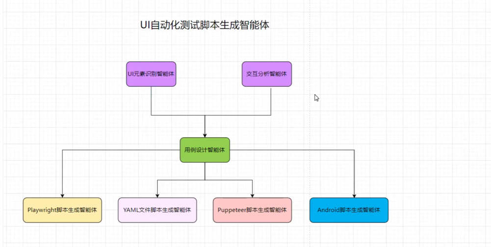
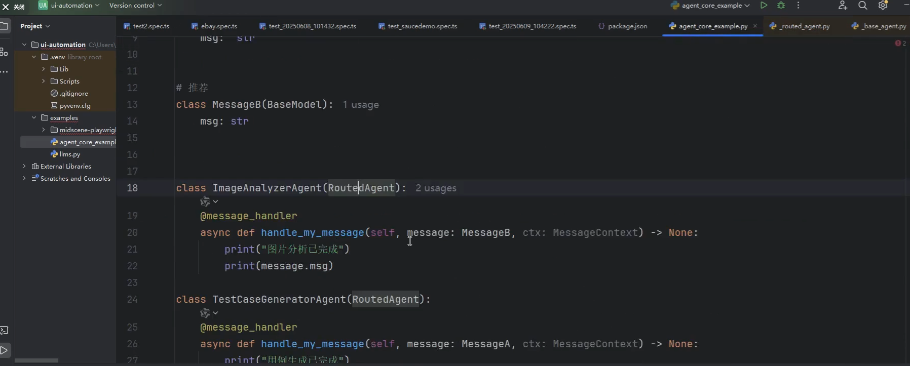
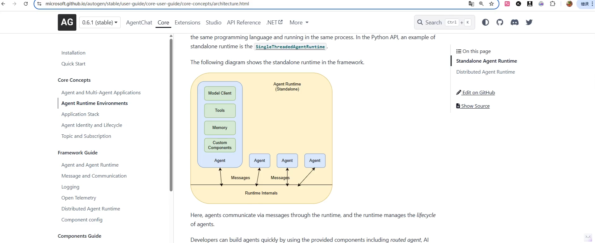
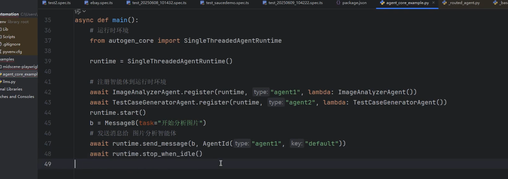
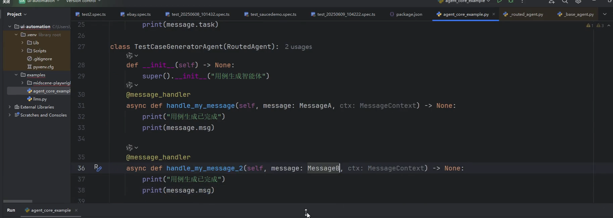
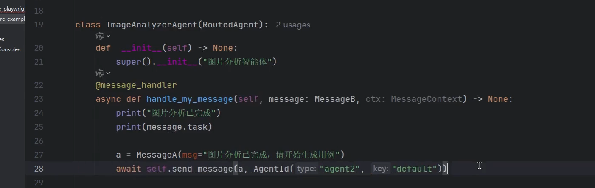

ui自动化：
    QTP 比较老的ui自动化框架，收费的。 Loadrunner/QC
    后续出现的Selenium框架/playwright --》基于dom解析技术（核心是元素定位）

AI出现
    举例：请输入正确的用户名，密码，点击登录按钮，进去之后把前三个商品添加到购物车，并且验证购物车里面是不是有3个商品。
    如果可以这么方便的话，那么ui自动化就可以更多的给到业务人员去测试了。
    别指望ai可以兜底所有的测试场景，学会拥抱新的知识。

browseruse github有开源版本，可以拿来学习
playwright mcp
Midscene.js 可以很好的和自动化框架结合，比如playwright,puppeteer https://midscenejs.com/zh/web-api-reference.html
    老师说他测试使用yaml格式效果不是很好，说不定现在好用了，可以生成playwright脚本或者yaml脚本，有需要的话也可以集成到puppeteer
    可以把这两份文档给ai写出准确的脚本： https://midscenejs.com/zh/web-api-reference.html    https://midscenejs.com/zh/llms-full.txt  https://midscenejs.com/zh/caching.html

基于playwright和midscene.js环境部署
    1.安装node，初始化playwright项目
    2.dotenv 是用来读取环境变量的

doubao UI-TARS这个模型还不错，可以在火山引擎生成对应的apikey

Autogen业务流实现：
    Teams，
    GraphFlow，
    消息机制（重点）
        直接方式： send_message
        广播方式： publish_message --更常见，订阅了消息主题的agent才可以接收到

一个agent可以处理多种类型的message类型，方便你扩展自己的业务逻辑，官方文档还有更多灵活的使用方式，有需要再去看

当前智能体完成任务之后发给下一个agent，代码细节。也就是说runtime可以发消息给agent，agent也可以发消息给其他agent。提供了比较灵活的消息发送选择

让ai生成代码的时候，参考上面的代码，因为现在的官方案例可能没更新，还是基于老版本来的，要记得提前检查一下

