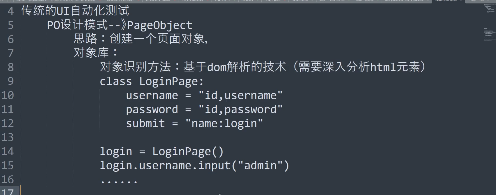
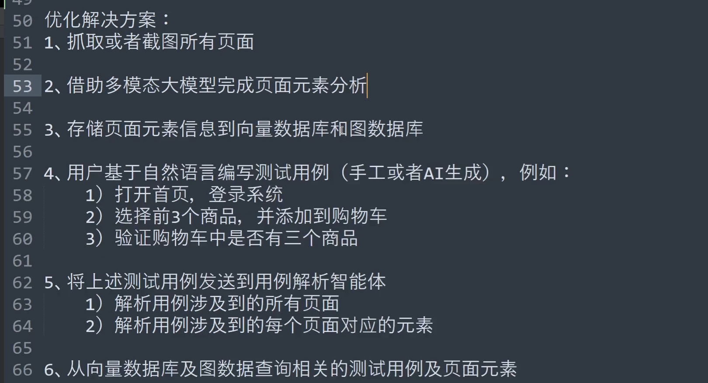
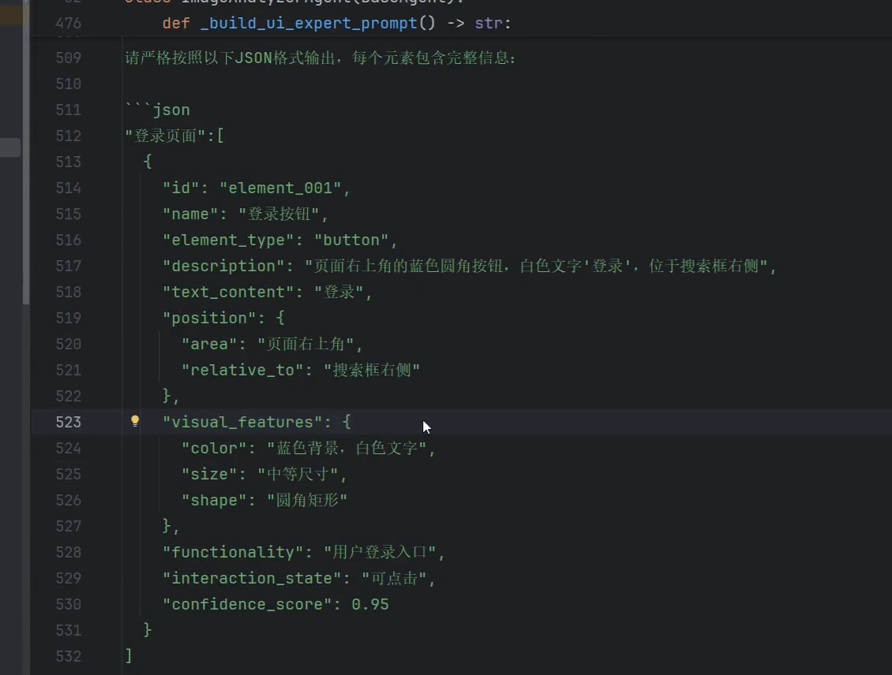
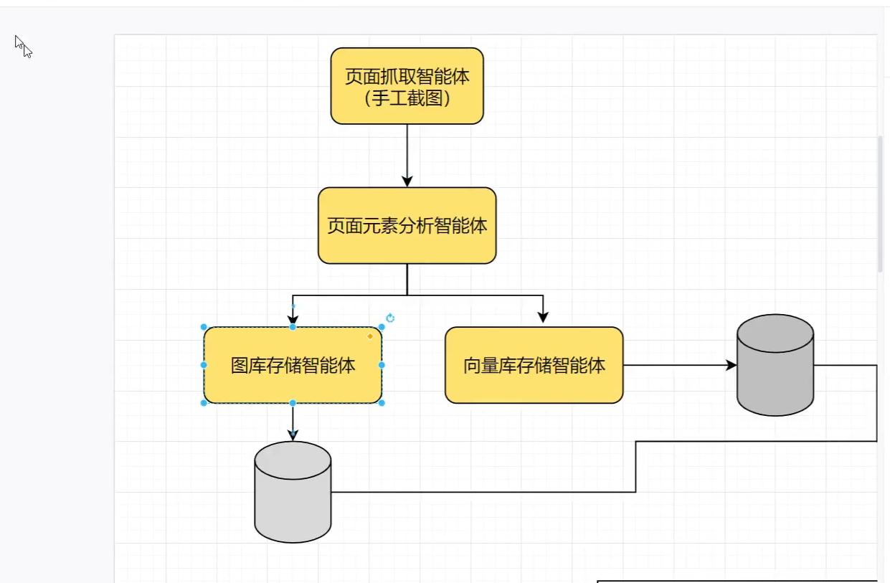
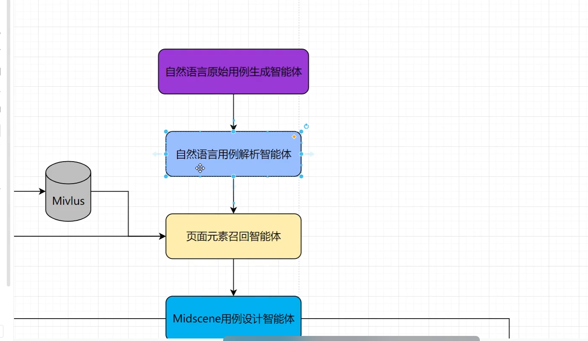
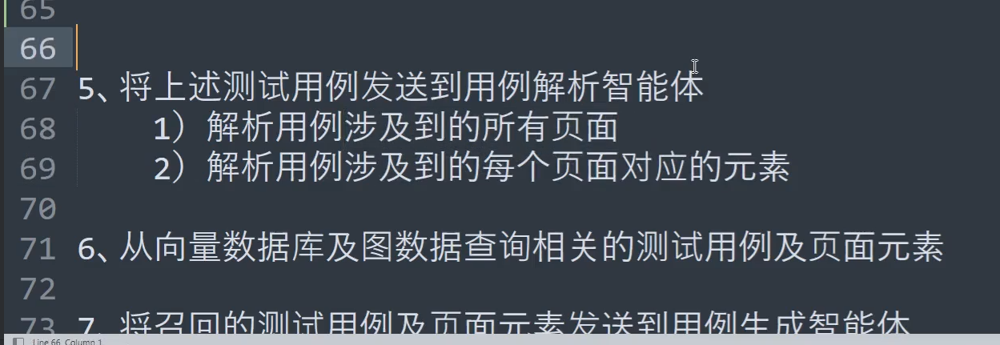
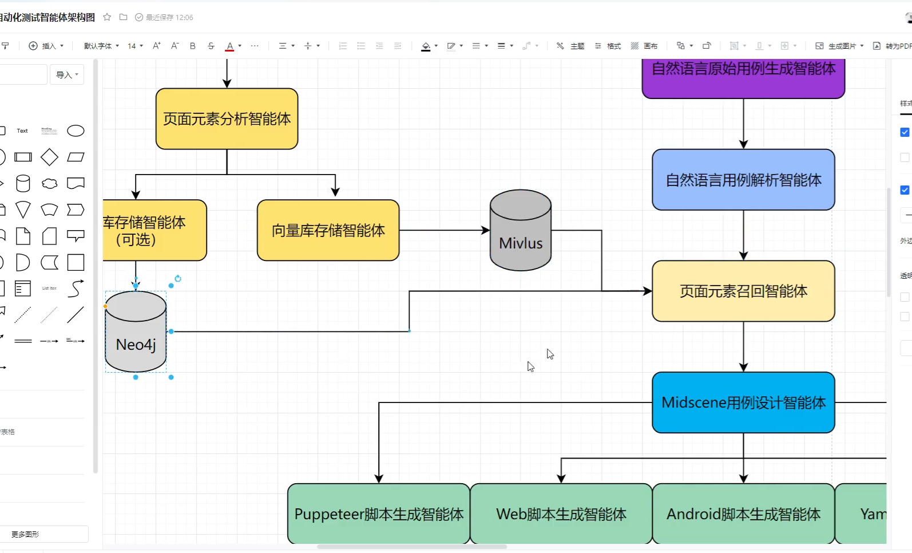
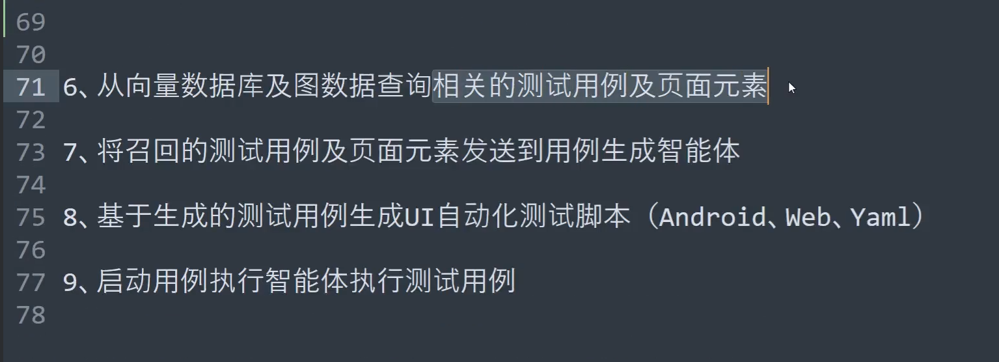

自动化测试思路梳理

ai时代的自动化测试方案：
元素依然重要，所以可以借助元素识别智能体，帮助我们，然后把他存入数据库。就可以基于它自动化写脚本了
课程里面的交互智能体不实用，因为不可能只通过图片就知道用户真实场景的点击操作和业务流程，因为它基本上就等同于测试案例了，你不可能通过图片写出来测试案例的。优化之后的方案如下，可以发现需要人参与其中：

图数据库保存这些图片信息更加准确，适合
向量数据库也可以保存

