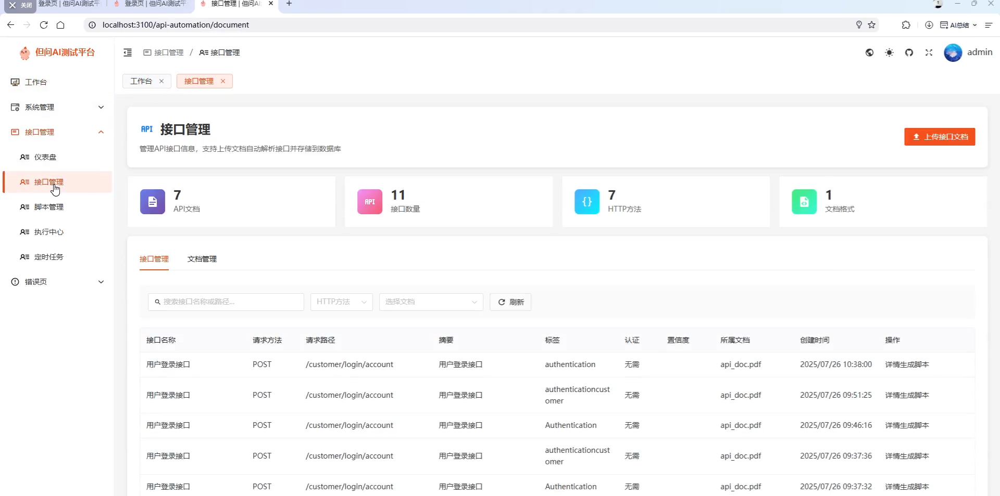
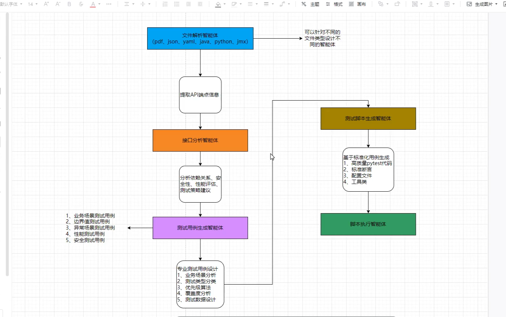
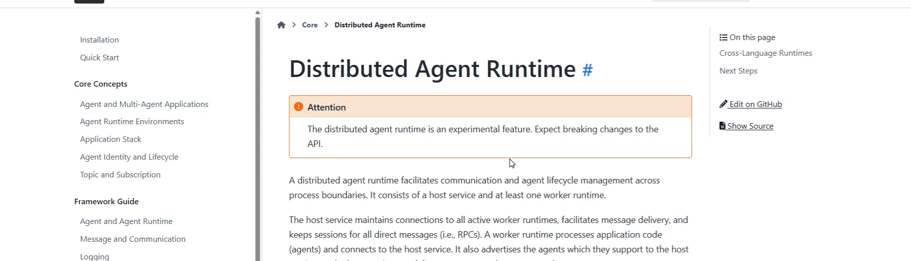

接口自动化智能体（接口和接口测试相当熟悉）
    接口：restful api --json
    难点：分析接口依赖关系：接口数据改造
接口管理页面需要给一个入口，让人工可以维护，修改。

细化后的实现思路：
    1.上传接口文档，postman，jmeter，json,pdf
    2,解析文档里面的所有接口和相关信息
    3，解析后的接口所有内容存入数据库

针对接口生成测试脚本 比如pytest。
    1，选择一个接口，点击生成脚本
    2，根据接口id，从数据库读取这个接口所有信息
    3，解析当前接口依赖关系
        1）优化当前接口内容，提取出关键的用于查询RAG的提示词，类似于改写query
        2)基于RAG知识库系统查询相关接口（这个接口要够强大，所以可以结合图数据库一起来搞定）R2R比较优秀，比ragflow效果还要好，而且容易二次开发，ragflow有兴趣可以去钻研，主要是太臃肿了，要瘦身才可以二次开发
        3）召回RAG相关接口信息 + 当前接口信息，让LLM分析接口依赖关系，结构化输出
    4，接口信息+接口依赖 --》 生成测试用例（可以考虑加入人工评审，可能太烦了，也可以考虑添加事后人工单独评审和修改功能）
    5，根据测试用例生成测试脚本（目标是可以生成可以执行的脚本，一个接口一个脚本）
    6，执行脚本，输出allure结果

代码实现，借助ai：
    1，开源二开--让ai分析项目结构，自动创建对应的功能在合适的目录下
    2，全新项目--如果是打造一个企业级项目，一定要考虑对应的项目的目录结构和可扩展性，可维护性。

对外接口：api/v1（sse，mcp，mcp-sse，websocket）
多智能体模块：放在子目录下，智能体管理，注册之类的。通过factory来实现。
现在说的智能提示，继承了routedagent的一个类，这个类可以完成特定的功能
    功能可以如下：与大模型交互，与数据库交互，与第三方平台交互（coze，dify），与其他智能体框架（langchain，LLmaindex，pydanticai等）
提示词是否需要通过factory管理：
    1， 如果是单一的大模型访问组件（比如assistantagent），可以把提示词配置到factory中
    2，如果是多个大模型访问组件，建议单独处理
    强烈建议：提示词不要让用户在配置文件中写（提示词属于核心代码的一部分，并且非常核心）

服务层：
    业务流驱动层，服务编排
    可分布式部署的runtime：这个基础是基于grpc协议来做的
    运行时环境：单线程本机运行；分布式运行
    统一注册智能体到运行时环境
    注册响应收集器基于智能体反馈函数
        响应收集器： 接受每个智能体输出的结果

