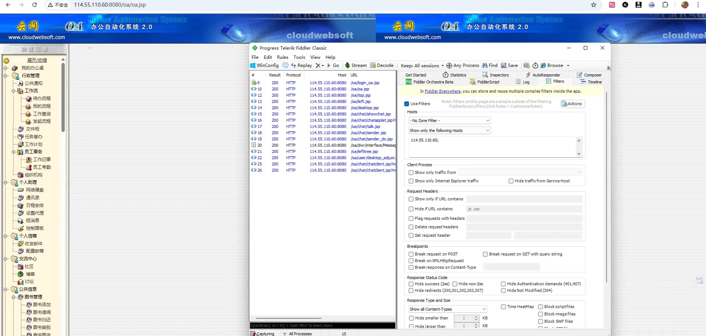
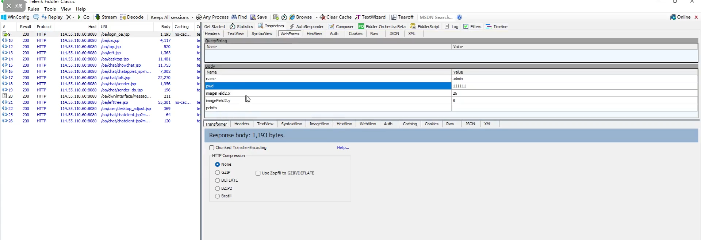
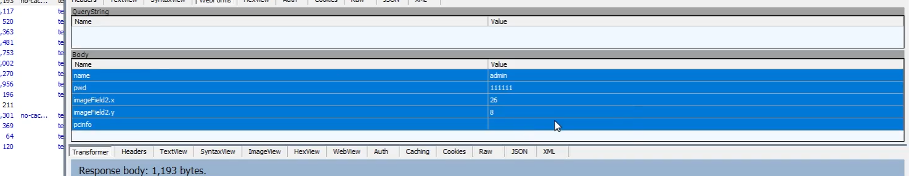
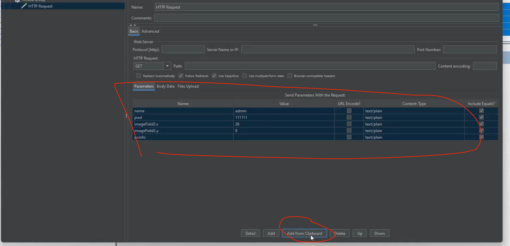
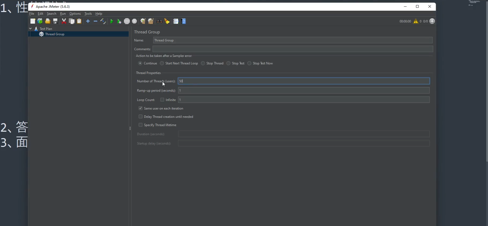
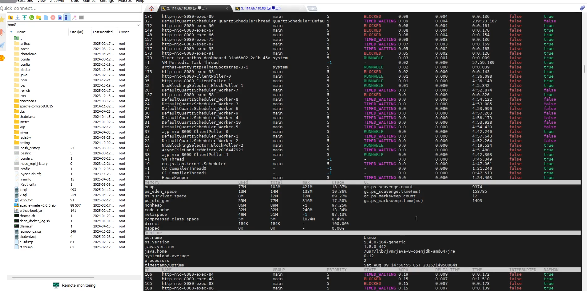
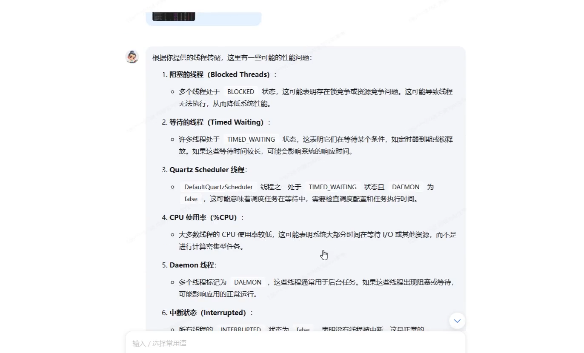
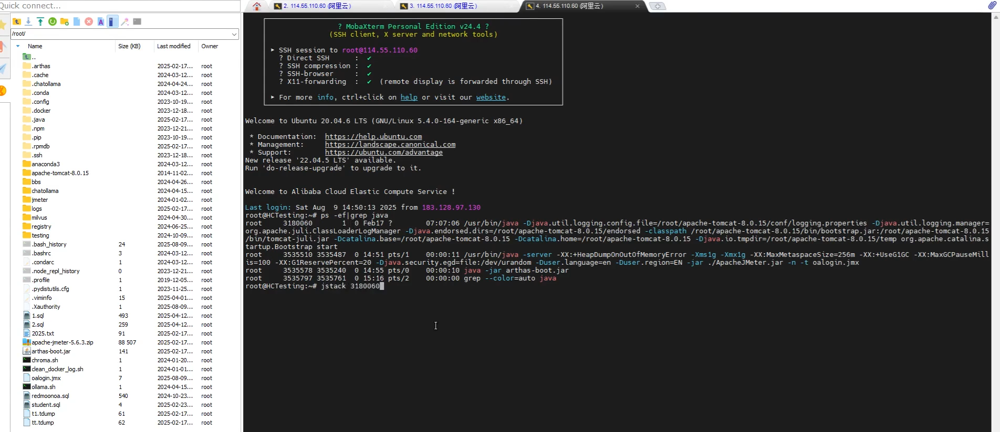
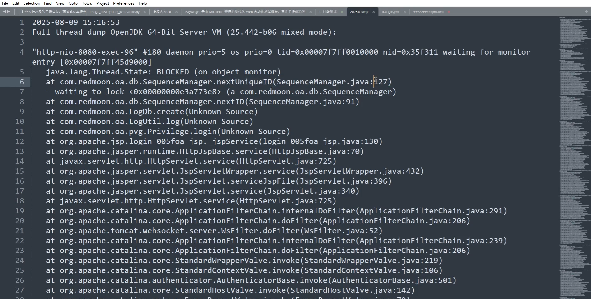
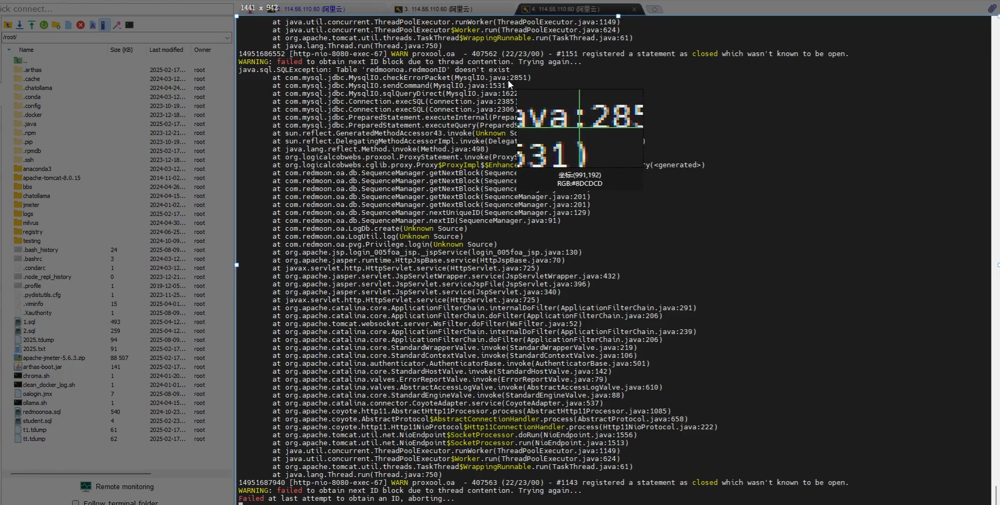

1.性能测试
    api接口测试-98%以上都是针对接口 -- 并发（多线程，多协程）
        性能测试工具：loadrunner，locust，jmeter --他们是多线程，多协程方式，
    UI性能（web，app）--本机体验
        dynatrace ajax edition
    性能分析：
        1，性能监控数据（图表，日志等）
        2，打印线程栈信息（哪些代码正在做事情，调用关系等）
            jstack 进程编号 > 重定向的文件名
        3，日志记录，错误日志
        4，性能方案（用户数，参数设置）

性能测试成果分批次给到智能体进行分析。
现阶段不需要rag，因为都是实时数据，需要人工介入比较多，除非后续再整体打通

借助前端性能监控mcp进行分析
基于浏览器监控插件，封装为mcp server
类似于插件装好之后，前端请求的包都保存下来，然后采集下来，后续就可以分析了

Fiddler 抓包，打开首页和登陆都是单独的接口，这一点要搞清楚。所以这里要分清楚
分析post请求，查看详情

然后把body复制下来，去写jmeter脚本

这里的50个线程，不代表50个用户。50个线程在这里相当于10万人或者50万人，
因为有可能10万个用户才凑巧有50个请求同时给到我们api处理，所以说真实用户和你的性能测试是有区别的。
我们这里模拟的50个请求同时进入api的场景。

性能测试，其实基本上只要解决网络带宽问题就基本上90%成功了，大部分都是通过广域网测试，压力没办法给到服务器。
所以，如果你把压测部署到服务器测试，基本网络问题就是解决了。

我们现在jmeter部署到服务器去测试了，但是依然cpu上不去，这个时候通过arthas来分析
，通过这个指标来查看，基本的常识就是：不是runnable状态的线程基本都是有问题的，说明他们没干活，导致cpu利用上不去

这个时候把这个截图发送给AI来分析，帮助你定位问题

 根据ai提示，打印栈信息来进行分析：

重要信息可以提取出来给ai，也可以直接全量信息用dump分析工具来查看
结合tomcat日志一起分析

2，答疑

国外服务器构建好image --》 发送到国内服务器部署，测试。就不担心打包网络问题了
通过爬虫实现自动识别每个页面UI元素，是一个思路，dom解析出来，压缩然后过滤。就可以发给llm了
因为midscene生成脚本依赖llm，执行脚本也要来llm。速度慢。所以如果爬虫得到的dom直接给llm，就会快很多才对

不要过度依赖ai，要有基本的排查错误能力

3，面试
如果做好一个自我介绍，把项目成果突出出来？
专业技能不要太多太花哨
你的技能需要在你的项目列出来，他是如何使用的，项目中如何做出来的
项目可以很多，公司不要太多。

个人介绍爱好：好听的写出来，有亮点的非专业技能展示出来。
项目功能描述不要太多：工作职责最重要，你做了什么最重要，你的成果，降本增效的地方。
你要写是独立开发的平台，开发公司的xxx项目，基于什么做的xxx，解决了什么问题，
准确率80%，90%之类的。项目依然有人还在维护
不要强调自己用ai之类的做出的项目，你就写自己写的。就说是自己开发的，但是ai协助。
做出很多0到1的东西。

