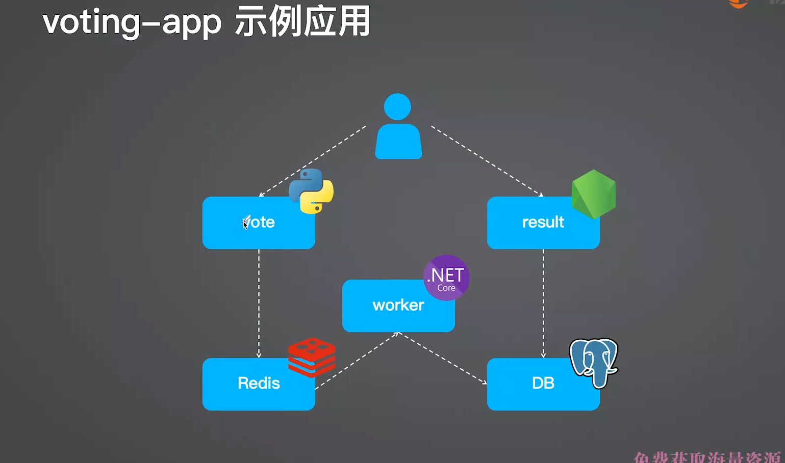
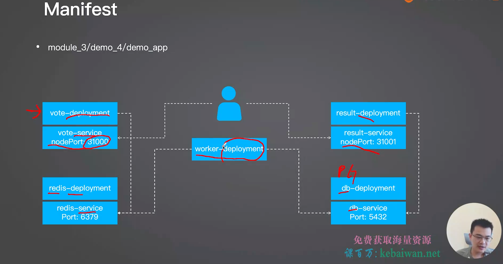
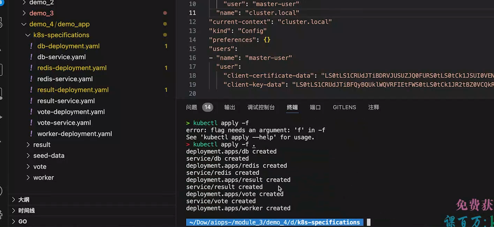
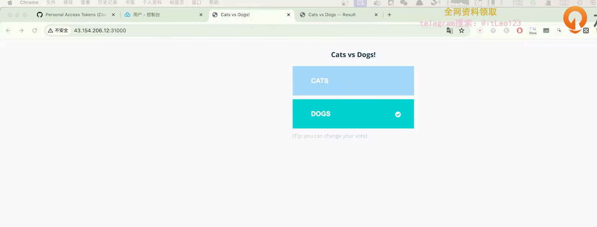

容器化部署node项目，这个tini推荐使用，
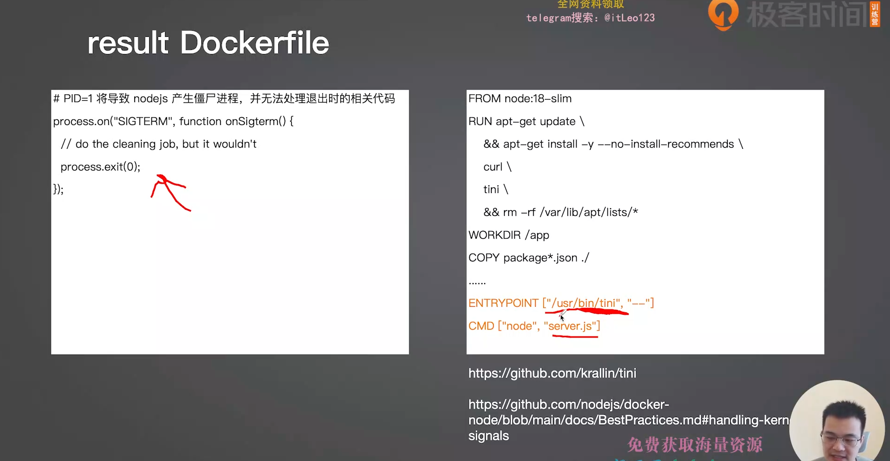

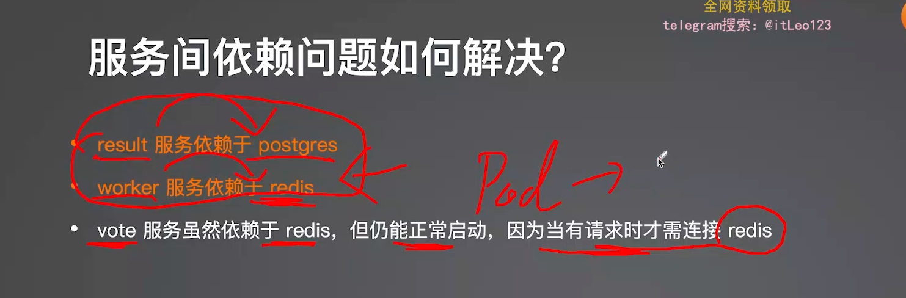
方案1，业务重试，但是依然我们写代码，需要依赖我们的开发
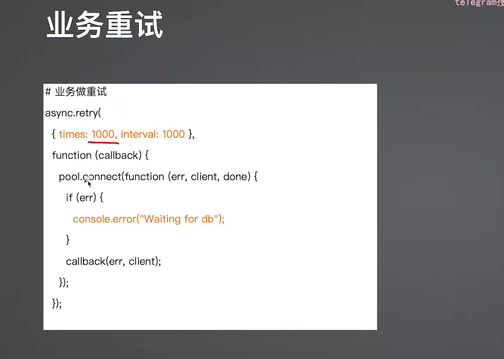
方案2:k8s自动重启机制
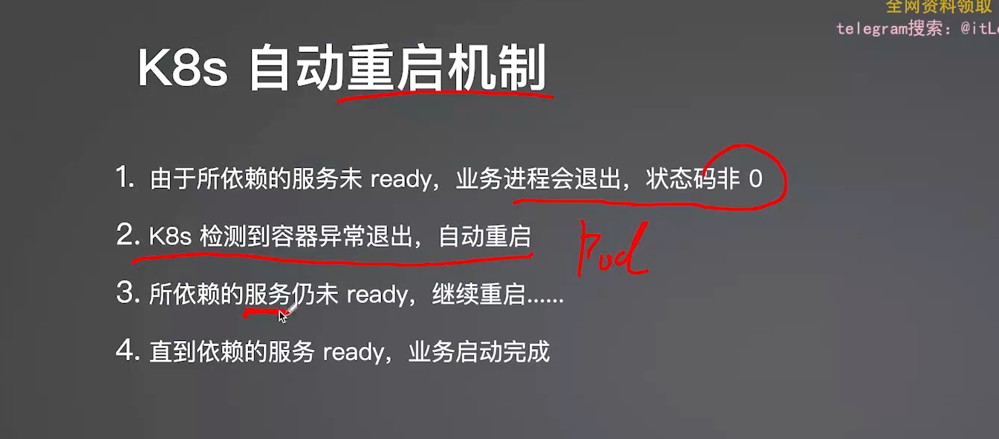
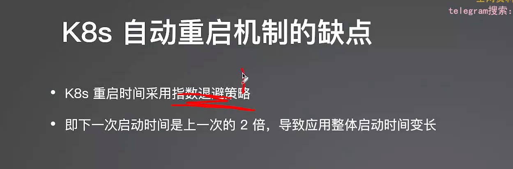

安排依赖关系
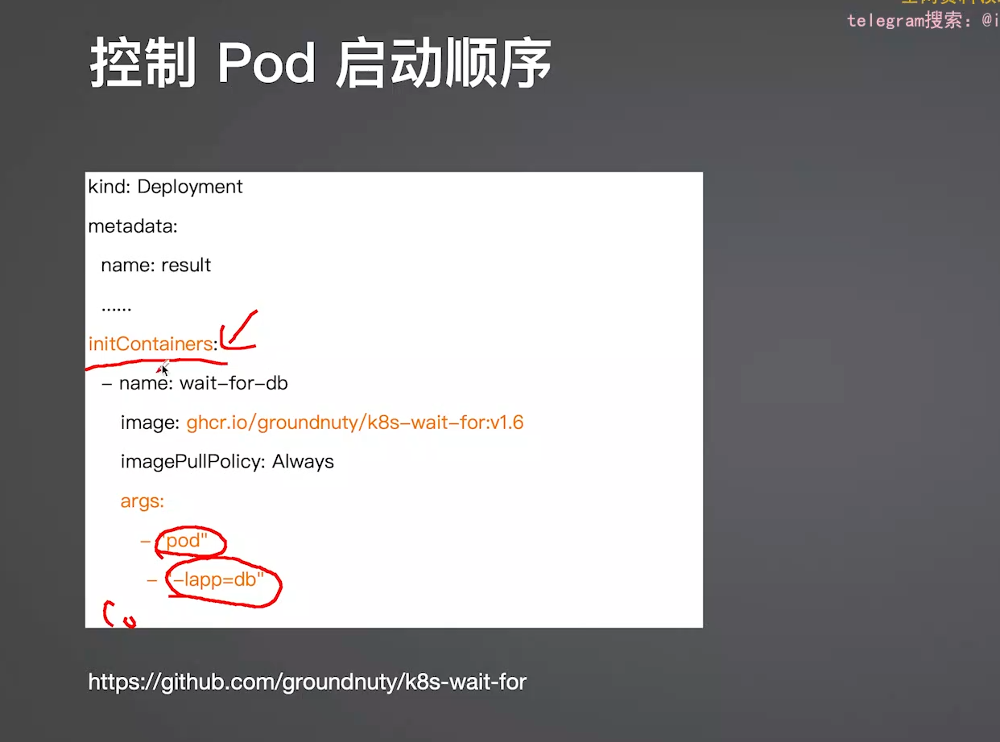
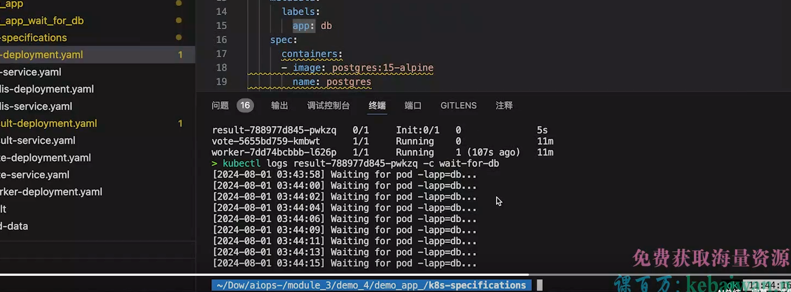
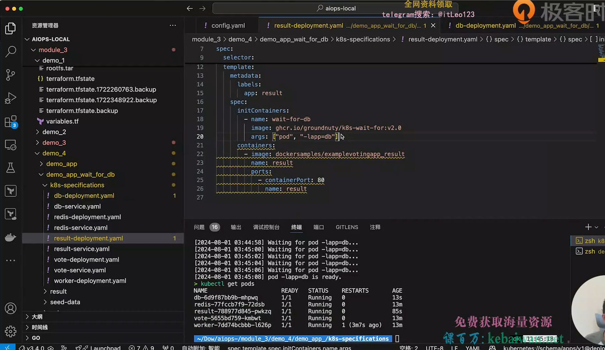

微服务启动顺序控制
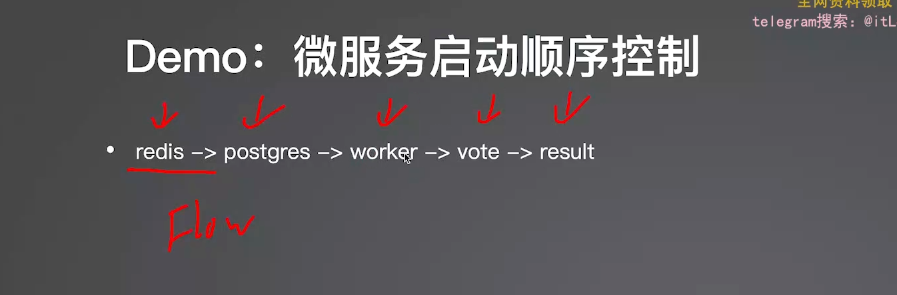
先启动redis，因此redis这里不需要任何依赖
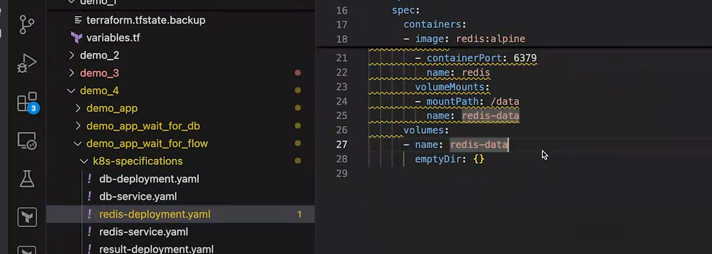
pg需要等redis，这里加上控制
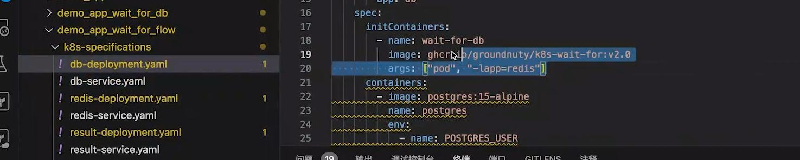
worker需要等db，这里加上控制
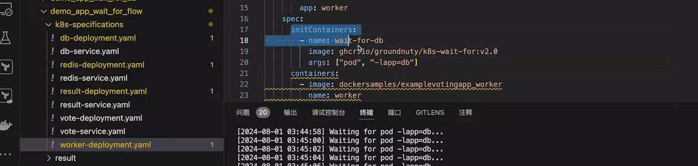
vote等worker
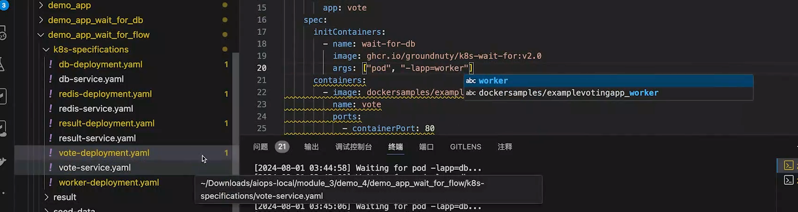
result等待vote
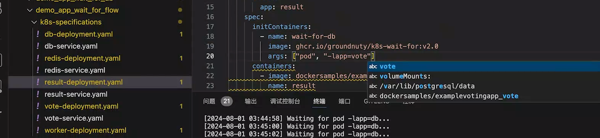

数据库表初始化
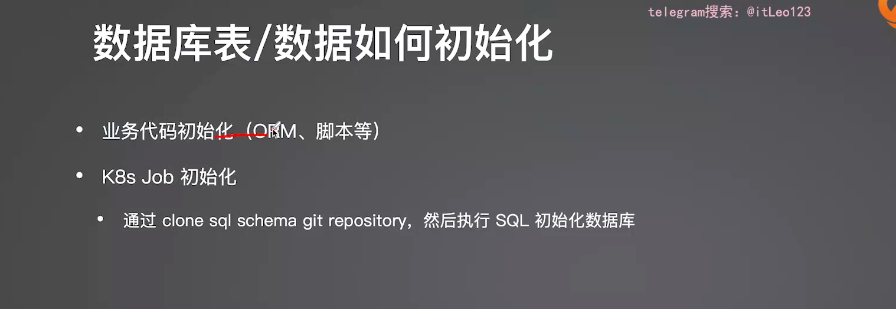
中间件高可用部署
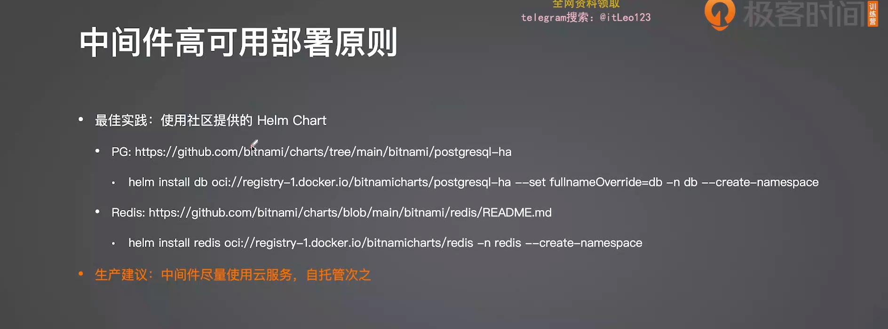
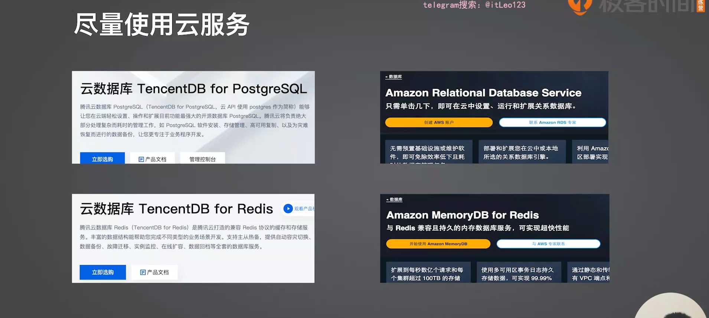

