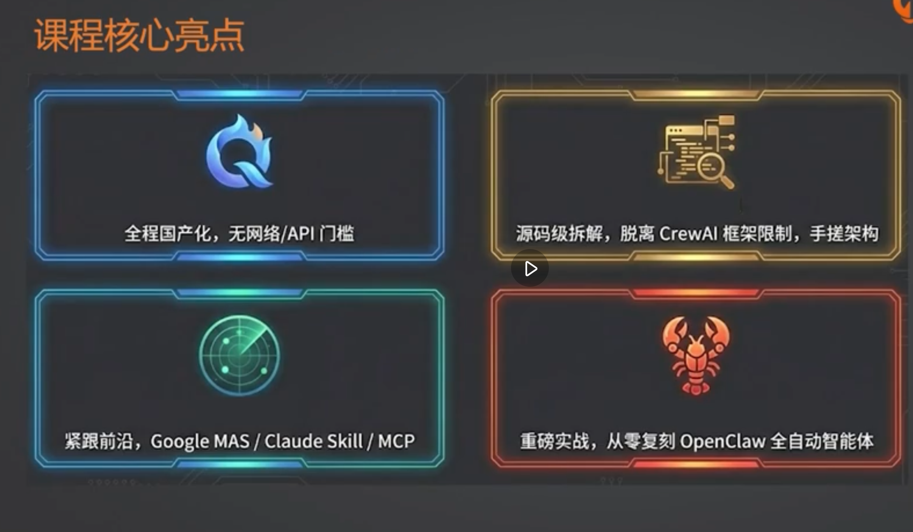

1.skills本身就是工具打包协议，最后泛化出来
底层本质就是一个agent介入工具的数量， mcp的时候上下文出现各种问题，skills渐进式披露上下文就是大大扩展你的能力。
好多玩workflow的同学，调用skills/mcp没有任何区别，因为你都是手动调用的。另外如果你只有三个场景或者3个工具需要使用，那么你根本没有必要使用skill，因为这些场景远远没有触及到你的上下文的能力极限。
渐进式披露就是一个很好的压缩上下文的理念，类似于一种数据库index的设计理念，树状结构的index设计，渐进式所引导你需要的上下文。但是你的表的元数据信息是依然在哪里，举例：mysl或者pgsql的某个索引，就对应skill的设计理念，具体细节ai帮我分析生成。
然后skills本质上就是提供一种类似mcp的协议，那么它的目的肯定是为了做他的生态，那么做好了以后，肯定就是可以让agent去加载，就很好的形成了这种生态。

