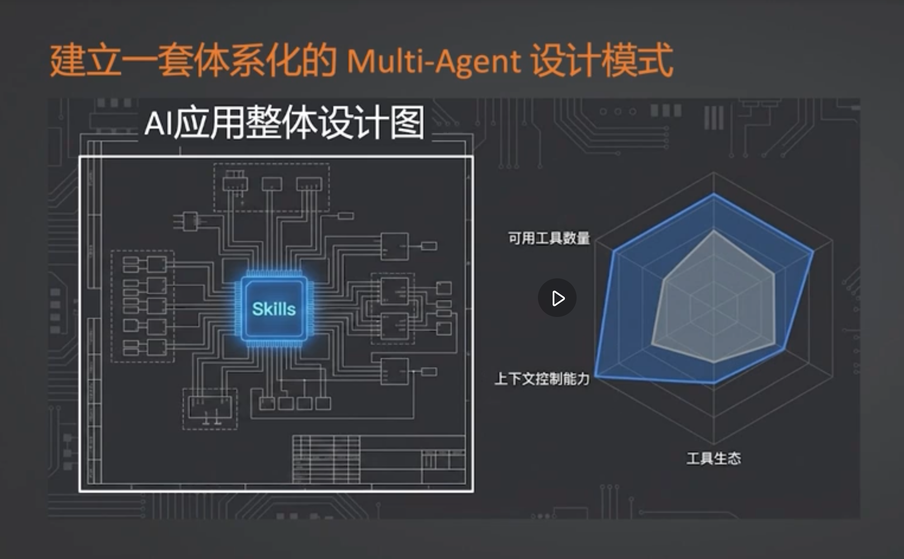
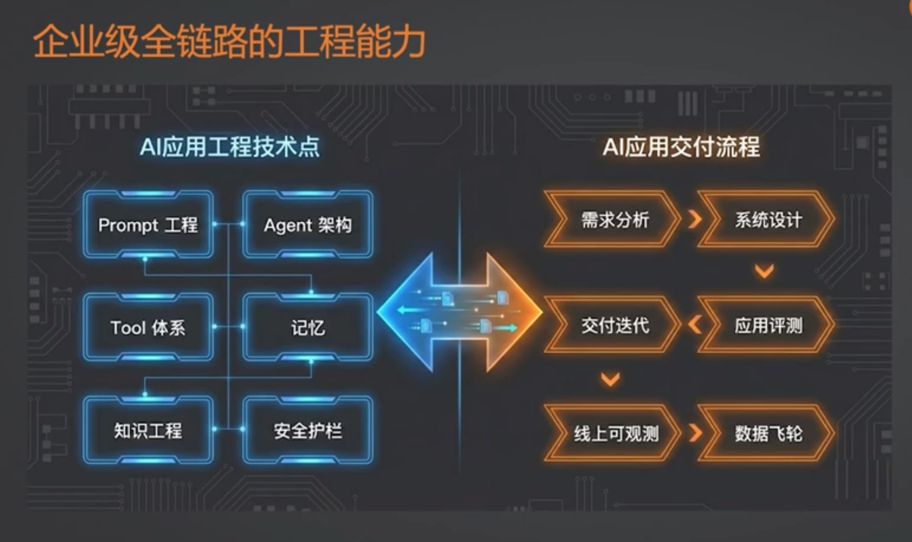
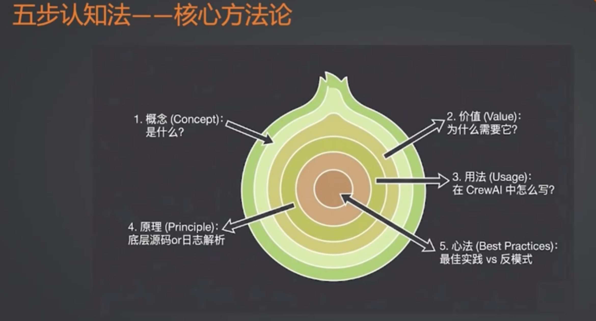

# 多智能体设计：Skills 机制与最佳实践

## 1. 核心概念：Skills 是什么？
- **本质**：Skills 本质上是一种**工具打包与泛化协议**。
- **要解决的核心痛点**：在传统的 Agent 接入大量工具时，或者基于 MCP（Model Context Protocol）直接注入所有工具时，往往会面临**上下文超载（Context Window Overflow）**和**注意力分散导致幻觉**等各种问题。
- **解决方案**：Skills 通过**“渐进式披露”（Progressive Disclosure）**机制，动态、按需地将工具上下文暴露给 Agent，从而大幅扩展 Agent 处理复杂任务的能力上限。

## 2. 适用场景建议
- **何时不需要使用 Skills/MCP**：
  - 如果你是通过 Workflow 手动调用工具节点，那么 Skills 或直接的 MCP 调用体验基本没有区别。
  - 如果你的业务只涉及 3 个以内的场景或 3 个以内的工具，**完全没有必要**引入复杂的 Skills 架构。因为较少的工具描述远未触及到大模型上下文能力的极限，直接注入 Prompt 即可。

## 3. 设计亮点：渐进式上下文披露（Progressive Disclosure）
渐进式披露是一种极佳的**上下文压缩与检索理念**。它可以直接类比于关系型数据库（如 MySQL/PostgreSQL）的**索引（Index）和树状结构设计**：
- 数据库即使有海量数据，表的数据依然在那里，但通过索引我们只需要加载相关的“页”（Page）到物理内存中进行匹配。
- 同样，系统中即使有成百上千个工具，大模型的 Context 中也只需要保留类似于“根节点”的索引元数据指引；只有当真正需要调用特定类目的工具时，才会加载它详细的参数结构。

> 📌 **深度解析**：关于“Skills 渐进式披露”如何与“数据库索引思想”高度契合，请参阅扩展阅读文档：
> [🚀 Skills 渐进式披露机制与数据库索引深度对比](skills_vs_db_indexes_analogy.md)

## 4. 生态与未来愿景
- Skills 底层提供了一种类似 MCP 的标准化协议。
- 其最终目的是**构建开发者生态**。当有了统一的协议标准，开发者打包好的 Skills 就可以顺理成章地被其他 Agent 动态加载、插拔与复用，从而形成一个极其繁荣的插件生态圈。

---
### 补充资料截图

