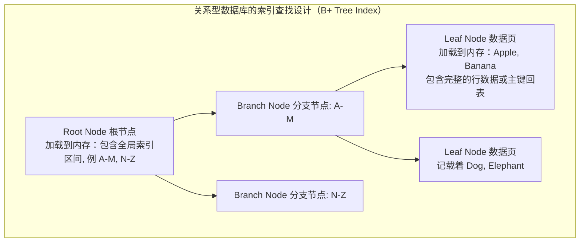
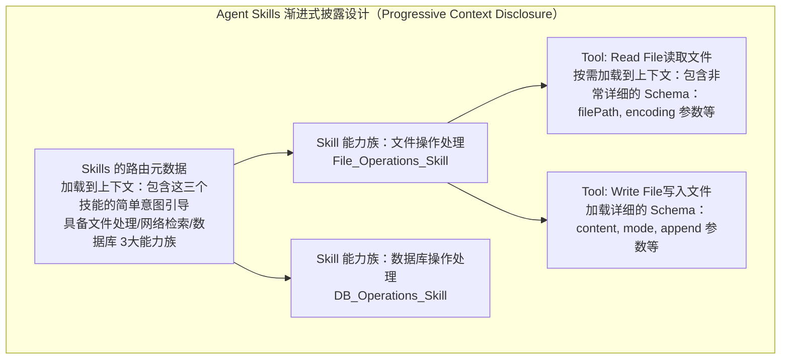

# 深度解析：Agent Skills 的渐进式披露与数据库索引设计

在多智能体（Multi-Agent）的架构设计中，**Skills 的渐进式披露机制（Progressive Disclosure）**是解决大语言模型上下文窗口瓶颈的一项核心设计。这与我们在关系型数据库（如 MySQL 或 PostgreSQL）中利用**索引（Index，比如 B+ 树）**来解决海量数据查询瓶颈的原理有着异曲同工之妙。

通过详细对比这两者的设计思想，我们可以更透彻地理解 Skills 机制。

## 1. 核心矛盾的类比

| 维度 | AI Agent 场景下的困境 | 数据库场景下的困境 (DB) |
| :--- | :--- | :--- |
| **基础资源限制** | 大语言模型的 Context Window（上下文 token 取值范围）是极其有限且昂贵的。 | 内存（RAM）和磁盘 I/O（读写能力）是有限的，特别是对于全量数据来说。 |
| **全量加载的后果** | 类似**“全表扫描”**。如果一次性把所有工具的详细 JSON Schema（描述、入参说明、必填项）输入给大模型，会导致严重的上下文挤占，甚至让大模型“无法集中注意力”，频发幻觉或遗忘任务目标。 | 类似**“全表扫描（Full Table Scan）”**。如果要找一条数据而没有索引，数据库不得不把磁盘上所有数据都装载进内存遍历一遍，会导致 I/O 和内存的极度浪费，查询极慢甚至超时。 |
| **解决思路** | **渐进式披露**：仅暴露顶层的“工具包”或“分类”目录（如文件工具集、搜索工具集），只有决定使用时，才索要具体的“工具详情”，加载到上下文中。 | **建立索引树**：通过构建 B+ 树等数据结构，先查询根节点，再去子节点，通过极少的比较次数就能快速定位到特定的数据页。 |

---

## 2. 树状图结构类比：B+ Tree 与 Skills 树

下面我们通过图层结构，直观地展示二者在“元数据指引”与“深入下钻”这一理念的共同之处。

### MySQL/PgSQL 中的 B+ 树索引查找过程：

### 多智能体系统中的 Skills 渐进式查找过程：

**二者的设计共同点：**
- **元数据长期兜底（常驻提示词 / 根节点一直存在）**：“数据库里表的元数据始终都在”，Agent 挂载的 Skills 元数据也在。大模型平时只要知道“有这个方向的大工具可以用”就可以了，就像数据库只需要经常缓存顶层的路由节点。
- **叶子节点按需加载（动态注入 / Page读取）**：只有当大模型的思考（ReAct / CoT）推断出“我的下一步动作确实需要读写数据库”时，才会触发对 `DB_Operations_Skill` 的探索。这时，底层极细粒度的数据验证逻辑、详细参数类型才进入模型的 Context 的视野中。

---

## 3. 详细实例推演

我们以构建一个**“能处理多种格式数据分析并发送报告的 Agent”**为例，看看是否有“渐进式披露”的差别。

### ❌ 传统方式（形同暴力穷举全表扫描）
通常做法是我们在 System Prompt 中一次塞进所有可能用到工具的完整 Schema：
1. `QueryUserDB({userId, filter, limit, offset})`
2. `FormatData({data_input, cleaning_strategy, drop_nulls})`
3. `RenderChart({chart_type, x_axis, y_axis, colors, title})`
4. `SendMarketingEmail({to_list, cc, subject, email_body, html_template})`
5. *...如果系统里还有50个以上的长尾工具的详尽参数...*

> **后果危机**：这样产生的 Token 轻松破千上万。一旦这批 Token 常驻进每轮对话的历史中，越到后期调用延时越高，系统运行成本呈几何级倍增。此外如果是类似或同名的图表库方法，大模型还会混淆参数（张冠李戴）。此时系统的能力其实很低。

### ✅ 渐进式披露方式（形同索引精确查找）

**Step 1（类比从索引根基上进行初步定位）：**
大模型自带很轻量的系统提示词：
*“你有三个强大的技能包可探索调用：`[DBSkills, ChartSkills, EmailSkills]`。如果需要相关能力，用探索工具去展开细分项。”*
当用户提出请求时，大模型初步推理得出必须查库。它输出动作：“给我展开 `DBSkills`”。

**Step 2（类比读入特定分支和数据页）：**
系统将 `QueryUserDB({userId, filter, limit, offset})` 等相关 SQL 查询工具的具体 Schema 临时放入此时对话轮次的工具列表中。
由于没有图表、邮件等参数干扰，上下文非常干净！大模型以极高的准确率和推理速度返回 `QueryUserDB(args...)` 的最终请求给环境。

**Step 3（根据查询结果跳转回表/读取其他关联索引页）：**
当查库技能返回分析数据后，代理通过思考链认为“现在要发送报告了”。此时系统在管理层面卸除了数据库复杂的 Schema，重新按需加载了非常厚重的 `RenderChart` 和 `SendMarketingEmail` 技能参数，大模型紧接着完成可视化与最终的分发。

---

## 4. 总结

使用**渐进式披露 Skills**的思路去设计 Multi-Agent，绝非是为了脱裤子放屁让调用多几次步骤，它的宏大出发点与“用B+树为DB构建索引”一脉相承：

1. **资源占用的“瘦身”**：大大节省宝贵的大语言模型推理算力的消耗（极大稀释 Token 量）。
2. **准确度飞拉升**：少而精的上下文能让大模型完全集中注意力，执行确定性很高的函数传参。
3. **海量能力的生态扩展底座**：借助这种设计，我们可以为单个 Agent 轻松装备成百上千种 Skills 而不用担心塞爆脑容量（Context），从而孕育出一个像繁荣丰富的插件生态架构。
