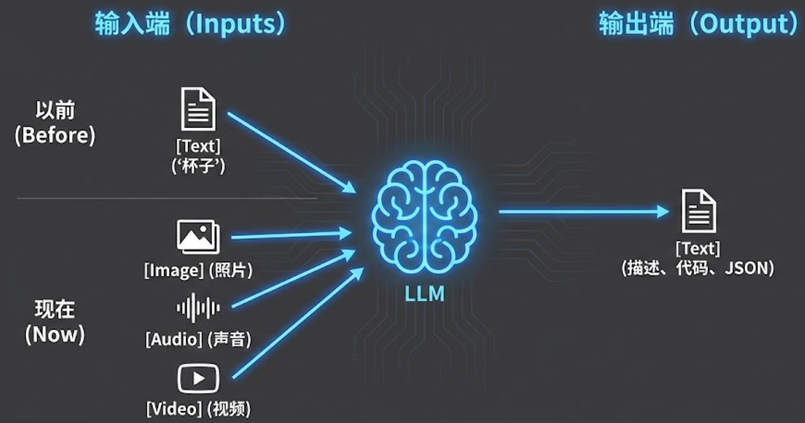
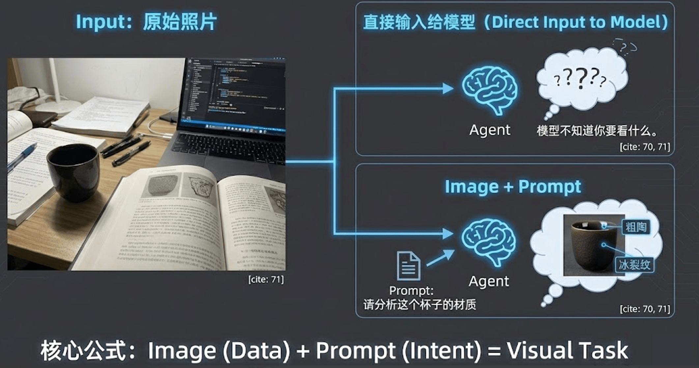

在真实的生产场景中，很多时候我们面对的不仅仅是纯文本信息，还包含大量其他模态的数据（如图片、视频、声音等）。如何让智能体跨越单一的文本模态，是构建复杂企业级 AI 应用的关键一步。多模态模型和大语言模型结合使用，尽可能限定多模态模型的使用范围（毕竟其效果和成本有限），通过优势互补来实现整体效能的提升。

# 一、 认知原点：什么是多模态文本生成模型？

首先，我们需要明确一个核心概念的边界。一提到“多模态”或“图片大模型”，很多人脑海里第一反应是 Midjourney 或者 Stable Diffusion 这类**“文生图”（Text-to-Image）**工具。但我们这节课要讲的，是完全相反的方向——**多模态的文本生成模型（Image-to-Text / Multimodal Understanding）**。

我们的目标是输入图片、声音或视频等多模态素材，让模型进行处理和理解，最终输出我们需要的文字结果或结构化数据。



## 1. 底层原理解析：模型如何“看懂”图片？

大语言模型（LLM）的本质是在做 Token 的预测（Predict the next token）。那么，一个原本只能处理文本序列的模型，是如何看懂一张具象的图片的呢？

穿透到底层，它的原理其实非常直接：图片本质上会被转化为有意义的 Base64 编码或特定的视觉 Token 序列。就像一段文字会被切分成一个个词汇 Token 一样，图片的像素特征也会被**视觉编码器**切分，并映射到大模型能够理解的语义空间中，与文本 Prompt 一起拼接成超长的上下文，喂给大模型进行联合推理。

## 2. 视觉任务的核心公式：图片 + Prompt

一个常见的误区是：直接把一张图片扔给大模型，期望它能自动返回你想要的结果。



记住这个核心公式：**视觉任务 = 图片 + Prompt**。

单纯的图片输入是不完整的，多模态模型需要你明确的 Prompt 引导，告诉它重点看什么、提取什么特征、遵循什么格式输出结果。**图片提供了“具象的信息描述”，而 Prompt 提供了“任务的分析逻辑”。**

---

# 二、 深入框架：AddImageTool 的注入实现

在实际的工程落地中，我们如何把一张本地的 JPG/PNG 图片变成大模型能理解的 Token 呢？我们需要借助工具来进行前置处理。

原生的 CrewAI 只支持网络 URL 的多模态模型请求，不能满足我们的纯本地文件诉求。所以在课程的代码实战中，我们编写了一个自定义的 `AddImageToolLocal` 工具。它的核心作用就是在 Agent 需要看图时，读取本地文件，进行必要的压缩，并将其转化为 Base64 Data URL 格式，注入到上下文中。

> **代码位置**：[add_image_tool_local.py](https://github.com/kid0317/crewai_mas_demo/blob/main/tools/add_image_tool_local.py)

```python
# add_image_tool_local.py 核心代码节选
import base64
from pathlib import Path
from crewai.tools import BaseTool

class AddImageToolLocal(BaseTool):
    """将本地图片加入上下文的工具：读取本地文件并转为 Base64 后返回。"""
    name: str = "Add image to content Local"
    description: str = "Load a local image file from the given path, compress it if necessary, and convert it to a base64 data URL format..."

    def _run(self, image_url: str, **kwargs) -> str:
        path = Path(image_url.strip())
        with path.open("rb") as f:
            raw = f.read()

        # 实际生产中建议在此处加入图片压缩逻辑 _compress_image(raw)

        # 转换为 Base64 编码
        b64 = base64.b64encode(raw).decode("utf-8")
        suffix = path.suffix.lower()
        mime = "image/jpeg"
        if suffix == ".png": 
            mime = "image/png"

        # 返回多模态大模型标准支持的 Data URL 格式
        return f"data:{mime};base64,{b64}"
```

但是，除了用工具返回 Base64 之外，因为在按照 OpenAI 规范调用模型时，图片识别的 message 列表有特殊的格式要求，因此还需要深度改造请求模型的底层代码实现：

> **代码位置**：[aliyun_llm.py](https://github.com/kid0317/crewai_mas_demo/blob/main/llm/aliyun_llm.py)

```python
def call(
    self,
    messages: str | list[dict[str, Any]],
    tools: list[dict] | None = None,
    callbacks: list[Any] | None = None,
    available_functions: dict[str, Any] | None = None,
    max_iterations: int = 10,
    _retry_on_empty: bool = True,
    **kwargs: Any,
) -> str | Any:
    # 先处理 message 列表，将图片类型的 message 进行解析
    messages, flag = self._normalize_multimodal_tool_result(messages)
    # 如果包含图片信息，使用 image_model 模型，否则用正常的文本模型
    if flag:
        payload["model"] = self.image_model

def _normalize_multimodal_tool_result(self, messages: list[dict[str, Any]]) -> Tuple[list[dict[str, Any]], bool]:
    """
    将 CrewAI 对 AddImageTool/AddImageToolLocal 的 stringify 结果还原为多模态 user 消息，
    否则可能因消息格式或体积导致 API 返回 400 错误。

    Returns:
        Tuple[list[dict[str, Any]], bool]: 返回处理后的消息列表和是否使用多模态模型
    """
    out: list[dict[str, Any]] = []
    flag = False
    
    for msg in messages:
        content = msg.get("content")
        if msg.get("role") != "assistant" or content is None or not isinstance(content, str):
            out.append(msg)
            continue
            
        s = content
        # 已包含 base64 data URL（来自 AddImageToolLocal）
        if "Add image to content Local" in s and ("data:image/" in s and ";base64," in s):
            idx = s.find("data:image/")
            data_url = s[idx:]
            text = s[:idx] + "图片内容已加载"
            user_msg = {
                "role": "user",
                "content": [
                    {"type": "text", "text": text},
                    {"type": "image_url", "image_url": {"url": data_url}},
                ],
            }
            out.append(user_msg)
            flag = True
            continue
            
        # 处理网络图片 HTTP 链接
        elif "Add image to content Local" in s and "Observation: http" in s:
            idx = s.find("Observation: http")
            data_url = "http" + s[idx:]
            text = s[:idx] + "图片内容已加载"
            user_msg = {
                "role": "user",
                "content": [
                    {"type": "text", "text": text},
                    {"type": "image", "image": data_url},
                ],
            }
            out.append(user_msg)
            flag = True
            continue
            
        out.append(msg)
        
    return out, flag
```

---

# 三、 代码实战：构建小红书笔记图片分析 Agent

为了让大家有更直观的体感，我们在本节课的代码实战部分，将使用国内开源的多模态模型 **Qwen-VL（通义千问视觉版）**，来构建一个“小红书笔记图片分析 Agent”。

这个 Agent 的任务是读取用户上传的图片，深度分析图片中的视觉元素、氛围感，并结构化输出，为后续生成爆款文案提供灵感弹药。

```python
# m2l6_agent.py 核心代码节选
from crewai import Agent, Task, Crew
from pydantic import BaseModel, Field
from tools.add_image_tool_local import AddImageToolLocal

# 1. 定义结构化输出模型 (Pydantic)
class ImageAnalysis(BaseModel):
    file_name: str = Field(..., description="图片文件名")
    subject_description: str = Field(..., description="图片中主要物品、人物或场景的客观描述")
    atmosphere_vibe: str = Field(..., description="图片传递的整体氛围感和情绪价值")
    visual_details: list[str] = Field(..., description="至少 3 个关键的视觉细节亮点")

# 2. 定义多模态 Agent
visual_analyst = Agent(
    role="资深视觉分析师",
    goal="准确解析图片内容，提取核心视觉卖点和氛围感",
    backstory="你是一位拥有多年经验的产品视觉分析师...",
    llm=aliyun_vl_llm,           # 绑定支持多模态的 LLM
    multimodal=True,             # 💡 核心配置：开启框架的多模态支持
    tools=[AddImageToolLocal()], # 💡 赋予读取本地图片的工具
)

# 3. 定义任务
analysis_task = Task(
    description="请使用工具加载本地图片 {image_path}，对图片进行整体与细节的多维度观察...",
    expected_output="结构化的视觉分析结果",
    agent=visual_analyst,
    output_pydantic=ImageAnalysis, # 强制结构化输出
)
```

通过配置 `multimodal=True` 并赋予 `AddImageToolLocal`，这个 Agent 就真正具备了“看图说话”的超能力。

---

# 四、 避坑指南：最佳实践与反模式

在实际应用多模态模型时，由于视觉 Token 的计算成本通常远高于普通文本，合理的工程设计显得尤为重要。以下是实战中总结出的排坑指南。

## 🚫 严重损耗效能的“反模式”

### 1. 像素倾倒（Pixel Dumping）
- **问题所在**：很多开发者为了省事，直接将用户上传的几十兆、原画质分辨率（如 4K/8K）的图片不加处理地全盘喂给模型。
- **致命后果**：不仅会极其严重地消耗 Token 额度、导致账单金额飙升，还会大大增加请求的网络延迟（Timeout）及显存压力。
- **正确做法**：大模型不需要肉眼级别的极限高清细节也能理解主体语义。在代码层必须前置处理，将图片压缩、降低分辨率至合适尺寸（例如：限制长边在 1024 或 2048 像素内）。

### 2. 用大模型纯做 OCR（光学字符识别）
- **问题所在**：极度不经济。如果你仅仅是为了提取发票或纯文字截图上的文本字面含义，调用庞大且昂贵的多模态模型不仅性价比极低，而且在大段纯文本的提取准确率上往往比不过专精的传统 OCR 引擎。
- **例外情况（杀手锏）**：当文档不仅包含文字，还拥有强语义的**排版格式**时（例如：复杂多级表格、带有位置关系的架构图、流程图），传统 OCR 会丢失空间语义，此时多模态模型具有降维打击的优势。

## 🌟 提升稳定性的“最佳实践”

### 1. 使用 vCoT（Visual Chain of Thought）引导解析
如同文本模型需要思维链（CoT）一样，图片分析同样需要强制模型按步骤思考。在 Prompt 中明确要求模型分为三步走，这能极大降低视觉幻觉与漏看情况：
1. **Describe（描述客观事实）**：先陈述图片中客观看到了什么物体、形状、颜色。
2. **Reason（推理中间过程）**：基于刚才描述的事实，结合业务背景进行深入推导。
3. **Conclude（得出结论）**：最后给出最终的综合分析结论或输出 JSON 数据。

### 2. 低清 -> 高清的漏斗过滤架构
当面对海量图片任务（如批量审核几万张商品图）时，为了在性能与成本之间取得平衡，建议采用漏斗式架构：
- **第一层（粗筛）**：先使用被极致压缩的低分辨率、小尺寸图片去跑低配多模态模型，进行廉价、快速的概览判断（如：筛出哪些图含有目标物体）。
- **第二层（精扫）**：对于第一层粗筛命中的少量嫌疑或高潜图片，再输入高分辨率版本交给高配多模态模型进行深度特征提取和精细化分析。