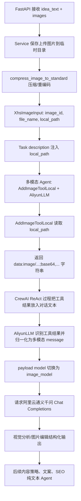

# AliyunLLM 与 AddImageToolLocal 多模态链路说明

这份笔记解释项目里为什么要自己实现 `AliyunLLM`，以及为什么还要单独实现 `AddImageToolLocal`。核心结论是：

- `AddImageToolLocal` 负责把本地图片文件变成模型能接收的图片内容。
- `AliyunLLM` 负责把 CrewAI 工具调用后的文本结果，改造成阿里云通义千问兼容的多模态消息格式。
- 两者配合，才让“上传到本地临时目录的图片”真正进入视觉模型，而不是只把文件路径作为普通文本发给大模型。

## 先解释这段代码

代码位置：[src/app/crews/llm/__init__.py](../../src/app/crews/llm/__init__.py)

```python
if provider == "aliyun":
    return AliyunLLM(
        model=model or settings.llm_model,
        api_key=kwargs.get("api_key"),
        region=kwargs.get("region") or settings.llm_region,
        temperature=kwargs.get("temperature"),
        timeout=kwargs.get("timeout"),
        retry_count=kwargs.get("retry_count"),
        image_model=image_model or settings.llm_image_model,
    )
```

这段代码是一个 LLM 工厂方法里的 provider 分发逻辑。它的意思是：

1. 先读取 `provider`。如果没有显式传入，就用配置里的 `APP_LLM_PROVIDER`，当前默认是 `aliyun`。
2. 如果 provider 是 `aliyun`，就创建并返回项目自定义的 `AliyunLLM` 实例。
3. `model` 是默认文本模型，比如项目里视觉分析 Agent 传的是 `qwen3-max-2026-01-23`。
4. `image_model` 是专门的视觉模型，比如 `qwen3-vl-plus`。
5. `api_key`、`region`、`temperature`、`timeout`、`retry_count` 这些参数都透传给 `AliyunLLM`，由它负责按阿里云 DashScope 的接口规则发请求。

所以，这里不是简单地“拿一个模型名”，而是在创建一个带阿里云 endpoint、鉴权、重试、多模态消息适配能力的 LLM 适配器。

## 整体链路



## 为什么需要 AddImageToolLocal

项目入口是上传图片文件。服务层会把上传文件保存到本地临时目录，然后把本地路径写进 `XhsImageInput.local_path`。

相关代码：

- 保存上传图片：[src/app/services/xhs_note_service.py](../../src/app/services/xhs_note_service.py)
- 图片输入模型：[src/app/schemas/xhs_note.py](../../src/app/schemas/xhs_note.py)
- 图片压缩函数：[src/app/core/image_utils.py](../../src/app/core/image_utils.py)

关键点是：大模型不能直接“看到” `/some/local/path/a.jpg` 这个本地文件路径。对模型来说，路径只是一段普通文本。除非把图片内容本身作为消息发给模型，否则视觉模型没有图片可看。

`AddImageToolLocal` 做的事情就是把本地路径变成图片内容：

1. 接收 `image_url` 参数。虽然字段名叫 `image_url`，但项目里主要传的是本地路径。
2. 如果是 `http://` 或 `https://`，直接返回 URL。
3. 如果是本地路径，读取文件二进制内容。
4. 做 Base64 编码。
5. 根据扩展名推断 MIME 类型。
6. 拼成 `data:image/jpeg;base64,...` 这样的 Data URL。

代码位置：[src/app/crews/tools/add_image_tool_local.py](../../src/app/crews/tools/add_image_tool_local.py)

工具名也很关键：

```python
name: str = "add_image_to_content_local"
```

`AliyunLLM` 后面就是靠这个名字识别“这段 assistant 文本里包含图片工具的结果”。也就是说，这个名字不只是展示给 Agent 看，还参与了下游的消息转换逻辑。

### 注意一个容易误解的点

`AddImageToolLocal` 的注释和 description 里说它会压缩图片，但当前真实代码没有在工具里调用 `compress_image_to_standard`。它只是导入了这个函数，没有实际使用。

当前实际压缩发生在 service 层：

```python
local_path = compress_image_to_standard(
    target_path,
    max_size=max_size,
    quality=quality,
)
```

也就是：

- 上传后先保存并压缩，得到 `local_path`。
- Agent 执行时，`AddImageToolLocal` 读取这个已经处理过的 `local_path`。
- 工具本身当前主要负责“读取 + Base64 编码 + 拼 Data URL”。

## 为什么需要 AliyunLLM

`AliyunLLM` 不是只为了“调用阿里云模型”。它同时承担了三类职责。

### 1. 适配阿里云 DashScope API

代码位置：[src/app/crews/llm/aliyun_llm.py](../../src/app/crews/llm/aliyun_llm.py)

`AliyunLLM` 继承 CrewAI 的 `BaseLLM`，但请求发往阿里云兼容模式接口：

```python
ENDPOINTS = {
    "cn": "https://dashscope.aliyuncs.com/compatible-mode/v1/chat/completions",
    "intl": "https://dashscope-intl.aliyuncs.com/compatible-mode/v1/chat/completions",
    "finance": "https://dashscope-finance.aliyuncs.com/compatible-mode/v1/chat/completions",
}
```

它还负责：

- 从项目配置读取 `APP_LLM_API_KEY`、`APP_LLM_REGION`、`APP_LLM_TIMEOUT` 等。
- 设置 Bearer Token 鉴权。
- 处理 5xx、429、超时等重试。
- 校验 messages 格式。
- 支持同步 `call()` 和异步 `acall()`。

这部分是 provider 级别的适配。即使没有图片，这个项目也需要一个能稳定接入阿里云通义接口的 LLM 类。

### 2. 把工具结果还原成多模态消息

这是最关键的部分。

CrewAI 的工具调用过程里，`AddImageToolLocal` 返回的是一个字符串，比如：

```text
data:image/jpeg;base64,/9j/...
```

如果这个字符串只是作为普通文本继续塞进 prompt，模型看到的是一长串 Base64 字符，不一定会按“图片”理解。多模态模型真正需要的是类似这样的消息结构：

```python
{
    "role": "user",
    "content": [
        {"type": "text", "text": "图片内容已加载"},
        {
            "type": "image_url",
            "image_url": {
                "url": "data:image/jpeg;base64,/9j/..."
            },
        },
    ],
}
```

`AliyunLLM._normalize_multimodal_tool_result()` 就是在做这层转换。

它会遍历 messages，如果发现某条 assistant 消息里同时包含：

- `add_image_to_content_local`
- `data:image/`
- `;base64,`

就把这条消息替换成一个新的 `role=user` 多模态消息，并把 `flag` 设为 `True`。

随后 `call()` 里根据这个 `flag` 切换模型：

```python
messages, used_multimodal = self._normalize_multimodal_tool_result(messages)

payload = {
    "model": self.model,
    "messages": messages,
}

if used_multimodal:
    payload["model"] = self.image_model
```

这就是“普通文本模型 + 视觉模型”能够在同一个 LLM 对象里共存的原因：

- 默认使用 `self.model`，例如 `qwen3-max-2026-01-23`。
- 一旦本轮消息里真的有图片，就自动切换到 `self.image_model`，例如 `qwen3-vl-plus`。

### 2.1 哪些 mock messages 会被识别成图片

`_normalize_multimodal_tool_result()` 的识别条件非常具体。它不是看到任意 Base64 就处理，而是只处理满足下面条件的消息：

- `role` 必须是 `assistant`。
- `content` 必须是字符串。
- `content` 里必须包含工具名 `add_image_to_content_local`。
- `content` 里必须同时包含 `data:image/` 和 `;base64,`。

只要满足这些条件，函数就会从 `content` 中找到第一个 `data:image/` 的位置，把从这里开始到字符串末尾的内容当成图片 Data URL。

下面是一个最小可识别的 mock message 列表：

```python
messages = [
    {
        "role": "user",
        "content": "请分析这张图片，重点看构图和主体。",
    },
    {
        "role": "assistant",
        "content": (
            "Thought: 我需要先加载图片。\n"
            "Action: add_image_to_content_local\n"
            "Action Input: {\"image_url\": \"/tmp/xhs_note/demo.jpg\"}\n"
            "Observation: data:image/jpeg;base64,/9j/4AAQSkZJRgABAQAAAQABAAD..."
        ),
    },
]
```

执行：

```python
normalized_messages, used_multimodal = llm._normalize_multimodal_tool_result(messages)
```

会得到类似结果：

```python
normalized_messages = [
    {
        "role": "user",
        "content": "请分析这张图片，重点看构图和主体。",
    },
    {
        "role": "user",
        "content": [
            {
                "type": "text",
                "text": (
                    "Thought: 我需要先加载图片。\n"
                    "Action: add_image_to_content_local\n"
                    "Action Input: {\"image_url\": \"/tmp/xhs_note/demo.jpg\"}\n"
                    "Observation: 图片内容已加载"
                ),
            },
            {
                "type": "image_url",
                "image_url": {
                    "url": "data:image/jpeg;base64,/9j/4AAQSkZJRgABAQAAAQABAAD..."
                },
            },
        ],
    },
]

used_multimodal = True
```

注意第二条消息发生了两个变化：

1. `role` 从 `assistant` 变成了 `user`。
2. `content` 从字符串变成了多模态数组：一个 `text` part，加一个 `image_url` part。

这个变化很关键。没有这个转换时，Base64 只是 prompt 里的普通文字；有了这个转换后，它才变成视觉模型能消费的图片输入。

再看一个更接近 CrewAI ReAct 轨迹的 mock：

```python
messages = [
    {
        "role": "system",
        "content": "你是资深小红书视觉分析师。",
    },
    {
        "role": "user",
        "content": (
            "你需要根据用户意图分析图片。\n"
            "images_info: [{\"image_id\":\"img_0\",\"local_path\":\"/data/output/xhs_note/run1/a.jpg\"}]"
        ),
    },
    {
        "role": "assistant",
        "content": (
            "Thought: 任务需要观察图片，我先调用工具读取本地图片。\n"
            "Action: add_image_to_content_local\n"
            "Action Input: {\"image_url\":\"/data/output/xhs_note/run1/a.jpg\"}\n"
            "Observation: data:image/png;base64,iVBORw0KGgoAAAANSUhEUgAA..."
        ),
    },
]
```

这也会被识别，因为 assistant 的字符串里同时出现了 `add_image_to_content_local`、`data:image/`、`;base64,`。

归一化后的请求 payload 会使用视觉模型：

```python
payload = {
    "model": "qwen3-vl-plus",
    "messages": normalized_messages,
}
```

也就是说，`used_multimodal=True` 不只是表示“发现图片了”，它还会触发 `payload["model"] = self.image_model`。

### 2.2 哪些 messages 不会被识别

下面这些都不会触发图片归一化。

第一种：只有本地路径，没有 Data URL。

```python
messages = [
    {
        "role": "assistant",
        "content": "add_image_to_content_local /tmp/xhs_note/demo.jpg",
    },
]
```

原因是缺少 `data:image/` 和 `;base64,`。这说明图片工具还没有真正把文件内容读出来。

第二种：有 Data URL，但没有工具名。

```python
messages = [
    {
        "role": "assistant",
        "content": "Observation: data:image/jpeg;base64,/9j/abc123",
    },
]
```

原因是缺少 `add_image_to_content_local`。当前代码用工具名作为强约束，避免误把普通文本里的 Data URL 当成工具产物。

第三种：消息是 `user` role，不是 `assistant` role。

```python
messages = [
    {
        "role": "user",
        "content": "add_image_to_content_local data:image/jpeg;base64,/9j/abc123",
    },
]
```

原因是 `_normalize_multimodal_tool_result()` 只处理 assistant 消息：

```python
if msg.get("role") != "assistant" or content is None or not isinstance(content, str):
    out.append(msg)
    continue
```

第四种：content 已经是多模态数组。

```python
messages = [
    {
        "role": "user",
        "content": [
            {"type": "text", "text": "请分析图片"},
            {"type": "image_url", "image_url": {"url": "data:image/jpeg;base64,/9j/abc123"}},
        ],
    },
]
```

这条消息本身已经是多模态格式，但当前函数不会把它标记为 `used_multimodal=True`，因为它只扫描 assistant 字符串消息。也就是说，在这个项目当前实现里，自动切换 `image_model` 依赖的是“工具返回字符串后被 LLM 层识别”这条路径。

### 2.3 图片 Base64 编码到底在哪个阶段生成

Base64 不是在 `_normalize_multimodal_tool_result()` 里生成的。

`_normalize_multimodal_tool_result()` 只做“识别和改写消息结构”，不读文件、不压缩图片、不做 Base64 编码。

图片 Base64 的生成发生在 `AddImageToolLocal` 的工具执行阶段：

```python
def _encode_image(image_path):
    with open(image_path, "rb") as image_file:
        return base64.b64encode(image_file.read()).decode("utf-8")
```

调用链是：

1. Service 阶段：上传图片保存到本地临时目录。
2. Service 阶段：`compress_image_to_standard()` 对图片进行压缩/重编码，返回压缩后的 `local_path`。
3. Task 构建阶段：`local_path` 被写入任务描述。
4. Agent 执行阶段：模型根据任务描述决定调用 `add_image_to_content_local`。
5. Tool 执行阶段：`AddImageToolLocal._run(image_url=local_path)` 被 CrewAI 调用。
6. Tool 执行阶段：`_local_path_to_base64_data_url()` 调用 `_encode_image(path)` 读取本地文件并生成 Base64。
7. Tool 执行阶段：工具拼出 `data:image/jpeg;base64,...` 并返回给 CrewAI。
8. LLM 调用阶段：`AliyunLLM._normalize_multimodal_tool_result()` 从 messages 里发现这个 Data URL，把它改造成多模态 message。

所以可以把阶段关系记成：

```text
Service 保存/压缩图片 -> Task 把 local_path 告诉 Agent -> AddImageToolLocal 读取文件并生成 Base64 -> AliyunLLM 把 Base64 Data URL 改造成多模态消息
```

这里最容易混淆的是第 6 步和第 8 步：

- 第 6 步才是 Base64 生成阶段。
- 第 8 步只是消息格式转换阶段。

### 3. 配合 CrewAI 的 ReAct 工具路径

`AliyunLLM.supports_function_calling()` 当前返回 `False`：

```python
def supports_function_calling(self) -> bool:
    return False
```

代码注释写得很直接：项目希望 CrewAI 走 ReAct 文本解析路径，也就是模型输出 `Action:` / `Action Input:`，CrewAI 再解析并执行工具。

原因是项目作者认为阿里云模型经常把“要调用工具”写在 content 里，而不是稳定返回 OpenAI 风格的 `tool_calls`。因此这里不依赖 API 原生 function calling，而是让 CrewAI 用文本 ReAct 方式执行工具。

这个选择也解释了为什么 `_normalize_multimodal_tool_result()` 要从 assistant 的字符串消息中寻找 `add_image_to_content_local` 和 Data URL：这是为了适配 ReAct 工具执行后留下的文本轨迹。

## 为什么 Agent 里既要 multimodal=True，又要 AddImageToolLocal

视觉分析 Agent 和图片编辑 Agent 的定义如下：

代码位置：[src/app/crews/xhs_note/agents.py](../../src/app/crews/xhs_note/agents.py)

```python
return Agent(
    config=cfg_visual,
    multimodal=True,
    llm=get_llm(image_model="qwen3-vl-plus", model="qwen3-max-2026-01-23"),
    tools=[AddImageToolLocal()],
)
```

这几个配置各自负责不同事情：

- `multimodal=True`：告诉 CrewAI 这是一个多模态 Agent。
- `llm=get_llm(...)`：给 Agent 绑定项目自定义的阿里云 LLM 适配器。
- `model="qwen3-max-2026-01-23"`：默认文本推理模型。
- `image_model="qwen3-vl-plus"`：真正看到图片时切换到的视觉模型。
- `tools=[AddImageToolLocal()]`：给 Agent 一个“把本地图片路径加载成图片内容”的能力。

仅有 `multimodal=True` 不够。因为 Task 里传给 Agent 的是 `local_path`，不是图片二进制内容。Agent 必须通过工具把本地图片读出来。

仅有 `AddImageToolLocal` 也不够。因为工具只返回 Data URL 字符串。还需要 `AliyunLLM` 把这个字符串改造成通义千问接口能理解的多模态 message。

所以这两者是上下游关系：

- `AddImageToolLocal` 解决“图片内容从哪里来”。
- `AliyunLLM` 解决“图片内容以什么消息格式发给阿里云模型”。

## Task 是怎么驱动工具调用的

视觉分析任务在 YAML 里明确要求：

代码位置：[src/app/crews/config/tasks.yaml](../../src/app/crews/config/tasks.yaml)

```yaml
请使用 AddImageTool 加载上述图片路径，对图片进行整体与细节的多维度观察
```

而 Python 构建 Task 时，会把当前图片的 `local_path` 注入到 description 中：

```python
images_json = json.dumps([{
    "image_id": image.image_id,
    "file_name": image.file_name,
    "local_path": image.local_path,
}], ensure_ascii=False, indent=2)
```

因此，视觉分析 Agent 收到的任务描述里包含类似：

```json
[
  {
    "image_id": "img_0",
    "file_name": "demo.jpg",
    "local_path": "/.../data/output/xhs_note/abcd1234/demo.jpg"
  }
]
```

Agent 根据任务要求调用图片工具，工具读取这个路径，返回 Data URL，然后 LLM 层再把它变成真正的多模态输入。

图片编辑任务也是同样逻辑，只是它还会额外收到视觉分析结果：

- 先通过视觉模型看图，产出 `XhsImageVisualAnalysis`。
- 再通过图片编辑 Agent 重新加载图片，并结合视觉分析结果，产出 `XhsImageEditPlan`。

## 完整执行顺序

1. API 收到用户创作意图 `idea_text` 和多张上传图片。
2. Service 将图片保存到本地临时目录。
3. Service 调用 `compress_image_to_standard()` 压缩图片。
4. Service 组装 `XhsNoteIdeaRequest`，其中每张图都有 `local_path`。
5. Flow 为每张图片创建视觉分析 Task。
6. Task description 里包含图片的 `local_path`。
7. 视觉分析 Agent 配备 `AddImageToolLocal`。
8. Agent 调用 `add_image_to_content_local` 读取本地图片。
9. 工具读取本地图片文件，在 `_encode_image()` 中生成 Base64。
10. 工具返回 `data:image/...;base64,...`。
11. `AliyunLLM` 在调用前扫描 messages，识别图片工具结果。
12. `AliyunLLM` 把工具结果改造成 `content=[text, image_url]` 的多模态消息。
13. `AliyunLLM` 把请求模型从文本模型切换到 `image_model`。
14. 阿里云视觉模型返回图片理解结果。
15. CrewAI 根据 `output_pydantic` 把结果解析成结构化模型。
16. 图片编辑阶段重复类似流程。
17. 后续增长策略、文案、SEO Agent 使用纯文本模型处理前面生成的结构化报告。
18. Flow 拼出最终小红书笔记报告。
19. Service 在 CrewAI 流程结束后清理临时图片目录。

## 数据格式变化

### 1. Service 层

图片是本地文件：

```python
XhsImageInput(
    image_id="img_0",
    file_name="demo.jpg",
    local_path="/.../demo.jpg",
)
```

### 2. Task Prompt 层

图片路径变成 prompt 里的 JSON 文本：

```json
{
  "image_id": "img_0",
  "file_name": "demo.jpg",
  "local_path": "/.../demo.jpg"
}
```

### 3. Tool 层

工具把本地文件变成 Data URL：

```text
data:image/jpeg;base64,/9j/...
```

这一步里的 Base64 是 `AddImageToolLocal._run()` 调用 `_local_path_to_base64_data_url()` 时生成的；更底层的读取和编码在 `_encode_image(image_path)` 中完成。

### 4. CrewAI ReAct 对话层

项目预期这个工具结果会出现在 assistant 文本消息中，且包含工具名：

```text
add_image_to_content_local ... data:image/jpeg;base64,/9j/...
```

### 5. AliyunLLM 请求层

最终变成阿里云兼容的多模态 message：

```python
{
    "role": "user",
    "content": [
        {"type": "text", "text": "...图片内容已加载"},
        {"type": "image_url", "image_url": {"url": "data:image/jpeg;base64,/9j/..."}},
    ],
}
```

这一步完成后，视觉模型才真的能“看到图片”。

## 为什么不用 CrewAI 原生能力直接搞定

从这个项目代码看，自定义实现主要是为了解决以下问题。

### 1. 图片是本地上传文件，不是公网 URL

用户上传的图片保存在服务端临时目录里，阿里云模型无法通过 `/local/path/demo.jpg` 访问。必须把文件内容读出来，通过请求体发给模型。

`AddImageToolLocal` 正是为“本地路径”补的能力。

### 2. 工具返回值默认只是字符串

CrewAI 工具执行后，返回结果会进入 Agent 的上下文。但“进入上下文”不等于“作为图片进入视觉模型”。

如果不做额外处理，Data URL 可能只是普通文本。`AliyunLLM` 的归一化逻辑把它从普通文本升级为真正的多模态 message part。

### 3. 阿里云通义的 provider 细节需要项目自己掌控

项目需要控制：

- 阿里云兼容模式 endpoint。
- 国内、国际、金融云三个 region。
- API Key 来源。
- 超时和重试。
- 空响应处理。
- stop words。
- 同步/异步调用方式。
- 文本模型和视觉模型的切换。

这些都集中放在 `AliyunLLM` 里，业务层只需要调用 `get_llm()`。

### 4. 项目选择禁用 API 原生 function calling

`supports_function_calling()` 返回 `False`，意味着工具调用主要走 CrewAI ReAct 文本解析路径。

这样做可以绕开模型不稳定返回 `tool_calls` 的问题，但代价是后面的多模态识别会比较依赖文本形态，比如必须出现 `add_image_to_content_local` 和 `data:image/`。

## 这套设计的职责边界

可以用一句话理解：

`AddImageToolLocal` 是“图片读取器”，`AliyunLLM` 是“阿里云多模态消息翻译器”。

更细一点：

| 组件 | 主要职责 | 不负责什么 |
| --- | --- | --- |
| `xhs_note_service.py` | 保存上传图、压缩图、生成 `local_path`、流程结束后清理临时目录 | 不直接调用大模型 |
| `tasks.yaml` / `tasks.py` | 把 `local_path` 放进任务描述，要求 Agent 加载图片 | 不读取图片内容 |
| `AddImageToolLocal` | 读取本地图片，返回 Base64 Data URL | 不负责构造最终 LLM payload |
| `AliyunLLM` | 调用阿里云接口、归一化多模态消息、自动切视觉模型 | 不负责从磁盘读取图片 |
| 多模态 Agent | 决定何时调用图片工具，并根据图片输出结构化结果 | 不直接处理文件 IO |

这个边界是合理的：文件 IO、Agent 编排、LLM provider 适配互相分开。

## 当前代码里的几个风险点

### 1. `AddImageToolLocal` 注释和实际行为不完全一致

文件顶部和 description 说工具会压缩图片，但当前 `_local_path_to_base64_data_url()` 没有调用 `compress_image_to_standard()`。实际压缩已经在 service 层完成。

如果以后有人只看注释，可能会误以为工具能兜底压缩所有输入图片。建议后续二选一：

- 要么删掉工具里的压缩描述和未使用 import。
- 要么真的在工具里增加压缩逻辑，但要避免重复压缩。

### 2. 远程 URL 分支疑似有拼接问题

`_normalize_multimodal_tool_result()` 里处理远程 URL 的代码是：

```python
idx = s.find("Observation: http")
data_url = "http" + s[idx:]
```

如果 `s[idx:]` 是 `"Observation: http://example.com/a.jpg"`，拼出来会变成：

```text
httpObservation: http://example.com/a.jpg
```

这看起来不是合法 URL。当前单元测试只验证 `flag is True`，没有验证最终 URL 是否正确。

### 3. Base64 提取比较依赖文本格式

当前逻辑是：

```python
idx = s.find("data:image/")
data_url = s[idx:]
```

如果 Data URL 后面还有额外文字，也会被一起截进去。这可能导致 `image_url.url` 不是纯净的 Data URL。

更稳的做法是用正则提取到空白、换行或 ReAct 分隔符为止。

### 4. 只扫描 assistant 字符串消息

归一化逻辑只处理：

```python
msg.get("role") == "assistant" and isinstance(content, str)
```

如果未来 CrewAI 版本把工具结果放进 `tool` role，或者 content 结构发生变化，这个识别逻辑可能失效。

### 5. 日志可能记录过大的图片内容

`llm_request` debug 日志里记录了 `raw_messages=messages`。当 messages 里包含 Base64 Data URL 时，日志体积会非常大，也可能包含用户上传图片的敏感内容。

### 6. 响应日志里的 model 字段可能不准确

发送 payload 时，如果用了多模态，会把 `payload["model"]` 改成 `self.image_model`。但响应日志里记录的是 `self.model`，不是 `payload["model"]`。这会让排查时误以为视觉调用仍然用了文本模型。

## 最后的心智模型

这套代码不是“为了图片多写了一个工具”这么简单，而是补齐了三层缺口：

1. 本地文件缺口：上传图片在本地，模型看不到路径，所以需要 `AddImageToolLocal` 读取并编码图片。
2. 消息格式缺口：CrewAI 工具返回的是字符串，不是多模态 message，所以需要 `AliyunLLM` 做消息归一化。
3. Provider 缺口：项目使用阿里云通义，需要自己的 endpoint、鉴权、region、重试、模型切换逻辑，所以需要 `AliyunLLM` 作为 provider 适配层。

因此，`AddImageToolLocal` 和 `AliyunLLM` 是一组配套设计：前者把图片变成 Data URL，后者把 Data URL 变成阿里云视觉模型真正能消费的多模态请求。
