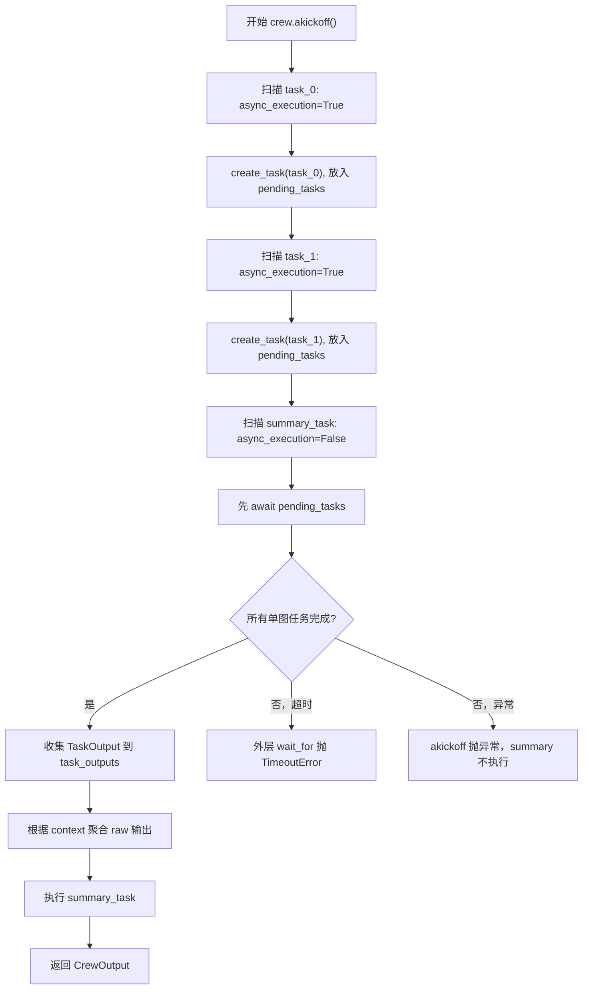

# CrewAI akickoff、asyncio.wait_for 与汇总 Task 执行顺序说明

这份笔记解释下面这段代码：

```python
# 使用 asyncio.wait_for 为 Crew 执行增加超时控制，避免任务“卡死”
result = await asyncio.wait_for(crew.akickoff(), timeout=timeout)
```

对应位置：

- 视觉分析阶段：[src/app/crews/xhs_note/flows.py](../../src/app/crews/xhs_note/flows.py)
- 图片编辑阶段：[src/app/crews/xhs_note/flows.py](../../src/app/crews/xhs_note/flows.py)
- Task 构造：[src/app/crews/xhs_note/tasks.py](../../src/app/crews/xhs_note/tasks.py)

核心结论：

- `crew.akickoff()` 是启动整个 CrewAI 工作流的异步入口。
- `asyncio.wait_for(..., timeout=timeout)` 是给整个 Crew 执行包一层总超时。
- 如果 Crew 在指定时间内没有结束，`wait_for` 会抛出 `asyncio.TimeoutError`，当前请求就不会一直挂住。
- 当前 CrewAI 实现里，前面的单图 task 虽然是异步任务，但最后的 summary task 是同步 task；CrewAI 在执行 summary task 之前，会先等待前面所有 pending async tasks 完成。
- 所以，正常情况下 summary task 不会因为前面任务还没输出就提前执行。

## 这行代码分开看

```python
result = await asyncio.wait_for(crew.akickoff(), timeout=timeout)
```

可以拆成三层：

```python
crew.akickoff()
```

返回一个 coroutine。这个 coroutine 代表“启动 CrewAI，并等待这个 Crew 的所有任务执行结束”。

```python
asyncio.wait_for(crew.akickoff(), timeout=timeout)
```

给这个 coroutine 加一个最大等待时间。

```python
await asyncio.wait_for(...)
```

当前 FastAPI 请求协程在这里暂停，事件循环可以去处理别的请求；等 Crew 执行完成、失败、或超时后，再回到这里继续。

## 为什么 wait_for 可以避免任务卡死

如果直接写：

```python
result = await crew.akickoff()
```

那么只要 Crew 内部某一步迟迟不返回，当前请求就会一直等下去。可能卡住的原因包括：

- LLM 请求长时间没有响应。
- 某个 Agent 工具调用阻塞。
- 模型一直没有产出可解析结果，CrewAI 内部持续重试。
- 网络连接处于半挂起状态。
- 多图任务里某一张图的分析特别慢，导致整个阶段一直不结束。

加上 `wait_for` 后，含义变成：

```text
最多等 timeout 秒；如果 timeout 秒内 crew.akickoff() 没有返回，就终止这次等待并抛出 TimeoutError。
```

所以它能避免的是“业务请求无限等待”。在这个项目里，异常会被外层捕获：

```python
try:
    result = await asyncio.wait_for(crew.akickoff(), timeout=timeout)
except Exception as exc:
    _handle_crew_error(exc, ["xhs_visual_analyst"])
    raise
```

然后再被更外层 `run_xhs_note_flow()` 捕获并转成错误信息：

```python
error_msg = f"流程执行失败: {type(exc).__name__}: {str(exc)}"
return None, error_msg
```

也就是说，超时后用户会得到一个失败响应，日志和指标也会记录失败，而不是请求一直没有结果。

## wait_for 的取消语义

`asyncio.wait_for()` 超时时，会尝试取消被等待的 coroutine。这里就是取消 `crew.akickoff()`。

可以理解为：

```text
当前等待链路不再继续等 Crew 结果，向 akickoff 发送取消信号。
```

不过要注意一个现实细节：取消不是操作系统级别的“强杀线程”。它对纯 async/await 链路最有效；如果底层某段代码已经进入同步阻塞调用，例如同步 HTTP 请求、线程池里的函数、第三方库内部阻塞，那么取消信号不一定能立刻中断那段底层工作。

本项目里的 `AliyunLLM.acall()` 是：

```python
return await asyncio.to_thread(self.call, ...)
```

而 `self.call()` 内部使用同步 `requests.post()`。这意味着：

- `wait_for` 可以保证当前业务协程按超时返回。
- 但已经丢到线程里的同步 `requests.post()` 不一定会被立即杀掉。
- 好在 `AliyunLLM` 自己也有 `timeout=self.timeout`，所以底层 HTTP 请求也有自己的超时。

因此，这里其实是两层超时：

| 层级 | 代码 | 控制范围 |
| --- | --- | --- |
| 单次 LLM HTTP 超时 | `requests.post(..., timeout=self.timeout)` | 控制单次阿里云 HTTP 请求最多等多久 |
| 整个 Crew 阶段超时 | `asyncio.wait_for(crew.akickoff(), timeout=timeout)` | 控制整个视觉分析/图片编辑/内容阶段最多跑多久 |

这两个超时不是重复，而是互补：

- HTTP timeout 防止单个模型请求挂太久。
- Crew timeout 防止多个任务、重试、工具调用、上下文汇总整体耗时失控。

## 当前视觉分析阶段的 Task 结构

视觉分析阶段的任务构造大致是：

```python
tasks: List[Task] = []

for img in idea_request.images:
    tasks.append(build_visual_analysis_task(img, idea_request.idea_text))

summary_task = build_visual_analysis_summary_task(tasks)
tasks.append(summary_task)
```

其中单图视觉分析 task 是：

```python
return Task(
    description=description,
    expected_output=expected_output,
    agent=get_xhs_visual_analyst(),
    output_pydantic=XhsImageVisualAnalysis,
    async_execution=True,
)
```

汇总 task 是：

```python
return Task(
    description=cfg.get("description", ""),
    expected_output=cfg.get("expected_output", ""),
    agent=get_xhs_visual_analyst(),
    context=context,
    async_execution=False,
)
```

所以任务列表长这样：

```text
[
  image_task_0(async_execution=True),
  image_task_1(async_execution=True),
  image_task_2(async_execution=True),
  summary_task(async_execution=False, context=[image_task_0, image_task_1, image_task_2]),
]
```

图片编辑阶段也是同样结构：

```text
[
  edit_task_0(async_execution=True),
  edit_task_1(async_execution=True),
  edit_task_2(async_execution=True),
  edit_summary_task(async_execution=False, context=[edit_task_0, edit_task_1, edit_task_2]),
]
```

## sequential 里为什么还能有并行

项目里 Crew 使用的是：

```python
crew = Crew(
    agents=agents,
    tasks=tasks,
    process=Process.sequential,
    ...
)
```

这里的 `Process.sequential` 表示 CrewAI 会按任务列表顺序扫描任务。但“按顺序扫描”不等于“每个任务都同步等完再扫描下一个”。

在当前 CrewAI 源码里，native async 路径大致逻辑是：

```python
for task in tasks:
    if task.async_execution:
        async_task = asyncio.create_task(task.aexecute_sync(...))
        pending_tasks.append((task, async_task, task_index))
    else:
        if pending_tasks:
            task_outputs.extend(await self._aprocess_async_tasks(pending_tasks))
            pending_tasks.clear()

        context = self._get_context(task, task_outputs)
        task_output = await task.aexecute_sync(...)
        task_outputs.append(task_output)
```

这个逻辑的意思是：

1. 扫描到 `async_execution=True` 的任务时，不立刻等待它完成。
2. CrewAI 用 `asyncio.create_task()` 启动它，并放进 `pending_tasks`。
3. 继续扫描下一个任务。
4. 如果下一个也是 async task，也同样启动后放进 `pending_tasks`。
5. 一旦遇到 `async_execution=False` 的任务，就先等待前面所有 pending async tasks 完成。
6. 等前面的输出都收集到 `task_outputs` 之后，再执行这个同步任务。

所以这里的“并行”更准确地说是：

```text
sequential 负责扫描顺序；async_execution=True 允许一段连续的异步任务先一起启动；后面的同步任务会成为一道等待屏障。
```

## 汇总 task 会不会抢在其他 task 没输出时执行

正常不会。

原因是 summary task 的 `async_execution=False`。CrewAI 扫描到它时，会先执行：

```python
if pending_tasks:
    task_outputs.extend(
        await self._aprocess_async_tasks(pending_tasks, was_replayed)
    )
    pending_tasks.clear()
```

而 `_aprocess_async_tasks()` 会逐个 await 前面已经创建的 async tasks：

```python
for future_task, async_task, task_index in pending_tasks:
    task_output = await async_task
    task_outputs.append(task_output)
```

这就意味着，summary task 运行前，前面的单图 async task 已经完成，并且它们的 `TaskOutput` 已经放进了 `task_outputs`。

然后 summary task 获取上下文：

```python
context = self._get_context(task, task_outputs)
```

如果 task 显式配置了 `context=[前面的单图 tasks]`，CrewAI 会从这些 task 的 `.output` 字段聚合 raw 输出：

```python
aggregate_raw_outputs_from_tasks(task.context)
```

其内部逻辑类似：

```python
task_outputs = [task.output for task in tasks if task.output is not None]
return "\n\n----------\n\n".join(output.raw for output in task_outputs)
```

所以 summary task 看到的是前面每个单图任务的 raw 输出拼接结果。

## 什么情况下 summary 可能拿不到完整结果

虽然正常不会抢跑，但下面几种情况会让 summary 拿不到完整结果，或者根本不会执行。

### 1. 前面的 async task 卡住

如果某个单图 task 一直不结束，CrewAI 会卡在等待 pending tasks 的位置：

```python
await self._aprocess_async_tasks(pending_tasks)
```

这时 summary task 不会执行。外层的：

```python
await asyncio.wait_for(crew.akickoff(), timeout=timeout)
```

会在总超时时间到达后抛出 `TimeoutError`。这就是 `wait_for` 的价值。

### 2. 前面的 async task 抛异常

如果某个单图 task 抛异常，`await async_task` 会把异常抛出来。CrewAI 整个 `akickoff()` 会失败，summary task 通常不会继续执行。

当前 flow 会进入异常处理：

```python
except Exception as exc:
    _handle_crew_error(exc, ["xhs_visual_analyst"])
    raise
```

### 3. 前面的 task 完成了，但没有 pydantic 输出

有些情况下，LLM 返回了 raw 文本，但没有成功解析成 `XhsImageVisualAnalysis`。这时：

- 对 summary task 来说，可能仍然能拿到前面 task 的 raw 输出。
- 对当前 flow 后处理来说，这张图可能不会进入 `visual_by_id`。

因为 flow 提取单图结果时写的是：

```python
visual = getattr(task_output, "pydantic", None)
if isinstance(visual, XhsImageVisualAnalysis):
    visual_by_id[visual.image_id] = visual
```

也就是说，summary task 关注 raw 上下文；业务结果映射关注 pydantic 对象。raw 有内容不代表 pydantic 一定解析成功。

### 4. 任务上下文里引用的 task 没有 output

CrewAI 聚合显式 `context` 时会跳过 `output is None` 的 task：

```python
[task.output for task in tasks if task.output is not None]
```

所以如果某个 context task 没有 output，它不会贡献上下文。正常等待流程下这不该发生；如果发生，通常意味着 task 被跳过、失败、或执行过程被中断。

## 用一张图理解执行流程



## 回到你的两个问题

### 为什么 wait_for 能避免任务卡死

因为它给 `crew.akickoff()` 整体加了最大等待时间。没有它时，某个 LLM 请求、工具调用、Agent 循环、异步 task 卡住，都可能让当前请求一直等待。有它时，到达 `timeout` 后当前协程会停止等待并抛出异常，业务层可以记录错误并返回失败响应。

它避免的是“应用层请求无限挂起”，不是保证底层所有线程立即被强制杀掉。底层同步 HTTP 请求仍然需要自己的 `requests.post(..., timeout=...)` 配合。

### 汇总 task 会不会因为其他 task 没输出而没有任何 output

正常不会，因为 summary task 是 `async_execution=False`，它会触发 CrewAI 先等待前面所有 pending async tasks 完成，再开始汇总。

但如果前面某个 async task 卡死，summary task 也不会执行，最后由外层 `wait_for` 超时兜底。如果前面 task 失败，整个 Crew 大概率直接失败。如果前面 task 只有 raw 没有 pydantic，summary 可能还能看到 raw，但 flow 后续按 `pydantic` 提取结构化结果时会跳过那张图。

所以更准确的理解是：

```text
summary task 不是并发任务的一部分，而是并发任务后面的一道同步汇总屏障。
```

前面的并发任务都结束后，它才会拿这些任务的输出做汇总。
