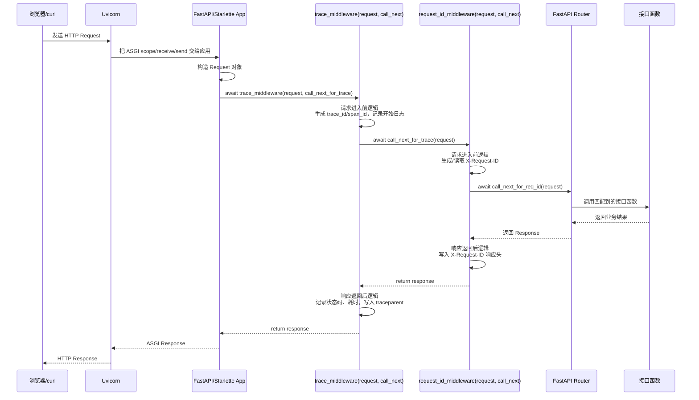

# `@app.middleware("http")` 是如何起作用的

这份笔记解释当前项目里这种代码：

```python
@app.middleware("http")
async def request_id_middleware(request: Request, call_next):
    ...
    response = await call_next(request)
    ...
    return response
```

它出现在 [`src/app/main.py`](../../src/app/main.py) 中，是 FastAPI/Starlette 的 HTTP 中间件写法。

## 1. 先说结论

`@app.middleware("http")` 本质上是 Python 的“装饰器”语法。

它做的事可以理解为：

> 把下面这个函数注册到 FastAPI 应用的 HTTP 请求处理链里。

所以：

```python
@app.middleware("http")
async def request_id_middleware(request, call_next):
    ...
```

大致等价于：

```python
async def request_id_middleware(request, call_next):
    ...

app.middleware("http")(request_id_middleware)
```

注意这里有两层调用：

```python
app.middleware("http")
```

先返回一个“装饰器函数”。

然后：

```python
装饰器函数(request_id_middleware)
```

把 `request_id_middleware` 注册进去。

## 2. Python 装饰器到底是什么

Python 装饰器本质上就是：

> 一个函数接收另一个函数作为参数，并返回一个函数或对象。

最简单的例子：

```python
def log_decorator(func):
    def wrapper():
        print("调用前")
        result = func()
        print("调用后")
        return result
    return wrapper


@log_decorator
def say_hello():
    print("hello")
```

上面这段代码等价于：

```python
def say_hello():
    print("hello")

say_hello = log_decorator(say_hello)
```

所以装饰器不是魔法，它只是 Python 提供的一种简洁语法。

## 3. 带参数的装饰器

`@app.middleware("http")` 是“带参数的装饰器”。

它比普通装饰器多一层。

普通装饰器：

```python
@log_decorator
def f():
    ...
```

等价于：

```python
f = log_decorator(f)
```

带参数装饰器：

```python
@app.middleware("http")
def f():
    ...
```

等价于：

```python
decorator = app.middleware("http")
f = decorator(f)
```

也就是：

```python
f = app.middleware("http")(f)
```

所以 `app.middleware("http")` 不是直接执行你的中间件函数，而是先生成一个“注册器”，再把你的函数交给它。

## 4. FastAPI 里的 middleware 做了什么

FastAPI 基于 Starlette。

当你写：

```python
@app.middleware("http")
async def request_id_middleware(request: Request, call_next):
    ...
```

FastAPI 会把这个函数保存到应用内部的 middleware 列表里。

之后每次 HTTP 请求进来时，FastAPI/Starlette 会按中间件链路调用这些函数。

中间件函数的形态固定是：

```python
async def middleware(request, call_next):
    # 请求进入路由之前
    ...

    response = await call_next(request)

    # 路由返回响应之后
    ...

    return response
```

其中：

- `request`：当前 HTTP 请求。
- `call_next`：调用下一个中间件或最终路由处理函数。
- `response`：下游返回的响应。

## 4.1 `request` 和 `call_next` 是谁传进来的

你的理解方向是对的，但要稍微拆细一点：

```python
@app.middleware("http")
async def request_id_middleware(request: Request, call_next):
    ...
```

这里的 `request` 和 `call_next` 不是你自己手动传的，也不是装饰器在“定义函数的那一刻”立刻传的。

更准确地说：

> `@app.middleware("http")` 只是把 `request_id_middleware` 注册成 HTTP 中间件。等真实 HTTP 请求进来时，FastAPI/Starlette 才会调用这个函数，并自动传入 `request` 和 `call_next`。

所以这段代码分成两个阶段理解。

### 阶段一：程序启动时，注册中间件

程序启动、执行到这段代码时：

```python
@app.middleware("http")
async def request_id_middleware(request: Request, call_next):
    ...
```

Python 会把它展开成类似这样：

```python
async def request_id_middleware(request: Request, call_next):
    ...

decorator = app.middleware("http")
request_id_middleware = decorator(request_id_middleware)
```

在这个阶段发生的是：

```text
你的函数 request_id_middleware
        |
        v
交给 app.middleware("http") 返回的注册器
        |
        v
FastAPI/Starlette 把它保存到 middleware 配置里
```

这个阶段没有真实请求，所以还没有 `request`，也不会调用你的中间件业务逻辑。

### 阶段二：请求进来时，调用中间件

当真实 HTTP 请求进来时，Uvicorn/FastAPI/Starlette 才会创建：

- `request`：当前请求对象。
- `call_next`：一个函数，表示“继续调用下游处理链”。

然后框架内部会做类似这样的调用：

```python
response = await request_id_middleware(request, call_next)
```

这时你的函数才真正执行。

所以可以理解成：

```text
你定义函数签名：
async def request_id_middleware(request, call_next)

框架负责运行时传参：
await request_id_middleware(当前请求对象, 下游调用函数)
```

你只需要按 FastAPI 约定写好这个函数形态，然后在函数体里写自己的逻辑。

## 4.2 从接收到 request 开始的时序图

下面用当前项目里的两个中间件举例：

- `trace_middleware`
- `request_id_middleware`

它们都定义在 [`src/app/main.py`](../../src/app/main.py)。

当前项目里代码顺序是：

```python
@app.middleware("http")
async def request_id_middleware(request: Request, call_next):
    ...

@app.middleware("http")
async def trace_middleware(request: Request, call_next):
    ...
```

由于 Starlette 中间件链通常是后注册的先执行，所以大致请求链路是：

```text
trace_middleware
  -> request_id_middleware
    -> 路由函数
```

时序图如下：



## 4.3 每一步到底发生了什么

可以按这 10 步理解。

### 第 1 步：服务启动，注册中间件

Python 执行 [`src/app/main.py`](../../src/app/main.py)。

遇到：

```python
@app.middleware("http")
async def request_id_middleware(...):
    ...
```

FastAPI 把 `request_id_middleware` 记下来。

又遇到：

```python
@app.middleware("http")
async def trace_middleware(...):
    ...
```

FastAPI 把 `trace_middleware` 也记下来。

此时只是注册，还没有请求对象。

### 第 2 步：Uvicorn 收到 HTTP 请求

比如浏览器请求：

```text
GET /health/live
```

Uvicorn 是 ASGI Server，它负责监听端口、接收 TCP/HTTP 请求，然后把请求交给 FastAPI 应用。

### 第 3 步：Starlette 构造 `Request`

FastAPI 底层的 Starlette 会把 ASGI 原始信息包装成更好用的 `Request` 对象。

也就是你的中间件参数：

```python
request: Request
```

这个对象里包含：

- 请求方法：`request.method`
- 路径：`request.url.path`
- 请求头：`request.headers`
- 查询参数：`request.query_params`
- 请求体：`await request.body()`
- 请求状态：`request.state`

### 第 4 步：Starlette 准备 `call_next`

Starlette 会给当前中间件准备一个 `call_next` 函数。

这个函数可以理解成：

```text
如果你想继续往下执行，请调用我。
```

对最外层中间件来说，`call_next` 指向下一个中间件。

对最内层中间件来说，`call_next` 指向路由匹配和接口函数执行。

### 第 5 步：调用最外层中间件

框架内部做类似这样的事：

```python
response = await trace_middleware(request, call_next)
```

所以 `trace_middleware` 里的两个参数来自框架：

```python
async def trace_middleware(request: Request, call_next):
    ...
```

不是你自己传的。

### 第 6 步：执行 `await call_next(request)` 前的逻辑

比如 `trace_middleware` 会在请求继续往下走之前：

- 解析或生成 trace_id
- 设置 span_id
- 记录请求开始日志

这就是“请求进入路由之前”的逻辑。

### 第 7 步：调用 `await call_next(request)`

代码执行到：

```python
response = await call_next(request)
```

这表示：

```text
我当前这一层处理完进入前逻辑了，请把请求交给下一层。
```

下一层可能是：

- 另一个中间件
- FastAPI 路由系统
- 最终接口函数

### 第 8 步：路由函数执行并返回响应

当请求穿过所有中间件后，FastAPI Router 会根据路径找到接口函数。

比如：

```python
@router.get("/live")
async def liveness():
    return {"status": "ok"}
```

路由函数返回后，FastAPI 会把结果转换成 `Response` 对象。

### 第 9 步：响应沿中间件链往回走

下游返回后，代码会从这里继续执行：

```python
response = await call_next(request)

# 这里是响应回来之后
response.headers["X-Request-ID"] = rid
return response
```

这就是“洋葱模型”的返回阶段。

中间件可以在响应回来后：

- 加响应头
- 记录耗时
- 打日志
- 改状态码
- 包装响应

### 第 10 步：Uvicorn 把响应发回客户端

所有中间件都 `return response` 后，响应交还给 Uvicorn。

Uvicorn 再把它转换成真实 HTTP Response 发给浏览器或 curl。

## 4.4 这是不是“默认就有的参数”

可以这样理解：

> 对于被 `@app.middleware("http")` 注册的 HTTP 中间件函数，FastAPI/Starlette 约定运行时会传入 `request` 和 `call_next` 两个参数。

但更精确的说法是：

```text
不是 Python 语言默认给它们传参，
而是 FastAPI/Starlette 的中间件机制在调用你的函数时传参。
```

所以这段代码：

```python
@app.middleware("http")
async def request_id_middleware(request: Request, call_next):
    ...
```

不是随便写两个参数都可以。

FastAPI 期望你的 HTTP middleware 函数满足这个调用约定：

```python
async def middleware(request, call_next):
    ...
```

如果你写成：

```python
@app.middleware("http")
async def bad_middleware():
    ...
```

当请求进来时，框架仍然会尝试类似这样调用：

```python
await bad_middleware(request, call_next)
```

这时参数数量对不上，就会报错。

## 4.5 一个更像底层的伪代码

下面是非常简化的伪代码，不是 Starlette 原源码，但可以帮助理解：

```python
class App:
    def __init__(self):
        self.middlewares = []

    def middleware(self, middleware_type):
        def decorator(func):
            if middleware_type == "http":
                self.middlewares.append(func)
            return func
        return decorator

    async def handle_request(self, request):
        async def route_handler(req):
            return await real_api_function(req)

        next_func = route_handler

        for middleware_func in reversed(self.middlewares):
            old_next = next_func

            async def new_next(req, mw=middleware_func, nxt=old_next):
                return await mw(req, nxt)

            next_func = new_next

        response = await next_func(request)
        return response
```

中间件注册时：

```python
app.middlewares.append(request_id_middleware)
```

请求进来时：

```python
response = await request_id_middleware(request, call_next)
```

所以你的业务函数只要知道：

```python
async def request_id_middleware(request, call_next):
    # 进入前
    response = await call_next(request)
    # 返回后
    return response
```

框架负责：

- 创建 `request`
- 创建 `call_next`
- 调用你的中间件
- 串联多个中间件
- 把最终响应交回 Uvicorn

## 5. 它是不是洋葱模型

是的，非常像。

尤其和 Node.js / TypeScript 生态里的 Koa 洋葱模型很像。

Koa 常见写法：

```ts
app.use(async (ctx, next) => {
  console.log("A before")
  await next()
  console.log("A after")
})

app.use(async (ctx, next) => {
  console.log("B before")
  await next()
  console.log("B after")
})
```

请求执行顺序是：

```text
A before
  B before
    route handler
  B after
A after
```

FastAPI 中间件也类似：

```python
@app.middleware("http")
async def middleware_a(request, call_next):
    print("A before")
    response = await call_next(request)
    print("A after")
    return response


@app.middleware("http")
async def middleware_b(request, call_next):
    print("B before")
    response = await call_next(request)
    print("B after")
    return response
```

请求会像一层一层剥洋葱一样进去，再一层一层出来。

## 5.1 `ctx` 和 `next` 分别是什么意思

以 Koa / TypeScript 里的这段为例：

```ts
app.use(async (ctx, next) => {
  console.log("A before")
  await next()
  console.log("A after")
})
```

这里有两个参数：

| 参数 | 含义 | 类比 FastAPI |
| --- | --- | --- |
| `ctx` | context，请求上下文，里面通常有 request、response、状态数据等 | `request`，以及可以写入 `request.state` 的上下文 |
| `next` | 一个函数，调用它表示“把请求交给下一个中间件/路由” | `call_next(request)` |

所以：

```ts
await next()
```

就是这一句让代码进入“下一层”。

如果不调用 `await next()`，后面的中间件和路由就不会执行。

## 5.2 可以直接复制运行的 JavaScript 洋葱模型例子

下面这段不是 Koa 源码，而是一个极简版 middleware 引擎。你可以直接复制到浏览器 Console 或 Node.js 里运行。

```js
const middlewares = []

function use(fn) {
  middlewares.push(fn)
}

use(async (ctx, next) => {
  console.log("A before")
  ctx.steps.push("A before")

  await next()

  console.log("A after")
  ctx.steps.push("A after")
})

use(async (ctx, next) => {
  console.log("B before")
  ctx.steps.push("B before")

  await next()

  console.log("B after")
  ctx.steps.push("B after")
})

use(async (ctx, next) => {
  console.log("C before")
  ctx.steps.push("C before")

  await next()

  console.log("C after")
  ctx.steps.push("C after")
})

async function routeHandler(ctx) {
  console.log("Route handler")
  ctx.steps.push("Route handler")
  ctx.response = "hello"
}

function compose(middlewares, routeHandler) {
  return async function run(ctx) {
    async function dispatch(index) {
      if (index < middlewares.length) {
        const middleware = middlewares[index]

        await middleware(ctx, async () => {
          await dispatch(index + 1)
        })

        return
      }

      await routeHandler(ctx)
    }

    await dispatch(0)
  }
}

const ctx = {
  request: {
    path: "/hello",
    method: "GET"
  },
  response: null,
  steps: []
}

const app = compose(middlewares, routeHandler)
await app(ctx)

console.log("最终 ctx:", ctx)
console.log("执行顺序:", ctx.steps.join(" -> "))
```

输出顺序会是：

```text
A before
B before
C before
Route handler
C after
B after
A after
```

这就是洋葱模型：

```text
A before
  B before
    C before
      Route handler
    C after
  B after
A after
```

也就是说：

- `await next()` 前面的代码，是“请求往里走”的逻辑。
- `await next()` 后面的代码，是“响应往外回”的逻辑。
- 最先执行 before 的中间件，最后执行 after。

## 5.3 逐行理解 `next`

核心是 `compose()` 里的这一段：

```js
await middleware(ctx, async () => {
  await dispatch(index + 1)
})
```

假设现在正在执行第 0 个中间件 A。

框架实际调用类似：

```js
await A(ctx, async () => {
  await dispatch(1)
})
```

所以 A 里的 `next` 实际上就是：

```js
async () => {
  await dispatch(1)
}
```

当 A 执行：

```js
await next()
```

就会进入第 1 个中间件 B。

B 的 `next` 又会进入 C。

C 的 `next` 再进入 route handler。

route handler 返回后，执行权会一层一层回到：

```text
C after -> B after -> A after
```

这就是“函数包函数”的效果。

## 5.4 如果不调用 `next` 会怎样

把 B 中间件改成这样：

```js
use(async (ctx, next) => {
  console.log("B before")
  ctx.steps.push("B before")

  // 不调用 await next()

  console.log("B after")
  ctx.steps.push("B after")
})
```

那么输出会变成：

```text
A before
B before
B after
A after
```

C 和 Route handler 都不会执行。

这说明 `next` 控制了请求是否继续往下传。

这和 FastAPI 里不调用：

```python
response = await call_next(request)
```

就可以提前返回响应，是同一个思想。

## 6. 和 TypeScript 的 `async` 是一回事吗

不是一回事，但经常一起出现。

`async` 只是表示这个函数是异步函数，可以使用 `await`。

比如 TypeScript：

```ts
async function handler() {
  const result = await fetch(...)
}
```

Python：

```python
async def handler():
    result = await some_async_call()
```

`async` 本身不等于洋葱模型。

洋葱模型的关键是：

> 当前函数拿到一个代表“下游处理流程”的函数，并在合适的位置调用它。

Koa 里是：

```ts
await next()
```

FastAPI 里是：

```python
response = await call_next(request)
```

所以更准确地说：

```text
async              = 支持异步等待
next/call_next     = 调用下游处理链
中间件链组合        = 形成洋葱模型
```

## 7. 一个通俗例子：进餐厅

把一次 HTTP 请求想象成你去餐厅吃饭。

```text
你进餐厅
  -> 门口登记员
    -> 服务员
      -> 厨房做菜
    <- 服务员检查菜品
  <- 门口登记员盖章放行
你拿到饭
```

对应到中间件：

```text
请求进入
  -> request_id_middleware before：给请求贴编号
    -> trace_middleware before：记录开始时间和 trace
      -> 路由函数：真正处理业务
    <- trace_middleware after：记录状态码和耗时
  <- request_id_middleware after：把 X-Request-ID 写入响应头
响应返回
```

代码形式：

```python
@app.middleware("http")
async def door_keeper(request, call_next):
    print("进门：发号码牌")
    response = await call_next(request)
    print("出门：检查号码牌")
    return response


@app.middleware("http")
async def waiter(request, call_next):
    print("上菜前：记录点餐")
    response = await call_next(request)
    print("上菜后：确认菜品")
    return response
```

`await call_next(request)` 就是“把请求交给下一层”。

如果你不调用它，请求就不会继续往下走。

## 8. 如果不调用 `call_next` 会怎样

中间件可以拦截请求。

例如：

```python
from fastapi.responses import JSONResponse


@app.middleware("http")
async def block_middleware(request, call_next):
    if request.url.path == "/blocked":
        return JSONResponse({"error": "blocked"}, status_code=403)

    return await call_next(request)
```

访问 `/blocked` 时，它直接返回 403。

这时后面的中间件和路由函数都不会执行。

这和很多 Web 框架里的鉴权、限流、黑名单拦截是一个思路。

## 9. 当前项目里的两个 HTTP 中间件

当前项目在 [`src/app/main.py`](../../src/app/main.py) 里注册了两个 HTTP 中间件：

```python
@app.middleware("http")
async def request_id_middleware(request: Request, call_next):
    ...


@app.middleware("http")
async def trace_middleware(request: Request, call_next):
    ...
```

它们的作用分别是：

| 中间件 | 作用 |
| --- | --- |
| `request_id_middleware` | 生成或读取 `X-Request-ID`，并写入响应头 |
| `trace_middleware` | 设置 trace_id/span_id，记录请求开始、响应结束、耗时等 |

### 9.1 为什么代码注释说“后注册的先执行”

当前代码里有这段注释：

```python
# 后注册的先执行：request_id 先注册，trace 后注册，故 trace 先执行，request_id 可读到 trace_id
```

意思是：

```python
@app.middleware("http")
async def request_id_middleware(...):
    ...

@app.middleware("http")
async def trace_middleware(...):
    ...
```

虽然 `request_id_middleware` 写在前面，`trace_middleware` 写在后面，但 Starlette 构建中间件调用链时，后注册的中间件会更靠外层，因此先收到请求。

实际进入方向大致是：

```text
请求进入
  -> trace_middleware
    -> request_id_middleware
      -> 路由函数
    <- request_id_middleware
  <- trace_middleware
响应返回
```

这样 `trace_middleware` 可以先生成 `request.state.trace_id`，后面的 `request_id_middleware` 就能拿到它。

## 10. 函数接受函数作为参数

你的理解里提到“函数接受函数作为参数”，这是对的。

这里有两处都体现了这个思想。

### 10.1 装饰器接收函数

```python
@app.middleware("http")
async def trace_middleware(...):
    ...
```

等价于：

```python
trace_middleware = app.middleware("http")(trace_middleware)
```

这里 `app.middleware("http")` 返回的装饰器接收了 `trace_middleware` 这个函数。

### 10.2 中间件接收 `call_next`

```python
async def trace_middleware(request, call_next):
    response = await call_next(request)
    return response
```

这里 `call_next` 也是一个函数。

它代表：

```text
下一个中间件，或者最终路由处理函数
```

所以你说的“函数接受函数作为参数，类似 TS/Koa 洋葱模型”，理解方向是准确的。

## 11. 一个极简手写洋葱模型

下面不用 FastAPI，手写一个迷你版，帮助理解原理：

```python
import asyncio


async def middleware_a(next_func):
    print("A before")
    result = await next_func()
    print("A after")
    return result


async def middleware_b(next_func):
    print("B before")
    result = await next_func()
    print("B after")
    return result


async def route_handler():
    print("route handler")
    return "response"


async def main():
    async def call_b():
        return await middleware_b(route_handler)

    result = await middleware_a(call_b)
    print("final:", result)


asyncio.run(main())
```

输出：

```text
A before
B before
route handler
B after
A after
final: response
```

这就是洋葱模型最核心的样子。

FastAPI/Starlette 底层做的事情更复杂，比如要处理 ASGI scope、receive、send、异常、响应对象等，但核心思想就是：

```text
中间件函数包住下游函数
请求先一层层进去
响应再一层层回来
```

## 12. 和 ASGI 的关系

FastAPI 是 ASGI 应用。

ASGI 可以简单理解为 Python 异步 Web 服务和服务器之间的协议。

Uvicorn 收到 HTTP 请求后，会把请求交给 FastAPI 这个 ASGI app。

大致链路是：

```text
浏览器 / curl
    |
    v
Uvicorn
    |
    v
FastAPI / Starlette ASGI App
    |
    v
Middleware 链
    |
    v
Router
    |
    v
你的接口函数
```

`@app.middleware("http")` 注册的函数，就在 Middleware 链这一层。

## 13. 一句话总结

`@app.middleware("http")` 的底层思路是：

```text
Python 装饰器语法
  + FastAPI/Starlette 把函数注册为 HTTP 中间件
  + 每次请求时通过 call_next 串起后续处理链
  + await call_next(request) 前后分别处理请求进入和响应返回
```

它和 TypeScript/Koa 的洋葱模型非常相似。

但要区分：

- `async` 只是异步语法。
- `call_next` / `next` 才是把一层层中间件串成洋葱模型的关键。
