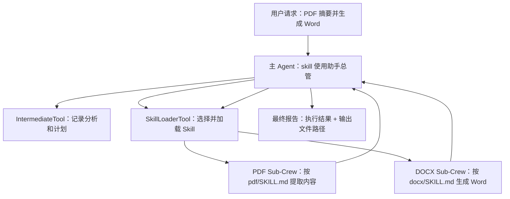
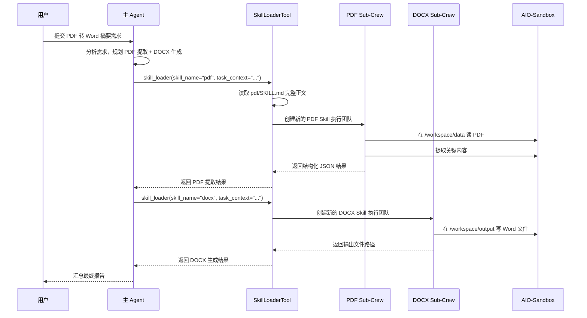

# m2l16_skills.py 代码设计解读

本文结合 `notes.md` 和 `../crewai_mas_demo/m2l16/m2l16_skills.py`、`../crewai_mas_demo/tools/skill_loader_tool.py` 解释第 16 课的 Skills 执行引擎。你可以把它理解为：主 Agent 不直接处理 PDF/Word，而是先判断该用哪个 Skill，再把具体任务交给一个临时创建的 Skill 专家去沙盒里执行。

## 1. 先理解几个基础概念

### 1.1 CrewAI 里的几个角色

在这段代码里，CrewAI 的核心对象有四个：

- `Agent`：一个带有角色、目标、背景说明、工具和 LLM 的智能体。可以把它理解成“员工”。
- `Task`：交给某个 Agent 做的一件事。可以把它理解成“工单”。
- `Crew`：由一个或多个 Agent 和 Task 组成的团队。可以把它理解成“项目小组”。
- `Tool`：Agent 能调用的工具。工具一般有输入参数、说明文档和执行逻辑。

主代码里创建了一个主 Crew：

```python
orchestrator = Agent(
    role="skill使用助手总管",
    goal="根据用户需求进行分析，拆解，分发任务，最终保证任务的完成",
    tools=[skill_loader, IntermediateTool()],
)

main_task = Task(
    description="{user_request}",
    expected_output="完整的任务执行报告...",
    agent=orchestrator,
)

return Crew(
    agents=[orchestrator],
    tasks=[main_task],
    process=Process.sequential,
)
```

这里的 `orchestrator` 是总管。它不亲自解析 PDF，也不亲自生成 Word，而是负责拆任务、选 Skill、检查结果。

### 1.2 Skill 是什么

`notes.md` 里说得很准确：Skill 不是 API，也不是 MCP Server，而是“给 LLM 读的结构化操作手册”。

一个 Skill 通常长这样：

```text
skills/pdf/
├── SKILL.md
├── scripts/
├── references/
└── assets/
```

`SKILL.md` 最重要。开头的 YAML frontmatter 是给主 Agent 判断用途的：

```markdown
---
name: pdf
description: Use this skill whenever the user wants to do anything with PDF files...
---
```

正文则是给 Skill 执行 Agent 用的完整操作指南，例如用 `pypdf`、`pdfplumber`、`pdftotext`，以及哪些坑要避开。

### 1.3 沙盒和容器是什么

这套代码强调“所有实际文件操作都在 AIO-Sandbox 中执行”。对初学者来说，可以这样理解：

- 本地电脑：你写代码、放 PDF、看输出文件的地方。
- Docker 容器 / 沙盒：一个隔离出来的小环境，Agent 可以在里面运行命令、安装依赖、读写指定目录。
- 挂载：把本地某个目录映射到容器内部。例如本地 `./workspace/data` 在容器里看起来是 `/workspace/data`。

代码中的默认挂载说明是：

```python
DEFAULT_SANDBOX_MOUNT_DESC = (
    "1. 所有的操作必须在沙盒中执行，不得操作本地文件系统，当前已挂载在沙盒的本地目录为"
    "./workspace/data:/workspace/data:ro和./workspace/output:/workspace/output:rw\n"
    ...
)
```

其中：

- `./workspace/data:/workspace/data:ro`：本地输入目录映射到沙盒 `/workspace/data`，`ro` 表示只读。
- `./workspace/output:/workspace/output:rw`：本地输出目录映射到沙盒 `/workspace/output`，`rw` 表示可读写。

这样设计的好处是：Agent 即使会执行命令，也只能在受控目录里操作，降低误删本地文件、污染项目目录的风险。

## 2. 整体架构：主 Agent 调度，Skill Agent 执行

这套设计不是“一个 Agent 从头干到尾”，而是分成两层：



这种架构的关键点是：

- 主 Agent 负责“理解需求、拆解步骤、选 Skill”。
- `SkillLoaderTool` 负责“发现有哪些 Skill、按需加载 Skill、决定是返回说明还是启动 Sub-Crew”。
- Sub-Crew 负责“拿着完整 Skill 指南，在沙盒里真正执行”。

对应到 `m2l16_skills.py`：

```python
def build_main_crew() -> Crew:
    skill_loader = SkillLoaderTool()

    orchestrator = Agent(
        role="skill使用助手总管",
        goal="根据用户需求进行分析，拆解，分发任务，最终保证任务的完成",
        tools=[skill_loader, IntermediateTool()],
        verbose=True,
    )
```

注意这里 `SkillLoaderTool()` 在主 Crew 创建时就实例化了。它的 `__init__` 会扫描 Skills 元数据，然后把“可用 Skill 列表”写入工具描述中，供主 Agent 做决策。

## 3. 一次完整执行会发生什么

假设用户请求是：

```python
USER_REQUEST = (
    "请将./workspace/data/quarterly_report.pdf里的关键数据提炼出来，生成一份格式规范的 Word 文档"
)
```

完整链路大概是：



这里最值得注意的是：PDF 和 DOCX 分别由独立的 Sub-Crew 执行。每次执行都重新 `build_skill_crew()`，这样上一次任务的上下文不会污染下一次任务。

## 4. m2l16_skills.py 的设计细节

### 4.1 为什么要改 `sys.path`

主文件开头有这段：

```python
_M2L16_ROOT = Path(__file__).parent
_PROJECT_ROOT = _M2L16_ROOT.parent
for _p in [str(_M2L16_ROOT), str(_PROJECT_ROOT)]:
    _ps = str(_p)
    if _ps not in sys.path:
        sys.path.insert(0, _ps)
```

初学者可以理解为：Python 找模块时会看 `sys.path`。这段代码把当前课程目录和项目根目录加入搜索路径，这样后面才能直接导入：

```python
from llm import AliyunLLM
from tools.skill_loader_tool import SkillLoaderTool, build_skill_crew
from tools.intermediate_tool import IntermediateTool
```

好处是这个 demo 文件可以直接运行，不必强依赖复杂的包安装方式。

### 4.2 `build_main_crew()`：创建主协调团队

这个函数是主入口的核心。它做三件事：

1. 创建 `SkillLoaderTool`。
2. 创建主 Agent `orchestrator`。
3. 创建主 Task 并组装成 Crew。

```python
skill_loader = SkillLoaderTool()

orchestrator = Agent(
    role="skill使用助手总管",
    goal="根据用户需求进行分析，拆解，分发任务，最终保证任务的完成",
    backstory="""
    你是skill使用助手总管，善于接收用户的需求，使用skill去完成。
    ...
    你会尽量使用skill完成任务，而不是自行编造结果。
    """,
    llm=AliyunLLM(model="qwen3.6-max-preview", region="cn", temperature=0.3),
    tools=[skill_loader, IntermediateTool()],
)
```

这里的 `backstory` 不是普通注释，而是写给 LLM 的行为说明。它告诉主 Agent：

- 先理解需求。
- 需要时记录中间思考。
- 找到合适的 Skill。
- 为任务型 Skill 构造完整的 `task_context`。
- 检查返回结果。
- 不要凭空编造执行结果。

这就是 Agent 的“岗位说明书”。

### 4.3 `IntermediateTool` 的作用

主 Agent 还有一个工具：

```python
tools=[skill_loader, IntermediateTool()]
```

`IntermediateTool` 很简单，只返回“中间结果已保存”。它的价值不在于真的写数据库，而是给 Agent 一个显式动作：每走一步可以先沉淀分析、计划、子任务信息。

它的输入 schema 允许传字符串、列表、字典：

```python
class IntermediateToolSchema(BaseModel):
    intermediate_product: Any = Field(...)

    @field_validator('intermediate_product', mode='before')
    def convert_to_string(cls, v: Any) -> str:
        ...
```

这样主 Agent 就算传了 JSON 对象，也不会因为类型不匹配而崩掉。

### 4.4 `run_doc_flow()`：给 Web 服务用的异步入口

```python
async def run_doc_flow(user_request: str) -> tuple[str | None, str]:
    crew = build_main_crew()
    try:
        result = await asyncio.wait_for(
            crew.akickoff(inputs={"user_request": user_request}),
            timeout=300,
        )
        return str(result), ""
    except Exception as exc:
        return None, f"流程执行失败: {type(exc).__name__}: {exc}"
```

这里有两个重点：

- `akickoff()` 是异步运行 Crew，适合 FastAPI 这类异步 Web 框架。
- `asyncio.wait_for(..., timeout=300)` 给任务加 300 秒超时，避免 PDF/Word 处理卡死后一直占用服务。

### 4.5 `main()` 与 `main_async()`：命令行演示入口

文件最后：

```python
if __name__ == "__main__":
    if "--async" in sys.argv:
        asyncio.run(main_async())
    else:
        main()
```

意思是：

- 直接 `python m2l16_skills.py`：走同步演示。
- `python m2l16_skills.py --async`：走异步演示，更接近 FastAPI 调用路径。

## 5. SkillLoaderTool 为什么是重点

`SkillLoaderTool` 是整套设计的枢纽。主 Agent 只拿到这一个入口，却可以间接使用很多 Skill。

它解决了四个问题：

- Skill 太多时，不能把所有 `SKILL.md` 全塞进主 Agent 上下文。
- 主 Agent 需要知道“有哪些 Skill 可以用”。
- 不同 Skill 有不同执行方式：有的只返回说明，有的要启动沙盒执行。
- 真正执行文件处理时，必须控制路径和安全边界。

## 6. SkillLoaderTool 的核心结构

### 6.1 工具输入：`SkillLoaderInput`

```python
class SkillLoaderInput(BaseModel):
    skill_name: str = Field(
        description="要加载的 Skill 名称，必须严格来自工具描述 XML 列表中的 <name> 值"
    )
    task_context: str = Field(
        default="",
        description="如果是任务型skill，此项为调用此 Skill 要完成的子任务的完整描述..."
    )
```

这段是 Pydantic schema。你可以把它理解成“工具参数表”：

- `skill_name`：要调用哪个 Skill，例如 `pdf`、`docx`。
- `task_context`：具体让这个 Skill 做什么，需要包含输入、输出、JSON schema 等。

为什么 `task_context` 描述这么长？因为它会被 CrewAI 序列化到工具 schema 里，LLM 在决定怎么调用工具时能看到这些要求。也就是说，这不是给人看的注释，而是直接影响模型调用工具质量的“参数说明工程”。

### 6.2 类型兜底：把 dict/list 自动转字符串

```python
@field_validator("task_context", mode="before")
@classmethod
def task_context_to_str(cls, v: Union[str, dict, list, None]) -> str:
    if v is None:
        return ""
    if isinstance(v, str):
        return v
    if isinstance(v, (dict, list)):
        return json.dumps(v, ensure_ascii=False)
    return str(v)
```

LLM 调工具时，有时会把 `task_context` 写成字典，而 schema 期望字符串。如果没有这段，Pydantic 可能直接报错。

这段 validator 的好处是“容错”：模型传字符串可以，传 dict/list 也可以，工具会自动转成 JSON 字符串。

## 7. 阶段一：启动时只加载 Skill 元数据

`SkillLoaderTool.__init__()` 会调用 `_build_description()`：

```python
def __init__(...):
    super().__init__(...)
    self._skill_registry = {}
    self._instruction_cache = {}
    self._step_callback = step_callback
    self._task_callback = task_callback
    self._build_description()
```

`_build_description()` 是渐进式披露的第一阶段。

```python
def _build_description(self) -> None:
    effective_dir = self._effective_skills_dir()
    manifest_path = effective_dir / "load_skills.yaml"
    ...
    skills_conf = manifest.get("skills") or []

    xml_parts = ["<available_skills>"]
    for skill_conf in skills_conf:
        if not skill_conf.get("enabled", True):
            continue
        name = skill_conf["name"]
        skill_type = skill_conf.get("type", "task")
        skill_path = self._resolve_skill_path(name)
        ...
        skill_md = (skill_path / "SKILL.md").read_text()
        desc = self._extract_frontmatter_description(skill_md)

        self._skill_registry[name] = {
            "type": skill_type,
            "path": skill_path,
        }
        xml_parts.append(
            f"  <skill>\n"
            f"    <name>{name}</name>\n"
            f"    <type>{skill_type}</type>\n"
            f"    <description>{desc}</description>\n"
            f"  </skill>"
        )
```

它做了几件事：

1. 读取 `load_skills.yaml`。
2. 跳过 `enabled: false` 的 Skill。
3. 找到每个 Skill 的目录。
4. 只从 `SKILL.md` 开头 frontmatter 中提取 `description`。
5. 生成一段 XML 风格的能力清单。
6. 把 Skill 的 `type` 和路径放进 `_skill_registry`。

最终主 Agent 看到的不是几百行 PDF 指南，而是一个轻量列表：

```xml
<available_skills>
  <skill>
    <name>pdf</name>
    <type>task</type>
    <description>Use this skill whenever the user wants...</description>
  </skill>
  <skill>
    <name>docx</name>
    <type>task</type>
    <description>Use this skill whenever the user wants...</description>
  </skill>
</available_skills>
```

这就是 `notes.md` 里说的“渐进式披露”：先给目录，不给全文。

### 7.1 为什么要生成 XML

XML 标签对 LLM 很友好。它比一大段自然语言更容易被模型识别为结构化信息：

```xml
<name>pdf</name>
<type>task</type>
<description>...</description>
```

模型看到它，就比较容易按 `<name>` 精确选择 `skill_name`，减少把 `PDF Skill`、`read_pdf` 这类不存在名称传进去的概率。

### 7.2 `_skill_registry` 是什么

```python
self._skill_registry[name] = {
    "type": skill_type,
    "path": skill_path,
}
```

它是一个内部索引表，大概长这样：

```python
{
    "pdf": {"type": "task", "path": ".../skills/pdf"},
    "docx": {"type": "task", "path": ".../skills/docx"},
    "sop_dev": {"type": "reference", "path": ".../skills/sop_dev"},
}
```

后面真正调用 `skill_loader(skill_name="pdf", ...)` 时，就靠这张表找到 `pdf` 的执行类型和文件位置。

### 7.3 为什么用 `PrivateAttr`

`SkillLoaderTool` 继承自 CrewAI 的 `BaseTool`，底层又依赖 Pydantic。Pydantic 会把类属性当作模型字段处理，字段会参与校验和 schema 导出。

但 `_skill_registry`、`_instruction_cache`、回调函数这些东西不是工具参数，也不适合暴露给 LLM。所以代码用：

```python
_skill_registry: dict[str, Any] = PrivateAttr(default_factory=dict)
_instruction_cache: dict[str, Any] = PrivateAttr(default_factory=dict)
_step_callback: Any = PrivateAttr(default=None)
_task_callback: Any = PrivateAttr(default=None)
```

好处：

- 不会暴露到工具 schema 中。
- 不会被多个工具实例错误共享。
- 不会因为回调函数不可 JSON 序列化导致 schema 生成失败。

## 8. 阶段二：调用时才加载完整 SKILL.md

当主 Agent 真正调用某个 Skill 时，会进入 `_get_skill_instructions()`：

```python
def _get_skill_instructions(self, skill_name: str) -> str:
    if skill_name in self._instruction_cache:
        return self._instruction_cache[skill_name]

    skill_path = self._skill_registry[skill_name]["path"]
    content = (skill_path / "SKILL.md").read_text()
    stripped = re.sub(r"^---\n.*?\n---\n?", "", content, flags=re.DOTALL)

    sandbox_directive = (
        f"\n\n<sandbox_execution_directive>\n"
        f"IMPORTANT:【强制约束】所有脚本和文件操作必须在 AIO-Sandbox 中执行..."
        f"</sandbox_execution_directive>"
    )

    result = stripped + sandbox_directive
    self._instruction_cache[skill_name] = result
    return result
```

这里有三个关键动作。

### 8.1 剥离 frontmatter

```python
stripped = re.sub(r"^---\n.*?\n---\n?", "", content, flags=re.DOTALL)
```

`SKILL.md` 开头的 frontmatter 只是给主 Agent 判断用途的；真正给 Skill Agent 执行时，不需要再看 `name`、`description`。所以这里把 `--- ... ---` 去掉，只保留正文操作指南。

### 8.2 拼接沙盒强制指令

代码会在 Skill 指南后面追加一段 `<sandbox_execution_directive>`。这段指令非常重要，因为官方 Skill 可能只说“运行 Python 脚本”，但本项目要求必须在 AIO-Sandbox 里运行。

它额外告诉 Agent：

- Skill 资源在沙盒里的路径是 `/mnt/skills/{skill_name}`。
- 写文件优先使用 `sandbox_file_operations(action="write")`。
- 运行脚本用 `sandbox_execute_bash`。
- 不要用 bash 传大段文本，避免 shell 转义导致内容截断。
- 所有文件操作不能碰本地文件系统。

这相当于给通用 Skill 加了一层本项目的安全操作规程。

### 8.3 缓存完整指令

```python
self._instruction_cache[skill_name] = result
```

同一个 Skill 第一次调用时读文件，后面再调用直接从缓存取。好处是：

- 减少磁盘读取。
- 保持同一次运行中指令一致。
- 避免重复解析大文件。

## 9. reference Skill 与 task Skill 的分流

`load_skills.yaml` 用 `type` 区分两类 Skill：

```yaml
skills:
  - name: pdf
    type: task
    enabled: true

  - name: sop_dev
    type: reference
    enabled: true
```

在 `_execute_skill_async()` 里，分流逻辑是：

```python
skill_info = self._skill_registry[skill_name]
instructions = self._get_skill_instructions(skill_name)

if skill_info["type"] == "reference":
    return f"<skill_instructions>\n{instructions}\n</skill_instructions>"

if not task_context.strip():
    return (
        f"<skill_instructions>\n{instructions}\n</skill_instructions>\n\n"
        "这是任务型 Skill，需要 task_context 才能执行。"
    )

crew = build_skill_crew(...)
result = await crew.akickoff(inputs=base_inputs)
return str(result)
```

### 9.1 reference Skill

reference Skill 只返回说明，不启动 Sub-Crew。

适合：

- 品牌规范
- 写作风格
- SOP
- 需求分析框架

主 Agent 读完就可以照着做。

### 9.2 task Skill

task Skill 会启动 Sub-Crew 并进入沙盒执行。

适合：

- PDF 解析
- Word 生成
- Excel 处理
- 文件读写
- 需要运行脚本或命令的任务

PDF 和 DOCX 都是 `task`，因为它们需要在沙盒里读写文件、安装依赖、运行代码。

## 10. `build_skill_crew()`：为每个 Skill 临时创建专家团队

`build_skill_crew()` 在 `skill_loader_tool.py` 里，不在主文件里。主文件只是导入它。

```python
def build_skill_crew(
    skill_name: str,
    skill_instructions: str,
    mount_desc: str = DEFAULT_SANDBOX_MOUNT_DESC,
    mcp_url: str = SANDBOX_MCP_URL,
) -> Crew:
    sandbox_mcp = MCPServerHTTP(url=mcp_url)

    skill_agent = Agent(
        role=f"{skill_name.upper()} Skill 执行专家",
        goal=f"严格按照 {skill_name} Skill 的操作规范，在 AIO-Sandbox 中完成任务",
        backstory=(
            f"你是一位专精于 {skill_name} 文件处理的 AI 专家。\n"
            f"你掌握以下操作规范，请严格遵循：\n\n"
            f"{skill_instructions}"
        ),
        mcps=[sandbox_mcp],
        max_iter=10,
    )
```

这段代码的含义是：每当调用 `pdf` Skill，就临时创建一个“PDF Skill 执行专家”；每当调用 `docx` Skill，就临时创建一个“DOCX Skill 执行专家”。

这个专家的 `backstory` 里塞入完整的 `SKILL.md` 正文和沙盒指令。它比主 Agent 知道更多细节，但只负责一个子任务。

### 10.1 MCPServerHTTP 是什么

```python
sandbox_mcp = MCPServerHTTP(url=mcp_url)
```

这表示连接到沙盒暴露的 MCP 服务。MCP 可以理解成“工具接口协议”。AIO-Sandbox 通过 MCP 暴露了执行 bash、执行代码、读写文件等能力。

所以 Skill Agent 不是真的直接进入容器，而是通过 MCP 工具让容器帮它执行动作。

### 10.2 为什么每次都新建 Sub-Crew

```python
crew = build_skill_crew(...)
result = await crew.akickoff(inputs=base_inputs)
```

每次调用都新建 Crew，有几个好处：

- 上一个 PDF 任务的对话和状态不会影响下一个任务。
- 每个 Skill Agent 只加载当前 Skill 的完整说明，注意力更集中。
- 任务结束后 Sub-Crew 上下文释放，主 Agent 上下文保持干净。
- 更容易调试：哪个 Skill 出错，就看哪个 Sub-Crew。

## 11. 异步和同步为什么各写一套

CrewAI 工具通常有两个执行入口：

- `_arun()`：异步调用时用。
- `_run()`：同步调用时用。

### 11.1 异步入口 `_arun()`

```python
async def _arun(self, skill_name: str, task_context: str) -> str:
    if skill_name not in self._skill_registry:
        return f"错误：未找到 Skill '{skill_name}'，可用：{list(self._skill_registry.keys())}"
    return await self._execute_skill_async(skill_name, task_context)
```

FastAPI 或 `crew.akickoff()` 这类异步链路会走这里。它直接 `await` 子任务即可。

### 11.2 同步入口 `_run()`

```python
def _run(self, skill_name: str, task_context: str) -> str:
    if skill_name not in self._skill_registry:
        return f"错误：未找到 Skill '{skill_name}'，可用：{list(self._skill_registry.keys())}"

    ctx = contextvars.copy_context()

    def _run_in_new_loop():
        loop = asyncio.new_event_loop()
        try:
            return loop.run_until_complete(
                self._execute_skill_async(skill_name, task_context)
            )
        finally:
            ...
            loop.close()

    with concurrent.futures.ThreadPoolExecutor(max_workers=1) as pool:
        future = pool.submit(ctx.run, _run_in_new_loop)
        return future.result(timeout=300)
```

为什么这么复杂？因为同步函数里要调用异步函数。如果直接在已有 event loop 中 `asyncio.run()`，可能遇到：

```text
RuntimeError: asyncio.run() cannot be called from a running event loop
```

所以代码开一个新线程，并在新线程里创建独立 event loop。这样同步场景也能安全调用异步 Sub-Crew。

对初学者可以先记住：`_arun()` 给异步环境用，`_run()` 给同步环境兜底。

## 12. 防止 `{xxx}` 模板变量误伤

`_execute_skill_async()` 里还有一段看起来不太直观的代码：

```python
base_inputs: dict[str, str] = {
    "task_context": task_context,
    "skill_name": skill_name,
}
all_text = ""
for _a in crew.agents:
    all_text += (_a.role or "") + " " + (_a.goal or "") + " " + (_a.backstory or "") + " "
for _t in crew.tasks:
    all_text += (_t.description or "") + " " + (_t.expected_output or "") + " "
for var in re.findall(r"\{([A-Za-z_][A-Za-z0-9_\-]*)\}", all_text):
    if var not in base_inputs:
        base_inputs[var] = "{" + var + "}"
```

CrewAI 的 Task 描述支持 `{变量名}` 模板替换。例如主任务里：

```python
description="{user_request}"
```

运行时传入：

```python
crew.kickoff(inputs={"user_request": USER_REQUEST})
```

但是 `SKILL.md` 里可能也有一些文本包含 `{role}`、`{name}` 这种占位符，它们不一定是 CrewAI 模板变量。为了避免 CrewAI 把它们当成必须替换的变量然后报错，代码会扫描所有 `{xxx}`，如果不是 `task_context` 或 `skill_name`，就给它一个自引用值：

```python
"role": "{role}"
```

这样模板替换后文本仍然保持原样。

## 13. 为什么这种设计好

### 13.1 上下文更省

如果有 20 个 Skill，主 Agent 不需要一次性读 20 份完整 `SKILL.md`。启动时只读每个 Skill 的 `name`、`type`、`description`，真正用到哪个再加载哪个。

这就是渐进式披露的最大价值：Skill 库可以不断扩大，主 Agent 的上下文不会爆炸。

### 13.2 职责更清楚

主 Agent 负责：

- 理解用户需求
- 拆解任务
- 选择 Skill
- 检查结果
- 汇总回复

Skill Agent 负责：

- 严格按某个 `SKILL.md` 执行
- 在沙盒里读写文件
- 返回结构化结果

这种分工让系统更像真实团队：总管管流程，专家管细节。

### 13.3 更安全

安全体现在几层：

- 输入目录只读：`workspace/data:ro`。
- 输出目录可写：`workspace/output:rw`。
- Skill 执行要求强制在沙盒中完成。
- `_get_skill_instructions()` 会追加沙盒工具使用规范。
- 任务型 Skill 不直接污染主 Agent 上下文。

### 13.4 更容易扩展

要增加一个 Excel Skill，大致只需要：

1. 新增 `skills/xlsx/SKILL.md`。
2. 在 `load_skills.yaml` 里加：

```yaml
- name: xlsx
  path: ./xlsx
  type: task
  enabled: true
```

3. 重启或重新创建 `SkillLoaderTool`。

主 Agent 不需要改代码，就能在工具描述里看到新 Skill。

### 13.5 更容易治理

`load_skills.yaml` 是统一清单：

```yaml
skills:
  - name: pdf
    type: task
    enabled: true

  - name: sop_dev
    type: reference
    enabled: true
```

团队可以通过它控制：

- 哪些 Skill 上线。
- 哪些 Skill 禁用。
- 哪些 Skill 是任务型。
- 哪些 Skill 只是参考型。

这比把所有能力硬编码在 Python 里更容易维护。

## 14. 用一个生活化类比理解

可以把整套系统想象成一家“文档处理公司”：

- 用户：客户，提出“帮我把 PDF 做成 Word 摘要”。
- 主 Agent：项目经理，负责理解需求、拆任务、验收。
- `SkillLoaderTool`：公司内部专家通讯录 + 工作派单系统。
- `pdf/SKILL.md`：PDF 专家的操作手册。
- `docx/SKILL.md`：Word 专家的操作手册。
- Sub-Crew：临时拉起的专家小组。
- AIO-Sandbox：公司规定的安全实验室，只能在里面操作文件。

项目经理不会自己翻 PDF，也不会自己排版 Word，而是按通讯录找到 PDF 专家和 Word 专家。专家进入安全实验室做事，做完把结果交回项目经理。

## 15. 初学者最应该抓住的主线

如果暂时记不住所有细节，可以先抓住这条主线：

```text
用户请求
  ↓
主 Agent 读取 SkillLoaderTool 的 description，知道有哪些 Skill
  ↓
主 Agent 调用 skill_loader("pdf", task_context="...")
  ↓
SkillLoaderTool 读取 pdf/SKILL.md 全文
  ↓
创建 PDF Sub-Crew
  ↓
PDF Sub-Crew 通过 AIO-Sandbox MCP 工具执行
  ↓
返回结构化结果
  ↓
主 Agent 再调用 docx Skill
  ↓
生成 Word 输出并汇总给用户
```

这就是本课的核心设计：让 Agent 不只是“有工具”，而是“知道什么时候该用哪个操作手册，并在安全环境中按规范执行”。

## 16. 这份代码里的几个可改进点

这段代码已经很完整，但阅读时可以注意几个工程细节：

- `SANDBOX_TOOL_FILTER` 已定义，但 `MCPServerHTTP` 里暂时注释掉了 `tool_filter`。如果沙盒工具很多，重新启用白名单能减少工具 schema 干扰。
- `load_skills.yaml` 现在包含后续课程的许多 Skill。作为第 16 课 demo，主 Agent 可能看到比 PDF/DOCX 更多的 Skill。课堂演示时可以只启用 `pdf` 和 `docx`，更聚焦。
- `task_context` 的 Field description 里编号有两个“4”。这不影响运行，但可以整理一下，减少模型理解歧义。
- `_run()` 已经处理了复杂的 event loop 和 Langfuse 兼容逻辑。初学时不必一次吃透，可以先理解“同步入口需要开新 event loop”。

## 17. 最后总结

`m2l16_skills.py` 的核心不是 PDF 转 Word 本身，而是一套可扩展的 Skills 执行架构：

- 用主 Crew 做任务总控。
- 用 `SkillLoaderTool` 做 Skill 发现、加载和派发。
- 用 `load_skills.yaml` 做 Skill 治理。
- 用 `SKILL.md` 沉淀专家经验。
- 用 Sub-Crew 做上下文隔离。
- 用 AIO-Sandbox 做安全执行边界。

其中 `SkillLoaderTool` 是最关键的设计，因为它把“技能库很大”和“主 Agent 上下文有限”这两个矛盾调和起来了：启动时只披露元数据，调用时才加载全文，执行时再创建独立专家团队。
