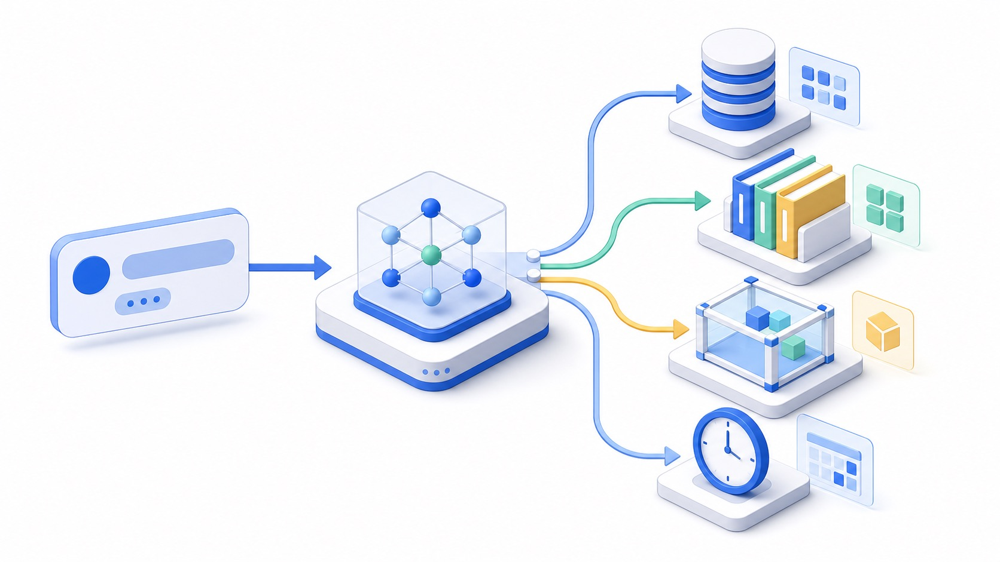
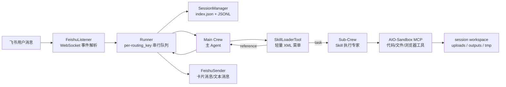
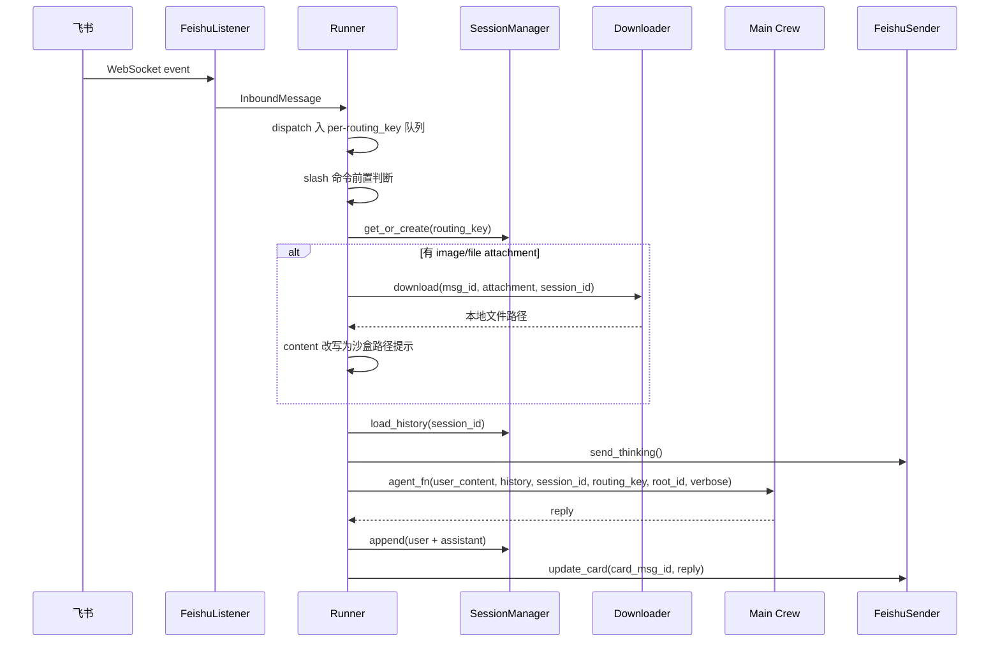
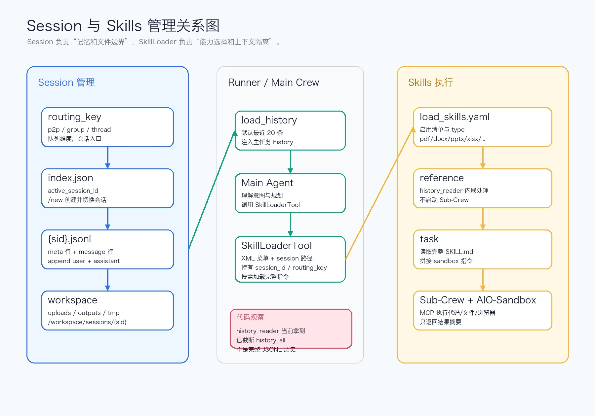
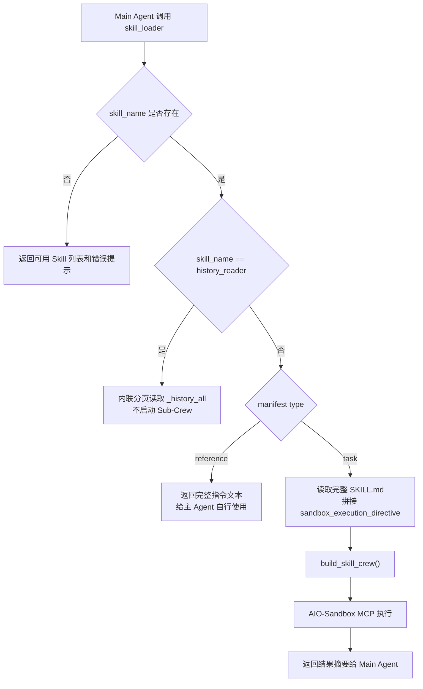
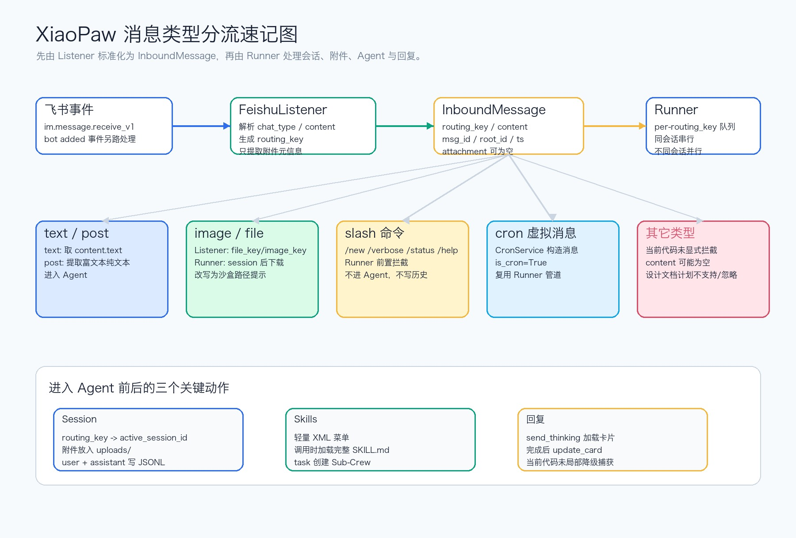
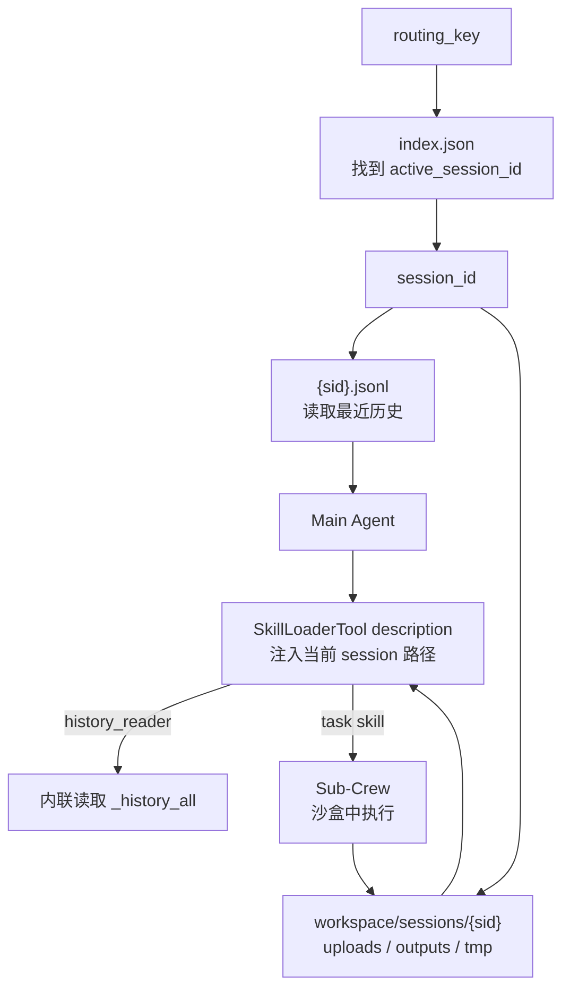
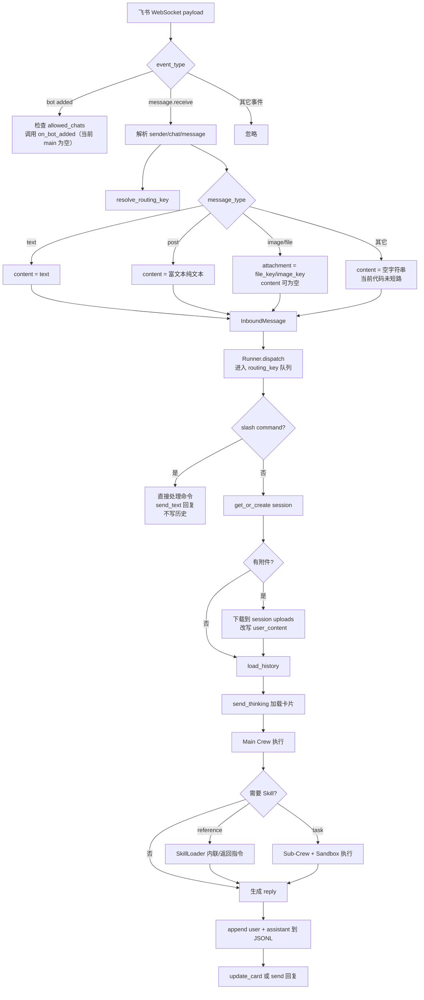

# XiaoPaw 代码仓库学习导读：结构、模块与消息流

> 结合 `notes.md`、`xiaopow/README.md`、`xiaopow/DESIGN.md`、`xiaopow/docs/*` 和当前代码实现整理。
> 生成日期：2026-05-30。



## 1. 一句话理解 XiaoPaw

XiaoPaw 是一个部署在飞书里的本地工作助手：飞书负责入口和回复，`Runner` 负责消息排队与会话边界，主 `Crew` 负责理解意图和选择 Skill，任务型 Skill 再通过独立 `Sub-Crew` 进入 AIO-Sandbox 执行代码、读写文件或调用飞书 API。

最核心的工程思想是两层隔离：

- 主 Agent 保持轻量：只负责理解用户、规划步骤、选择 Skill、组织最终回复。
- Sub-Crew 专门干活：每次 Skill 调用新建一个执行专家，在沙盒中使用 MCP 工具完成文件处理、网页搜索、飞书操作、定时任务管理等任务。



## 2. 仓库整体结构

当前工作区的结构可以分成三层：

```text
.
├── notes.md                         # 课程讲解笔记，偏学习叙事
├── imgs/                            # notes.md 中使用的课程截图
├── docs/                            # 本次新增的学习文档和配图
└── xiaopow/                         # XiaoPaw 代码仓库
    ├── README.md / DESIGN.md        # 总览和设计说明
    ├── docs/                        # 模块、数据、接口、可观测性设计
    ├── config.yaml.template         # 运行配置模板
    ├── sandbox-docker-compose.yaml  # AIO-Sandbox 容器挂载配置
    ├── tests/                       # 单元测试与集成测试
    └── xiaopaw/                     # Python 包主体
```

`xiaopow/xiaopaw/` 是真正的应用代码：

```text
xiaopaw/
├── main.py                  # 进程入口：组装所有服务
├── models.py                # InboundMessage / Attachment / SenderProtocol
├── runner.py                # 消息执行引擎：队列、slash、session、agent、回复
├── feishu/                  # 飞书接入：监听、发送、下载、routing_key
├── session/                 # SessionManager：index.json + JSONL
├── agents/                  # Main Crew 与 Sub-Crew 工厂
├── tools/                   # SkillLoaderTool、IntermediateTool、图片/搜索工具
├── skills/                  # SKILL.md + scripts，真正的能力生态
├── cron/                    # CronService：定时任务调度
├── cleanup/                 # 清理与凭证写入 workspace/.config
├── observability/           # logging + Prometheus metrics
├── api/                     # TestAPI，本地模拟飞书消息
└── llm/                     # AliyunLLM，CrewAI BaseLLM 适配器
```

## 3. 模块总览

| 模块 | 关键文件 | 职责 | 学习重点 |
|---|---|---|---|
| 进程入口 | `xiaopaw/main.py` | 读取配置，初始化日志、飞书 Client、Session、Runner、Cron、Listener、Metrics、TestAPI | 依赖注入顺序 |
| 核心模型 | `xiaopaw/models.py` | 定义内部统一消息对象 `InboundMessage` 和附件元信息 | 统一事件格式 |
| 飞书接入 | `xiaopaw/feishu/*` | WebSocket 收消息，REST 发消息，下载附件，解析 routing_key | 外部平台适配层 |
| Runner | `xiaopaw/runner.py` | 消息入队、串行消费、slash 拦截、附件下载、Agent 调用、历史写入、回复 | 应用主协调层 |
| Session | `xiaopaw/session/*` | 管理 active session、JSONL 历史、verbose 开关 | 会话记忆和文件边界 |
| Agents | `xiaopaw/agents/*` | 主 Crew 与任务型 Skill Sub-Crew 的工厂 | 两层 Multi-Agent 隔离 |
| Tools | `xiaopaw/tools/*` | SkillLoader、保存中间产物、图片本地加载、百度搜索封装 | 工具 schema 和渐进式披露 |
| Skills | `xiaopaw/skills/*` | 以 `SKILL.md` 描述能力，以 scripts 执行任务 | 能力可扩展入口 |
| Cron | `xiaopaw/cron/*` | 读取 `tasks.json`，到点后构造虚拟 `InboundMessage` | 复用 Runner 管道 |
| Cleanup | `xiaopaw/cleanup/service.py` | 清理过期文件，写入飞书/百度凭证到沙盒配置 | 安全和磁盘治理 |
| LLM | `xiaopaw/llm/aliyun_llm.py` | 通义千问适配 CrewAI，支持 Function Calling、多模态、重试、截断 | 模型接口防护层 |
| API | `xiaopaw/api/*` | 本地 HTTP 调试入口和 CaptureSender | 无飞书环境调试 |
| Observability | `xiaopaw/observability/*` | JSON 日志、控制台日志、Prometheus 指标 | 运行时可观测性 |

## 4. 模块细讲

### 4.1 `main.py`：把服务串起来

`main.py` 的职责不是处理业务，而是按依赖顺序组装系统：

1. 读取 `config.yaml`。
2. 初始化日志目录 `data/logs`。
3. 读取飞书凭证、session、sandbox、runner、debug 配置。
4. 创建飞书 HTTP `Client`。
5. 创建 `SessionManager`、`FeishuSender`、`FeishuDownloader`、`CleanupService`。
6. 将飞书和百度凭证写入 `data/workspace/.config/*.json`，让沙盒脚本读取，避免凭证进入 LLM 上下文。
7. 构建 `agent_fn = build_agent_fn(...)`。
8. 构建 `Runner`，注入 session、sender、agent_fn、downloader。
9. 启动 `CronService`，把 `runner.dispatch` 作为定时任务触发入口。
10. 启动 `FeishuListener`、metrics server、每日清理协程，可选启动 TestAPI。

这条依赖链很清楚：

```text
Feishu Client
  -> Sender / Downloader
  -> agent_fn
  -> Runner
  -> CronService / Listener / TestAPI
```

### 4.2 核心数据模型：统一入口格式

`models.py` 定义了两个核心对象：

- `Attachment`：只保存飞书附件元信息，例如 `msg_type`、`file_key`、`file_name`。
- `InboundMessage`：框架内部流转的统一消息对象，包含 `routing_key`、`content`、`msg_id`、`root_id`、`sender_id`、`ts`、`is_cron`、`attachment`。

Listener 不直接下载文件，只把附件的 key 记录下来。真正下载发生在 Runner 确认 session 之后，因为此时才知道文件应该落到哪个 session workspace。

### 4.3 飞书模块：平台边界层

`feishu/listener.py` 使用飞书 `lark-oapi` 的 WebSocket Client 接收事件。因为 WebSocket 是本地进程主动连飞书，不要求本地服务有公网 IP。

当前代码主要处理：

| 飞书事件/消息 | 当前代码行为 |
|---|---|
| `im.message.receive_v1` | 解析为 `InboundMessage` 后投递给 Runner |
| `im.chat.member.bot.added_v1` | 如果配置了 `on_bot_added`，投递入群回调；当前 `main.py` 传入 `None` |
| `text` | 从 content JSON 提取 `text` |
| `post` | 从富文本 JSON 提取纯文本 |
| `image` | 提取 `image_key`，构造 `Attachment`，文件名为 `{image_key}.jpg` |
| `file` | 提取 `file_key` 和 `file_name`，构造 `Attachment` |
| 其它消息类型 | 当前 `_extract_content` 返回空字符串，未在 listener 层显式拦截 |

`feishu/session_key.py` 把飞书会话映射为统一路由键：

```text
p2p    -> p2p:{open_id}
group  -> group:{chat_id}
thread -> thread:{chat_id}:{thread_id}
```

`feishu/sender.py` 根据 `routing_key` 选择飞书发送 API：

- `p2p:` 使用 `receive_id_type=open_id` 创建新消息。
- `group:` 使用 `receive_id_type=chat_id` 创建新消息。
- `thread:` 使用 `ReplyMessage` 在话题内回复。

它支持三类发送：

- `send()`：发送 interactive 卡片，使用 `lark_md` Markdown。
- `send_thinking()`：发送“思考中”加载卡片，返回卡片消息 ID。
- `update_card()`：用 Agent 最终回复 PATCH 更新卡片。
- `send_text()`：纯文本，主要给 slash 命令用。

`feishu/downloader.py` 调用飞书消息资源接口，把图片/文件写到：

```text
data/workspace/sessions/{session_id}/uploads/{filename}
```

沙盒内看到的路径是：

```text
/workspace/sessions/{session_id}/uploads/{filename}
```

### 4.4 Runner：消息处理总枢纽

`Runner` 是应用内最关键的协调层。它做了两件很重要的事：

- 并发控制：每个 `routing_key` 一个 `asyncio.Queue` 和一个 worker，同一会话串行，不同会话并行。
- 业务编排：slash 拦截、session 获取、附件下载、历史加载、Agent 执行、历史写入、飞书回复。



Runner 的 slash 命令在进入 Agent 前处理：

| 命令 | 行为 |
|---|---|
| `/new` | 创建新 session，并切换当前 `active_session_id` |
| `/verbose on` | 开启当前 session 的 verbose |
| `/verbose off` | 关闭当前 session 的 verbose |
| `/verbose` | 查询 verbose 状态 |
| `/status` | 查询当前 session ID、消息数、verbose 状态 |
| `/help` | 返回帮助文本 |

slash 命令不会进入 Agent，也不会写入 JSONL 历史。

### 4.5 SessionManager：会话记忆和文件边界

Session 的核心是 `routing_key -> active_session_id`。

运行时数据主要在：

```text
data/sessions/index.json
data/sessions/{session_id}.jsonl
data/workspace/sessions/{session_id}/uploads/
data/workspace/sessions/{session_id}/outputs/
data/workspace/sessions/{session_id}/tmp/
```

`index.json` 保存一个 routing_key 下的所有 session，以及当前活跃 session：

```json
{
  "p2p:ou_xxx": {
    "active_session_id": "s-abc123",
    "sessions": [
      {
        "id": "s-abc123",
        "created_at": "2026-03-10T00:00:00+00:00",
        "verbose": false,
        "message_count": 8
      }
    ]
  }
}
```

`{session_id}.jsonl` 是干净对话历史，每条用户消息和助手回复各占一行。写入时使用 per-session lock、`flush()` 和 `fsync()`；`index.json` 使用全局 `asyncio.Lock` 和 write-then-rename。



### 4.6 Main Crew：极简主 Agent

`agents/main_crew.py` 通过 `build_agent_fn()` 返回 Runner 可调用的闭包。每条消息都会新建一个 Crew，避免 CrewAI 内部状态污染下一轮请求。

主 Agent 的配置来自：

- `agents/config/agents.yaml`
- `agents/config/tasks.yaml`

它绑定的主要工具是：

- `SkillLoaderTool`：能力入口。
- `IntermediateTool`：保存中间思考产物，目前是语义 checkpoint，不做持久化。

主任务输出被 `MainTaskOutput` 约束为：

```json
{
  "reply": "发送给用户的内容",
  "used_skills": ["本次调用过的 Skill 名称"]
}
```

verbose 模式由 `step_callback` 实现：当 session 的 `verbose=True` 时，主 Agent 每轮 ReAct 的 `thought` 会通过 `FeishuSender.send()` 推送到飞书。

### 4.7 SkillLoaderTool：渐进式披露核心

`tools/skill_loader.py` 是 XiaoPaw 的能力入口。它的工作分两段：

第一段：初始化时只读 `skills/load_skills.yaml` 和每个 `SKILL.md` 的 frontmatter，拼出轻量 XML 菜单放进工具 description。

```xml
<available_skills>
  <skill>
    <name>xlsx</name>
    <type>task</type>
    <description>...</description>
  </skill>
</available_skills>
```

第二段：主 Agent 真正调用某个 Skill 时，才读取完整 `SKILL.md`，替换路径占位符，转义花括号，再拼接 `sandbox_execution_directive`，然后按类型分流。



Skill 清单来自 `skills/load_skills.yaml`。当前启用 9 个 Skill：

| Skill | 类型 | 主要用途 |
|---|---|---|
| `pdf` | task | PDF 读取、提取、转换、表单处理等 |
| `docx` | task | Word 文档读取、创建、编辑 |
| `pptx` | task | PPT 读取、创建、编辑 |
| `xlsx` | task | Excel/CSV/TSV 读取、清洗、创建、公式、图表 |
| `feishu_ops` | task | 发消息、发文件/图片、读写飞书文档/表格、多维表格、日历 |
| `scheduler_mgr` | task | 创建、查看、更新、删除定时任务 |
| `baidu_search` | task | 百度千帆搜索，适合最新信息查询 |
| `web_browse` | task | URL 转 Markdown、浏览器自动化、截图、表单 |
| `history_reader` | reference | 历史记录分页读取；当前代码里由 SkillLoaderTool 内联处理 |

### 4.8 Sub-Crew：任务型 Skill 的隔离执行层

`agents/skill_crew.py` 每次任务型 Skill 调用都会新建一个 Sub-Crew。

Sub-Crew 的特点：

- 不接收主 Agent 的完整历史，只接收 `task_context` 和完整 Skill 指令。
- 不注入主 Agent 的 `step_callback`，避免 verbose 模式把底层执行细节刷给用户。
- 通过 `MCPServerHTTP` 连接 AIO-Sandbox。
- 当前开放全部 MCP 工具，不在接口层做白名单；约束写在 Sub-Agent backstory 和 Skill 指令里。

`sandbox-docker-compose.yaml` 把资源挂载进容器：

```text
./xiaopaw/skills  -> /mnt/skills:ro
./data/workspace -> /workspace:rw
./data/cron      -> /workspace/cron:rw
```

也就是说，Skill 脚本从 `/mnt/skills/{skill_name}/scripts/...` 读取，session 文件从 `/workspace/sessions/{session_id}/...` 读写。

### 4.9 CronService：把定时任务变成一条消息

`cron/service.py` 不直接执行业务逻辑。它只做调度，到时间后构造一条 `InboundMessage`：

```python
InboundMessage(
    routing_key=job.payload.routing_key,
    content=job.payload.message,
    msg_id="cron_xxx",
    root_id="cron_xxx",
    sender_id="cron",
    is_cron=True,
)
```

然后调用 `runner.dispatch(inbound)`。因此，定时任务和普通用户消息走同一条 Runner 管道。


支持三种 schedule：

- `at`：一次性任务。
- `every`：固定间隔任务。
- `cron`：cron 表达式加时区。

需要注意：同一个 `routing_key` 下，cron 触发的消息也会进入同一个队列。如果某个定时任务跑得很久，会阻塞同一用户/群/话题后续消息。

### 4.10 CleanupService：清理和凭证下发

`cleanup/service.py` 有两个职责：

- 清理过期文件：`tmp`、`uploads`、`outputs`、`traces`、session JSONL。
- 写入沙盒凭证：`workspace/.config/feishu.json`、`workspace/.config/baidu.json`。

凭证写入使用临时文件 + rename，文件权限设置为 `0600`，目录权限为 `0700`。这也是 XiaoPaw 避免“凭证进模型上下文”的关键设计：Sub-Crew 的脚本自己读取配置文件，LLM 不需要看见 app secret。

### 4.11 AliyunLLM：模型适配和防护

`llm/aliyun_llm.py` 把通义千问兼容 OpenAI Chat Completions 的接口适配成 CrewAI `BaseLLM`。

它做了几个生产防护：

- 从 `QWEN_API_KEY` 或 `DASHSCOPE_API_KEY` 读取密钥。
- 支持同步 `call()` 和异步 `acall()`。
- 支持 Function Calling。
- 对 MCP 工具参数做规范化，例如把字符串 `"None"`、`"True"`、`"False"` 转成合法 JSON 类型。
- 截断过长的 tool result，避免请求 payload 过大导致模型 API 500。
- 支持多模态图片消息归一化。
- 对 500、429、timeout 做重试。

### 4.12 TestAPI：本地调试入口

`api/test_server.py` 提供：

- `POST /api/test/message`：模拟一条飞书消息。
- `DELETE /api/test/sessions`：清空测试 session。

测试环境用 `CaptureSender` 把 Runner 的回复捕获到 `asyncio.Future`，于是 HTTP 请求可以同步拿到 Bot 回复。

它还支持本地附件：把本地文件复制到 session `uploads/`，再把消息内容改写成沙盒路径提示。

### 4.13 Observability：日志和指标

`observability/metrics.py` 定义了 Prometheus 指标：

- 飞书事件数：`xiaopaw_feishu_events_total`
- 入站消息数：`xiaopaw_inbound_messages_total`
- Runner worker 数：`xiaopaw_runner_workers_active`
- Runner 队列长度：`xiaopaw_runner_queue_size`
- HTTP 请求数与耗时
- 错误数：`xiaopaw_errors_total`

`observability/logging_config.py` 负责日志初始化，设计文档中还规划了 trace 存储。

## 5. 一条消息进入后到底发生什么



### 5.1 第一步：飞书事件标准化

Listener 收到飞书 WebSocket payload 后：

1. 解析 JSON。
2. 记录 metrics。
3. 判断事件类型。
4. 对消息事件解析 sender、chat、thread、content、attachment。
5. 用 `resolve_routing_key()` 生成路由键。
6. 构造 `InboundMessage`。
7. 用 `asyncio.run_coroutine_threadsafe()` 把 `Runner.dispatch(inbound)` 投递回主事件循环。

### 5.2 第二步：Runner 按 routing_key 排队

`Runner.dispatch()` 以 `routing_key` 为 key：

- 第一次见到该 key，创建一个 `asyncio.Queue` 和一个 worker。
- 同一 key 的消息按顺序入队并串行处理。
- 不同 key 的 worker 可以并发处理。
- worker 空闲超过 `idle_timeout` 后自动退出。

### 5.3 第三步：slash 命令优先

Runner 先检查 slash 命令。命中后直接调用 `send_text()` 回复，不进入 Agent，也不写历史。

这意味着：

- `/new` 会创建新 session。
- `/verbose` 会修改当前 active session 的 verbose 标志。
- `/status` 可能会创建 session，因为它调用 `get_or_create()`。

### 5.4 第四步：确定 Session

非 slash 消息会调用：

```python
session = await self._session_mgr.get_or_create(key)
```

如果 routing_key 不存在：

- 生成 `s-{uuid}`。
- 写入 `index.json`。
- 创建 `{session_id}.jsonl` 并写入 meta 行。

如果 routing_key 已存在：

- 找到当前 `active_session_id`。
- 返回该 session 的 `verbose` 和 `message_count` 等元数据。

### 5.5 第五步：附件下载

如果消息有 `attachment` 且 Runner 配了 downloader：

1. Runner 计算沙盒内目标路径。
2. Downloader 调飞书资源接口下载到本地 workspace。
3. Runner 把 `user_content` 改写为：

```text
用户发来了文件，已自动保存至沙盒路径：
`/workspace/sessions/{sid}/uploads/{filename}`
请根据文件内容和用户意图完成相应处理。
```

如果用户同时发了备注，会追加到消息末尾。

### 5.6 第六步：历史加载和 Agent 执行

Runner 调用：

```python
history = await self._session_mgr.load_history(session.id)
```

当前默认只返回最近 20 条 message。随后：

1. `send_thinking()` 发送加载卡片。
2. `agent_fn()` 新建 Main Crew。
3. Main Crew 把历史文本和当前用户消息注入主任务。
4. 主 Agent 如果需要专业能力，调用 `SkillLoaderTool`。
5. SkillLoader 按 Skill 类型选择内联处理或创建 Sub-Crew。
6. Sub-Crew 进入沙盒执行任务并返回摘要。
7. 主 Agent 组织最终 `reply`。

### 5.7 第七步：写历史和回复

Runner 拿到 `reply` 后：

1. `SessionManager.append()` 追加 user 和 assistant 两行 JSONL。
2. 如果 `send_thinking()` 成功返回了 `card_msg_id`，调用 `update_card()`。
3. 如果没有 `card_msg_id`，调用 `send()` 发新卡片。

## 6. 不同消息类型如何管理 Session 和 Skills

| 消息类型 | Session 行为 | Skills 行为 | 当前代码重点 |
|---|---|---|---|
| `text` | 非 slash 时获取/创建 active session，加载历史，最后写 user+assistant | 主 Agent 判断是否调用 Skill | 最标准路径 |
| `post` | 同 `text` | 同 `text` | Listener 会把富文本提取为纯文本 |
| `image` | 先获取 session，再下载到该 session 的 `uploads/`，最后写历史 | Agent 通常需要文件/图片相关 Skill 或多模态工具 | Listener 只保存 `image_key`，不下载 |
| `file` | 同 `image` | 通常触发 `pdf/docx/pptx/xlsx` 等文件 Skill | 文件路径被写入 user_content |
| slash 命令 | `/new` 创建新 session；`/verbose` 修改 session；`/status` 查询 session | 不调用 Skill | 不写 JSONL 历史 |
| cron 虚拟消息 | 使用 job payload 中的 `routing_key`，和普通消息共享 active session | 可调用任何 Skill | 会被同一 routing_key 队列串行化 |
| Bot 入群事件 | 不走 session | 不走 Skill | 当前 `on_bot_added=None`，没有欢迎逻辑 |
| 其它消息类型 | 当前可能创建 session，并以空 content 进入 Runner/Agent | 取决于 Agent 如何理解空消息 | 设计文档说 audio/sticker/merge_forward 应回复不支持或忽略，但当前代码未显式实现 |
| TestAPI 消息 | 和普通消息一样；本地附件会复制到 uploads | 和普通消息一样 | 用 CaptureSender 捕获最终回复 |

## 7. Session 与 Skills 的关系

Session 决定“这条消息属于哪里”，Skills 决定“这条消息需要什么能力”。



重要细节：

- `session_id` 不通过主任务 inputs 明文交给 LLM，但 `SkillLoaderTool.description` 会告诉主 Agent 当前 session 的沙盒路径。
- `routing_key` 会被注入 `sandbox_execution_directive`，方便 `feishu_ops` 脚本知道消息发送目标。
- 任务型 Skill 的输出应写到当前 session 的 `outputs/`。
- 用户上传文件写到当前 session 的 `uploads/`。
- `/new` 不删除旧 session，只是切换 active session。

## 8. 代码实现观察：设计文档与当前代码的差异

以下不是架构问题，而是学习代码时要区分的“设计意图”和“当前实现”：

| 主题 | 设计/notes 中的说法 | 当前代码观察 |
|---|---|---|
| Trace | 文档设计了 `data/traces/{sid}/{ts}_{msg_id}`、`main.jsonl`、`skills/*.jsonl` | 当前代码里未找到 TraceWriter；`IntermediateTool` 也注明暂不持久化；TestAPI 的 `skills_called` 仍是 TODO |
| `history_reader` | 设计为读取完整历史，解决上下文截断 | Runner 调用 `load_history(session.id)` 默认已截断最近 20 条，再传给 SkillLoader 的 `_history_all`，所以当前只能分页这 20 条 |
| `update_card` 降级 | 设计文档说 PATCH 失败后降级 `send()` | Runner 当前直接 `await update_card()`，异常会被 worker 外层捕获并发送“处理出错” |
| 不支持消息类型 | 设计文档列出 audio、sticker、merge_forward 的不支持/忽略策略 | Listener 当前只对 text/post/image/file 特殊处理，其它类型 content 为空，未显式短路 |
| TestAPI 启动 | README 说明 debug 模式可启动 TestAPI | `create_test_app()` 签名需要 `sender`，但 `main.py` 中调用只传了 `runner` 和 `session_mgr`；按当前代码开启 debug 可能需要补 `CaptureSender` 或调整签名 |
| Cleanup 触发 | 部分文档说由 CronService 触发每日清理 | 当前 `main.py` 使用独立 `_daily_cleanup_loop()`，不依赖 CronService |

这些点很适合做后续代码修复练习：它们都比较局部，又能帮助你理解整条链路。

## 9. 推荐学习路线

1. 先读 `xiaopaw/models.py` 和 `xiaopaw/feishu/session_key.py`，理解内部消息格式和 routing_key。
2. 再读 `xiaopaw/feishu/listener.py`，看飞书事件如何变成 `InboundMessage`。
3. 重点读 `xiaopaw/runner.py`，它是消息生命周期的主线。
4. 读 `xiaopaw/session/manager.py`，理解 `/new`、verbose、JSONL、index 的关系。
5. 读 `xiaopaw/agents/main_crew.py` 和 `agents/config/*.yaml`，理解主 Agent 为什么极简。
6. 读 `xiaopaw/tools/skill_loader.py`，这是 Skills 生态的核心。
7. 读 `xiaopaw/agents/skill_crew.py` 和 `sandbox-docker-compose.yaml`，理解 Sub-Crew 如何进入沙盒。
8. 挑一个 Skill，例如 `xlsx`、`feishu_ops` 或 `scheduler_mgr`，看 `SKILL.md` 如何指导 Sub-Crew 使用脚本。
9. 最后读 `xiaopaw/cron/service.py`，理解定时任务为什么也是一条消息。

## 10. 一张更完整的消息流程图



## 11. 记忆要点

- `routing_key` 是并发隔离和 session 查找的入口。
- `session_id` 是历史记录和文件 workspace 的边界。
- `Runner` 决定一条消息是否进入 Agent。
- 主 Agent 不直接做文件处理、飞书操作、网页浏览；它通过 `SkillLoaderTool` 调 Skill。
- `SkillLoaderTool` 先给主 Agent 看轻量 Skill 菜单，真正调用时才加载完整指令。
- task Skill 会进入 Sub-Crew 和 AIO-Sandbox；reference Skill 不一定进沙盒。
- CronService 不特殊处理业务，它只是制造一条 `is_cron=True` 的 `InboundMessage`。
- 当前代码中 Trace、完整 history_reader、unsupported message 短路、update_card 降级等点仍值得继续打磨。
