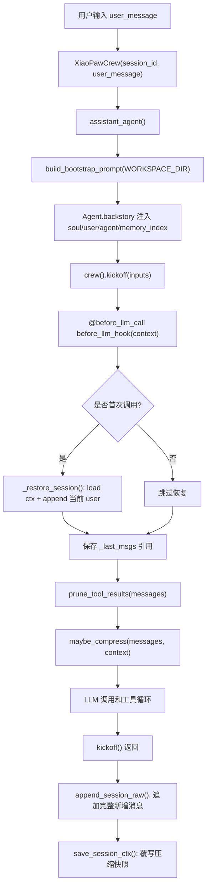

# m3l19：上下文生命周期数据流转详解

这份笔记把第19课的核心思想和 `m3l19_context_mgmt.py` 的代码放在一起看，并用一组 mock 数据演示一次 session 从启动、恢复、剪枝、压缩到持久化的完整流转。

## 1. 核心思想如何落到代码里

| 课程思想 | 代码落点 | 关键逻辑 |
|---|---|---|
| Bootstrap 是加法 | `build_bootstrap_prompt()` | 从 workspace 读取 `soul.md`、`user.md`、`agent.md`、`memory.md`，拼成结构化 backstory |
| 只注入导航骨架 | `memory.md` 只取前 200 行 | 让模型知道“有什么记忆”，而不是把所有历史都塞进上下文 |
| Pre-Model 是主要干预点 | `@before_llm_call` 的 `before_llm_hook()` | 每次 LLM 调用前统一恢复、剪枝、压缩 |
| 剪枝是减法 | `prune_tool_results()` | 保留最近 N 轮，旧 tool 消息的 `content` 改为 `[已剪枝]` |
| 压缩是减法 | `maybe_compress()` | 超阈值后，把旧历史分块摘要成 `<context_summary>` |
| 记忆要可恢复 | `save_session_ctx()` | 覆写保存当前压缩后的 message list |
| 记忆要可审计 | `append_session_raw()` | append-only 保存原始消息，每条带时间戳 |
| Agent 感知不到中断 | `_restore_session()` | 读取历史 ctx，原地替换 `context.messages`，再追加新 user 消息 |

可以把它理解成三层治理：

```text
启动层：workspace/*.md -> build_bootstrap_prompt() -> Agent.backstory
运行层：context.messages -> before_llm_hook() -> restore / prune / compress
落盘层：_last_msgs -> append_session_raw() + save_session_ctx()
```

## 2. 代码里的实际生命周期



这里最重要的细节是 `context.messages` 是框架 executor 内部列表的直接引用，所以 `_restore_session()`、`prune_tool_results()`、`maybe_compress()` 都必须原地修改：

```python
context.messages.clear()
context.messages.extend(history)
context.messages.append(current_user_msg)
```

如果写成 `context.messages = history`，只是让 hook 里的变量名指向新列表，executor 仍然持有旧列表，治理不会生效。

## 3. Mock 数据：工作区记忆输入

假设 workspace 中有以下文件。

```text
m3l19/workspace/
├── soul.md
├── user.md
├── agent.md
├── memory.md
└── sessions/
```

简化后的内容如下：

```markdown
<!-- soul.md -->
你是 XiaoPaw，晓寒的专属 AI 助手。
风格：严谨、高效、结果导向，重要结果保存到文件。

<!-- user.md -->
晓寒是 AI 技术架构师，正在制作《企业级多智能体设计实战》。
偏好：Python / CrewAI / Markdown，中文回复，不喜欢废话。

<!-- agent.md -->
行业调研 SOP：
1. 搜索 3-5 组关键词。
2. 抓取原文。
3. 结构化报告。
4. 保存到 workspace/{主题}-调研报告.md。

<!-- memory.md -->
本周工作记录：
- 03-15 完成 m3l19 上下文管理方案设计。
- 03-16 实现 m3l19 演示代码，23 个测试通过。
```

`build_bootstrap_prompt()` 生成的 mock backstory：

```xml
<soul>
你是 XiaoPaw，晓寒的专属 AI 助手。
风格：严谨、高效、结果导向，重要结果保存到文件。
</soul>

<user_profile>
晓寒是 AI 技术架构师，正在制作《企业级多智能体设计实战》。
偏好：Python / CrewAI / Markdown，中文回复，不喜欢废话。
</user_profile>

<agent_rules>
行业调研 SOP：
1. 搜索 3-5 组关键词。
2. 抓取原文。
3. 结构化报告。
4. 保存到 workspace/{主题}-调研报告.md。
</agent_rules>

<memory_index>
本周工作记录：
- 03-15 完成 m3l19 上下文管理方案设计。
- 03-16 实现 m3l19 演示代码，23 个测试通过。
</memory_index>
```

这个 backstory 被放进 `Agent(backstory=...)`。从模型视角看，它一启动就知道自己是谁、服务谁、怎么干活、有哪些记忆索引。

## 4. Round 1：全新 session 的首次任务

用户输入：

```text
帮我调研极客时间平台上多智能体相关课程的现状，生成一份调研报告保存到文件
```

初始化：

```python
crew_instance = XiaoPawCrew(
    session_id="demo_mock",
    user_message="帮我调研极客时间平台上多智能体相关课程的现状，生成一份调研报告保存到文件",
)
```

### 4.1 before hook 前的 messages

全新 session 还没有历史快照，框架准备调用模型前，`context.messages` 可以简化理解为：

```json
[
  {
    "role": "system",
    "content": "You are XiaoPaw...<soul>...</soul><user_profile>...</user_profile>..."
  },
  {
    "role": "user",
    "content": "帮我调研极客时间平台上多智能体相关课程的现状，生成一份调研报告保存到文件"
  }
]
```

### 4.2 `_restore_session()`

执行：

```python
history = load_session_ctx("demo_mock")
```

由于 `sessions/demo_mock_ctx.json` 不存在，返回空列表：

```json
[]
```

结果：

```text
_history_len = 0
context.messages 保持不变
```

### 4.3 `prune_tool_results()`

当前只有 1 条 user 消息：

```text
len(user_indices) = 1 <= keep_turns(10)
```

所以不剪枝。

### 4.4 `maybe_compress()`

假设当前内容约 1200 token，模型窗口为 32000：

```text
approx_tokens / model_limit = 1200 / 32000 = 0.0375
0.0375 < 0.45
```

所以不压缩。

### 4.5 LLM 工具循环产生新消息

模型根据 `agent.md` 的 SOP 调用搜索、抓网页、写文件。mock 后的 message list：

```json
[
  {"role": "system", "content": "...Bootstrap backstory..."},
  {"role": "user", "content": "帮我调研极客时间平台上多智能体相关课程的现状，生成一份调研报告保存到文件"},
  {
    "role": "assistant",
    "content": "Action: search_web\nAction Input: {\"query\":\"极客时间 多智能体 课程\"}",
    "tool_call_id": "call_search_001"
  },
  {
    "role": "tool",
    "tool_call_id": "call_search_001",
    "content": "搜索结果：DeepResearch前沿智能体实战... 企业级多智能体设计实战..."
  },
  {
    "role": "assistant",
    "content": "Action: File Writer Tool\nAction Input: {\"filename\":\"极客时间多智能体课程现状调研报告.md\"}",
    "tool_call_id": "call_write_001"
  },
  {
    "role": "tool",
    "tool_call_id": "call_write_001",
    "content": "Content successfully written to ./极客时间多智能体课程现状调研报告.md"
  },
  {
    "role": "assistant",
    "content": "调研报告已生成并保存。主要结论：极客时间已有智能体课程矩阵，正在从概念走向工程化。"
  }
]
```

### 4.6 kickoff 后持久化

`main()` 在 `kickoff()` 返回后执行：

```python
new_msgs = list(crew_instance._last_msgs)[crew_instance._history_len:]
append_session_raw("demo_mock", new_msgs)
save_session_ctx("demo_mock", list(crew_instance._last_msgs))
```

因为 `_history_len = 0`，本轮所有消息都会追加到 `demo_mock_raw.jsonl`。同时完整 message list 覆写到 `demo_mock_ctx.json`。

落盘状态：

```text
sessions/demo_mock_raw.jsonl   追加：system + user + assistant/tool/... + final
sessions/demo_mock_ctx.json    覆写：当前完整上下文快照
```

## 5. Round 2：session 恢复并续接

用户第二轮输入：

```text
把刚才报告里的关键结论总结成3条，方便我发给同事
```

这次重新构造了一个 `XiaoPawCrew("demo_mock", user_message)`，但由于 session 文件存在，它不会失忆。

### 5.1 `_restore_session()` 读到历史快照

`load_session_ctx("demo_mock")` 返回 Round 1 保存的列表：

```json
[
  {"role": "system", "content": "...Bootstrap backstory..."},
  {"role": "user", "content": "帮我调研极客时间平台上多智能体相关课程的现状..."},
  {"role": "assistant", "content": "Action: search_web...", "tool_call_id": "call_search_001"},
  {"role": "tool", "tool_call_id": "call_search_001", "content": "搜索结果：..."},
  {"role": "assistant", "content": "调研报告已生成并保存。主要结论：..."}
]
```

然后 `_restore_session()` 做原地替换：

```python
context.messages.clear()
context.messages.extend(history)
context.messages.append(current_user_msg)
```

恢复后的 messages：

```json
[
  {"role": "system", "content": "...Bootstrap backstory..."},
  {"role": "user", "content": "帮我调研极客时间平台上多智能体相关课程的现状..."},
  {"role": "assistant", "content": "Action: search_web...", "tool_call_id": "call_search_001"},
  {"role": "tool", "tool_call_id": "call_search_001", "content": "搜索结果：..."},
  {"role": "assistant", "content": "调研报告已生成并保存。主要结论：..."},
  {"role": "user", "content": "把刚才报告里的关键结论总结成3条，方便我发给同事"}
]
```

模型因此知道“刚才报告”指的是 Round 1 生成的调研报告。

### 5.2 剪枝与压缩仍然跳过

当前 user 轮数是 2，仍然没有超过 `PRUNE_KEEP_TURNS=10`，所以不剪枝。

假设 token 占比仍低于 45%，所以不压缩。

### 5.3 生成第二轮结果

mock final assistant：

```json
{
  "role": "assistant",
  "content": "1. 课程矩阵已成型。2. 内容趋势从概念普及转向工程化。3. 我方课程定位应强化框架源码和生产治理。"
}
```

持久化时：

```text
raw.jsonl 追加 Round 2 新增消息
ctx.json 覆写为 Round 1 + Round 2 的压缩快照
```

注意 `_history_len` 的意义：Round 2 恢复历史时，`_history_len = len(history)`，所以 `new_msgs = _last_msgs[_history_len:]` 只会把 Round 2 新增部分追加到 raw，不会重复写 Round 1。

## 6. Round 12：剪枝如何发生

假设同一个 session 已经运行到第 12 轮，每轮都有搜索或文件读取工具结果。

剪枝前的简化消息结构：

```text
0  system    Bootstrap
1  user      第1轮任务
2  assistant call_search_001
3  tool      call_search_001: 9000字搜索结果
4  assistant 第1轮结论
5  user      第2轮任务
6  assistant call_file_002
7  tool      call_file_002: 3000字文件内容
8  assistant 第2轮结论
...
35 user      第12轮任务
```

`prune_tool_results(messages, keep_turns=10)` 计算：

```python
user_indices = [1, 5, 9, 13, 17, 21, 25, 29, 33, 37, 41, 45]
cutoff_idx = user_indices[-10]  # 第3轮 user 的位置
```

这表示最近 10 轮是第3轮到第12轮，第1-2轮属于旧区。旧区里的 tool 消息被替换：

```json
[
  {"role": "tool", "tool_call_id": "call_search_001", "content": "[已剪枝]"},
  {"role": "tool", "tool_call_id": "call_file_002", "content": "[已剪枝]"}
]
```

剪枝后的治理效果：

| 字段 | 是否保留 | 原因 |
|---|---|---|
| `role=tool` | 保留 | 保持消息序列结构 |
| `tool_call_id` | 保留 | 避免框架找不到对应工具调用 |
| `content` 原文 | 不保留 | 原材料已用完，占 token |
| assistant 结论 | 保留 | 它通常是工具结果被加工后的高价值信息 |

## 7. Round 20：压缩如何发生

假设剪枝后上下文仍然很大：

```text
model_limit = 32000
approx_tokens = 16000
compress_threshold = 0.45
16000 / 32000 = 0.50 >= 0.45
```

`maybe_compress()` 开始压缩。

### 7.1 切出 system、旧区、新鲜区

代码：

```python
system_msgs = [m for m in messages if m.get("role") == "system"]
non_system = [m for m in messages if m.get("role") != "system"]
user_indices = [i for i, m in enumerate(non_system) if m.get("role") == "user"]
cutoff = user_indices[-fresh_keep_turns]
old_msgs = non_system[:cutoff]
fresh_msgs = non_system[cutoff:]
```

假设一共有 20 轮，`fresh_keep_turns=10`：

```text
old_msgs   = 第1轮到第10轮之前的历史
fresh_msgs = 最近第11轮到第20轮的完整原文
```

按 user 消息边界切割的好处是：一轮里的 `assistant tool_call` 和 `tool result` 会一起进入旧区或一起留在新鲜区，不会被拆散。

### 7.2 分块摘要

旧区按近似 token 分块：

```python
chunks = chunk_by_tokens(old_msgs, chunk_tokens=2000)
```

mock 切块结果：

```text
chunk_1: 第1-3轮，约 1900 token
chunk_2: 第4-7轮，约 1800 token
chunk_3: 第8-10轮，约 1600 token
```

每个 chunk 进入 `_summarize_chunk()`，得到结构化摘要：

```xml
<context_summary>
用户目标：完成极客时间多智能体课程现状调研，并提炼可发给同事的结论。
关键事实：
- 报告保存到 极客时间多智能体课程现状调研报告.md。
- 结论包括课程矩阵已成型、内容走向工程化、我方课程应强化源码和治理。
未完成事项：无。
</context_summary>
```

### 7.3 原地替换 message list

压缩后的结构：

```json
[
  {"role": "system", "content": "...原 Bootstrap system..."},
  {
    "role": "system",
    "content": "<context_summary>\n用户目标：...\n关键事实：...\n未完成事项：无。\n</context_summary>"
  },
  {"role": "user", "content": "第11轮用户消息"},
  {"role": "assistant", "content": "第11轮助手回复"},
  "...最近10轮原文..."
]
```

治理结果：

| 压缩前 | 压缩后 |
|---|---|
| 老历史完整堆在上下文里 | 老历史变成少量 `<context_summary>` |
| 最近上下文可能被噪声稀释 | 最近 10 轮仍保持原文 |
| 任务继续时容易超限 | token 占用下降 |
| 细节可能被摘要丢掉 | raw.jsonl 仍保存完整历史 |

## 8. AfterTurn：为什么要双写

每轮结束后，`main()` 做两次写入：

```python
append_session_raw(SESSION_ID, new_msgs)
save_session_ctx(SESSION_ID, list(crew_instance._last_msgs))
```

### 8.1 `ctx.json`：服务“继续对话”

`ctx.json` 是在线恢复用的当前状态：

```json
[
  {"role": "system", "content": "...Bootstrap..."},
  {"role": "system", "content": "<context_summary>...</context_summary>"},
  {"role": "user", "content": "最近第11轮..."},
  {"role": "assistant", "content": "最近第11轮..."}
]
```

它允许下次启动时直接恢复上下文，让 Agent 感知不到中断。

### 8.2 `raw.jsonl`：服务“审计和再加工”

`raw.jsonl` 是完整历史：

```json
{"role":"user","content":"第1轮任务","ts":"2026-03-31T14:27:19"}
{"role":"tool","tool_call_id":"call_search_001","content":"完整搜索结果...","ts":"2026-03-31T14:27:19"}
{"role":"assistant","content":"第1轮最终回答","ts":"2026-03-31T14:27:19"}
```

即使 `ctx.json` 里旧工具结果被剪枝、旧对话被摘要，`raw.jsonl` 仍然保留原始证据链。它适合做：

1. 问题追踪：为什么 Agent 当时做了这个判断。
2. 数据回放：重新构造某次上下文。
3. 长记忆提炼：后续把多轮原始记录提炼进 `memory.md` 或主题文件。
4. 合规审计：检查工具调用、用户输入、输出结果。

## 9. 这个项目体现的记忆工程治理思路

### 9.1 分层治理

| 层级 | 文件或对象 | 治理目标 |
|---|---|---|
| 身份层 | `soul.md` | 稳定人格和输出风格 |
| 用户层 | `user.md` | 用户偏好和长期项目背景 |
| 行为层 | `agent.md` | SOP、工具规则、可进化约束 |
| 索引层 | `memory.md` | 只放导航，不放全部历史 |
| 在线层 | `context.messages` | 当前任务可用上下文 |
| 快照层 | `ctx.json` | 快速恢复 |
| 原始层 | `raw.jsonl` | 完整审计和后处理 |

### 9.2 加法和减法分离

加法只发生在该加的时候：

```text
Bootstrap 加身份、用户、规则、索引
Session 恢复加历史快照
当前轮追加新 user 消息
```

减法只作用在该减的对象上：

```text
剪枝主要减旧 tool result
压缩主要减旧历史原文
最近 N 轮保持完整
原始 raw 永远不减
```

### 9.3 在线上下文和长期记忆解耦

`context.messages` 是模型马上要看的内容，目标是短、小、准。

`raw.jsonl` 是完整事实账本，目标是全、稳、可追溯。

`memory.md` 是长期记忆索引，目标是帮助模型知道“该去哪里找”，不是承担所有历史细节。

这个解耦很关键：如果把长期记忆、工具原文、对话历史都塞进在线上下文，Agent 会越来越慢，也越来越容易被噪声带偏。

## 10. 用一句话串起来

`m3l19` 的代码把“上下文生命周期管理”落成了一条完整数据链：启动时从 workspace 注入导航骨架，调用模型前恢复历史并治理 message list，运行中让工具结果进入上下文，过长时对旧 tool result 剪枝、对旧历史摘要，结束后双写压缩快照和原始日志。这样 Agent 既能连续工作，又不会让上下文无限膨胀，还能在事后追溯每一次记忆加工的证据链。
