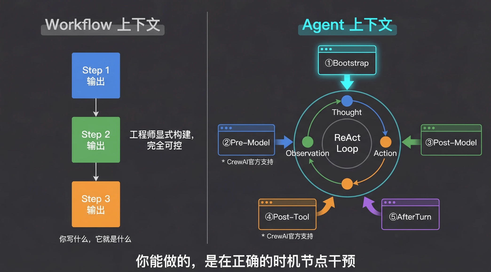
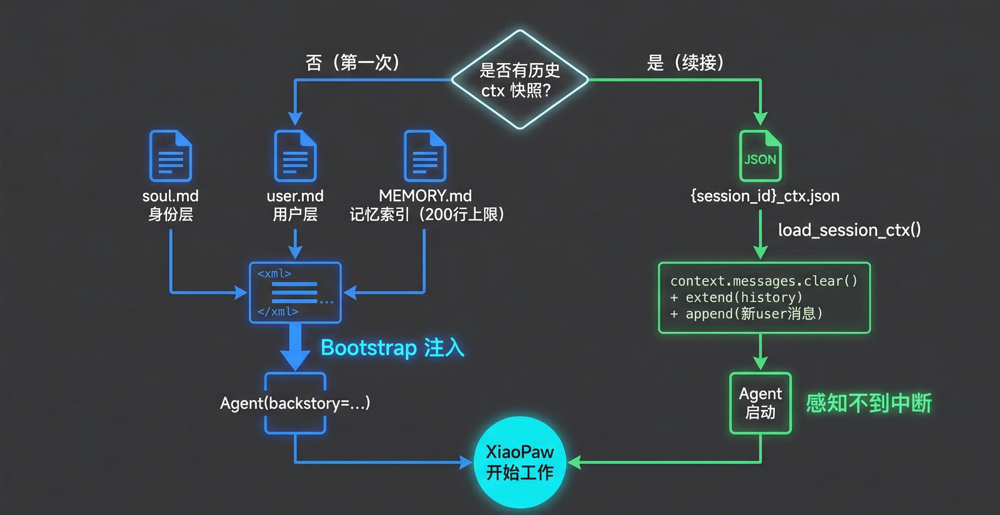
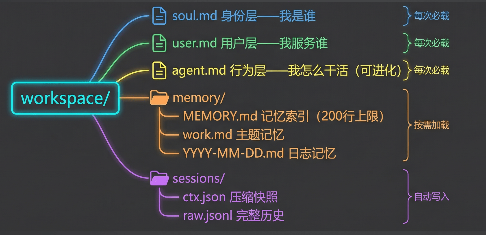
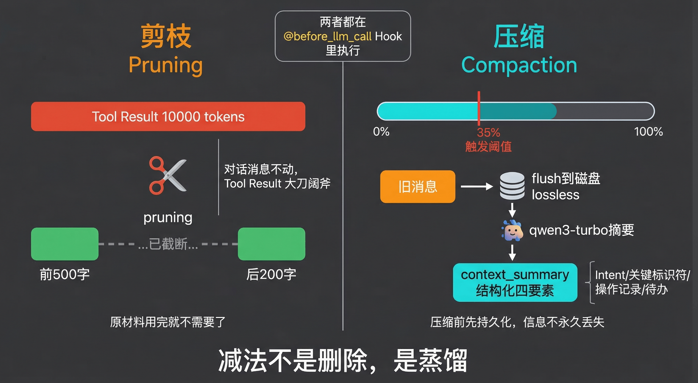
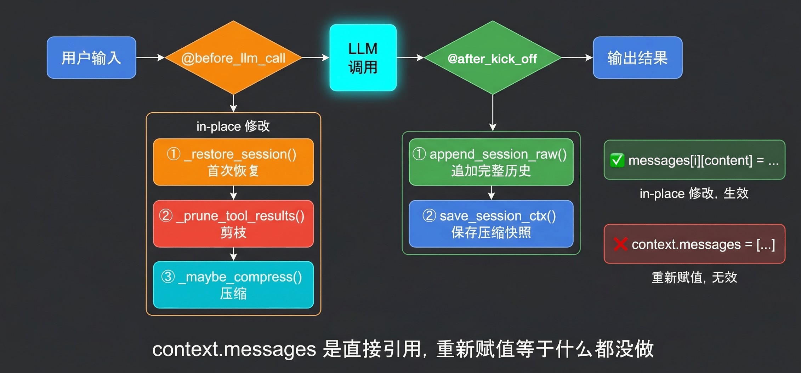

# 第19课：上下文生命周期管理

本课讨论的问题不是“上下文里应该有什么”，而是“Agent 运行到哪些时刻时，我们可以介入上下文”。上节课说上下文治理的核心是加法和减法，这节课把它落到 Agent 的生命周期节点里：Bootstrap 做加法，剪枝和压缩做减法。

配套代码见 `m3l19/m3l19_context_mgmt.py`，更细的数据流转推演见 `m3l19/上下文生命周期数据流转详解.md`。

## 1. 核心认知：上下文是生长出来的



Workflow 的上下文是工程师显式构建的。Step 1 的输出传给 Step 2，Step 2 的输出传给 Step 3，每一步 message list 都是你在代码里写出来的。

Agent 的上下文不同。Agent 通常运行在 ReAct 循环里：

```text
Thought -> Action -> Observation -> Thought -> Action -> Observation ...
```

每一轮循环里，模型自己决定调什么工具、传什么参数，工具结果再被框架自动放回 message list。因此 Agent 上下文不是提前写死的，而是在运行过程中持续生长出来的。

这带来一个工程事实：你无法提前枚举 Agent 的全部上下文，但你可以在固定生命周期节点干预它。

## 2. 生命周期节点

Agent 上下文治理可以拆成几个关键干预点：

| 节点 | 时机 | 典型治理动作 | CrewAI 当前落点 |
|---|---|---|---|
| Bootstrap | Agent 启动前 | 注入身份、用户画像、工作规则、记忆索引 | `Agent(backstory=...)` |
| Pre-Model | 每次 LLM 调用前 | 恢复 session、剪枝、压缩、拦截危险上下文 | `@before_llm_call` |
| Post-Model | LLM 输出后 | 格式化、脱敏、输出校验 | 可用但需谨慎 |
| Pre-Tool | 工具调用前 | 参数校验、权限检查 | 需框架支持或自封装 |
| Post-Tool | 工具返回后 | 工具结果过滤、结构化抽取 | 需框架支持或自封装 |
| AfterTurn | 一轮结束后 | 持久化、异步压缩、审计记录 | 本项目在 `kickoff()` 后实现 |

本课代码主要使用 CrewAI 官方支持的两个落点：

1. `backstory`：启动时注入 Bootstrap 导航骨架。
2. `@before_llm_call`：每次模型调用前做 session 恢复、剪枝和压缩。

## 3. 不治理会怎样

上下文不受控，问题不只是“变慢”。生产环境里更常见的是三类崩溃：

| 问题 | 表现 | 根因 |
|---|---|---|
| Context Overflow | message list 超过模型窗口，任务中断 | 工具结果、历史对话、系统提示无限增长 |
| Context Rot | 模型开始遗漏、重复、前后矛盾 | 重要信息被长上下文噪声稀释 |
| Context Poisoning | 错误事实或恶意输入持续污染后续回答 | Transformer 会持续 attend 到上下文里的坏信息 |

治理目标是让上下文长期保持“够用、干净、可恢复、可审计”。

## 4. Bootstrap：给 Agent 一个起点



Bootstrap 解决的是“Agent 默认从零开始”的问题。它在 Agent 启动前，把必要的导航骨架注入 system prompt 或 backstory。

本项目的 Bootstrap 由四类文件组成：

| 文件 | 标签 | 作用 | 加载策略 |
|---|---|---|---|
| `soul.md` | `<soul>` | Agent 身份、风格、价值约束 | 每次必载 |
| `user.md` | `<user_profile>` | 用户画像、偏好、当前项目 | 每次必载 |
| `agent.md` | `<agent_rules>` | 工具说明、SOP、行为规范 | 每次必载，可进化 |
| `memory.md` | `<memory_index>` | 记忆索引、近期工作、重要文件 | 只取前 200 行 |



这里的关键不是“把所有记忆都塞进去”，而是只放导航骨架。`memory.md` 更像索引，不是全文仓库。模型先知道“有哪些记忆可以用”，需要细节时再通过文件工具读取。

## 5. 剪枝：控制 Tool Result 膨胀



Agent 上下文里最大的膨胀源通常不是用户对话，而是工具结果。一次网页抓取可能返回数千到上万 token，几轮工具调用后，message list 很快被原材料塞满。

剪枝原则：

1. 对话消息尽量不动，因为它们承担语义连续性。
2. 旧的 Tool Result 可以大胆裁剪，因为多数工具结果用完后只需要保留结论。
3. 不能随便删除 tool 消息，应该保留 `tool_call_id` 等结构字段，避免框架内部引用断裂。

本项目的实现是把较早的 tool 消息内容替换成 `[已剪枝]`，保留消息占位和 `tool_call_id`。

```python
def prune_tool_results(messages, keep_turns=10):
    user_indices = [i for i, m in enumerate(messages) if m.get("role") == "user"]
    if len(user_indices) <= keep_turns:
        return

    cutoff_idx = user_indices[-keep_turns]
    for i in range(cutoff_idx):
        if messages[i].get("role") == "tool":
            messages[i]["content"] = "[已剪枝]"
```

## 6. 压缩：把旧历史变成摘要

压缩解决的是“早期消息仍然占窗口，但已不适合保留全文”的问题。

本项目的策略：

| 机制 | 说明 |
|---|---|
| 触发阈值 | `approx_tokens / model_limit >= 0.45` |
| 新鲜区保护 | 最近 `FRESH_KEEP_TURNS=10` 轮保持原文 |
| 切割边界 | 以 user 消息为边界，避免拆开 tool call 与 tool result |
| 分块摘要 | 旧消息按 `CHUNK_TOKENS=2000` 切块 |
| 摘要角色 | 摘要以 `system` 角色写回 `<context_summary>` |

压缩一定会丢失细节，所以不能只保存压缩后的上下文。本项目同时维护两份 session 文件：

| 文件 | 写入方式 | 用途 |
|---|---|---|
| `{session_id}_ctx.json` | 覆写 | 保存当前可恢复的压缩快照 |
| `{session_id}_raw.jsonl` | 追加 | 保存完整原始历史，用于审计和调试 |

这就是记忆工程里的 lossless 思路：在线上下文可以压缩，但原始历史要可追溯。

## 7. Hook 流程：代码真正动手的位置



`@before_llm_call` 是本课的核心手术台。每次 LLM 调用前，它拿到 `context.messages` 的直接引用，然后按顺序做三件事：

1. 首次调用时执行 `_restore_session()`：读取 `{session_id}_ctx.json`，恢复历史并追加当前用户消息。
2. 执行 `prune_tool_results()`：把旧 tool result 替换成 `[已剪枝]`。
3. 执行 `maybe_compress()`：超过阈值时，把旧历史摘要成 `<context_summary>`。

注意：`context.messages` 必须原地修改。

```python
# 正确：in-place 修改
context.messages[i]["content"] = "[已剪枝]"
context.messages.clear()
context.messages.extend(new_messages)

# 错误：重新赋值只改了局部引用
context.messages = new_messages
```

## 8. m3l19 代码地图

| 代码位置 | 职责 | 对应思想 |
|---|---|---|
| `build_bootstrap_prompt()` | 读取 workspace 四件套并拼成 XML 块 | Bootstrap 加法 |
| `load_session_ctx()` | 读取压缩快照 | session 恢复 |
| `save_session_ctx()` | 覆写当前压缩上下文 | 在线状态保存 |
| `append_session_raw()` | 追加原始完整历史 | lossless 审计 |
| `prune_tool_results()` | 清空旧 tool result 内容 | 减法：剪枝 |
| `chunk_by_tokens()` | 按近似 token 切块 | 控制摘要输入规模 |
| `_summarize_chunk()` | 用轻量模型生成摘要 | 降低压缩成本 |
| `maybe_compress()` | 阈值触发、保留新鲜区、摘要旧历史 | 减法：压缩 |
| `XiaoPawCrew.before_llm_hook()` | Pre-Model 统一入口 | 生命周期干预点 |
| `main()` | 多轮演示并在 kickoff 后持久化 | AfterTurn 持久化 |

## 9. 最容易踩的坑

| 反模式 | 后果 | 正确做法 |
|---|---|---|
| 把 `memory=True` 当上下文治理 | 只得到框架 memory/RAG，不等于 message list 治理 | 明确管理 Bootstrap、剪枝、压缩、持久化 |
| 等到 token 超限再处理 | 用户任务中断，状态丢失 | 30%-50% 主动压缩 |
| `context.messages = [...]` | 修改不生效 | `clear()` + `extend()` |
| 按消息数量硬切 | tool call 和 tool result 可能被拆开 | 按 user 边界切 |
| 只存 ctx 快照 | 压缩丢失的信息无法审计 | ctx 快照 + raw JSONL 双写 |
| 摘要 Prompt 太泛 | 摘要丢关键事实 | 明确保留目标、事实、待办，明确丢弃中间过程 |

## 10. 一句话总结

上下文生命周期管理的本质是：在 Agent 上下文生长的关键节点，对 message list 做可控的加法、减法和持久化。`m3l19` 用 `backstory` 完成 Bootstrap，用 `@before_llm_call` 完成 session 恢复、剪枝与压缩，再用双文件持久化把“可恢复的当前状态”和“可审计的完整历史”分开治理。
