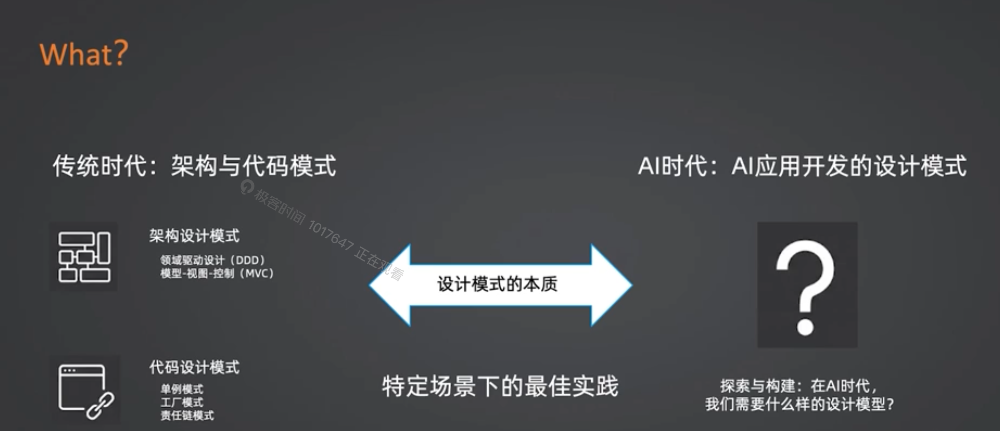
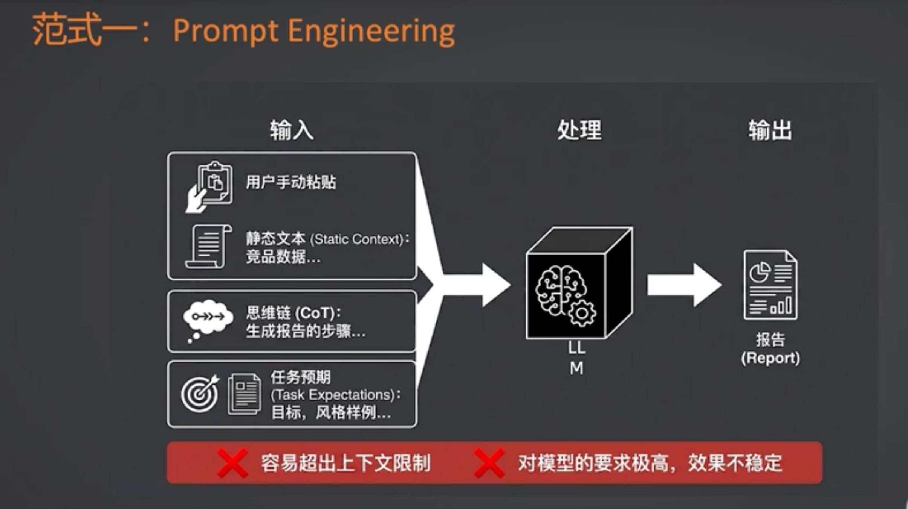
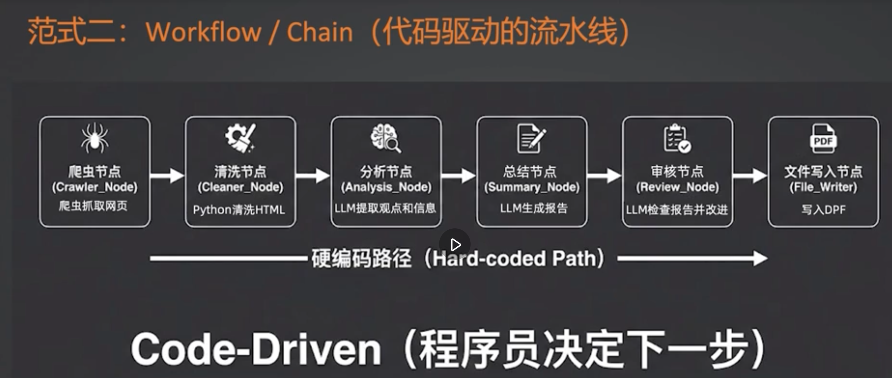
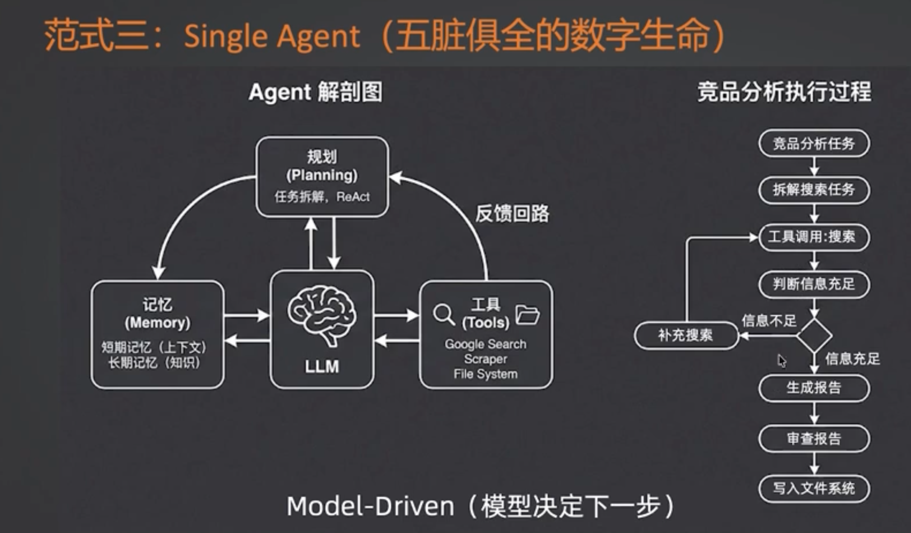
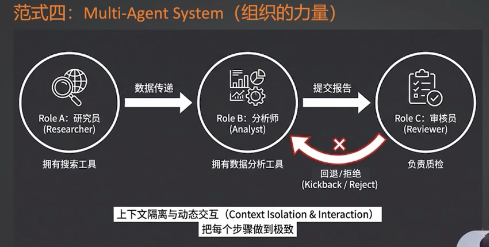

# AI 时代设计模式

提示此工程范式：上下文装很多没用，超过3，5万基本上就是能力大幅度下降了，会出现幻觉，内容提取效果差等问题。因此不要刻意追求上下文，而是给到足够有效的上下文

workflow范式：程序员决定下一步去到哪里，这个基本上是目前企业落地场景最多的。最稳定的。

single agent范式： 模型决定下一步去到哪里，

multi-agent范式: agent之间需要上下文隔离。还有一个好处就是从agent层面就把每一个agent可以用的工具都进行了隔离，那么其实也减轻了单个agent加载工具的负担。就是所谓了空间换时间的一种感觉，类似于提前把数据或者工具分区了。还可以尽可能减少你在使用单个agent时候出现的幻觉或者错误，因为单个agent用到错误工具的概率更高。组织的容错性把单个agent的不确定性更好的抵消。也是解决单个agent无法深度去做事情的问题。

根据业务不确定性来决定你选择哪种范式
