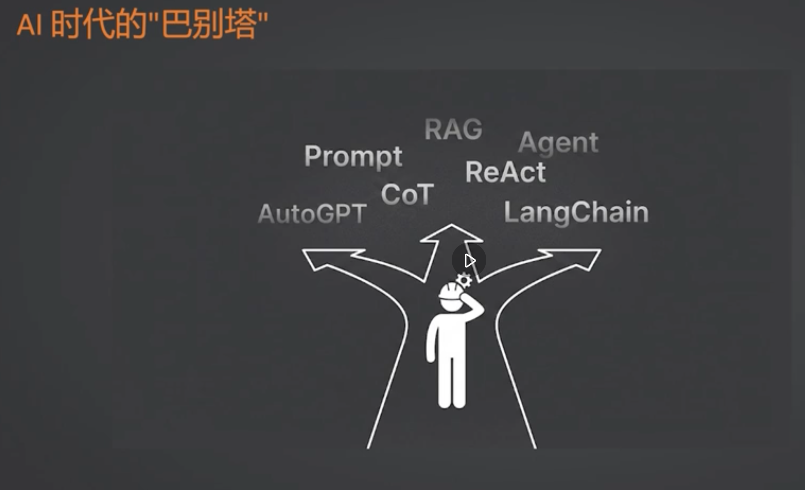
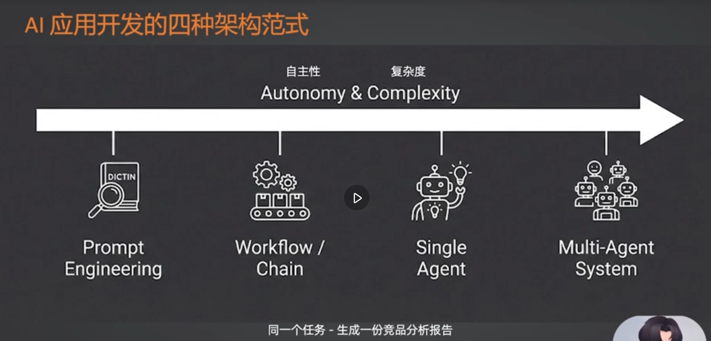
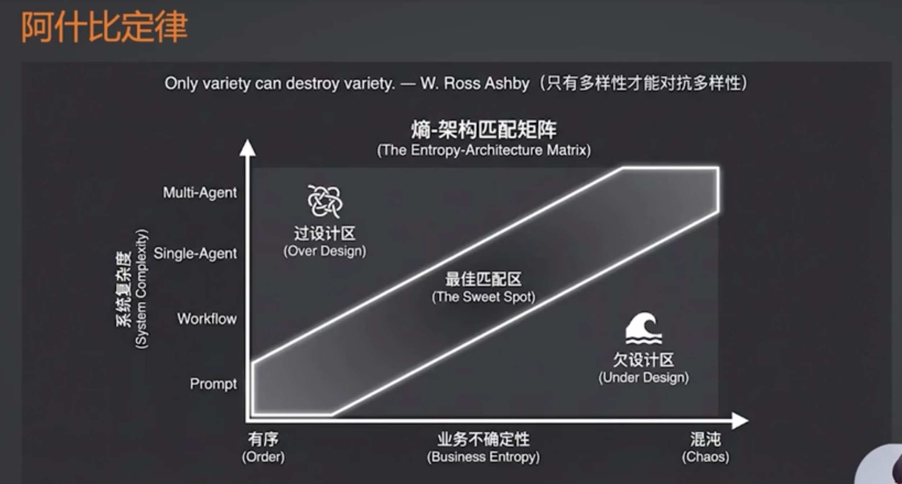
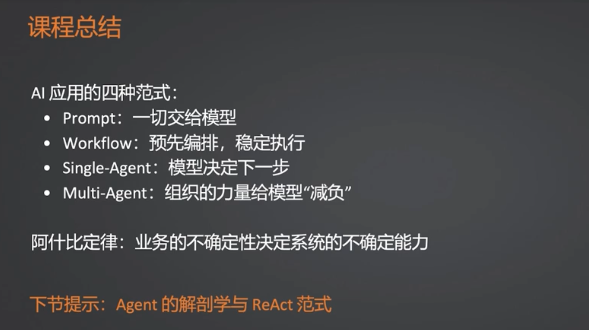

# AI 时代设计模式

## 1. 提示词工程范式 (Prompt Engineering)

**核心要点**：
上下文装载过多往往没有实际作用。当上下文 token 超过 3 到 5 万时，模型能力基本上会大幅度下降，容易出现幻觉、内容提取效果差等问题。
**结论**：因此，不要刻意追求超长的上下文，而是应当给到**足够有效**的上下文。

---

## 2. 工作流范式 (Workflow)

**核心要点**：由**程序员**决定下一步的走向。
**特点**：这是目前企业落地场景最多、也最稳定的一种范式。

---

## 3. 单智能体范式 (Single Agent)

**核心要点**：由**大模型**决定下一步的走向。

---

## 4. 多智能体范式 (Multi-Agent)

**核心要点**：
- **上下文隔离**：Agent 之间需要进行上下文隔离。
- **工具隔离与减负**：从 Agent 层面将每个 Agent 可用的工具进行隔离，减轻了单个 Agent 加载工具的负担。这是一种“空间换时间”的策略，类似于提前将数据或工具进行了分区。
- **降低错误率与幻觉**：能尽可能减少使用单个 Agent 时出现的幻觉或错误，因为单个 Agent 在面临过多选择时调用错误工具的概率更高。
- **提升系统容错性**：多智能体组织的容错性能够更好地抵消单个 Agent 的不确定性。同时，这也是解决单个 Agent 无法深度去做特定微观任务的有效途径。

---

## 总结：如何选择设计范式

**核心原则**：根据**业务的不确定性**来决定选择哪种范式。

