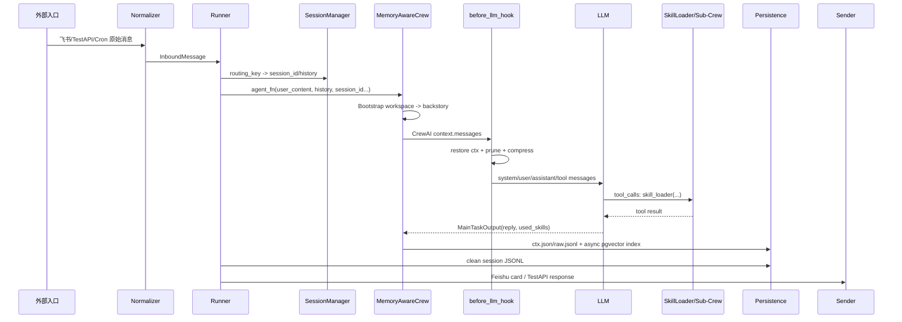

# XiaoPaw 消息形态变化地图：从入口消息到 System/User/Tool Messages

这份笔记专门回答：不同类型的消息进入 XiaoPaw 后，如何一步步变形，最终以什么形态进入 LLM，以及每一步对应哪个底层文件。

## 总体链路



## 关键文件索引

| 环节 | 文件 |
| --- | --- |
| 飞书事件解析 | `xiaopaw-with-memory/xiaopaw/feishu/listener.py` |
| routing_key 生成 | `xiaopaw-with-memory/xiaopaw/feishu/session_key.py` |
| 内部消息模型 | `xiaopaw-with-memory/xiaopaw/models.py` |
| TestAPI 入口 | `xiaopaw-with-memory/xiaopaw/api/test_server.py`、`xiaopaw-with-memory/xiaopaw/api/schemas.py` |
| Cron 入口 | `xiaopaw-with-memory/xiaopaw/cron/service.py`、`xiaopaw-with-memory/xiaopaw/cron/models.py` |
| 主流程调度 | `xiaopaw-with-memory/xiaopaw/runner.py` |
| session 存储 | `xiaopaw-with-memory/xiaopaw/session/manager.py` |
| 主 Agent/Crew | `xiaopaw-with-memory/xiaopaw/agents/main_crew.py` |
| 主 Agent 静态配置 | `xiaopaw-with-memory/xiaopaw/agents/config/agents.yaml` |
| 主 Task 配置 | `xiaopaw-with-memory/xiaopaw/agents/config/tasks.yaml` |
| workspace 注入 | `xiaopaw-with-memory/xiaopaw/memory/bootstrap.py` |
| ctx 生命周期 | `xiaopaw-with-memory/xiaopaw/memory/context_mgmt.py` |
| Skill 路由 | `xiaopaw-with-memory/xiaopaw/tools/skill_loader.py` |
| Sub-Crew 执行 | `xiaopaw-with-memory/xiaopaw/agents/skill_crew.py` |
| LLM API 适配 | `xiaopaw-with-memory/xiaopaw/llm/aliyun_llm.py` |
| 搜索记忆写入 | `xiaopaw-with-memory/xiaopaw/memory/indexer.py` |
| 搜索记忆读取 | `xiaopaw-with-memory/xiaopaw/skills/search_memory/scripts/search.py` |
| pgvector schema | `xiaopaw-with-memory/schema.sql` |

## 1. 飞书文本 / 富文本消息

### 入口形态

飞书 WebSocket 推来的是 JSON payload。`listener.py` 从中取出 sender、message、chat_type、chat_id、thread_id 等字段。

```python
# xiaopaw/feishu/listener.py
event_obj = data.get("event") or {}
message = event_obj.get("message") or {}
sender = event_obj.get("sender") or {}
```

### 第一次变形：routing_key

```python
# xiaopaw/feishu/session_key.py
if chat_type == "p2p":
    return f"p2p:{sender_id}"
if thread_id:
    return f"thread:{chat_id}:{thread_id}"
return f"group:{chat_id}"
```

得到：

```text
p2p:ou_xxx
group:oc_xxx
thread:oc_xxx:om_xxx
```

### 第二次变形：content 纯文本

文本消息：

```python
# xiaopaw/feishu/listener.py
if msg_type == "text":
    return data.get("text", "")
```

富文本 post：

```python
# xiaopaw/feishu/listener.py
if msg_type == "post":
    return FeishuListener._extract_post_text(data)
```

post 会被压平为纯文本，标题和文本段落被拼到一起。

### 第三次变形：InboundMessage

```python
# xiaopaw/feishu/listener.py
inbound = InboundMessage(
    routing_key=routing_key,
    content=content,
    msg_id=msg_id,
    root_id=root_id,
    sender_id=sender_open_id,
    ts=ts,
    attachment=attachment,
)
```

此时消息变成项目内部标准形态：

```python
InboundMessage(
    routing_key="p2p:ou_xxx",
    content="用户原始文本",
    msg_id="om_xxx",
    root_id="om_xxx",
    sender_id="ou_xxx",
    ts=1710000000000,
    is_cron=False,
    attachment=None,
)
```

### 第四次变形：Runner agent_fn 输入

`Runner` 处理后调用：

```python
# xiaopaw/runner.py
reply = await self._agent_fn(
    user_content, history, session.id,
    inbound.routing_key, inbound.root_id, session.verbose,
)
```

形态变成：

```python
agent_fn(
    user_message="用户原始文本",
    history=[MessageEntry(...), ...],
    session_id="s-abc123",
    routing_key="p2p:ou_xxx",
    root_id="om_xxx",
    verbose=False,
)
```

## 2. 飞书图片 / 文件消息

### 入口形态

飞书的图片或文件消息不直接把二进制交给 LLM，而是先提取附件元信息：

```python
# xiaopaw/feishu/listener.py
return Attachment(
    msg_type="file",
    file_key=file_key,
    file_name=file_name,
)
```

### 下载到 session workspace

`Runner` 拿到 session 后，才能知道文件应该放进哪个会话目录：

```python
# xiaopaw/runner.py
sandbox_path = (
    f"/workspace/sessions/{session.id}/uploads/"
    f"{inbound.attachment.file_name}"
)
local_path = await self._downloader.download(
    inbound.msg_id, inbound.attachment, session.id
)
```

本地实际位置：

```text
data/workspace/sessions/{session_id}/uploads/{file_name}
```

沙盒可见位置：

```text
/workspace/sessions/{session_id}/uploads/{file_name}
```

### content 被改写为路径提示

```python
# xiaopaw/runner.py
user_content = _build_attachment_message(
    sandbox_path=sandbox_path,
    original_text=inbound.content,
)
```

进入 Agent 的消息不再是空文件消息，而是：

```markdown
用户发来了文件，已自动保存至沙盒路径：
`/workspace/sessions/s-abc123/uploads/report.pdf`
请根据文件内容和用户意图完成相应处理。
用户备注：帮我总结一下
```

这一步很重要：模型只看到沙盒路径，不碰宿主机路径。

## 3. TestAPI 消息

TestAPI 用于本地调试，不依赖真实飞书。

### 入口形态

```python
# xiaopaw/api/schemas.py
class TestRequest(BaseModel):
    routing_key: str
    content: str = ""
    msg_id: str | None = None
    sender_id: str = "ou_test001"
    attachment: TestAttachment | None = None
```

HTTP 请求类似：

```json
{
  "routing_key": "p2p:ou_test001",
  "content": "你好"
}
```

### 变成 InboundMessage

```python
# xiaopaw/api/test_server.py
inbound = InboundMessage(
    routing_key=req.routing_key,
    content=content,
    msg_id=msg_id,
    root_id=msg_id,
    sender_id=req.sender_id,
    ts=ts_ms,
)
```

从这里开始，TestAPI 消息和飞书消息进入同一条 Runner 管道。

### CaptureSender 捕获最终回复

测试模式不用 FeishuSender，而用 CaptureSender：

```python
# xiaopaw/api/capture_sender.py
async def update_card(self, card_msg_id: str, content: str) -> None:
    for msg_id, fut in list(self._futures.items()):
        if not fut.done():
            self._futures.pop(msg_id, None)
            fut.set_result(content)
            return
```

所以 TestAPI 的回复不是发到飞书，而是 resolve Future 后返回 HTTP JSON。

## 4. Cron 定时任务消息

CronService 的任务配置在：

```text
data/cron/tasks.json
```

模型或用户可以通过 `scheduler_mgr` Skill 修改它。

### 任务 payload 形态

```python
# xiaopaw/cron/models.py
@dataclass
class CronPayload:
    routing_key: str
    message: str
```

### 到点后变成 InboundMessage

```python
# xiaopaw/cron/service.py
inbound = InboundMessage(
    routing_key=job.payload.routing_key,
    content=job.payload.message,
    msg_id=msg_id,
    root_id=msg_id,
    sender_id="cron",
    ts=ts_ms,
    is_cron=True,
)
```

之后和普通用户消息一样进入 Runner。区别只有：

```python
is_cron=True
sender_id="cron"
```

## 5. Slash 命令消息

Slash 命令是特殊路径，它不会进入 LLM，也不会写入历史。

```python
# xiaopaw/runner.py
slash_reply = await self._handle_slash(inbound)
if slash_reply is not None:
    await self._sender.send_text(key, slash_reply, inbound.root_id)
    return
```

支持：

```text
/new
/verbose on
/verbose off
/verbose
/status
/help
```

含义：

- `/new`：创建新 session，旧 clean history 不带入
- `/verbose`：改变 session 元数据
- `/help`、`/status`：直接返回纯文本

这类消息不会形成 system/user messages。

## 6. 进入 Main Crew 前的输入形态

`Runner` 调 `agent_fn` 后，`build_agent_fn()` 创建一个新的 `MemoryAwareCrew`：

```python
# xiaopaw/agents/main_crew.py
crew_instance = MemoryAwareCrew(
    session_id=session_id,
    user_message=user_message,
    routing_key=routing_key,
    workspace_dir=workspace_dir,
    ctx_dir=ctx_dir,
    db_dsn=db_dsn,
    step_callback=step_cb,
    verbose=verbose,
    history_all=history,
    sandbox_url=sandbox_url,
)
return await crew_instance.run_and_index()
```

这一步的关键是：每条用户消息都会创建新的 Crew 实例，避免 CrewAI 内部状态跨 session 污染。

## 7. System message 的来源和形态

### 静态 Agent 配置

静态 role/goal 在：

```yaml
# xiaopaw/agents/config/agents.yaml
orchestrator:
  role: XiaoPaw 工作助手
  goal: >
    理解用户的工作需求，通过合理使用 Skills 完成任务...
```

### 动态 backstory 覆盖

`main_crew.py` 会覆盖 YAML 里的 backstory：

```python
# xiaopaw/agents/main_crew.py
cfg = dict(_load_yaml(_CONFIG_DIR / "agents.yaml")["orchestrator"])
cfg["backstory"] = build_bootstrap_prompt(self._workspace_dir)
```

### workspace -> XML system 背景

`bootstrap.py` 输出类似：

```xml
<soul>
来自 /data/workspace/soul.md
</soul>

<user_profile>
来自 /data/workspace/user.md
</user_profile>

<agent_rules>
来自 /data/workspace/agent.md
</agent_rules>

<memory_index>
来自 /data/workspace/memory.md 前 200 行
</memory_index>
```

这部分会进入 CrewAI 构造出的 system 消息。严格说，最终 system message 的完整格式由 CrewAI 内部拼接 role/goal/backstory，但在本项目里，**最关键、可变的 system 背景就是这个 Bootstrap backstory**。

## 8. User message 的来源和形态

主任务模板在：

```yaml
# xiaopaw/agents/config/tasks.yaml
main_task:
  description: |
    【历史对话】
    {history}

    【用户消息】
    {user_message}
```

`run_and_index()` 显式注入：

```python
# xiaopaw/agents/main_crew.py
result = await self.crew().akickoff(
    inputs={
        "user_message": self.user_message,
        "history": _format_history(self._history_all),
    }
)
```

进入 LLM 的 user 消息概念上类似：

```markdown
【历史对话】
用户: 上一轮用户消息
助手: 上一轮助手回复

【用户消息】
这次用户说的话

请理解用户需求并完成任务。如需专业能力...
```

注意：`session_id` 不通过 task template 注入。session_id 是系统私有状态，只在 Python 层和沙盒路径指令中使用。

## 9. before_llm_hook 后的 messages 形态

CrewAI 初始构造的 messages 大致是：

```python
[
    {"role": "system", "content": "role/goal/backstory，其中 backstory 是 <soul>..."},
    {"role": "user", "content": "【历史对话】...\n【用户消息】..."}
]
```

然后进入：

```python
# xiaopaw/agents/main_crew.py
@before_llm_call
def before_llm_hook(self, context):
    if not self._session_loaded:
        self._restore_session(context)
        self._session_loaded = True
    self._last_msgs = context.messages
    prune_tool_results(context.messages, ...)
    maybe_compress(context.messages, context)
```

### 9.1 如果没有 ctx.json

新 session 首轮：

```python
[
    {"role": "system", "content": "最新 Bootstrap system 背景"},
    {"role": "user", "content": "当前 task.description"}
]
```

### 9.2 如果有 ctx.json

`_restore_session()` 会重建顺序：

```python
# xiaopaw/agents/main_crew.py
context.messages.clear()
context.messages.extend(current_system_msgs)
context.messages.extend(hist_conv)
if current_user_msg:
    context.messages.append(current_user_msg)
```

形态变成：

```python
[
    {"role": "system", "content": "最新 Bootstrap system 背景"},
    {"role": "system", "content": "<context_summary>旧历史摘要</context_summary>"},
    {"role": "user", "content": "历史用户消息"},
    {"role": "assistant", "content": "历史助手消息"},
    {"role": "assistant", "tool_calls": [...]},
    {"role": "tool", "tool_call_id": "...", "content": "历史工具结果"},
    {"role": "user", "content": "当前 task.description"}
]
```

这里有两个细节：

- 旧 role-definition system 会被过滤掉，避免旧 backstory 覆盖新 workspace
- `<context_summary>` 是 system role，会被保留，因为它是压缩后的历史记忆

### 9.3 prune 后

旧工具结果不会被删除，只替换内容：

```python
{
    "role": "tool",
    "tool_call_id": "call_xxx",
    "content": "[已剪枝]"
}
```

原因在 `context_mgmt.py`：tool_call_id 链路必须完整，删除 tool 消息可能导致模型 API 校验失败。

### 9.4 compress 后

旧非 system 消息被分块摘要，插回 system：

```python
{
    "role": "system",
    "content": "<context_summary>\n用户目标：...\n关键事实：...\n未完成事项：...\n</context_summary>"
}
```

最终形态：

```python
[
    {"role": "system", "content": "最新 Bootstrap system 背景"},
    {"role": "system", "content": "<context_summary>...</context_summary>"},
    {"role": "user", "content": "最近 N 轮原文"},
    {"role": "assistant", "content": "最近 N 轮原文"},
    {"role": "user", "content": "当前 task.description"}
]
```

这就是当前笔记里 “prune / compress / ctx.json” 的真实工程形态。

## 10. Tool call 消息形态：主 Agent 调 SkillLoader

主 Agent 的工具列表来自：

```python
# xiaopaw/agents/main_crew.py
tools.append(SkillLoaderTool(**loader_kwargs))
tools.append(IntermediateTool())
```

`SkillLoaderTool` 的 description 只注入轻量 XML：

```xml
<available_skills>
  <skill>
    <name>memory-save</name>
    <type>task</type>
    <description>Use this skill to persist important information...</description>
  </skill>
  <skill>
    <name>search_memory</name>
    <type>task</type>
    <description>当需要回忆任何历史对话内容时...</description>
  </skill>
</available_skills>
```

当模型决定调用 Skill 时，LLM messages 会出现 assistant tool call：

```python
{
    "role": "assistant",
    "content": None,
    "tool_calls": [
        {
            "id": "call_xxx",
            "type": "function",
            "function": {
                "name": "skill_loader",
                "arguments": "{\"skill_name\":\"search_memory\",\"task_context\":\"...\"}"
            }
        }
    ]
}
```

工具执行后，会出现 tool 结果：

```python
{
    "role": "tool",
    "tool_call_id": "call_xxx",
    "content": "Sub-Crew 返回的结果字符串"
}
```

这些消息会保存在 `ctx.json` 中，因此下一轮可被恢复、剪枝或压缩。

## 11. SkillLoader 内部的二次变形

### 11.1 reference Skill

如果是 reference 类型：

```python
# xiaopaw/tools/skill_loader.py
return f"<skill_instructions>\n{instructions}\n</skill_instructions>"
```

这只是把指令文本作为 tool result 返回给主 Agent。

### 11.2 task Skill

如果是 task 类型：

```python
# xiaopaw/tools/skill_loader.py
crew = build_skill_crew(**crew_kwargs)
result = await crew.akickoff(inputs=inputs)
return str(result)
```

它会启动 Sub-Crew。Sub-Crew 的 system 背景由 `agents.yaml` 的 `skill_agent` 模板和完整 `SKILL.md` 拼成：

```yaml
# xiaopaw/agents/config/agents.yaml
skill_agent:
  role: "{skill_name_upper} Skill 执行专家"
  goal: "严格按照 {skill_name} Skill 的操作规范，在 AIO-Sandbox 中完成任务"
  backstory: |
    当前 Session 沙盒工作目录：{session_dir}/
    ...
    {skill_instructions}
```

Sub-Crew 的 user task 来自：

```yaml
# xiaopaw/agents/config/tasks.yaml
skill_task:
  description: |
    根据以下任务要求，使用你掌握的 Skill 操作规范完成任务。

    任务要求：
    {{task_context}}
```

所以 task Skill 里又形成一套小型 harness：

```python
[
    {"role": "system", "content": "Skill 专家人设 + 完整 SKILL.md + 沙盒路径约束"},
    {"role": "user", "content": "task_context，即主 Agent 给子任务的结构化说明"}
]
```

## 12. memory-save 消息如何处理

触发条件来自 `memory-save/SKILL.md` frontmatter：

```yaml
description: >
  Activate proactively ... when:
  - User expresses a preference or habit
  - User corrects Agent behavior
  - A key fact emerges ...
```

主 Agent 看到用户说：

```text
以后不要用表格，直接给我结论。
```

会调用：

```json
{
  "skill_name": "memory-save",
  "task_context": "把用户偏好写入 /workspace/user.md：以后不要用表格，直接给结论..."
}
```

Sub-Crew system 中会包含 `memory-save/SKILL.md` 的写入规则：

```markdown
target = user → /workspace/user.md
写入前检查 Utility / Confidence / Novelty
更新优于追加，用 str_replace 精准更新
写入后 read-back 验证
```

最终变化的底层文件通常是：

```text
data/workspace/user.md
data/workspace/agent.md
data/workspace/soul.md
data/workspace/memory.md
data/workspace/memory_<name>.md
```

下一轮 `bootstrap.py` 再读这些文件，它们就变成新的 system 背景。

这是 L20 写通道和 L19 读通道的闭环。

## 13. search_memory 消息如何处理

触发条件来自 `search_memory/SKILL.md`：

```yaml
description: >
  当需要回忆任何历史对话内容时，主动使用此 skill...
  - "上次你说的"
  - "之前的分析"
  - "复盘"
  - "该不该 XX" 且背景未在当前对话出现
```

用户说：

```text
阿里今天该不该挂单卖出？
```

如果当前上下文没有持仓信息，主 Agent 应主动调用：

```json
{
  "skill_name": "search_memory",
  "task_context": "搜索用户历史对话中关于阿里持仓、成本价、操作记录的信息..."
}
```

Sub-Crew 会执行：

```bash
python /mnt/skills/search_memory/scripts/search.py \
  --query "阿里 持仓 成本价 操作记录" \
  --mode hybrid \
  --limit 5
```

底层 SQL：

```sql
SELECT
    id, summary, user_message, assistant_reply, tags,
    created_at, turn_ts,
    (
        0.7 * (1 - (summary_vec <=> %(query_vec)s::vector))
        + 0.3 * ts_rank(search_tsv, plainto_tsquery('simple', %(tsquery)s))
    ) AS score
FROM memories
ORDER BY score DESC
LIMIT %(limit)s
```

搜索结果作为 tool result 回到主 Agent，主 Agent 再结合当前问题生成最终回复。

## 14. 一轮结束后的持久化形态

### clean history

位置：

```text
data/sessions/{session_id}.jsonl
```

形态：

```json
{"type":"message","role":"user","content":"用户消息","ts":...,"feishu_msg_id":"..."}
{"type":"message","role":"assistant","content":"助手最终回复","ts":...}
```

写入代码：

```python
# xiaopaw/session/manager.py
await self._session_mgr.append(...)
```

### ctx snapshot

位置：

```text
data/ctx/{session_id}_ctx.json
```

形态：

```json
[
  {"role": "system", "content": "..."},
  {"role": "user", "content": "..."},
  {"role": "assistant", "tool_calls": [...]},
  {"role": "tool", "tool_call_id": "...", "content": "..."},
  {"role": "assistant", "content": "..."}
]
```

写入代码：

```python
# xiaopaw/memory/context_mgmt.py
save_session_ctx(session_id, messages, ctx_dir)
```

### raw audit

位置：

```text
data/ctx/{session_id}_raw.jsonl
```

形态：

```json
{"role":"user","content":"...","ts":"2026-..."}
{"role":"assistant","tool_calls":[...],"ts":"2026-..."}
{"role":"tool","content":"...","ts":"2026-..."}
```

写入代码：

```python
# xiaopaw/memory/context_mgmt.py
append_session_raw(session_id, new_msgs, ctx_dir)
```

### pgvector memory

位置：

```text
PostgreSQL / pgvector: memories 表
```

字段：

```sql
id, session_id, routing_key,
user_message, assistant_reply,
summary, tags,
turn_ts,
summary_vec, message_vec,
search_text, search_tsv
```

写入代码：

```python
# xiaopaw/memory/indexer.py
summary, tags = extract_summary_and_tags(user_message, assistant_reply)
vecs = embed_texts([summary, message_text])
upsert_memory(conn, {...})
```

## 15. 不同消息入口对照表

| 入口消息 | 标准化位置 | 进入 Runner 的 content | 是否进 LLM | 是否写 clean history | 是否可能写 ctx/pgvector |
| --- | --- | --- | --- | --- | --- |
| 飞书 text | `feishu/listener.py` | 文本内容 | 是 | 是 | 是 |
| 飞书 post | `feishu/listener.py` | 抽取后的纯文本 | 是 | 是 | 是 |
| 飞书 file/image | `listener.py` + `downloader.py` + `runner.py` | 沙盒路径提示 | 是 | 是 | 是 |
| TestAPI text | `api/test_server.py` | HTTP body 的 content | 是 | 是 | 是 |
| TestAPI attachment | `api/test_server.py` | 沙盒路径提示 | 是 | 是 | 是 |
| Cron | `cron/service.py` | `CronPayload.message` | 是 | 是 | 是 |
| Slash 命令 | `runner.py` | 原始 slash 文本 | 否 | 否 | 否 |
| Main Agent tool call | CrewAI + `skill_loader.py` | function call arguments | 是，作为 assistant/tool messages | 不写 clean history | 写入 ctx |
| memory-save 写文件 | `memory-save/SKILL.md` + Sub-Crew | task_context | 间接进入 Sub-Crew | 主回复写 clean history | 文件变化进入下轮 system |
| search_memory 搜索历史 | `search_memory/SKILL.md` + `scripts/search.py` | task_context + SQL 结果 | 搜索结果作为 tool result 回主 Agent | 主回复写 clean history | 搜索过程写 ctx，历史已在 pgvector |

## 16. 对应 harness 工程思想的理解

把这条链路和 `notes.md` 对起来，可以得到一个非常清晰的分层：

| harness 层 | 控制什么 | 项目实现 |
| --- | --- | --- |
| Ingress Harness | 外部消息如何进入 | FeishuListener / TestAPI / CronService |
| Normalization Harness | 外部消息如何变成统一内部对象 | InboundMessage |
| Routing Harness | 谁和谁属于同一个上下文 | routing_key + SessionManager |
| Context Harness | 什么历史可以进 LLM | task history + ctx restore + prune + compress |
| System Prompt Harness | 什么长期状态进入 system | workspace Bootstrap |
| Tool Harness | 模型能调用什么能力 | SkillLoaderTool |
| Execution Harness | 工具在哪里执行 | Sub-Crew + AIO-Sandbox |
| Memory Write Harness | 什么信息能长期保存 | memory-save / skill-creator |
| Retrieval Harness | 历史怎么被找回 | search_memory + pgvector |
| Output Harness | 最终怎么回到用户 | FeishuSender / CaptureSender |

所以，“消息进入系统消息的形态变化”可以总结为：

```text
外部消息
→ InboundMessage
→ Runner user_content
→ Task description 的 {user_message}
→ CrewAI user message
→ before_llm_hook 重组后的 messages
→ LLM API payload.messages
→ assistant/tool messages
→ final JSON reply
→ clean history / ctx snapshot / pgvector
```

而 system message 的变化则是：

```text
workspace-init/*.md
→ data/workspace/*.md
→ build_bootstrap_prompt()
→ Agent.backstory
→ CrewAI system message
→ ctx restore 时保留最新 system，丢弃旧 role-definition system
→ compress 时追加 <context_summary> system message
```

这就是 XiaoPaw 项目把 notes 里的记忆体系和 harness 工程思想对应起来的完整路径。
