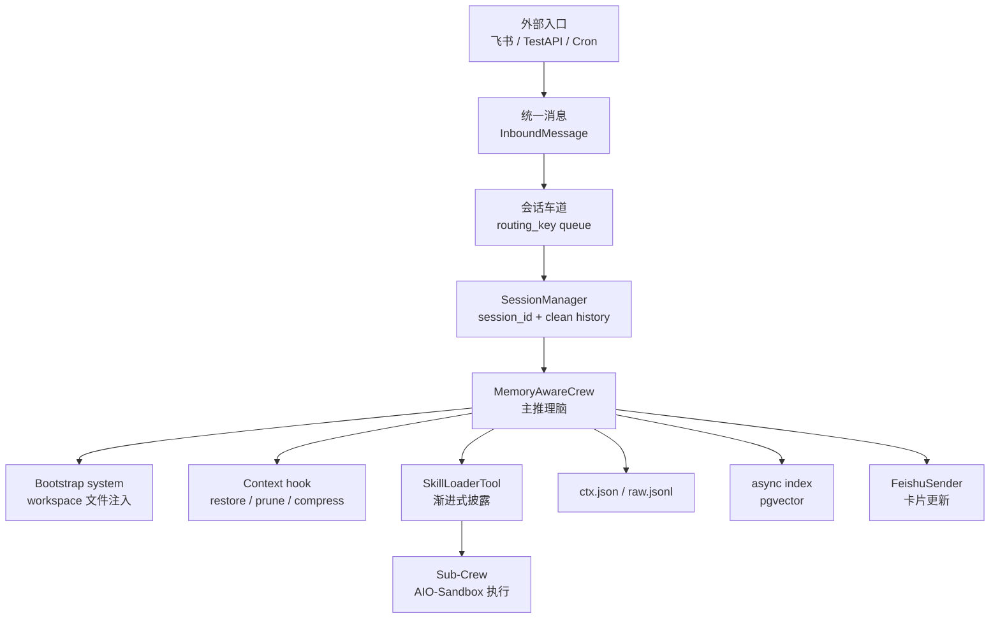

# XiaoPaw With Memory 项目拆解：从笔记最佳实践到 Harness 工程

这份笔记把根目录 `notes.md` 里的第 22 课最佳实践，映射到 `xiaopaw-with-memory/` 项目的真实代码。

阅读这份笔记时，可以先把 **harness** 理解成：包在 LLM 外面的工程外壳。它负责消息接入、会话隔离、上下文裁剪、工具路由、文件与数据库记忆、安全沙盒、最终发送。LLM 不是系统本身，而是被这个 harness 管起来的推理核心。

## 一句话总览

这个项目没有把“记忆”硬塞进飞书路由或业务逻辑里，而是在稳定的消息骨架外面挂了三层记忆：

- 文件层：`workspace-init/*.md` 和运行时 `data/workspace/*.md`
- 上下文层：`data/ctx/{session_id}_ctx.json` 和 `raw.jsonl`
- 搜索层：`pgvector` 的 `memories` 表

这正对应 `notes.md` 里的核心句子：**记忆系统是长出来的，不是侵入进去的。**

## 最佳实践到代码映射

| notes 中的实践 | 项目落地位置 | 作用 |
| --- | --- | --- |
| 骨架不动，记忆长出来 | `xiaopaw/runner.py`、`xiaopaw/session/manager.py`、`xiaopaw/tools/skill_loader.py` 基本保持职责稳定；记忆集中在 `xiaopaw/agents/main_crew.py` 和 `xiaopaw/memory/*` | 消息接入、会话、技能路由仍是原框架；记忆作为可插拔增强层出现 |
| Bootstrap 读 workspace 注入 backstory | `xiaopaw/memory/bootstrap.py`、`xiaopaw/agents/main_crew.py` | 每轮启动时读取 `soul.md`、`user.md`、`agent.md`、`memory.md`，生成当前 system 背景 |
| 初始引导写进 `agent.md`，不写进代码 | `workspace-init/agent.md` | 首次配置是 Agent 行为规范，不是程序 if 分支；完成后可被 `memory-save` 自清除 |
| `memory-save` 作为语义记忆写通道 | `xiaopaw/skills/memory-save/SKILL.md` | 用户偏好、事实、规则、主题记忆通过 Skill 写入 workspace 文件 |
| `skill-creator` 作为程序记忆写通道 | `xiaopaw/skills/skill-creator/SKILL.md`、`xiaopaw/skills/load_skills.yaml` | 用户调教出的 SOP 被沉淀为新的 `SKILL.md`，下次一句话触发 |
| `search_memory` 按需触发历史搜索 | `xiaopaw/skills/search_memory/SKILL.md`、`xiaopaw/skills/search_memory/scripts/search.py` | 用户提到“上次/之前/复盘/该不该”时，Agent 通过 pgvector 找历史对话 |
| 上下文 prune / compress / ctx.json | `xiaopaw/memory/context_mgmt.py`、`xiaopaw/agents/main_crew.py` | 每次 LLM 调用前剪枝或压缩，结束后保存跨 session 快照 |
| 每轮对话异步建索引 | `xiaopaw/memory/indexer.py`、`xiaopaw/agents/main_crew.py` | 主回复不等待向量入库；后台提取摘要、向量化、写 pgvector |
| 渐进式披露 | `xiaopaw/tools/skill_loader.py` | 主 Agent 先只看到 Skill 名称和 description；调用时才加载完整 `SKILL.md` |
| 沙盒隔离，凭证不进 LLM | `sandbox-docker-compose.yaml`、`xiaopaw/cleanup/service.py`、`xiaopaw/agents/skill_crew.py` | 执行类操作进入 AIO-Sandbox；飞书/百度凭证写到 `/workspace/.config`，不出现在模型上下文里 |

## 从浅到深理解项目

### 1. 第一层：它是一个飞书助手

最外层入口在 `xiaopaw/main.py`。启动时它做几件事：

1. 读取 `config.yaml`
2. 初始化日志、metrics、SessionManager、CleanupService
3. 写入沙盒凭证
4. 构建 `agent_fn`
5. 启动 Feishu WebSocket、CronService、TestAPI

核心代码位置：

```python
# xiaopaw/main.py
agent_fn = build_agent_fn(
    sender=sender,
    workspace_dir=workspace_dir,
    ctx_dir=ctx_dir,
    db_dsn=db_dsn,
    max_history_turns=max_history_turns,
    sandbox_url=sandbox_url,
)

runner = Runner(
    session_mgr=session_mgr,
    sender=sender,
    agent_fn=agent_fn,
    downloader=downloader,
    idle_timeout=idle_timeout,
)
```

这说明：`main.py` 不直接跟 LLM 对话，它只把外部服务装配起来。真正处理消息的是 `Runner`。

### 2. 第二层：所有入口先变成统一消息

项目内部统一使用 `InboundMessage`：

```python
# xiaopaw/models.py
@dataclass
class InboundMessage:
    routing_key: str
    content: str
    msg_id: str
    root_id: str
    sender_id: str
    ts: int
    is_cron: bool = False
    attachment: Attachment | None = None
```

飞书消息、TestAPI 消息、定时任务消息，最终都被压成这个形态。这就是 harness 的第一层价值：**外部世界再复杂，内部只吃一种标准消息。**

### 3. 第三层：routing_key 决定会话隔离

飞书入口把消息解析成三种 routing_key：

```python
# xiaopaw/feishu/session_key.py
if chat_type == "p2p":
    return f"p2p:{sender_id}"
if thread_id:
    return f"thread:{chat_id}:{thread_id}"
return f"group:{chat_id}"
```

`Runner` 为每个 routing_key 建一个队列：

```python
# xiaopaw/runner.py
if key not in self._queues:
    self._queues[key] = asyncio.Queue()
    self._workers[key] = asyncio.create_task(self._worker(key))
await self._queues[key].put(inbound)
```

含义：

- 同一个用户或群聊的消息串行处理，避免上下文乱序
- 不同 routing_key 可以并发处理
- routing_key 再映射到 active session_id，存到 `data/sessions/index.json`

这就是项目级 harness 的“车道隔离”。

### 4. 第四层：Runner 只做流程控制，不做智能判断

`Runner._handle()` 是最清晰的主流程：

```python
# xiaopaw/runner.py
slash_reply = await self._handle_slash(inbound)
if slash_reply is not None:
    await self._sender.send_text(key, slash_reply, inbound.root_id)
    return

session = await self._session_mgr.get_or_create(key)
history = await self._session_mgr.load_history(session.id)
card_msg_id = await self._sender.send_thinking(key, inbound.root_id)

reply = await self._agent_fn(
    user_content, history, session.id,
    inbound.routing_key, inbound.root_id, session.verbose,
)

await self._session_mgr.append(...)
await self._sender.update_card(card_msg_id, reply)
```

它只负责：

- slash 命令拦截
- session 获取
- 附件下载与路径提示
- loading 卡片
- 调 Agent
- 写干净历史
- 发最终回复

它不负责“该不该记忆”“该不该搜索”“该不该创建 Skill”。这些交给 Agent 和 Skills。

### 5. 第五层：Main Crew 是“推理脑”，但能力极简

主 Agent 在 `MemoryAwareCrew.orchestrator()` 中创建：

```python
# xiaopaw/agents/main_crew.py
cfg = dict(_load_yaml(_CONFIG_DIR / "agents.yaml")["orchestrator"])
cfg["backstory"] = build_bootstrap_prompt(self._workspace_dir)

tools = [
    SkillLoaderTool(...),
    IntermediateTool(),
]

return Agent(
    **cfg,
    llm=AliyunLLM(...),
    tools=tools,
    verbose=True,
)
```

注意这里的设计：

- `agents.yaml` 保留 role/goal 等静态人设
- `backstory` 被运行时 Bootstrap 覆盖
- 主 Agent 只拿到 `SkillLoaderTool` 和中间产物工具
- 专业能力不直接塞给主 Agent，而是通过 SkillLoader 按需加载

这就是笔记里“极简主 Agent + 丰富 Skills 生态”的实现。

### 6. 第六层：system message 来自 workspace，而不是写死在代码里

`build_bootstrap_prompt()` 会读取四个文件：

```python
# xiaopaw/memory/bootstrap.py
for fname, tag in [
    ("soul.md",  "soul"),
    ("user.md",  "user_profile"),
    ("agent.md", "agent_rules"),
]:
    ...
    parts.append(f"<{tag}>\n{content}\n</{tag}>")

memory_path = workspace_dir / "memory.md"
lines = memory_path.read_text(...).splitlines()[:200]
parts.append(f"<memory_index>\n{chr(10).join(lines)}\n</memory_index>")
```

最终系统背景大致变成：

```xml
<soul>
XiaoPaw 的名字、身份、性格、工作原则
</soul>

<user_profile>
用户档案、偏好、习惯、重要记忆
</user_profile>

<agent_rules>
Agent 能力边界、初始引导 SOP、记忆主动保存原则、工具使用原则
</agent_rules>

<memory_index>
长期记忆索引前 200 行
</memory_index>
```

这就是 L19 读通道。文件一改，下轮 session 的 system 背景就变。

### 7. 第七层：上下文生命周期由 hook 接管

`MemoryAwareCrew` 使用 `@CrewBase`，是因为 CrewAI 的 `@before_llm_call` 只能绑定在 CrewBase 类上：

```python
# xiaopaw/agents/main_crew.py
@before_llm_call
def before_llm_hook(self, context: LLMCallHookContext) -> bool | None:
    if not self._session_loaded:
        self._restore_session(context)
        self._session_loaded = True

    self._last_msgs = context.messages

    prune_tool_results(context.messages, keep_turns=self._prune_keep_turns)
    maybe_compress(context.messages, context)
    return None
```

这里一次性挂了三件事：

- `_restore_session()`：从 `ctx.json` 恢复历史消息
- `prune_tool_results()`：旧 tool result 变成 `[已剪枝]`
- `maybe_compress()`：过长上下文压成 `<context_summary>`

这正是 notes 里的 L19 上下文生命周期管理。

### 8. 第八层：结束后同时写两套历史

一轮对话结束后，项目会写两类历史：

```python
# xiaopaw/agents/main_crew.py
append_session_raw(self.session_id, new_msgs, ctx_dir=self._ctx_dir)
save_session_ctx(self.session_id, list(self._last_msgs), ctx_dir=self._ctx_dir)
```

```python
# xiaopaw/runner.py
await self._session_mgr.append(
    session.id,
    user=user_content,
    feishu_msg_id=inbound.msg_id,
    assistant=reply,
)
```

它们不是重复，而是分工不同：

| 存储 | 文件 | 内容 | 用途 |
| --- | --- | --- | --- |
| clean history | `data/sessions/{sid}.jsonl` | 只有 user/assistant 干净对话 | task.description fallback、history_reader |
| ctx snapshot | `data/ctx/{sid}_ctx.json` | CrewAI messages，包括 system/user/assistant/tool | 下次 LLM 恢复上下文 |
| raw audit | `data/ctx/{sid}_raw.jsonl` | 本轮新增原始 messages | debug 和审计 |
| search memory | pgvector `memories` | 摘要、tags、原文、向量、全文索引 | 语义/关键词历史搜索 |

### 9. 第九层：文件层写记忆通过 Skill，而不是 Python 业务代码

`workspace-init/agent.md` 要求 Agent 在合适时主动调用 `memory-save`：

```markdown
无需用户说"记住"，主动调用 memory-save 的场景：
- 用户表达偏好、习惯或禁忌
- 用户确认了某个工作方式或回复风格
- 用户提供了重要背景信息
```

`memory-save/SKILL.md` 定义了五种写入目标：

| target | 文件 | 典型内容 |
| --- | --- | --- |
| `soul` | `/workspace/soul.md` | XiaoPaw 名字、人设 |
| `user` | `/workspace/user.md` | 用户偏好、背景、禁忌 |
| `agent` | `/workspace/agent.md` | 行为规范、SOP、自删引导 |
| `memory_index` | `/workspace/memory.md` | 主题索引 |
| `topic` | `/workspace/memory_<name>.md` | 主题详情 |

这很关键：写记忆不是 `Runner` 的职责，也不是 `SessionManager` 的职责，而是 Agent 调用 Skill 后在沙盒里完成。模型拥有“何时写”的判断权，但写入路径和写入规则被 Skill 约束。

### 10. 第十层：搜索层用后台索引和按需检索解耦

写入 pgvector 发生在每轮对话结束后：

```python
# xiaopaw/agents/main_crew.py
asyncio.create_task(
    async_index_turn(
        session_id=self.session_id,
        routing_key=self.routing_key,
        user_message=self.user_message,
        assistant_reply=assistant_reply,
        turn_ts=self._turn_start_ts,
        db_dsn=self._db_dsn,
    )
)
```

`indexer.py` 的 pipeline 是：

```python
summary, tags = extract_summary_and_tags(user_message, assistant_reply)
vecs = embed_texts([summary, message_text])
upsert_memory(conn, {...})
```

搜索发生在用户未来的问题里，由 `search_memory` Skill 触发：

```sql
0.7 * (1 - (summary_vec <=> %(query_vec)s::vector))
+ 0.3 * ts_rank(search_tsv, plainto_tsquery('simple', %(tsquery)s))
```

所以搜索层分成两条异步链：

- 写链：每轮对话后台索引
- 读链：未来问题按需调用 `search_memory`

这也是 harness 思想：主流程保持轻，重任务后置或按需。

## 和 notes 的三层记忆对应关系

| notes 术语 | 项目代码 | 什么时候发生 | 解决什么问题 |
| --- | --- | --- | --- |
| L19 Bootstrap 读通道 | `build_bootstrap_prompt()` | 每次创建 Agent 时 | 重启后仍知道用户偏好、Agent 规范 |
| L19 ctx.json | `load_session_ctx()` / `save_session_ctx()` | 每轮 LLM 前后 | 跨 session 恢复 LLM messages |
| L19 prune/compress | `before_llm_hook()` | 每次 LLM 调用前 | 长对话不爆上下文 |
| L20 memory-save | `memory-save/SKILL.md` | 用户表达稳定偏好/事实时 | 偏好和事实可写入长期文件 |
| L20 skill-creator | `skill-creator/SKILL.md`、`load_skills.yaml` | 用户确认 SOP 时 | 工作流变成程序记忆 |
| L21 async index | `async_index_turn()` | 每轮对话结束后 | 对话可被未来语义召回 |
| L21 search_memory | `search_memory/SKILL.md`、`scripts/search.py` | 用户隐含引用过去时 | 历史结论可按需找回 |

## 项目的核心工程取舍

### 把“行为规范”放进 Markdown

初始引导、记忆写入原则、Skill 触发条件都放在 `*.md` 里，而不是写成 Python if/else。

好处：

- 逻辑可被用户或运营人员调教
- 行为可通过 `memory-save` 自我修改
- 不需要改代码就能更新 Agent 工作方式

### 把“结构稳定性”留给 Python

消息入队、session、文件写入、数据库索引、沙盒挂载、HTTP/WebSocket，这些稳定结构仍由 Python 控制。

好处：

- 安全边界清晰
- 可测试
- 能处理并发、失败、超时、重试

### 把“大能力”放进 Skills

主 Agent 不直接拥有 PDF、搜索、飞书 API、浏览器、记忆写入等工具。它只有 SkillLoader。

好处：

- 主上下文小
- 每个 Skill 可独立演化
- Sub-Crew 隔离执行过程，不污染主 Agent 对话

## 推荐源码阅读顺序

如果你想从浅到深读这个项目，建议按这个顺序：

1. `xiaopaw/models.py`：先理解内部标准消息 `InboundMessage`
2. `xiaopaw/feishu/listener.py`：看飞书事件如何变成内部消息
3. `xiaopaw/runner.py`：看消息主流程和 slash 拦截
4. `xiaopaw/session/manager.py`：看 routing_key 如何映射 session
5. `xiaopaw/agents/main_crew.py`：看主 Agent 如何被构造，记忆 hook 如何挂载
6. `xiaopaw/memory/bootstrap.py`：看 system 背景如何来自 workspace
7. `xiaopaw/memory/context_mgmt.py`：看 prune/compress/ctx.json
8. `xiaopaw/tools/skill_loader.py`：看 Skill 渐进式披露
9. `xiaopaw/agents/skill_crew.py`：看 Sub-Crew 和 AIO-Sandbox
10. `xiaopaw/memory/indexer.py` 和 `xiaopaw/skills/search_memory/scripts/search.py`：看搜索记忆的写入和读取

## 这套架构和 harness 思想怎么对应

可以把 XiaoPaw 看成下面这个结构：



harness 的职责是控制“什么能进入模型、以什么形态进入、输出后写到哪里”。这个项目做得最好的地方，是把这些职责拆得很清楚：

- 外部消息不直接进 LLM，先标准化
- session_id 不由模型决定，由系统注入
- system 背景不硬编码，来自 workspace 文件
- 历史不无限塞入，ctx hook 管生命周期
- 工具能力不直接暴露，SkillLoader 分层披露
- 执行不在主进程，进入沙盒
- 长期检索不阻塞主回复，后台异步索引

这就是 `notes.md` 里“从原理到真实产品”的工程化落点。
