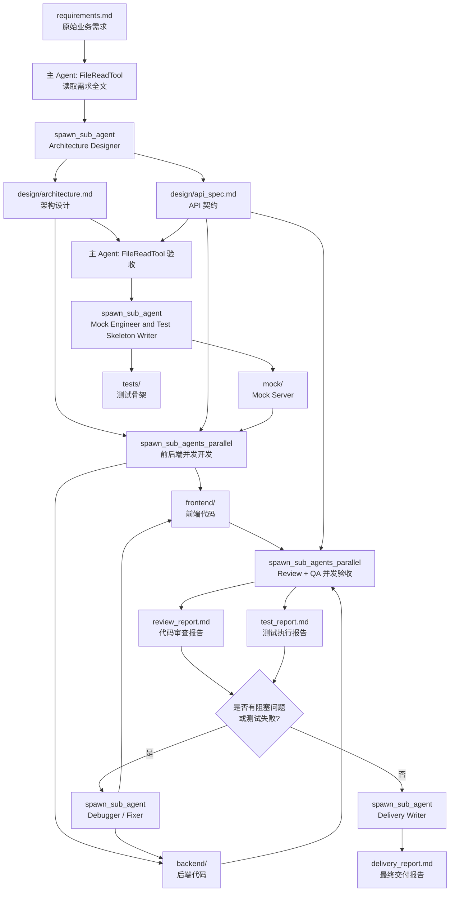

# m4l23 Orchestrator 数据流与设计实现分析

本文分析上层代码目录：

```text
../crewai_mas_demo/m4l23/
```

主入口文件：

```text
../crewai_mas_demo/m4l23/m4l23_orchestrator.py
```

目标：解释它如何实现当前 `notes.md` 中的 Orchestrator 核心要点，并把“每个阶段的数据是什么、从哪里来、传给谁、写到哪里、由哪段代码负责”串起来。

---

## 1. 一句话总览

这个实现不是把软件开发流程写死成 Python 里的固定步骤，而是：

1. Python 代码只提供基础设施：主 Agent、spawn 工具、并发工具、文件读写工具、路径修复、LLM 工厂。
2. SOP 文件定义流程规则：什么时候串行、什么时候并发、每个阶段要产出什么。
3. 主 Agent 运行时读取需求和 SOP，自行决定创建什么子 Agent、传什么 `context`、给什么工具、让它写到哪个 `output_file`。
4. 子 Agent 只拿到被显式传入的上下文，在独立 Crew 中执行，把结果写成文件。
5. 主 Agent 只接收文件路径，再用 `FileReadTool` 验收文件内容，合格后进入下一阶段。

这正好对应 notes 里的三个关键设计：

- **Task 对象精准传参**：通过 `role / goal / task / context / tool_names / output_file` 描述子任务。
- **子 Crew 完全隔离**：每次 `_run_one_sub_crew()` 都创建新的 `Agent / Task / Crew`。
- **结果传路径，不传内容**：子任务输出写入文件，spawn 工具返回路径字符串或路径结果 JSON。

---

## 2. 核心文件与职责

| 文件 | 职责 |
| --- | --- |
| `m4l23_orchestrator.py` | 主入口。定义 Orchestrator、spawn 工具、并发工具、文件读写工具、路径解析、运行入口。 |
| `../skills/software-dev-sop/SKILL.md` | SOP as Skill。定义 6 个交付阶段、串并行规则、产物清单、失败重试原则。 |
| `workspace/requirements.md` | 用户需求输入。员工休假记录管理系统需求。 |
| `workspace/design/architecture.md` | 阶段 1 产物：架构设计。 |
| `workspace/design/api_spec.md` | 阶段 1 产物：API 契约，下游 mock、前端、后端都依赖它。 |
| `workspace/mock/`、`workspace/tests/` | 阶段 2 产物：mock server 和测试骨架。 |
| `test_orchestrator.py` | 单元测试。验证 spawn、并发、SOP 注入、上下文隔离、异常捕获等机制。 |

---

## 3. 入口启动：从 Python 进程到主 Crew

### 3.1 常量确定数据边界

代码位置：`m4l23_orchestrator.py:31-42`

```python
_HERE = Path(__file__).resolve().parent
_PROJECT_ROOT = _HERE.parent

WORKSPACE_DIR = _HERE / "workspace"
SKILL_PATH = _PROJECT_ROOT / "skills" / "software-dev-sop" / "SKILL.md"
REQUIREMENTS_FILE = WORKSPACE_DIR / "requirements.md"
```

这三个路径决定了整个系统的数据边界：

| 变量 | 实际含义 | 数据角色 |
| --- | --- | --- |
| `WORKSPACE_DIR` | `m4l23/workspace` | 所有阶段产物的落盘根目录 |
| `SKILL_PATH` | `skills/software-dev-sop/SKILL.md` | 主 Agent 的流程说明书 |
| `REQUIREMENTS_FILE` | `workspace/requirements.md` | 整个项目的原始输入 |

### 3.2 `run()` 创建主 Crew

代码位置：`m4l23_orchestrator.py:464-492`

数据流：

```text
python3 m4l23_orchestrator.py
        |
        v
run()
        |
        |-- 设置 CREWAI_TESTING，避免 CrewAI 首次运行交互阻塞
        |-- 确保 WORKSPACE_DIR 存在
        |-- 检查 requirements.md 是否存在
        v
build_orchestrator()
        |
        v
Crew(agents=[orchestrator], tasks=[main_task]).kickoff()
```

此时真正开始工作的不是某个固定函数流程，而是 CrewAI 驱动的主 Agent。Python 只把“需求文档路径 + SOP + 工具能力”交给它。

---

## 4. 主 Agent 的输入长什么样

主 Agent 的输入由三部分组成。

### 4.1 主 Agent 的身份与行为约束

代码位置：`m4l23_orchestrator.py:402-429`

关键约束：

- 主 Agent 是 `Software Development Orchestrator`。
- 目标是“协调子 Agent 完成设计、实现、测试与交付”。
- 明确写了“你只做拆解、派单、验收与策略性重试，不执笔任何文档或代码”。
- 工具只有三个：`spawn_sub_agent`、`spawn_sub_agents_parallel`、`FileReadTool`。

这就是 notes 中“主 Agent 没有写工具”的落地实现。主 Agent 的 `tools` 是：

```python
tools=[SpawnSubAgentTool(), SpawnParallelTool(), FileReadTool()]
```

也就是说，主 Agent 本身不能调用 `FileWriterTool`，不能直接写业务代码或交付文档。它想产生任何文件，都必须派子 Agent。

### 4.2 SOP 注入 backstory

代码位置：

- `load_sop_skill()`：`m4l23_orchestrator.py:388-392`
- 注入位置：`m4l23_orchestrator.py:409-428`

数据形态：

```text
sop_content = SKILL.md 全文字符串

orchestrator.backstory =
  固定的工作方式说明
  + 工具说明
  + "━━━ SOP 流程（必须遵守）━━━"
  + sop_content
```

这就是 notes 里的 **SOP as Skill**：

- Python 不硬编码阶段 1、2、3、4、5、6 的执行函数。
- 阶段规则写在 `SKILL.md`。
- 主 Agent 读到 SOP 后，在 LLM 推理中决定下一步 spawn 参数。

### 4.3 main_task 把总任务交给主 Agent

代码位置：`m4l23_orchestrator.py:434-455`

`main_task.description` 给主 Agent 的输入大意是：

```text
读取需求文档 requirements.md，按照 SOP 完成完整交付。

阶段 1：spawn 子 Agent 产出 architecture.md 和 api_spec.md，然后读取验收。
阶段 2-5：mock/单测 -> 前后端开发 -> 代码审查+测试 -> 修复循环。
阶段 6：spawn 子 Agent 写 delivery_report.md，仅路径引用。

约束：
- 一次性做完整个 SOP。
- 不向用户提问。
- spawn 子 Agent 时显式传完整上下文。
- 子 Agent 完成后必须读取输出文件确认内容。
```

所以主 Agent 第一次拿到的数据是：

```text
输入：
  requirements.md 的路径
  SOP 的完整文本
  可用工具：
    - spawn_sub_agent
    - spawn_sub_agents_parallel
    - FileReadTool

输出期望：
  workspace/delivery_report.md 的绝对路径
```

---

## 5. 子任务的数据结构：Orchestrator 的最小工作单元

无论串行还是并发，子 Agent 的任务数据都长这样。

代码位置：`_SpawnSingleInput`，`m4l23_orchestrator.py:277-289`

```python
{
    "role": "子 Agent 的角色名",
    "goal": "子 Agent 的目标",
    "task": "详细任务描述",
    "context": "子 Agent 需要的完整上下文",
    "tool_names": "FileReadTool, FileWriterTool, BashTool",
    "output_file": "结果写入的文件路径"
}
```

每个字段的意义：

| 字段 | 是什么 | 数据流作用 |
| --- | --- | --- |
| `role` | 运行时动态创建的角色 | 让子 Agent 进入某个专业身份，比如架构师、前端开发、QA |
| `goal` | 一句话目标 | 控制子 Agent 的任务方向 |
| `task` | 详细任务说明 | 告诉子 Agent 具体要做什么、产出格式是什么 |
| `context` | 显式上下文 | 替代共享记忆；只传当前子任务需要的信息 |
| `tool_names` | 工具名字符串 | 从工具池里挑工具，限制子 Agent 能力 |
| `output_file` | 产物路径 | 子 Agent 写文件的位置，也是返回给主 Agent 的路径 |

这就是 notes 中“以 Task 为视角，而不是以 Agent 为视角”的具体数据结构。

---

## 6. 工具池：子 Agent 的能力不是固定拥有，而是按任务领取

代码位置：`m4l23_orchestrator.py:216-220`

```python
TOOL_REGISTRY = {
    "FileReadTool": WorkspaceFileReadTool(),
    "FileWriterTool": WorkspaceFileWriterTool(),
    "BashTool": BashTool(),
}
```

子 Agent 并不是天然拥有所有工具。主 Agent 在 spawn 时传：

```text
tool_names="FileWriterTool"
```

或者：

```text
tool_names="FileReadTool,BashTool"
```

然后 `_run_one_sub_crew()` 里按名称从 `TOOL_REGISTRY` 取工具。

代码位置：`m4l23_orchestrator.py:242-247`

```python
tools = [
    TOOL_REGISTRY[t.strip()]
    for t in tool_names.split(",")
    if t.strip() in TOOL_REGISTRY
]
```

这带来两个效果：

- 主 Agent 可以为不同任务分配不同能力。
- 未知工具名会被静默过滤，避免因为 LLM 写错工具名导致系统崩溃。

测试覆盖：`test_orchestrator.py` 的 T3 验证未知工具名会被过滤。

---

## 7. 子 Agent 如何被真正创建：上下文隔离的关键

核心函数：`_run_one_sub_crew()`

代码位置：`m4l23_orchestrator.py:228-270`

数据流：

```text
spawn 参数
  role
  goal
  task
  context
  tool_names
  output_file
        |
        v
_run_one_sub_crew()
        |
        |-- 根据 tool_names 从 TOOL_REGISTRY 取工具
        |-- 解析 output_file，确保父目录存在
        |-- 创建全新的 Agent(role, goal, backstory=context, tools=tools)
        |-- 创建全新的 Task(description=task, expected_output=..., output_file=...)
        |-- 创建全新的 Crew(agents=[agent], tasks=[task_obj])
        |-- kickoff()
        v
返回 output_path 字符串
```

最重要的几行：

```python
agent = Agent(
    role=role,
    goal=goal,
    backstory=context,
    tools=tools,
    llm=_llm_for_sub_agent(role),
)

task_obj = Task(
    description=task,
    expected_output=f"将结果写入 {output_path}，返回该文件的绝对路径字符串",
    agent=agent,
    output_file=str(output_path),
)

Crew(agents=[agent], tasks=[task_obj], verbose=True).kickoff()
return str(output_path)
```

这里有几个关键点：

1. `backstory=context`：子 Agent 只知道主 Agent 显式传给它的上下文。
2. 每次都会新建 `Agent / Task / Crew`：没有共享历史，没有共享中间推理。
3. `output_file=str(output_path)`：CrewAI 会把任务产物落盘。
4. 返回值只有路径字符串：主 Agent 收到的不是文件内容，而是文件位置。

这就是 notes 中“真正隔离沙箱”和“文件路径回传”的实现。

---

## 8. 串行 spawn 的数据流

工具：`SpawnSubAgentTool`

代码位置：`m4l23_orchestrator.py:292-322`

数据形态：

```python
spawn_sub_agent(
    role="Architecture Designer",
    goal="完成系统架构和 API 契约设计",
    task="写 architecture.md 和 api_spec.md ...",
    context="requirements.md 的完整内容",
    tool_names="FileWriterTool",
    output_file="design/architecture.md",
)
```

流转过程：

```text
主 Agent
  |
  | 调用 spawn_sub_agent，传入一个子任务对象
  v
SpawnSubAgentTool._run()
  |
  | 打印启动日志
  | 调用 _run_one_sub_crew(...)
  v
独立 Sub-Crew
  |
  | 写 output_file
  v
返回 output_file 的绝对路径
  |
  v
主 Agent 用 FileReadTool 读取并验收
```

适用阶段：

- 阶段 1：架构和 API 设计，因为所有后续任务依赖 API 契约。
- 阶段 2：mock 和测试骨架，因为前后端开发依赖 mock / tests。
- 阶段 5：修复循环，因为修复通常依赖上一步报告和定位结论。
- 阶段 6：交付报告，因为要汇总前面所有路径和验收结论。

---

## 9. 并发 spawn 的数据流

工具：`SpawnParallelTool`

代码位置：`m4l23_orchestrator.py:340-381`

输入不是单个对象，而是 JSON 数组字符串。

数据形态：

```json
[
  {
    "role": "Frontend Developer",
    "goal": "实现前端 CRUD 页面",
    "task": "根据 API 规范实现页面...",
    "context": "architecture.md 内容 + api_spec.md 内容 + mock 目录路径",
    "tool_names": "FileWriterTool",
    "output_file": "frontend/index.html"
  },
  {
    "role": "Backend Developer",
    "goal": "实现 FastAPI 后端接口",
    "task": "根据 API 规范实现 RESTful 接口...",
    "context": "architecture.md 内容 + api_spec.md 内容",
    "tool_names": "FileWriterTool,BashTool",
    "output_file": "backend/main.py"
  }
]
```

流转过程：

```text
主 Agent
  |
  | 调用 spawn_sub_agents_parallel(subtasks_json)
  v
SpawnParallelTool._run()
  |
  | json.loads(subtasks_json)
  | ThreadPoolExecutor(max_workers=len(subtasks))
  | 每个 subtask submit 到 _run_one_sub_crew()
  v
多个独立 Sub-Crew 同时运行
  |
  | 谁先完成，as_completed 就先收谁
  | 成功：results[output_file] = 绝对路径
  | 失败：results[output_file] = "error: ..."
  v
返回 JSON 字符串
```

返回数据形态：

```json
{
  "frontend/index.html": "/absolute/path/to/workspace/frontend/index.html",
  "backend/main.py": "/absolute/path/to/workspace/backend/main.py"
}
```

如果某个任务失败：

```json
{
  "frontend/index.html": "/absolute/path/to/workspace/frontend/index.html",
  "backend/main.py": "error: some exception"
}
```

这对应 notes 里的“并发执行解决性能瓶颈”。代码中用 `ThreadPoolExecutor` 实现，同一个并发批次里的子任务互相不知道对方的上下文。

测试覆盖：

- T2：并发 wall time 小于串行时间。
- T4：子任务异常会被捕获成 error 字符串。
- T5：一个并发任务失败不影响另一个成功任务。
- T8：并发任务的 `role/context/output_file` 不同，验证上下文隔离。

---

## 10. 文件读写与路径修复：让文件成为 Agent 间的数据总线

### 10.1 Writer：把内容写入 workspace

代码位置：`WorkspaceFileWriterTool`，`m4l23_orchestrator.py:147-190`

子 Agent 使用 `FileWriterTool` 时，输入数据大致是：

```python
{
    "filename": "api_spec.md",
    "directory": "design",
    "overwrite": True,
    "content": "# API Specification\n..."
}
```

内部会被解析成：

```text
WORKSPACE_DIR / "design" / "api_spec.md"
```

然后写入磁盘。

### 10.2 Reader：主 Agent 或子 Agent 按需读取文件

代码位置：`WorkspaceFileReadTool`，`m4l23_orchestrator.py:193-208`

输入数据：

```python
{
    "file_path": "design/api_spec.md",
    "start_line": 1,
    "line_count": None
}
```

内部先调用 `_resolve_workspace_path()` 修正路径，再交给 CrewAI 的 `FileReadTool`。

### 10.3 路径修复规则

代码位置：`m4l23_orchestrator.py:97-140`

它主要防御 LLM 常见的路径误写：

| LLM 可能给出的路径 | 问题 | 修复策略 |
| --- | --- | --- |
| `workspace/design/api_spec.md` | 当前 cwd 已经是 workspace，容易写成 `workspace/workspace/design/...` | 去掉开头的 `workspace/` |
| `Users/xiao/...` | 没有 `/`，会被当成相对路径 | 补成 `/Users/xiao/...` |
| `/.../workspace/workspace/...` | 历史产物里已经出现重复 workspace | 折叠成单层 workspace |

这部分是工程实现里非常实用的一层“防幻觉护栏”。

当前磁盘上确实能看到一个历史嵌套目录：

```text
../crewai_mas_demo/m4l23/workspace/workspace/
```

说明这个路径问题是实际发生过的，所以代码后来加了 `_collapse_double_workspace_segment()` 和 `_resolve_workspace_path()` 来兜底。

---

## 11. SOP 阶段数据流全景

下面把 SOP 的 6 个阶段按数据流展开。

### 阶段 0：原始输入

数据来源：

```text
workspace/requirements.md
```

当前文件内容要点：

```text
系统：员工休假记录管理系统
数据字段：id、employee_id、employee_name、leave_type、start_date、end_date、days、apply_time、status、approver、reason
功能：列表筛选、新建、编辑、删除、审批
技术：原生 HTML + JS、FastAPI、内存 Dict、RESTful JSON API
验收：前端可用、后端符合 api_spec、接口测试通过、交付物包含项目结构说明
```

主 Agent 拿到的是需求文档路径。根据 main task 要求，它需要用 `FileReadTool` 读取完整需求，再把需求内容放入阶段 1 子 Agent 的 `context`。

### 阶段 1：需求 -> 架构设计 + API 契约

SOP 位置：`SKILL.md:99-115`

串行原因：

```text
architecture.md 和 api_spec.md 是后续所有任务的共同契约。
契约未确定前，mock、前端、后端不能并发，否则会接口不一致。
```

spawn 数据形态：

```python
{
    "role": "Architecture Designer",
    "goal": "根据需求设计系统架构和 RESTful API 契约",
    "task": (
        "写 workspace/design/architecture.md：模块、技术栈、目录结构。\n"
        "写 workspace/design/api_spec.md：路径、方法、请求体、响应体、错误码。"
    ),
    "context": "<requirements.md 的完整内容>",
    "tool_names": "FileWriterTool",
    "output_file": "design/architecture.md"
}
```

子 Agent 输入：

```text
requirements.md 全文
```

子 Agent 输出：

```text
workspace/design/architecture.md
workspace/design/api_spec.md
```

主 Agent 回收的数据：

```text
spawn_sub_agent 返回 architecture.md 的绝对路径
然后主 Agent 用 FileReadTool 分别读取：
  design/architecture.md
  design/api_spec.md
```

当前磁盘上的实际阶段 1 产物：

- `workspace/design/architecture.md`
- `workspace/design/api_spec.md`

其中 `api_spec.md` 已经把字段枚举从中文需求转成了接口层枚举，例如：

```text
leave_type:
  annual_leave / sick_leave / personal_leave / ...

status:
  pending / approved / rejected
```

这一步的数据变形是：

```text
业务需求语言
  -> 系统模块与目录结构
  -> REST API 契约
  -> 后续开发共享协议
```

### 阶段 2：API 契约 -> Mock Server + 测试骨架

SOP 位置：`SKILL.md:119-132`

串行原因：

```text
前端需要 mock 进行联调。
后端需要测试骨架验证接口。
所以 mock/tests 必须先于前后端开发完成。
```

spawn 数据形态：

```python
{
    "role": "Mock Engineer and Test Skeleton Writer",
    "goal": "根据 API 规范创建 mock server 和每个接口的 happy path 测试",
    "task": (
        "创建接口 mock server。\n"
        "为每个接口写至少 1 条单测骨架。"
    ),
    "context": "<api_spec.md 的完整内容>",
    "tool_names": "FileWriterTool",
    "output_file": "mock/mock_server.py"
}
```

子 Agent 输入：

```text
api_spec.md 全文
```

子 Agent 输出：

```text
workspace/mock/
workspace/tests/
```

当前磁盘上的实际阶段 2 产物包括：

```text
workspace/mock/server.py
workspace/mock/mock_server.py
workspace/tests/test_api.py
workspace/tests/test_mock_server.py
```

这里也能看到一个非常典型的数据契约分叉：

- `api_spec.md` 采用英文枚举：`annual_leave`、`pending`、`PATCH /leaves/{id}/status`
- `workspace/mock/server.py` 和 `workspace/tests/test_api.py` 采用中文枚举：`年假`、`待审批`、`PATCH /leaves/{id}/approve`

这说明实际产物并不完全一致。按照 SOP，主 Agent 应该在阶段 4 的 Code Review / QA 中发现这种接口契约偏差，并进入修复循环。

这也正好说明 Orchestrator 为什么需要“独立验收”：子 Agent 产出了文件，不代表契约一定正确。

### 阶段 3：共享契约 -> 前端和后端并发开发

SOP 位置：`SKILL.md:136-158`

并发原因：

```text
前端和后端都依赖 architecture.md + api_spec.md + mock。
但前端不依赖后端开发结果，后端也不依赖前端开发结果。
只要输出目录不重叠，就可以并发。
```

并发输入数据形态：

```json
[
  {
    "role": "Frontend Developer",
    "goal": "实现原生 HTML + JavaScript 的员工休假 CRUD 页面",
    "task": "实现列表、筛选、新建、编辑、删除、审批状态变更，并调用 mock/API。",
    "context": "<architecture.md 内容>\n<api_spec.md 内容>\nmock 目录路径: workspace/mock/",
    "tool_names": "FileWriterTool",
    "output_file": "frontend/index.html"
  },
  {
    "role": "Backend Developer",
    "goal": "实现 FastAPI 后端接口",
    "task": "实现 api_spec.md 中定义的全部 RESTful JSON API。",
    "context": "<architecture.md 内容>\n<api_spec.md 内容>",
    "tool_names": "FileWriterTool,BashTool",
    "output_file": "backend/main.py"
  }
]
```

并发工具返回数据形态：

```json
{
  "frontend/index.html": "/.../workspace/frontend/index.html",
  "backend/main.py": "/.../workspace/backend/main.py"
}
```

当前磁盘状态：

```text
workspace/frontend/ 不存在
workspace/backend/ 不存在
```

也就是说，当前已落盘产物并没有完整走到阶段 3 的最终结果。代码设计支持这一步，但现有 workspace 快照只保留了部分执行痕迹。

### 阶段 4：前后端产物 -> Review 报告 + Test 报告

SOP 位置：`SKILL.md:162-181`

并发原因：

```text
Code Reviewer 只读代码和规范。
QA Engineer 运行测试和命令。
二者都依赖 D/E 产物，但互相不依赖。
```

并发输入数据形态：

```json
[
  {
    "role": "Code Reviewer",
    "goal": "审查前后端代码是否符合 API 契约",
    "task": "检查接口路径、字段、状态码、业务规则、安全问题，输出阻塞/建议问题清单。",
    "context": "<architecture.md + api_spec.md + 前后端代码文件路径列表>",
    "tool_names": "FileReadTool",
    "output_file": "review_report.md"
  },
  {
    "role": "QA Engineer",
    "goal": "运行测试并输出测试报告",
    "task": "运行所有 pytest，记录通过/失败/跳过数量和失败原因。",
    "context": "测试文件路径 + 后端代码路径 + 启动命令",
    "tool_names": "BashTool,FileReadTool",
    "output_file": "test_report.md"
  }
]
```

当前磁盘状态：

```text
workspace/review_report.md 不存在
workspace/test_report.md 不存在
```

如果阶段 3 缺失，阶段 4 自然无法形成合格产物。

### 阶段 5：Review/Test 报告 -> 修复循环

SOP 位置：`SKILL.md:185-202`

输入数据：

```text
review_report.md
test_report.md
相关代码路径
主 Agent 自己写出的失败分类和根因假设
```

修复类 spawn 的数据形态：

```python
{
    "role": "Debugger",
    "goal": "修复测试失败或契约不一致问题",
    "task": "根据失败报告和根因假设修复指定文件，然后说明改动。",
    "context": (
        "失败摘要：...\n"
        "失败类型：接口契约 / 导入路径 / 测试写法 / 业务逻辑\n"
        "主 Agent 根因假设：...\n"
        "建议先验证：...\n"
        "相关文件内容或路径：..."
    ),
    "tool_names": "FileReadTool,FileWriterTool,BashTool",
    "output_file": "backend/main.py"
}
```

关键点：

- 主 Agent 不应该无脑重试。
- 每次修复 context 要递增：包含上一轮尝试、为何失败、本轮新假设。
- SOP 写了最多重试 2 次。

注意：最多重试 2 次目前主要是 SOP / prompt 约束，不是 Python 层硬计数器。Python 代码有 `BashTool` 的 60 秒超时，但没有在代码层实现全局 token 预算或 retry counter。

### 阶段 6：所有路径与验收结论 -> 交付报告

SOP 位置：`SKILL.md:206-218`

spawn 数据形态：

```python
{
    "role": "Delivery Writer",
    "goal": "生成最终交付报告",
    "task": "写 delivery_report.md，仅引用文件路径，不复制代码。",
    "context": (
        "需求摘要：...\n"
        "中间产物路径：architecture.md, api_spec.md, mock/, tests/, frontend/, backend/, review_report.md, test_report.md\n"
        "验收结论：..."
    ),
    "tool_names": "FileWriterTool",
    "output_file": "delivery_report.md"
}
```

交付报告应该只包含路径引用，而不是复制大段代码。这对应 notes 里的“结果传路径，不传内容”。

当前磁盘上的交付报告位于：

```text
workspace/workspace/delivery_report.md
```

它只包含路径清单：

```text
A. Architecture documentation: architecture.md
B. API specification: api_spec.md
C. Mock data and tests: mock/ and tests/
D. Frontend code: frontend/
E. Backend code: backend/
F. Review report: review_report.md
G. Test report: test_report.md
H. This delivery report: delivery_report.md
```

但这份报告在嵌套的 `workspace/workspace/` 下，且当前实际磁盘没有 `frontend/`、`backend/`、`review_report.md`、`test_report.md`。所以它更像一次历史运行的未完全合格产物，而不是严格通过 SOP 验收后的最终交付。

---

## 12. 完整数据流图



---

## 13. notes 核心要点与代码对应关系

| notes 核心要点 | 代码实现 | 说明 |
| --- | --- | --- |
| 主 Agent 负责调度，子 Agent 负责执行 | `build_orchestrator()` 中主 Agent 只有 spawn 和 read 工具 | 主 Agent 不能写文件，只能派单和验收。 |
| 以 Task 为视角动态创建子 Agent | `_SpawnSingleInput` 定义 `role/goal/task/context/tool_names/output_file` | 角色不是预定义类，而是主 Agent 运行时传字符串。 |
| 子 Agent 独立上下文 | `_run_one_sub_crew()` 每次新建 `Agent / Task / Crew` | `backstory=context`，只知道显式传入信息。 |
| 工具按任务分配 | `TOOL_REGISTRY` + `tool_names` 过滤 | 子 Agent 只拿被分配的工具。 |
| 文件路径回传 | `Task(output_file=...)` + `_run_one_sub_crew()` 返回路径 | 主 Agent 收到路径，再读取文件验收。 |
| 串行任务 | `SpawnSubAgentTool._run()` | 等单个子 Crew 完成后返回。 |
| 并发任务 | `SpawnParallelTool._run()` + `ThreadPoolExecutor` | 多个 `_run_one_sub_crew()` 同时运行。 |
| SOP as Skill | `load_sop_skill()` 读取 `SKILL.md` 并注入 backstory | 流程规则不写死在 Python 控制流里。 |
| 验收与 retry | SOP 阶段 4/5 + 主 Agent backstory 失败处理约束 | 主要由 prompt/SOP 驱动，Python 层提供 spawn/read/bash 能力。 |
| 路径防御 | `_resolve_workspace_path()`、`_collapse_double_workspace_segment()` | 防止 LLM 写出 `workspace/workspace` 或 `Users/...` 假路径。 |

---

## 14. 当前代码设计中的几个重要边界

### 14.1 “流程控制”主要在 LLM + SOP，不在 Python if/else

代码里没有这样的固定流程：

```python
design()
mock()
parallel(frontend, backend)
parallel(review, qa)
fix()
deliver()
```

真正的阶段推进由主 Agent 读 SOP 后自主调用工具完成。这是教学重点：Orchestrator 不是静态 workflow，而是运行时决策器。

### 14.2 “只传路径”不是绝对不传内容

SOP 的上下文规则更精确：

- 子 Agent 需要理解内容时，传完整内容，例如阶段 1 传 `requirements.md` 全文，阶段 2 传 `api_spec.md` 全文。
- 子 Agent 只需要定位产物时，传路径，例如 mock 目录路径、代码文件路径列表。
- 子 Agent 的输出不直接塞回主 Agent 上下文，而是写文件，主 Agent 按需读取。

所以更准确的说法是：

```text
输入上下文：必要时传内容。
输出结果：优先传路径。
跨阶段共享：通过文件系统。
```

### 14.3 可靠性机制一部分在代码，一部分在 SOP

代码层已经实现：

- Bash 命令 60 秒超时。
- 并发任务异常捕获，不影响其他任务。
- 工具名过滤。
- 路径修复。
- 主 Agent 没有写工具。

SOP 层约束：

- 最多重试 2 次。
- 失败先分类，再派 Debugger / QA。
- 不允许同一失败模式无脑重复 spawn。
- 交付报告只引用路径。

尚未在 Python 层硬实现：

- 全局 token 预算。
- 全局最大迭代次数。
- 每阶段 retry counter。
- 对交付报告中路径是否真实存在的强校验。

这意味着这份代码是一个“教学版 Orchestrator 架构骨架”：核心范式清晰，但生产级 guardrail 还可以继续下沉到代码层。

---

## 15. 用一个具体例子串起来

假设主 Agent 要完成阶段 1。

### 15.1 主 Agent 先读需求

输入：

```text
file_path = "workspace/requirements.md"
```

读到内容：

```text
开发员工休假记录管理系统：
- 字段：employee_id、employee_name、leave_type、start_date、end_date...
- 功能：列表、新建、编辑、删除、审批
- 技术：HTML + JS、FastAPI、Dict
```

### 15.2 主 Agent 构造子任务

生成的 spawn 参数可能是：

```python
role = "Architecture Designer"
goal = "为员工休假系统设计架构和 API 规范"
task = "写 design/architecture.md 和 design/api_spec.md ..."
context = "<requirements.md 全文>"
tool_names = "FileWriterTool"
output_file = "design/architecture.md"
```

你提到的这个例子我没理解，
role = "Architecture Designer"
goal = "为员工休假系统设计架构和 API 规范"
task = "写 design/architecture.md 和 design/api_spec.md ..."
context = "<requirements.md 全文>"
tool_names = "FileWriterTool"
output_file = "design/architecture.md"
为什么这里task让它写design/architecture.md 和 design/api_spec.md ， 但是output_file只有一个design/architecture.mddesign/architecture.md，不应该是输出应该都要包含 design/architecture.md 和 design/api_spec.md吗 ？？？

-- 你的疑问是对的，而且正好戳到这个实现里一个容易混淆的点：

`output_file` 不是“这个子 Agent 只能写这一个文件”，而是 **CrewAI 这个 Task 的主输出文件 / 返回路径锚点**。

在这个例子里：

```python
task = "写 design/architecture.md 和 design/api_spec.md ..."
output_file = "design/architecture.md"
```

含义其实是：

- `task`：告诉子 Agent 实际要完成两份产物：
  - `design/architecture.md`
  - `design/api_spec.md`
- `tool_names = "FileWriterTool"`：给子 Agent 写文件工具，所以它可以在执行过程中调用工具写多个文件。
- `output_file = "design/architecture.md"`：告诉 CrewAI 这个 Task 的“主输出”落到哪里，并让 spawn 工具最后返回这个主路径。

也就是说，`api_spec.md` 是靠 `task` 明确要求 + `FileWriterTool` 写出来的，不是靠 `output_file` 自动声明出来的。

更准确的数据形态应该写成这样：

```python
role = "Architecture Designer"
goal = "为员工休假系统设计架构和 API 规范"
task = """
根据 requirements.md 内容完成两份文件：

1. 写入 design/architecture.md
   内容包括：模块划分、技术栈、目录结构、数据流说明。

2. 写入 design/api_spec.md
   内容包括：接口路径、HTTP 方法、请求体、响应体、错误码。

完成后返回 design/architecture.md 的绝对路径。
"""
context = "<requirements.md 全文>"
tool_names = "FileWriterTool"
output_file = "design/architecture.md"
```

为什么不把 `output_file` 写成两个？因为这段代码的 `_run_one_sub_crew()` 只支持一个 `output_file` 参数：

```python
task_obj = Task(
    description=task,
    expected_output=f"将结果写入 {output_path}，返回该文件的绝对路径字符串",
    agent=agent,
    output_file=str(output_path),
)
```

所以它只能给 CrewAI Task 一个主输出文件。多文件产出要通过 `task` 描述和 `FileWriterTool` 完成。

但从工程设计上，你的直觉更严谨：如果一个阶段有两个必须产物，最好把它显式表达出来。比如改成：

```python
output_file = "design/architecture.md"
required_outputs = [
    "design/architecture.md",
    "design/api_spec.md",
]
```

或者拆成两个串行子任务：

```text
Architecture Designer -> design/architecture.md
API Designer -> design/api_spec.md
```

当前课程代码选择“一次 spawn 写两个文件，一个主 output_file 回传”，是为了演示简单；但它确实依赖 prompt/SOP 约束，稳健性不如“多个必需输出显式建模”。

### 15.3 子 Agent 独立执行

`_run_one_sub_crew()` 创建：

```python
Agent(
    role="Architecture Designer",
    goal="为员工休假系统设计架构和 API 规范",
    backstory="<requirements.md 全文>",
    tools=[WorkspaceFileWriterTool()],
)
```

然后创建：

```python
Task(
    description="写 design/architecture.md 和 design/api_spec.md ...",
    expected_output="将结果写入 /.../workspace/design/architecture.md，返回该文件的绝对路径字符串",
    output_file="/.../workspace/design/architecture.md",
)
```

### 15.4 子 Agent 写文件

产物：

```text
workspace/design/architecture.md
workspace/design/api_spec.md
```

### 15.5 主 Agent 只拿回路径

返回：

```text
/.../m4l23/workspace/design/architecture.md
```

主 Agent 再用 `FileReadTool` 读取：

```text
design/architecture.md
design/api_spec.md
```

验收通过后，阶段 1 的输出就变成阶段 2 的输入：

```text
api_spec.md 全文 -> Mock Engineer and Test Skeleton Writer 的 context
```

这就是完整的数据流转闭环。

---

## 16. 你应该抓住的设计主线

这份代码最值得学习的不是某个工具类，而是四层分工：

1. **Python 层：提供执行原语**
   - spawn 单个子 Agent
   - 并发 spawn 多个子 Agent
   - 读文件
   - 写文件
   - 跑命令
   - 修复路径

2. **SOP 层：定义流程策略**
   - 哪些阶段必须串行
   - 哪些阶段可以并发
   - 每个阶段产物是什么
   - 失败后如何分类和重试

3. **主 Agent 层：动态决策**
   - 当前该进入哪个阶段
   - 该创建什么角色
   - 该传哪些上下文
   - 该验收哪些文件
   - 失败后该换什么策略

4. **子 Agent 层：专注执行**
   - 只看当前任务 context
   - 只用被分配的工具
   - 只写自己的 output_file 或指定目录
   - 不知道主 Agent 和其他子 Agent 的完整历史

如果用一句话概括：

> 这套实现把“复杂任务交付”拆成了由文件系统串起来的一组独立子任务；主 Agent 按 SOP 动态派发这些子任务，子 Agent 在隔离上下文里产出文件，主 Agent 再读取文件做验收和下一步决策。

