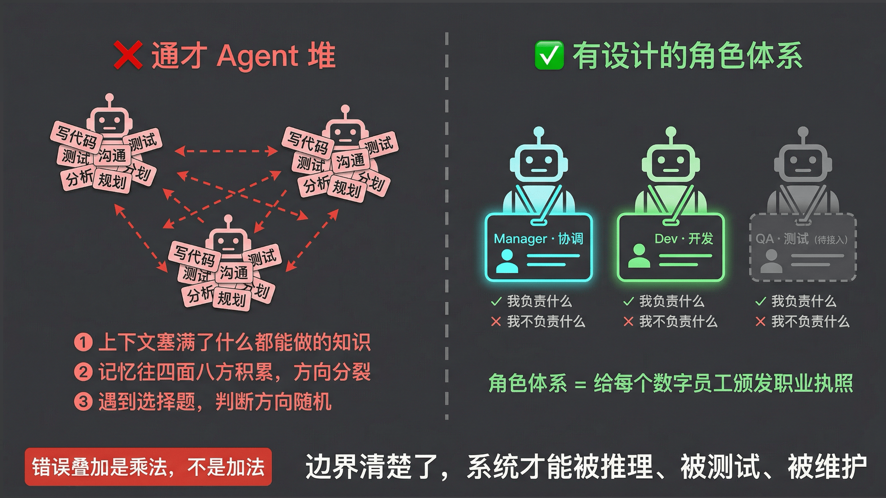
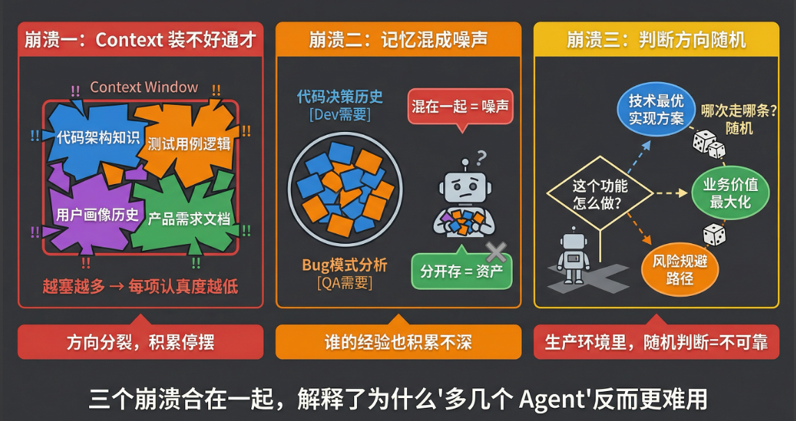
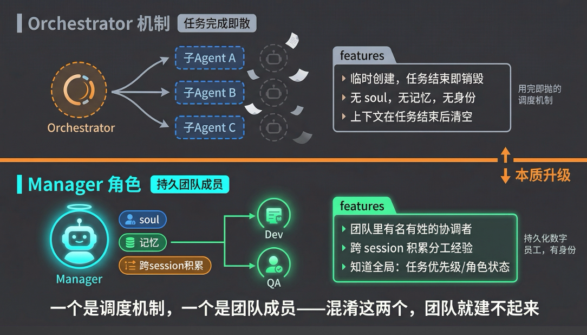
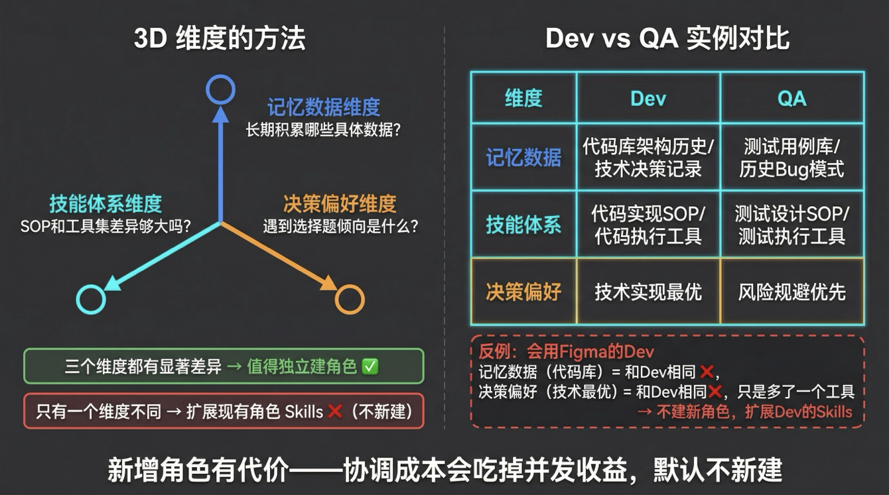
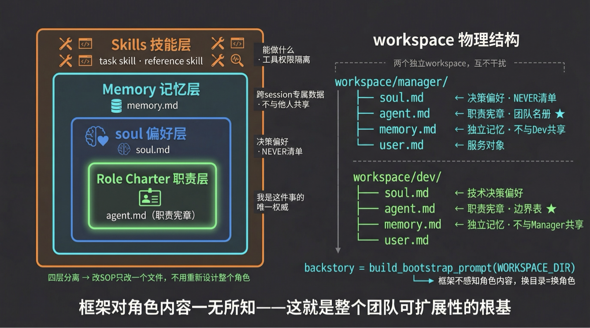
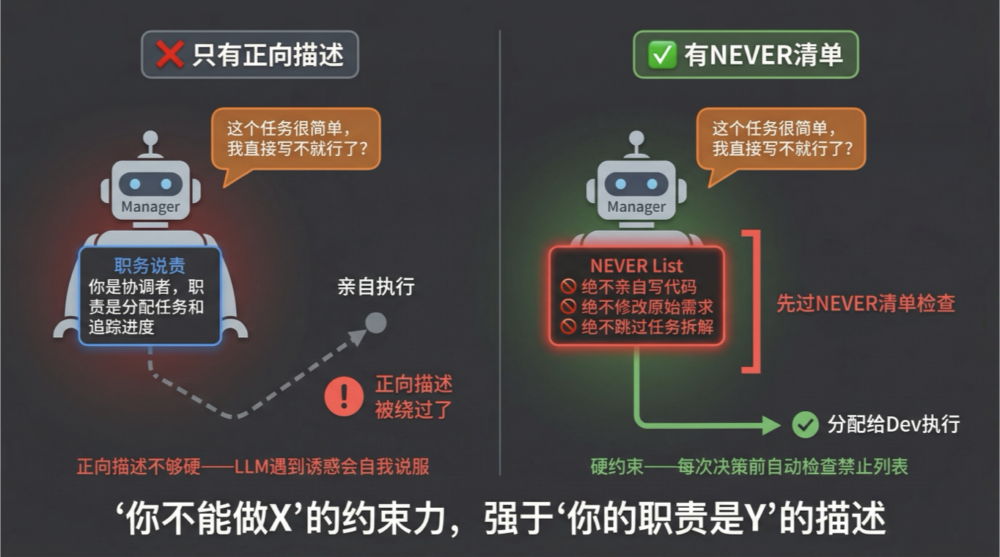
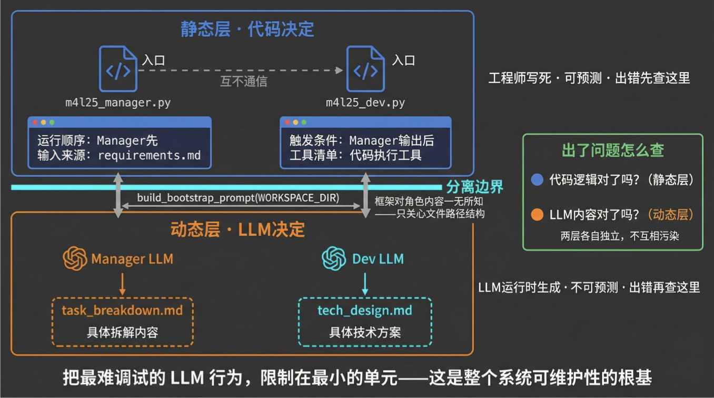

# 第 25 课：团队角色 - 基于角色的行动机构

## 开场：从单个数字员工到数字员工团队

上节课我们完成了一个重要的认知升级：数字员工不再只是会调工具的执行者，它有了自己的 **soul（决策偏好）**、**skill（技能体系）** 和 **memory（专属积累）**。有了这三件套，一个数字员工才算真正“活”起来。

但新的问题来了。

过去讨论多智能体时，我们更多考虑的是“怎么完成一个任务”：几个角色协作，把事情搞定。但现在 harness 技术成熟了，Agent 的自主性大幅提高，每个数字员工都是一个独立个体。那么，当你要建立一个数字员工团队时，应该用什么样的范式？

- 谁该存在？
- 谁该做什么？
- 当两个人都认为某件事该自己管时，谁来仲裁？

如果这些问题没想清楚，多几个 Agent 反而比一个更麻烦：错误在链路上不是加法放大，而是乘法放大。

本节课的核心问题只有两个：

1. **谁应该存在？**
2. **如何定义他？**

---

## 一、认知原点：角色体系的本质是什么？

角色体系的本质，就是给每个数字员工颁发一张“职业执照”：

- 明确他能做什么；
- 明确他不能做什么；
- 明确他积累的经验属于谁。

这和第一章做 backstory 时讲的“行为边界”是一回事。那时候给单个子 Agent 定义行为边界，是为了让它在任务链里不越位；现在给数字员工定义角色体系，是为了让整个团队运行时不起冲突。

只是规模从一个 Agent 变成了一个团队，边界设计的重要性不是降低了，而是更加凸显。

### 为什么角色边界更加重要？

过去是 **任务驱动**：

- 每个子任务有明确的 owner；
- Agent 做完后由你校验；
- 就算 Agent 之间有点差别，任务还是能跑。

现在是 **协作驱动**：

- 数字员工需要长时间运行；
- 它会接受各种不同请求；
- 如果职责、知识、记忆都差不多，任务分给谁都行，团队很快会进入混乱状态。

用职场类比来说：你加入一家公司，第一天 HR 会给你一份职位说明书（job description）。这不只是告诉你“你要做什么”，更重要的是告诉你：

- 这件事归你管；
- 那件事不归你管；
- 遇到跨边界问题该找谁。

角色体系，就是给数字员工团队里的每一个成员颁发这样一张清单。



---

## 二、为什么需要角色体系：通才模式的三个崩溃场景

在引入角色体系之前，很多团队的做法是：所有 Agent 都是同一个通才，什么都能做。

这个设计看起来灵活，实际上藏着三个必然崩溃的地方。



### 崩溃一：Context Window 装不好通才

一个什么都做的 Agent，需要在同一个上下文里装进：

- 代码库的架构知识；
- 测试用例库的分类逻辑；
- 用户画像的历史偏好；
- 各种 SOP 和工具调用方式。

即使用渐进式披露、skill 等方式优化，在复杂生产级任务里，通才的 skill 和 SOP 仍然会越来越多。越塞越多，每一个 skill 真正被调用的概率就越低，最终直接崩溃或停摆。

### 崩溃二：没有专属记忆，经验无法朝一个方向积累

记忆不只是“存信息”，而是“朝一个方向持续积累”。

例如：

- 研发需要记住代码结构、架构决策、技术债；
- 产品需要记住产品流程、线上方案、用户偏好；
- QA 需要记住测试用例、缺陷模式、风险点。

如果所有人的记忆混在一起，同一个任务今天由研发写单测，明天又变成 QA 写单测，那么 QA 在写单测时就无法稳定复用之前研发的决策经验。

没有统一标准的记忆，全是噪声。**混在一起是噪声，分开才是资产。**

### 崩溃三：没有专业化偏好，遇到选择题就乱

Agent 本身非常主观，也容易被引导。只要在 system prompt 或角色定义里多说几句，它后续的判断就可能朝那个方向偏移。这是大模型“迎合用户”的特质。

但不同角色的本能是不一样的：

| 角色 | 决策本能 |
| --- | --- |
| 研发 | 高效交付、技术最优 |
| QA | 规避风险、发现问题 |
| 产品 | 优化用户体验、对齐需求 |

如果是通才，它就会“神经分裂”：一会儿按研发视角想，一会儿按 QA 视角想，一会儿又按产品视角想，大概率想不好。

### 小结

这三个崩溃合在一起，解释了一件事：

> 通才列十个 Agent，可能不如只有三个、但分工非常鲜明的 Agent 好用。

---

## 三、从通才到有设计的团队：三步落地

回忆一下：上节课讲到数字员工的 **soul + skill + memory** 三件套，这三件套解决的是单个员工的能力问题。

今天要解决的是：这一群员工如何构成一个有边界的团队。

### 3.1 中心协调：从通才到分工的第一步

既然不做通才了，那决策分工该怎么分？

业界关于多 Agent 角色分工的探索，主要可以归纳为三种模式：

| 模式 | 特点 | 问题 |
| --- | --- | --- |
| 序列直传 | 角色固定，流程固定；产品 -> 研发 -> QA -> OP | 死板，自主性弱，应对不确定性差 |
| 松散团队 | 角色分工明确，但没有管理者 | N 个角色会形成 N x N 的交互网络，难管理 |
| 中心协调 | Manager 负责分配任务，成员只管执行 | 当前最稳定、最容易定位问题 |

#### 中心协调模式

中心协调模式中，有一个 **Manager（大管家）**，所有成员只管干活：

- 活由 Manager 分配；
- 成员之间不需要过多交流；
- 每个角色只跟 Manager 通信；
- 复杂度从 O(n²) 降低到 O(n)。

你可能已经不知不觉在用这个模式了：

1. 来了一个需求，你告诉产品；
2. 产品给方案后，你拿着方案去找研发；
3. 研发做完后，你再拿着项目和报告去找 QA；
4. 你自己负责把各个角色的产出串起来。

在这个流程里，你自己就是 Manager。自然的想法是：既然人能干这事，能不能用一个 Manager 角色把人替掉？

目前业界探索最多、最有效的就是这种中心协调模式。Claude Code 的 Team 模式有 Team Leader；GitHub 上 42k+ stars 的 agency-agents 框架也采用类似模式。

#### Manager 和 Orchestrator 的区别

你可能会想：这不就是第 23 课讲的 Orchestrator 模式吗？



不一样。

| 对象 | 本质 | 生命周期 | 是否积累经验 |
| --- | --- | --- | --- |
| Orchestrator | 一种机制 | 临时创建子 Agent，任务完成后结束 | 不强调跨 session 积累 |
| Manager | 一种角色 | 团队里的持久化数字员工 | 有自己的 soul 和记忆 |

可以把 Manager 理解成编排者模式的增强版：它不光管一个任务，还管所有任务，甚至整个团队的运行方式。

一个是用完即抛的调度机制，一个是团队里有名有姓的协调者。

---

### 3.2 三维隔离判断法：谁应该存在？

确定中心协调结构后，下一个问题是：除了 Manager，团队还需要哪些专项数字员工？

不能按“业务流程图有几个节点就建几个角色”来。流程图描述的是“事情怎么流动”，不是“谁的能力真正不同”。

这里推荐一个更有工程感的判断工具：**三维隔离判断法**。



#### 第一维：记忆数据维度

这个角色需要长期积累哪些具体数据？

以产品和研发为例：

- 产品记住的是产品流程、线上已有产品方案；
- 研发记住的是代码、架构决策、技术债。

这两者的记忆数据完全不同，一定不该合成一个角色。

再看 UI/UE：它记住的很多内容跟产品相似，都是产品流程，只是还会多记具体设计图。大的记忆维度接近。

QA 的记忆包括测试用例和各种 bug，和研发有一定重合，但也有自己独特的东西。因此 QA 和研发是否合并，还要看其他维度。

#### 第二维：技能体系维度

这个角色的 SOP、工具集、方法论是否显著不同？

研发和 QA 的差异非常明显：

| 角色 | 典型 SOP |
| --- | --- |
| Dev | 写设计、开发代码、做 review 和安全扫描、写单元测试、交付 |
| QA | 做测试设计、设计用例、评估风险、写自动化代码、执行测试 |

两者的 SOP 差异相当大。

#### 第三维：决策偏好维度

遇到选择题时，这个角色的倾向是什么？

例如“写单测”这件事：

- Dev 写单测时，关注覆盖率，因为这是研发衡量指标；
- QA 写单测时，关注这个单测发现 bug 的效率。

同一件事，两个角色的决策偏好完全不同。

#### 判断标准

判断标准很简单：

> 如果一个新角色与现有角色相比，在三个维度上都有显著差异，就值得独立出来。

如果只有一个维度不同，比如只是工具不一样，那就不需要新建角色，扩展现有角色的 Skills 就够了。

##### 反例：会用 Figma 的 Dev

一个“会用 Figma 的 Dev”：

- 记忆数据仍然是代码库；
- 决策偏好仍然是技术最优；
- 只是多了一个设计工具。

这不是新角色，而是 Dev 的技能扩展。

##### 合并例子：QA 和安全

QA 和安全是否能放在一个角色里？

| 维度 | QA | 安全 |
| --- | --- | --- |
| 记忆数据 | bug、测试用例 | 安全反模式、攻击用例 |
| 技能流程 | 了解项目、了解代码、写测试用例 | 了解项目、了解代码、找安全模式上的测试 |
| 决策偏好 | 蓝军视角，发现风险 | 蓝军视角，发现风险 |

三个维度都很像，所以 QA 和安全应该尽量合并成一个角色。

#### 原则：先少后多

角色一开始越少越好，然后逐渐扩展。

角色一多，协调成本也会变多。少的角色能搞定的事情，就先用少的角色。

---

### 3.3 四层框架 + 代码实战

三维判断法解决“谁应该存在”，四层框架解决“怎么定义他”。

课程代码：

<https://github.com/kid0317/crewai_mas_demo/blob/main/m4l25/run_manager.py>



不管你用的是 XiaoPaw、Claude Code 还是最新的 Hermes，框架层面能提供的能力都是静态固定的。

不同数字员工真正的区别，是以下四个层次：

| 框架层 | 对应维度 | 核心作用 |
| --- | --- | --- |
| 职责（Role Charter） | 团队架构决策 | 团队赋予这个角色的“授权书”，它是这件事的唯一权威 |
| soul | 决策偏好维度 | role / goal / backstory + NEVER 清单，定义角色遇到选择题时的判断倾向 |
| Memory | 记忆数据维度 | 跨 session 持久化的专属数据，不与其他角色共享 |
| Skills | 技能维度 | reference skill（SOP）+ task skill（工具），可以随时间成长 |

#### Manager 与 Dev 的四层差异

| 角色 | 职责 | soul 偏好 | Memory | Skills |
| --- | --- | --- | --- | --- |
| Manager | 分配任务、验收任务、推动任务完成 | 全局协调、推进解决 | 完成过多少任务、谁干的、干得好不好 | 接任务、分配、复盘、验收 |
| Dev | 代码实现、技术设计 | 技术最优解 | 代码库历史、架构决策、技术债 | 设计模式、TDD、查代码库 |

#### workspace 物理结构

四层框架的文件载体如下：

```text
workspace/
├── manager/
│   ├── soul.md      # 四层框架 · Soul（决策偏好维度）：NEVER 清单在此
│   ├── agent.md     # Role Charter（职责宪章）：团队成员名册
│   ├── memory.md    # Memory（记忆数据维度）：独立，不与 Dev 共享
│   └── user.md      # 服务对象（用户画像）
└── dev/
    ├── soul.md      # 四层框架 · Soul（决策偏好维度）：技术决策偏好
    ├── agent.md     # Role Charter（职责宪章）：职责边界表
    ├── memory.md    # Memory（记忆数据维度）：独立，不与 Manager 共享
    └── user.md
```

两个角色，两套完全独立的 workspace 目录。

- Manager 的记忆不会流进 Dev 的上下文；
- Dev 的技术积累也不会污染 Manager 的全局视野。

#### Manager 四层框架落地代码

```python
@agent
def manager_agent(self) -> Agent:
    # 核心点：build_bootstrap_prompt 注入 soul + user + agent（含团队名册）+ memory
    backstory = build_bootstrap_prompt(WORKSPACE_DIR)
    return Agent(
        role="项目经理（Manager）",
        goal="将业务需求拆解为可分配给团队执行的结构化任务清单",
        backstory=backstory,  # 四层框架全部注入此处
        llm=aliyun_llm.AliyunLLM(model="qwen-plus", temperature=0.3),
        tools=[SkillLoaderTool(sandbox_mount_desc=...)],
    )
```

这里的 `role`、`goal` 都是写死的，也就是“数字员工”的静态身份。

真正让 Manager 变成 Manager、让 Dev 变成 Dev 的，是 `build_bootstrap_prompt` 从 workspace 目录动态加载的内容。

这也是为什么从这节课开始，改代码的事情越来越少，更多是在维护数字员工的 workspace：

- memory；
- soul；
- skill；
- agent.md。

就像业界趋势一样：改代码越来越少，更多是在一个已经很好的框架下，给它加各种 context 和 skill。

#### 和直接在 backstory 里手写所有内容有什么区别？

区别在于：**可替换性**。

框架不感知角色内容，它只关心文件路径结构。换一套 `workspace/` 目录，框架代码完全不用改，跑出来的就是一个完全不同的角色。

也就是说：

> Manager 的 workspace 换成 QA 的 workspace，这套框架立刻变成 QA。

---

#### 职责层：Role Charter

Role Charter 的核心是：**我是这件事的唯一权威**。

示例：

```markdown
<!-- workspace/dev/agent.md 关键片段 -->

## Role Charter（职责宪章）- 团队定位

### 职责边界

| 我负责 | 我不负责 |
| --- | --- |
| 技术架构设计 | 需求文档（PM 负责） |
| 代码实现 | 集成测试、E2E 测试（QA 负责） |
| 单元测试 | 团队协调、进度管理（Manager 负责） |
```

Role Charter 不等于 soul 里的 role 字段：

| 概念 | 定义 | 谁可以调整 |
| --- | --- | --- |
| soul | 角色自身的决策偏好，偏内在 | 角色自身或角色设计者 |
| Role Charter | 团队赋予的授权，偏外在 | Manager 或团队设计者 |

Manager 可以调整 Dev 的 Role Charter，比如让 Dev 不再负责单元测试，但 Dev 的 soul 不需要改。两者独立迭代，不相互污染。

Role Charter 的关键是“我不负责”这一列。有了第二列，角色才能在职责冲突时自主做出正确判断，而不是等 Manager 仲裁每一个边界情况。

例如 Dev 和 QA：如果“单元测试”这件事没分清楚，就可能出现两种问题：

- 两个人都认为归自己，结果重复执行；
- 两个人都认为是对方的，结果任务漏掉。

---

#### NEVER 清单：决策边界的第一道防线



职责说明不能光写“你能做什么”，还必须写清楚“你不能做什么”。

示例：

```markdown
<!-- workspace/manager/soul.md 关键片段 -->

## 禁止（NEVER）

- **绝不亲自写代码**：代码是 Dev 的职责，不是你的。
- **绝不修改原始需求**：需求属于 PM，你只能澄清，不能改写。
- **绝不跳过任务拆解**：任何情况下不直接执行，先拆任务再交出。
- **绝不接受无验收标准的需求**：模糊需求必须先澄清，再拆解。
```

你可能觉得，在 soul 里写“你是一个协调者，你的职责是分配任务”就够了，为什么还要 NEVER 清单？

因为正向描述不够硬。

LLM 遇到一个“显然我能做得更好”的诱惑时，正向描述很容易被绕过。它会自我说服：“这个任务很简单，我直接做不就行了？”

NEVER 清单是硬约束。每次决策时，LLM 都会先过这一道检查：

> 这件事在我的禁止列表里吗？

告诉 LLM 边界，比告诉它职责更难被突破。

---

### 3.4 代码实战：验证角色边界

本节课还没有涉及多个数字员工之间如何协作，那是第 26 课的内容。

所以本课代码的目标不是跑通协作，而是验证：

- 角色边界是否清晰；
- 行为是否稳定；
- 单个角色是否能按自己的职责独立工作。

#### 两个独立角色

| 角色 | 输入 | 输出 |
| --- | --- | --- |
| Manager | 一个项目需求，例如“智能日常助手” | 结构化任务列表，分别告诉 PM、Dev 各自该干什么 |
| Dev | 一个 feature 开发需求，例如“自然语言日程解析模块” | 完整技术设计文档 |

两个角色各自有独立入口，各自有独立 workspace。

运行后：

1. Manager 的 agent loop 加载自己的 soul、agent.md、memory；
2. Manager 加载自己的 skill，完成任务拆解；
3. Dev 加载自己的 soul 和技术相关 skill；
4. Dev 基于要求输出技术设计文档。

#### 为什么单角色验证有意义？

角色边界没验证清楚就跑协作，出了问题就不知道是角色问题还是协作协议问题。

因此要先验证单元，再验证集成。

---

## 四、深入框架：静态 Workflow 与动态 LLM 的分离



把这套框架的外衣撕开，会发现一个精妙的分层设计。

整个系统里的决策被切成两种：

| 层次 | 决策者 | 内容 |
| --- | --- | --- |
| 静态 | 代码 | 哪个角色运行、运行顺序、输入从哪里来 |
| 动态 | Manager LLM | `task_breakdown.md` 的具体拆解内容 |
| 动态 | Dev LLM | `tech_design.md` 的具体技术方案 |

本课两个角色 Manager 和 Dev 各自有独立入口：

- `run_manager.py`
- `run_dev.py`

它们互不通信。LLM 只决定“说什么”，不决定“找谁说”。

这个设计的底层逻辑是：

> 把最难调试的部分隔离到最小的单元。

LLM 的行为不可预测，所以我们把 LLM 的决策范围限制在“内容生成”这一层，把“谁跑、怎么跑”这些结构性决策留给代码。

出问题时，定位顺序是：

1. 代码逻辑对了吗？
2. LLM 的内容对了吗？

两层可以各自独立排查。

### build_bootstrap_prompt 的执行过程

`build_bootstrap_prompt` 可以分成四个步骤：

1. 从 `workspace/` 目录读取 `soul.md`，注入为 `<soul>` 标签；
2. 读取 `user.md`，注入为 `<user_profile>` 标签；
3. 读取 `agent.md`（Role Charter + 团队名册），注入为 `<agent_rules>` 标签；
4. 读取 `memory.md`（历史积累索引），注入为 `<memory_index>` 标签。

这四个标签拼在一起，就是这个角色的完整 backstory。

最精妙的设计在于：框架代码对这四个文件的内容毫无感知。

它只知道文件名和标签格式，不知道：

- soul 里写的是什么偏好；
- agent.md 里定义的是哪个角色；
- memory.md 里存了什么经验。

这意味着一旦出现问题，你可以独立定位：

- 是框架代码的问题？
- 还是 Manager 的某个 workspace 文件的问题？

基于这个设计，你可以继续扩展：

- 加一个 QA 角色，只需要准备 `workspace/qa/` 目录；
- 换一套 `soul.md` 做实验，框架代码一行不动。

懂得了这个分离设计，哪怕脱离 CrewAI 框架，也有能力手搓一套类似的角色注入机制。

---

## 五、避坑指南：最佳实践与反模式

### 严重破坏稳定性的反模式

#### 反模式一：Manager 亲自执行业务任务，soul 无 NEVER 清单

**现象：** Manager 接到一个需求，觉得“这个我来写更快”，于是直接在自己的上下文里写代码。没有 NEVER 清单的 Manager，“规划”功能悄悄演变成“执行”功能。

**致命后果：** Manager 一旦开始执行业务任务，就失去了全局视野。它不再知道 Dev 在做什么、QA 的优先级是什么，因为它自己的上下文被执行任务塞满了。

一个失去全局视野的协调者，等于整个团队失去了中枢。专业化崩解为昂贵的通才，协调税还在，执行效率反而更低。

#### 反模式二：所有角色共享同一 Memory 目录，记忆互相污染

**现象：** Dev、QA、Manager 都往同一个 `memory/` 目录写文件。Dev 在查技术历史时读到了 QA 的测试用例分析，Manager 的任务分配记录和 Dev 的代码决策记录混在一起。

**致命后果：** 每个角色建模同一份数据，产生三个不兼容的数据结构。角色的上下文噪声急剧增大，专业化积累停止。

因为每次加载记忆时，都要从一堆无关信息里挑出自己需要的部分。久而久之，记忆变成负担，而不是资产。

#### 反模式三：职责（Role Charter）不清晰，多个角色都认为某件事是自己的事

**现象：** Dev 和 QA 都认为“单元测试”归自己管。两个角色同时处理同一个任务；或者反过来，两个角色互相推诿，都认为“这是对方的事”。

**致命后果：** 重复执行产生冲突，互踢皮球导致任务悬空。

更隐蔽的是：两个角色用不同决策偏好处理同一件事，产出不一致，最终没有一个人对结果负责。

#### 反模式四：拍脑袋加 Agent，没有三维判断，过度分化

**现象：** 团队有了三个角色，觉得还不够，继续拆分。例如把“写 API 的 Dev”和“写 UI 的 Dev”分成两个角色，把“功能测试”和“性能测试”各建一个 QA，却没有经过三维隔离判断。

**致命后果：** 错误在多 Agent 链路上是乘法放大的。哪怕每个角色的出错率只有 10%，8 个角色串联后的整体错误率也可能达到基线的 17 倍。

每次角色交接还会增加 100-500ms 的协调延迟，10 跳工作流会产生 1-5 秒的纯调度开销。

新增角色必须有明确理由。只有工具不同的“角色”，是技能扩展，不是新角色。

---

### 稳健落地的最佳实践

#### 最佳实践一：soul 中 NEVER 清单 + 工具 Skill 限制，双重划边界

为每个角色的 `soul.md` 添加独立的 NEVER 清单，明确列出这个角色在任何情况下都不应该做的事。

Manager 的 NEVER 清单至少包含：

- 不亲自写代码；
- 不修改原始需求；
- 不跳过任务拆解；
- 不接受无验收标准的需求。

同时，通过每个数字员工的 SkillLoader 配置限制它能加载哪些 skill。这是比 NEVER 清单更高一层的限制，从工具权限层面保证角色不会越界。

定义完成后，用“干运行”测试：

> 给 Manager 一个诱惑性场景：“这个任务很简单，你直接做不就行了”，看边界是否真的生效。

#### 最佳实践二：Memory 目录按 agent_id 严格隔离

每个角色使用独立的 workspace 目录，命名规范为：

```text
workspace/{agent_id}/
```

例如：

- Manager 的输出文件写入 `workspace/manager/`；
- Dev 的记忆存入 `workspace/dev/`；
- 两个目录的文件永远不交叉。

物理路径隔离是“架构保证”，不是“LLM 自律”。

不要依赖 LLM 记住“别去读对方的文件”，而是从文件系统层面保证它根本读不到。

#### 最佳实践三：新增角色前先用三维判断法，默认不新建

默认一个 Agent 够用。

每次想增加新角色，先用三维判断法过一遍：

1. 这个角色需要积累的记忆数据，跟现有角色显著不同吗？
2. 它的技能体系（SOP + 工具）有实质差异吗？
3. 它的决策偏好方向不同吗？

三个问题有两个以上回答“是”，才考虑新建角色。否则，优先扩展现有角色的 Skills。

团队越小越好维护。协调成本会吃掉并发收益，所以先用起来，有问题再说。

#### 最佳实践四：协调者不执行业务任务，只持有状态

Manager 的核心价值是“知道全局”，而不是“执行能力更强”。

在工程设计上，明确 Manager 的输出是任务清单：

```text
task_breakdown.md
```

而不是任何业务产物，例如：

- 代码；
- 文档；
- 测试报告。

让 Manager 执行业务任务，等于用全局视野换取一次执行能力，这笔账不合算。

根据 Anthropic 自己的实验数据，1 个协调者 + 3-5 个专家的组合，在复杂任务上比全员通才提升 90% 以上的完成质量。

---

## 六、课程总结

本节课主要完成了五件事。

### 1. 识别通才模式的三个崩溃点

通才模式在多 Agent 场景下会遇到三个必然问题：

- Context 装不好；
- 记忆积累方向分裂；
- 决策偏好不稳定。

通才列十个 Agent，不如三个分工鲜明的 Agent 好用。

### 2. 比较三种团队结构

我们比较了三种团队结构：

- 序列直传；
- 松散团队；
- 中心协调。

最终确认 **中心协调（Manager + 专项数字员工）** 是最佳起点。

Manager 不是 Orchestrator 的换皮。Orchestrator 是用完即抛的调度机制，Manager 是跨 session 积累经验的持久化团队成员。

### 3. 引入三维隔离判断法

三维隔离判断法用三个问题判断一个角色是否值得独立存在：

- 记忆数据是否不同？
- 技能体系是否不同？
- 决策偏好是否不同？

这是防止过度分化、角色膨胀的工程护栏。

### 4. 给出四层框架

四层框架包括：

- 职责（Role Charter）；
- soul；
- Memory；
- Skills。

代码中通过 `build_bootstrap_prompt` 将四层框架注入 backstory。NEVER 清单则成为决策边界的第一道防线。

### 5. 拆解静态 Workflow 与动态 LLM 的分离设计

框架代码对角色内容毫无感知。换一套 workspace 目录，就能驱动出完全不同的角色。

这个底层逻辑决定了整个团队的可扩展性。

---

## 下节课预告

既然角色都定义好了，那他们之间怎么“说话”？

- 任务怎么从 Manager 流向 Dev？
- Dev 完成后怎么告诉 Manager？
- 团队成员之间如何进行任务移交？

下一节课进入第 26 课：**任务链与信息传递**。

我们会学习如何设计数字员工之间的协作协议，包括共享工作区、消息格式与任务移交机制。

---

## 课后学习活动

### 费曼检验

在你脑中，用一句话把“三维隔离判断法”解释给一个没学过多智能体的同事听。

要求：不许用“维度”“隔离”“分化”这些词。

### 思考题一

不看课文，你能说出在 `soul.md` 里写 NEVER 清单，比单纯写“你是协调者，职责是分配任务”强在哪里吗？

它在 LLM 决策过程中发挥作用的机制是什么？

提示：从 LLM 遇到“我执行一下可能更快”这类诱惑时，两种写法各自会产生什么约束效果来思考。

### 思考题二

在你自己的业务场景里，如果要搭一个数字员工团队，你会先设几个角色？

用三维隔离判断法过一遍：

- 哪些角色值得独立？
- 哪些角色应该合并？

欢迎在评论区分享你的真实案例，我们下一讲见！
