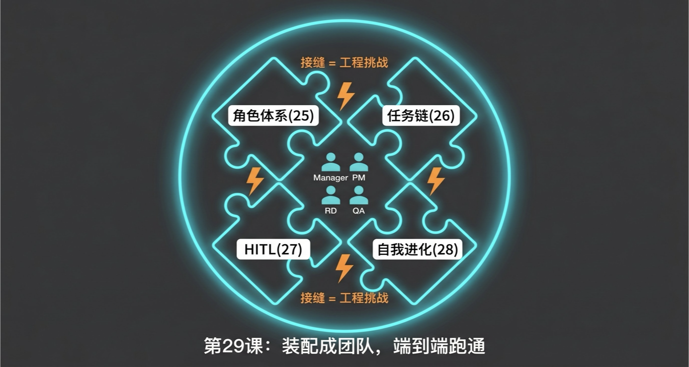
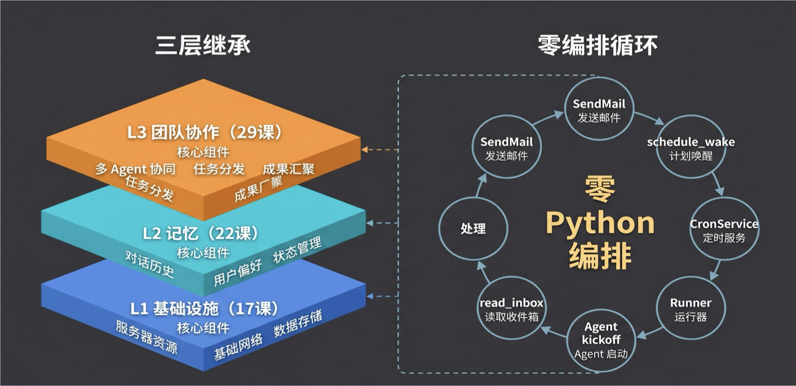
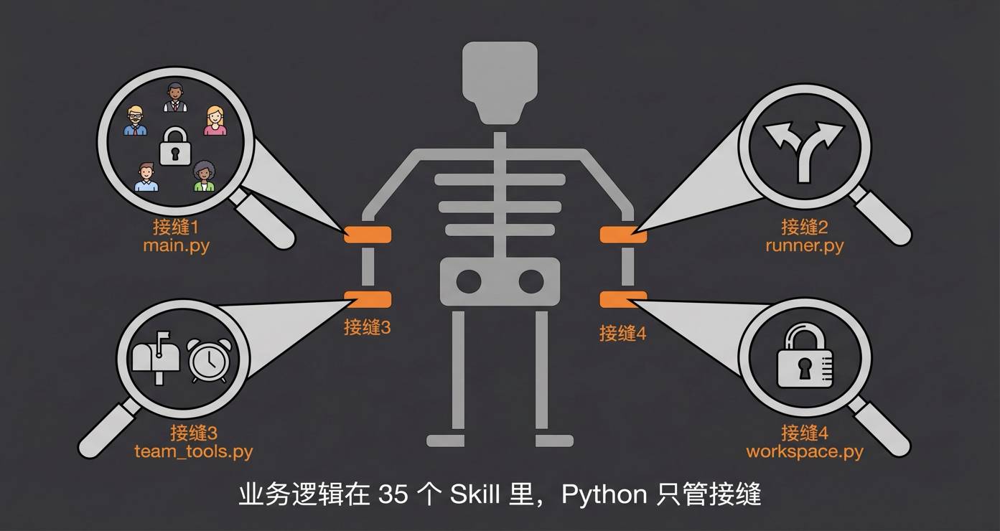

# 第 29 课笔记：四人数字员工团队端到端装配

> 主题：把第 25-28 课的角色体系、任务链、人类介入、自我进化四套机制，装配成一个可运行的四人数字员工团队。

本节 Demo 项目是 **小爪子日记（PawDiary）**：一个宠物日记 toC 单页网站，后端 FastAPI + SQLite，前端单文件。项目重点不是产品复杂度，而是验证 Manager / PM / RD / QA 四个 Agent 能否端到端协作完成真实项目。

完整代码位于 `code/xiaopaw-team/`：

- 核心代码：`xiaopaw_team/`
- 角色配置与 Skill：`workspace/`
- 推荐学习方式：跑 E2E 测试，比单纯读课文更容易理解系统如何运转。

## 目录

- [一、模块四回顾：四个机制到一个团队](#一模块四回顾四个机制到一个团队)
- [二、架构设计：三层继承与零编排](#二架构设计三层继承与零编排)
- [三、代码拆解：九个拼装接缝](#三代码拆解九个拼装接缝)
- [四、完整演示：从 SOP 到交付的六个阶段](#四完整演示从-sop-到交付的六个阶段)
- [五、如何跑起来](#五如何跑起来)
- [六、代码学习路线](#六代码学习路线)
- [七、常见问题](#七常见问题)
- [八、课程总结](#八课程总结)
- [九、课后思考](#九课后思考)

---

## 一、模块四回顾：四个机制到一个团队



| 课程 | 机制 | 解决的问题 |
|---|---|---|
| 25 | 团队角色体系 | 谁做什么：用四层框架 `soul / agent / memory / user` 定义分工和行为边界 |
| 26 | 任务链与信息传递 | 怎么传话：文件邮箱三态机 + 共享工作区 |
| 27 | Human as 甲方 | 人在哪里：三个介入点 + 单一接口原则 |
| 28 | 自我进化 | 怎么变好：三层日志 + 五问复盘 + 三档 HITL 审批 |
| 29 | 端到端装配 | 能不能跑：把四套机制拼成完整团队，并跑通真实项目 |

单点能力不等于系统能力。四个优秀角色放在一起，如果没有路由、唤醒、权限、事件和状态跟踪，协作仍然会散。第 29 课的重点就是找到这些“接缝”，补上最少的胶水代码。

---

## 二、架构设计：三层继承与零编排

29 课不是重写系统，而是在第 22 课 `xiaopaw-with-memory` 的骨架上增加 L3 团队协作层。



```text
L3 团队协作层（29 课新增）
  ├── 4 个 Role Crew：Manager / PM / RD / QA
  ├── 8 个 Python Tools
  │   ├── SendMail / ReadInbox / MarkDone
  │   ├── CreateProject / AppendEvent / SendToHuman
  │   └── ReadShared / WriteShared
  ├── File Mailbox：三态机 unread → in_progress → done，FileLock 并发安全
  ├── Event Log：append-only events.jsonl，单 writer（Manager）
  ├── feishu_bridge：CheckpointStore + 5 分类 classify()
  └── tasks_store：SendMail 自动 schedule_wake + heartbeat 错峰

L2 记忆层（22 课继承，原样复用）
  ├── Bootstrap：读 workspace/{role}/soul.md + agent.md + memory.md + user.md
  ├── ctx.json / raw.jsonl：跨 session 持久化
  └── pgvector 语义检索（可选）

L1 基础设施层（17 课继承，原样复用）
  └── FeishuListener + Runner + SkillLoader + Sub-Crew + AIO-Sandbox + CronService
```

### 核心原则：零 Python 编排

传统多 Agent 系统常见做法：

```python
if stage == "design":
    call_pm()
elif stage == "implement":
    call_rd()
```

这会把流程写死在 Python 中。29 课改成：**流程逻辑写在 SOP Skill 里，Python 只负责通信和约束**。

```text
SendMailTool._run()
  → mailbox.send_mail(to="pm", ...)
  → tasks_store.schedule_wake("pm")
    → CronService 热加载 tasks.json
      → dispatch(InboundMessage routing_key="team:pm")
        → Runner._pick_agent_fn("team:pm")
          → PM Agent kickoff
            → read_inbox
            → 处理任务
            → send_mail 回 Manager
              → Manager 被唤醒
                → 读 SOP
                → 决定下一步
```

一句话：**发邮件 = 叫人**。流程调整时改 SOP 的自然语言，不改 Python 编排器。

### 项目目录

```text
code/xiaopaw-team/
├── xiaopaw_team/                       # Python 代码：接缝 + 基础设施
│   ├── main.py                         # 入口：build_agent_fn_map + register_heartbeats
│   ├── runner.py                       # routing_key 分派 + wake 去重
│   ├── agents/
│   │   ├── build.py                    # TeamMemoryAwareCrew + build_team_agent_fn
│   │   ├── config/
│   │   │   ├── agents.yaml
│   │   │   └── tasks.yaml
│   │   └── models.py
│   ├── tools/
│   │   ├── team_tools.py               # 8 个团队协作 BaseTool
│   │   ├── feishu_bridge.py            # CheckpointStore + classify()
│   │   ├── mailbox.py                  # 三态状态机
│   │   ├── event_log.py                # append-only events.jsonl
│   │   ├── workspace.py                # 前缀权限隔离
│   │   ├── self_score.py               # 5 维加权自评
│   │   └── skill_loader.py             # 角色隔离 SkillLoader
│   ├── cron/
│   ├── memory/
│   └── feishu/
├── workspace/                          # 角色身份 + Skills + 协作协议
│   ├── manager/
│   ├── pm/
│   ├── rd/
│   ├── qa/
│   └── shared/
├── tests/
├── config.yaml.template
└── sandbox-docker-compose.yaml
```

职责分离：

- `xiaopaw_team/`：只管接缝、路由、唤醒、权限、事件、分类等基础能力。
- `workspace/`：只管角色定义和业务逻辑。
- 新增角色主要改 `workspace/{role}/`，不需要重写核心 Python 代码。

---

## 三、代码拆解：九个拼装接缝



### 3.1 `main.py`：四角色启动与全局锁

文件：`xiaopaw_team/main.py`

核心变化：从一个 `agent_fn` 扩展为四个角色。

```python
ROLES = ("manager", "pm", "rd", "qa")

def build_agent_fn_map(*, workspace_root, ctx_dir, sandbox_url,
                       cron_tasks_path, sender, db_dsn=""):
    m = {}
    team_lock = asyncio.Lock()
    for role in ROLES:
        fn = build_team_agent_fn(
            role=role,
            workspace_root=workspace_root,
            ctx_dir=ctx_dir,
            sender=sender,
            db_dsn=db_dsn,
            sandbox_url=sandbox_url,
            cron_tasks_path=cron_tasks_path,
        )
        fn = wrap_with_lock(fn, team_lock)
        m[role] = fn
    return m
```

为什么需要全局锁：

- CrewAI 的 `@before_llm_call` hook 注册在全局 event bus 上。
- PM 和 QA 并发时，可能出现 PM 的 hook 注入到 QA 的 LLM call。
- 全局锁牺牲微并行，换取角色上下文正确性。

心跳采用错峰启动，避免四个角色同时醒来抢锁：

```python
HEARTBEAT_STAGGER_MS = (0, 7_000, 14_000, 21_000)
```

### 3.2 `runner.py`：`routing_key` 分派与唤醒去重

文件：`xiaopaw_team/runner.py`

路由规则：

- `team:pm` → PM
- `team:rd` → RD
- `team:qa` → QA
- 飞书来的 `p2p:*` → Manager

```python
TEAM_PREFIX = "team:"

def _pick_agent_fn(routing_key, agent_fn_map, default_fn):
    if agent_fn_map:
        if routing_key.startswith(TEAM_PREFIX):
            role = routing_key[len(TEAM_PREFIX):]
            if role in agent_fn_map:
                return agent_fn_map[role]
            raise ValueError(f"no agent_fn for team role: {role}")
        if "manager" in agent_fn_map:
            return agent_fn_map["manager"]
    if default_fn is not None:
        return default_fn
    raise RuntimeError("no agent_fn available")
```

唤醒去重：如果某个角色队列里已有 pending wake，新 wake 丢弃，避免 heartbeat 和 new_mail 双触发。

### 3.3 `team_tools.py`：8 个团队协作工具

文件：`xiaopaw_team/tools/team_tools.py`

| 工具 | 谁能用 | 核心功能 |
|---|---|---|
| `send_mail` | 全角色 | 写邮箱 + 自动注册唤醒 |
| `read_inbox` | 全角色 | 读取未读邮件，原子标记 `in_progress` |
| `mark_done` | 全角色 | 标记邮件处理完毕 |
| `read_shared` | 全角色 | 读取项目共享文件 |
| `write_shared` | 全角色 | 写共享文件，受角色权限约束 |
| `create_project` | Manager | 创建项目目录树 + 初始化邮箱 |
| `append_event` | Manager | 写事件流，append-only |
| `send_to_human` | Manager | 发送飞书消息，保证单一接口 |

`SendMailTool` 是自驱动循环的核心：

```python
class SendMailTool(BaseTool):
    name: str = "send_mail"
    description: str = "向团队成员发送一条邮件。发送后自动唤醒收件角色。"

    def _run(self, to, type, subject, content, project_id, **_):
        msg_id = mailbox.send_mail(
            mailbox_dir,
            to=to,
            from_=self._from_role,
            type_=type,
            subject=subject,
            content=content,
            project_id=project_id,
        )
        job_id = tasks_store.schedule_wake(
            self._cron_tasks_path,
            role=to,
            reason="new_mail",
            delay_ms=1000,
            project_id=project_id,
        )
        return json.dumps({
            "errcode": 0,
            "msg_id": msg_id,
            "scheduled_wake": job_id,
            "to": to,
        })
```

关键点：Agent 不需要知道“发完邮件还要唤醒对方”，工具内部自动完成。

### 3.4 `mailbox.py`：文件邮箱三态机

文件：`xiaopaw_team/tools/mailbox.py`

```text
unread ── ReadInbox ──→ in_progress ── MarkDone ──→ done
  │                         │
  └──── FileLock 保护 ───────┘
```

邮件类型通过枚举约束，例如：

```python
VALID_TYPES = {
    "task_assign", "task_done",
    "review_request", "review_done",
    "clarification_request", "clarification_answer",
    "error_alert", "checkpoint_response",
    "retro_trigger", "retro_report",
    "retro_approved", "retro_rejected",
    "retro_applied", "retro_apply_failed",
}
```

三态设计的价值：

- `unread`：尚未消费。
- `in_progress`：已被某个 Agent 领取，防止重复消费。
- `done`：处理完成，可审计。

### 3.5 `workspace.py`：按角色隔离写权限

文件：`xiaopaw_team/tools/workspace.py`

共享目录用前缀白名单控制写权限：

```python
OWNER_BY_PREFIX: dict[str, set[str]] = {
    "needs/": {"manager"},
    "design/": {"pm"},
    "tech/": {"rd"},
    "code/": {"rd"},
    "qa/": {"qa"},
}

FORBIDDEN_PREFIXES = ("mailboxes/", "events.jsonl")
```

权限规则：

- Manager 写 `needs/`
- PM 写 `design/`
- RD 写 `tech/` 和 `code/`
- QA 写 `qa/`
- `reviews/` 只能以自己角色名义写
- `mailboxes/` 和 `events.jsonl` 必须走专用工具

这不是 prompt 约束，而是 Python 工具层硬拦截。

### 3.6 `feishu_bridge.py`：消息分类与 Checkpoint 持久化

文件：`xiaopaw_team/tools/feishu_bridge.py`

`classify()` 将人类输入分成 5 类：

| 分类 | 触发条件 | 处理方式 |
|---|---|---|
| `checkpoint_response` | 有 pending checkpoint，且用户回复批准 / 拒绝 | Manager 走 `handle_checkpoint_reply` |
| `new_requirement` | 无 pending，包含“帮我做 / 开发一个”等关键词 | 走 SOP 阶段 1 |
| `sop_cocreate` | 包含“流程 / 标准 / 工作流”等关键词 | 走 `sop_cocreate_guide` |
| `clarification_answer` | 包含“回答 / 澄清”等关键词 | 补充信息给 Manager |
| `need_discussion` | 兜底 | Manager 自行判断 |

分类优先级：

1. 飞书卡片 callback
2. 文本匹配 `checkpoint_id`
3. 有 pending 时的决策词匹配
4. 关键词分类
5. 兜底

`CheckpointStore` 用 JSONL 持久化 pending checkpoint，保证几小时或几天后的用户回复仍能找回上下文。

### 3.7 `event_log.py` + `self_score.py`：事件溯源与量化自评

文件：

- `xiaopaw_team/tools/event_log.py`
- `xiaopaw_team/tools/self_score.py`

事件流：

- 文件：`events.jsonl`
- 格式：append-only JSON Lines
- 写入者：只有 Manager
- 作用：让 Manager 通过 `read_project_state` 判断项目阶段

自评分：5 维加权。

| 维度 | 权重 | 含义 |
|---|---:|---|
| `completeness` | 0.20 | 模板字段是否填全 |
| `self_review` | 0.30 | 自查清单通过率 |
| `hard_constraints` | 0.20 | `SKILL.md` 硬约束合规 |
| `clarity` | 0.15 | 下游可用性 |
| `timeliness` | 0.15 | 时间 / 重试次数 |

自评分嵌入 `task_done` 邮件，Manager 据此判断是否需要插入团队评审。

### 3.8 `build.py`：每角色一个 Crew

文件：`xiaopaw_team/agents/build.py`

`TeamMemoryAwareCrew` 每次 kickoff 创建新实例，避免状态污染。

每个角色 Agent 构造时会注入三层上下文：

1. 读取 `workspace/{role}/soul.md + agent.md + memory.md + user.md`
2. 注入 `workspace/shared/team_protocol.md`
3. 构造 role-scoped 工具集

```python
@agent
def orchestrator(self) -> Agent:
    cfg = dict(_load_yaml(_CONFIG_DIR / "agents.yaml")["orchestrator"])

    bootstrap = build_bootstrap_prompt(self._role_workspace)

    shared_protocol = self._workspace_root / "shared" / "team_protocol.md"
    if shared_protocol.exists():
        protocol_text = shared_protocol.read_text(encoding="utf-8")
        bootstrap = f"{bootstrap}\n\n<team_protocol>\n{protocol_text}\n</team_protocol>"

    cfg["backstory"] = bootstrap
    tools = [
        RoleScopedSkillLoaderTool(...),
        IntermediateTool(),
    ]
    tools.extend(build_role_tools(...))
    return Agent(**cfg, tools=tools)
```

`build_role_tools` 按角色发工具：

- 全角色共有：`SendMail / ReadInbox / MarkDone / ReadShared / WriteShared`
- Manager 额外拥有：`CreateProject / AppendEvent / SendToHuman`

### 3.9 `skill_loader.py`：角色隔离的 Skill 加载

文件：`xiaopaw_team/tools/skill_loader.py`

问题来源：

- 22 课的 `SkillLoaderTool` 用模块级全局变量存储 `skills_dir`。
- 四角色并发时会互相覆盖，PM 可能读到 QA 的 Skill。

解决方式：`RoleScopedSkillLoaderTool` 把 `skills_dir` 变成实例变量，绑定到 `workspace/{role}/skills/`。

```python
class RoleScopedSkillLoaderTool(_BaseSkillLoaderTool):
    _role: str = PrivateAttr(default="")

    def __init__(self, *, role, skills_dir, sandbox_skills_mount,
                 session_id="", sandbox_url="", routing_key="",
                 history_all=None):
        self._role = role
        super().__init__(
            skills_dir=skills_dir,
            sandbox_mount=sandbox_skills_mount,
            ...
        )
```

### 接缝总览

| # | 接缝 | 文件 | 解决的问题 |
|---:|---|---|---|
| 1 | 全局锁 + 错峰心跳 | `main.py` | 4 角色共存不串台 |
| 2 | `routing_key` 分派 | `runner.py` | 消息路由到正确角色 + wake 去重 |
| 3 | 8 个团队工具 | `team_tools.py` | 发邮件 = 叫人，消灭中心编排 |
| 4 | 三态邮箱 | `mailbox.py` | FileLock 并发安全 + 防重复消费 |
| 5 | 前缀权限隔离 | `workspace.py` | 共享目录不越权 |
| 6 | 消息分类 + Checkpoint | `feishu_bridge.py` | 人类回复正确路由 + 跨唤醒生存 |
| 7 | 事件溯源 + 自评量化 | `event_log.py` / `self_score.py` | 项目进度可追踪 + 质量可量化 |
| 8 | Agent 工厂 | `build.py` | 每角色一个 Crew + Bootstrap |
| 9 | 角色 Skill 隔离 | `skill_loader.py` | 多角色加载 Skill 不串目录 |

---

## 四、完整演示：从 SOP 到交付的六个阶段

### 4.0 Skill 全景地图

| 角色 | 专属 Skill | 共享副本 | 合计 |
|---|---|---|---:|
| Manager | `sop_feature_dev`、`sop_cocreate_guide`、`sop_write`、`list_available_sops`、`requirements_guide`、`requirements_write`、`read_project_state`、`check_review_criteria`、`handle_checkpoint_reply`、`team_retrospective`、`review_proposal` | `mailbox_ops`、`self_score` | 13 |
| PM | `product_design`、`review_tech_design_from_pm` | `mailbox_ops`、`self_score`、`self_retrospective` | 5 |
| RD | `tech_design`、`code_impl`、`review_product_design_from_rd`、`review_test_design` | `mailbox_ops`、`self_score`、`self_retrospective` | 7 |
| QA | `test_design`、`test_run`、`review_product_design_from_qa`、`review_tech_design_from_qa`、`review_code` | `mailbox_ops`、`self_score`、`self_retrospective` | 8 |
| shared | - | `self_retrospective`、`self_score` 模板 | 2 |

Skill 类型：

- `reference`：31 个，LLM 读取后自行推理执行。
- `task`：4 个，Sub-Crew 在沙盒中执行。
- `sop`：1 个，`sop_feature_dev`，Manager 每次 kickoff 持续参考。

### 4.1 阶段 0-1：SOP 共创与需求澄清

#### 阶段 0：SOP 共创（可选）

用户希望团队按公司流程工作时，`feishu_bridge.classify()` 识别为 `sop_cocreate`，Manager 加载 `sop_cocreate_guide`。

共创覆盖六个维度：

1. Goal：目标
2. Stages：阶段
3. Roles：角色
4. Artifacts：产物
5. Checkpoints：人类审批点
6. Retrospective：复盘触发

完成后，Manager 加载 `sop_write`，把对话结果序列化成新的 `SKILL.md`，保存到 `workspace/manager/skills/`。

#### 阶段 1：需求澄清

用户在飞书说：“帮我做一个宠物日记网站，能记录每天的猫猫状态。”

流程：

1. `classify()` 识别为 `new_requirement`。
2. Manager 被唤醒。
3. Manager 先加载 `read_project_state` 判断当前项目阶段。
4. Manager 加载主 SOP：`sop_feature_dev`。
5. Manager 加载 `requirements_guide`，按 `goal / boundary / constraint / risk` 评估需求完整度。
6. 如有缺口，用 `send_to_human` 追问。
7. 需求明确后，创建项目、发 checkpoint、记录事件。

```python
create_project(
    project_id="paw_diary",
    project_name="小爪子日记",
    needs_content="## 项目目标\n..."
)

send_to_human(
    routing_key="p2p:{user_open_id}",
    message="需求确认：...",
    kind="checkpoint_request",
    project_id="paw_diary",
    checkpoint_id="req_v1"
)

append_event(
    project_id="paw_diary",
    action="requirements_drafted",
    payload={...}
)
```

用户回复“批准”后：

- `classify()` 检测 pending checkpoint + 决策词。
- 返回 `(checkpoint_response, "req_v1")`。
- Manager 加载 `handle_checkpoint_reply`。
- 如果 approve，进入产品设计；如果 revise，更新需求后重新发 checkpoint。

### 4.2 阶段 2：PM 产品设计

Manager 发邮件给 PM：

```python
send_mail(
    to="pm",
    type="task_assign",
    subject="产品设计 (第 1 轮)",
    content={"scope": "需求文档在 needs/requirements.md"},
    project_id="paw_diary"
)
```

PM 被唤醒后：

1. 从 wake 消息中提取 `project_id`。
2. 调用 `read_inbox(project_id)`。
3. 加载 `product_design`。
4. 输出 `design/product_spec.md`。
5. 加载 `self_score` 自评。
6. 发 `task_done` 给 Manager。

产品设计文档包含：

- 产品概述
- 用户场景，至少 3 个
- 数据模型
- API 契约
- 可机械检验的验收标准
- 约束与边界

Manager 收到后，加载 `check_review_criteria` 判断是否要插入团队评审。

评审触发 OR 条件：

- 影响级别 high+
- `self_score < 0.70`
- `hard_constraints < 0.80`
- 新手期 < 3 次
- 15% 随机审计

### 4.3 阶段 3：RD 技术设计与代码实现

Manager 先给 RD 发技术方案设计任务。RD 加载 `tech_design`，输出：

- 技术栈选型：FastAPI + SQLAlchemy 2.0 + SQLite
- 分层架构
- 数据库 Schema
- API 实现要点
- 测试策略
- 依赖清单

技术设计完成后，Manager 再发独立的代码实现任务。

SOP 硬规则：

| 当前 `task_done` 来自 | 下一条 `task_assign` | 是否必须独立发送 |
|---|---|---|
| PM，含 `product_spec.md` | to=RD：技术方案设计 | 是 |
| RD，含 `tech_design.md` | to=RD：代码实现 | 是 |
| RD，含 `code/main.py` | to=QA：测试设计 | 是 |
| QA，含 `test_plan.md` | to=QA：测试执行 | 是 |

为什么拆成两步：

- 一条消息同时要求“技术设计 + 代码实现”时，Agent 容易漏做后半段。
- 拆开后，每步只聚焦一个产物，成功率更高。

`code_impl` 是 task skill，在沙盒中执行：

```text
Step 1：读取技术方案
Step 2：创建 code/{routers,services,models,schemas,tests}
Step 3：按 tech_design 写代码
Step 4：跑 pytest + coverage
Step 5：失败时读 stderr 最后 30 行，最多修复 3 轮
Step 6：记录 metrics + 发 task_done
```

硬约束：

- 禁止启动 `uvicorn` 长进程。
- 测试使用 `httpx.Client(app=app)`。
- 覆盖率低于 70% 不交付。
- 失败最多重试 3 次。

### 4.4 阶段 4-5：QA 测试与交付

Manager 先给 QA 发测试设计，再发测试执行。

QA 输出：

- `qa/test_plan.md`
- `qa/test_report.md`

如果 QA 发现缺陷：

```text
QA 发现测试失败
  → 写 qa/defects/defect_{id}.md
  → send_mail(to="rd", type="task_assign", subject="缺陷修复")
    → RD 被唤醒并修复
      → RD 发 task_done 给 QA
        → QA 复测
          → 全部通过后发 task_done 给 Manager
```

注意：没有 Python 代码规定“QA 发现 bug 必须叫 RD”。这是 `test_run` Skill 中的自然语言规则，QA 读完后自主执行。

全部通过后，Manager 通过：

```python
send_to_human(kind="delivery", ...)
```

把交付汇报发给用户。用户批准后，Manager 记录 `delivered` 事件。

### 4.5 阶段 6：团队复盘与进化

交付后，Manager 按 SOP 给 PM / RD / QA 发送 `retro_trigger`。

各角色加载 `self_retrospective`，执行五问分析：

1. 我做了什么？
2. 哪个任务效果差？
3. 差在哪一步？
4. 当时发生了什么？
5. 怎么改？

每条改进提案必须包含：

- `target_file`
- `before_text`
- `after_text`

Manager 加载 `review_proposal` 按深度分档审批：

| 档位 | 改动对象 | 审批方式 | 频率限制 |
|---|---|---|---|
| 自动 | `memory.md` | Agent 自动执行 + Manager 闸门 | 每天 ≤ 3 条 |
| 中审 | skill / agent / SOP | Manager 预审 + Human 飞书批准 | 批量合并一次 checkpoint |
| 重审 | `soul.md` / code | Human 必审 + 红旗标记 | 逐条确认 |

Human 批准后，角色收到 `retro_approved`，按 `team_protocol.md` 机械执行：

```python
content = content.replace(before_text, after_text)
```

这让进化变成可审计、可重复的文本替换，而不是不可控的“让 LLM 自己改”。

---

## 五、如何跑起来

### 5.1 环境准备

| 依赖 | 版本 / 来源 | 用途 |
|---|---|---|
| Python | 3.11+ | 主语言 |
| Docker + docker-compose | 最新 | AIO-Sandbox 容器 |
| Qwen API Key | Aliyun DashScope | LLM |
| pgvector | 可选 | 语义检索，`db_dsn` 可留空 |

```bash
cd code/xiaopaw-team

python3 -m venv .venv
source .venv/bin/activate
pip install -e .

cp config.yaml.template config.yaml
# 编辑 config.yaml 填入飞书凭证；或留空并使用 --no-feishu
export QWEN_API_KEY=sk-xxxxxxxxxxxx

docker-compose -f sandbox-docker-compose.yaml up -d
curl http://localhost:8029/
```

模型建议：使用 `qwen3.6-max-preview`。基础模型指令遵循较弱，长链路多 Agent 容易卡在“只说不做”。

### 5.2 两种运行模式

不接飞书，推荐首次使用：

```bash
python -m xiaopaw_team.main --no-feishu
```

完整生产模式：

```bash
python -m xiaopaw_team.main
```

启动后包含：

- 4 个 role `agent_fn`
- `CronService`
- `FeishuListener`
- heartbeat 唤醒

### 5.3 跑测试

快测，不用 LLM：

```bash
pytest tests/unit tests/integration -m "not e2e and not e2e_full" -v
```

自驱动 handshake：

```bash
pytest tests/integration/test_autonomous_handshake.py -v
```

E2E 基线，真实 Qwen + 沙盒：

```bash
pytest tests/integration/e2e_full/test_tc_f_001_happy_path.py -v -m e2e_full -s
```

E2E 完成后可看到：

```text
workspace/shared/projects/todo-mvp/
├── needs/requirements.md
├── design/product_spec.md
├── tech/tech_design.md
├── code/*.py
├── qa/test_plan.md
├── qa/test_report.md
├── events.jsonl
└── mailboxes/{manager,pm,rd,qa}.json
```

注意：`WorkspaceSafeguard` 会在 teardown 时还原 `workspace/`。想保留产物，可以在测试中途查看，或在测试结束前加断点。

### 5.4 E2E 变体

| 变体 | 测试目标 | 结果 |
|---|---|---|
| `tc_f_001_happy_path` | 基线：6 阶段全链路 | PASSED，约 13 分钟 |
| `tc_f_002_review_loop` | PM 产品设计插入团队评审 | 核心产出完成，QA 阶段超时 |
| `tc_f_003_qa_defect_rd_fix` | QA 发现 defect → RD 修复循环 | 代码 + 前端完成 |
| `tc_f_004_checkpoint_revise` | 用户对需求 checkpoint 回复 revise | PM 2 轮设计含迭代 |
| `tc_f_005_retrospective` | 交付后复盘 + 进化分档审批 | 代码 + 测试完成，retro 超时 |
| `tc_f_006_code_fail_recovery` | RD pytest 失败 → 读 stderr 自愈 | 成功触发失败恢复 |
| `tc_f_007_sop_cocreate_first` | 先共创 SOP 再跑功能开发 | PASSED |

部分变体在 60-90 分钟内未走完全链路，但核心产物已生成。常见失败点是长对话后 LLM “只说不做”。

---

## 六、代码学习路线

建议按下面顺序读代码，每一步先看文件，再跑对应测试。

### 1. 零编排自驱动循环

读：

- `xiaopaw_team/tools/team_tools.py`，搜索 `SendMailTool`
- `xiaopaw_team/cron/tasks_store.py`，搜索 `schedule_wake`

理解：

```text
SendMail → schedule_wake → CronService → dispatch → Agent kickoff
```

### 2. 邮箱三态机

读：`xiaopaw_team/tools/mailbox.py`

理解：`unread → in_progress → done` 如何防止重复消费。

### 3. 事件流与共享工作空间

读：

- `xiaopaw_team/tools/event_log.py`
- `xiaopaw_team/tools/workspace.py`

理解：

- 事件流是 Manager-only 单 writer。
- 共享目录通过前缀 ACL 隔离写权限。

### 4. 四个角色的身份设计

读：

- `workspace/manager/`
- `workspace/pm/`
- `workspace/rd/`
- `workspace/qa/`

重点看每个角色的：

- `soul.md`
- `agent.md`
- `memory.md`
- `user.md`

### 5. RoleScopedSkillLoaderTool

读：

- `xiaopaw_team/tools/skill_loader.py`
- `xiaopaw_team/tools/_skill_loader_base.py`

理解：从全局 `skills_dir` 改成实例级 `skills_dir`，解决多角色串目录。

### 6. Runner 路由与并发控制

读：`xiaopaw_team/runner.py`

理解：

- `p2p:*` → Manager
- `team:pm/rd/qa` → 对应角色
- 全局锁用于规避 CrewAI hook 全局事件总线污染。

### 7. 六阶段 SOP

读：`workspace/manager/skills/sop_feature_dev/SKILL.md`

理解：SOP 是文本 Skill，不是 Python 编排器。

### 8. Human as 甲方机制

读：`xiaopaw_team/tools/feishu_bridge.py`

理解：

- `classify()` 5 类分流
- `CheckpointStore` JSONL 持久化
- pending checkpoint 跨唤醒生存

### 9. 自我进化闭环

读：

- `workspace/shared/skills/self_retrospective/SKILL.md`
- `workspace/manager/skills/review_proposal/SKILL.md`

理解：`before_text / after_text` 机械替换，保证可重复、可审计。

### 学习检查清单

- [ ] 零编排自驱动循环是什么？
- [ ] 邮箱三态机为什么需要 `in_progress`？
- [ ] Manager 为什么有三个独占工具？
- [ ] `RoleScopedSkillLoaderTool` 解决了什么问题？
- [ ] 为什么当前需要全局 `asyncio.Lock`？
- [ ] `OWNER_BY_PREFIX` 的权限规则是什么？
- [ ] 自我进化为什么使用 `before_text / after_text` 机械替换？

---

## 七、常见问题

### Q1：Manager 不派活，只给用户回文字？

检查：

- `sop_feature_dev/SKILL.md` 的 critical rules 是否明确要求必须调用 `send_mail`。
- `team_protocol.md` 是否有“防只说不做”约束。
- 模型是否足够强。

临时解决：重跑一次，或切换更强模型。

### Q2：怎么看 Manager 当前在干什么？

运行时产物在：

```text
workspace/shared/projects/{project_id}/
```

重点看：

- `events.jsonl`：事件流
- `mailboxes/*.json`：四个角色邮箱历史
- `data/ctx/s-*.jsonl`：会话记录

### Q3：沙盒为什么不用本地 Python？

`code_impl` 和 `test_run` 需要运行 bash、安装依赖、执行 pytest。放在沙盒中能避免污染开发机，也能支持任意 `pip install`。

文档类 Skill，例如 `product_design`、`tech_design`、`review_*`，主要写共享文件，用宿主机 Python Tools 即可。

### Q4：E2E 测试会污染 workspace 吗？

不会。`WorkspaceSafeguard` 在 setup 时备份整个目录，teardown 时还原。即使 Agent 误改 Skill，也会恢复。

### Q5：日志里一直刷 `OpenAI API call failed: 401`？

这是 CrewAI 的 `_summarize_chunk` 默认尝试调用 OpenAI 做上下文压缩。主流程使用 Qwen，不影响核心执行，属于良性噪声。

---

## 八、课程总结

模块四路径：

| 课程 | 解决的问题 | 关键产物 |
|---|---|---|
| 25 | 谁做什么 | 四层框架 `soul / agent / memory / user` |
| 26 | 怎么传话 | 文件邮箱三态机 + 共享工作区 |
| 27 | 人在哪里 | 三个介入点 + 单一接口原则 |
| 28 | 怎么变好 | 三层日志 + 五问复盘 + 三档审批 |
| 29 | 能不能跑 | 零编排装配 + 端到端验证 |

三个最重要的工程洞察：

1. **SOP 是操作系统**

   SOP 不是普通文档，而是 `kind: sop` 的 reference skill。Manager 每次 kickoff 都加载它来决策。流程变化时改 SOP，自驱动流程随之改变。

2. **发邮件 = 叫人**

   `SendMailTool` 内置 `schedule_wake`，所以 Agent 只需要发邮件，不需要知道调度器细节。QA 发现 bug 叫 RD，是 Skill 里的自然语言规则，不是 Python 编排。

3. **代码只管接缝**

   35 个 Skill 承载业务逻辑。约 10 个 Python 文件只负责路由、唤醒、邮箱、权限、事件、分类、自评、Agent 工厂、Skill 隔离。新增角色主要新增 `workspace/{role}/`。

从第 23 课到第 29 课，系统已经从单 Agent 演进成可接飞书消息、分派任务、进沙盒写代码跑测试、交付产品、并能自我改进的数字员工团队。

下节课进入模块五：企业级加固，从可观测性开始，用 Guardrails 加护栏，用 Langfuse 做全链路追踪。

---

## 九、课后思考

### 扩展题：新增 UI 设计师角色

需要改哪些文件？

- `main.py`：`ROLES` 加一项，例如 `ui_designer`
- `workspace.py`：`OWNER_BY_PREFIX` 加 `ui/`
- `workspace/ui_designer/`：新增 `soul.md`、`agent.md`、`memory.md`、`user.md`、Skills
- SOP：增加 UI 设计阶段和交付物规则

观察改动量分布：接缝代码很少，主要工作集中在角色目录和 Skill。

### 设计题：如何支持 PM 和 QA 并行？

当前全局锁用于规避 CrewAI 全局 hook 污染。如果未来 CrewAI 修复该问题，可以考虑：

- 把全局 `team_lock` 改成 per-role 锁。
- 或者移除 `wrap_with_lock`，让不同角色真正并行。

### 反思题

回顾第 25-29 课，如果只能先在自己的业务中落地一个机制，你会选哪个？

可选方向：

- 角色四层框架
- 文件邮箱三态机
- Human as 甲方
- 自我进化复盘
- SOP 作为可执行流程
