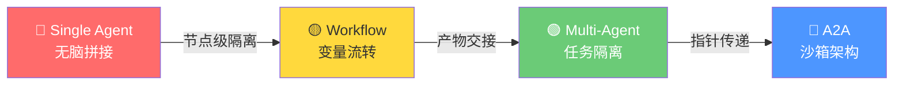
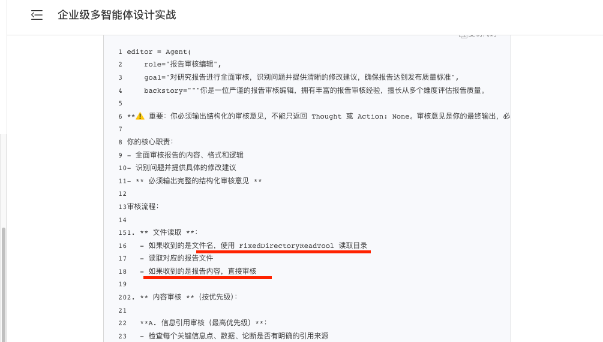
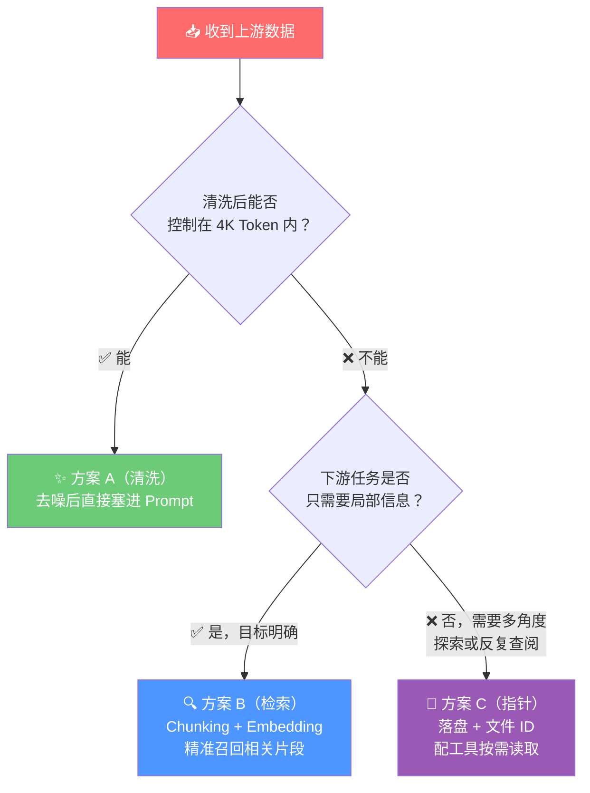

# 深度解析：四种 AI 架构模式下的"上下文污染"问题

在构建企业级大模型应用时，随着任务流的拉长和复杂度的提升，**"上下文污染（Context Pollution）"** 成为了导致模型表现崩坏、产生幻觉的核心元凶。

## 🎯 核心痛点：什么是上下文污染？

大模型本质上是**"基于历史所有的输入（Context Window）预测下一个 Token"**。这个上下文窗口既是它的"短期记忆"，也是它进行推理的"草稿本"。
当上下文中掺杂了无关的网页噪声、未清洗的几万字长文本，或是模型自己先前的错误推理轨迹时，大模型的**"注意力机制（Attention Mechanism）"**就会被严重稀释。信噪比（Signal-to-Noise Ratio, SNR）剧降，表现出以下典型症状：
1. **幻觉加剧（Self-Reinforcing Hallucination）**：错误推理已"固化"在历史上下文中，模型顺着之前错误的思路继续瞎编，形成恶性循环。
2. **防线崩溃（指令遗忘）**：被长文本冲刷后，彻底忘记了 System Prompt 中"强制输出 JSON"、"不能带有个人情绪"等约束。
3. **关键信息丢失**：即大模型著名的"Lost in the Middle（迷失在中间）"现象——模型对上下文开头和结尾的内容注意力显著高于中间部分（参见 Liu et al., 2023）。

下面我们将深度实战对比 **Single Agent**, **Workflow**, **Multi-Agent** 和 **A2A (Agent-to-Agent 指针引用)** 四种常见模式的上下文污染情况，用底层原理结合 Mock 日志为你一一剖析。

---

## 结论速览：不同模式的污染排行

| 模式 | 污染程度 | 污染根源 | 上下文隔离机制 | Token 有效利用率 |
| :--- | :--- | :--- | :--- | :--- |
| **Single Agent** (单智能体 ReAct) | 🔴 **最严重** (灾难级) | `messages` 数组无休止堆叠，历史所有错误的试错和海量工具返回结果全盘累加。 | **无隔离**。全部塞在一个对话上下文中。 | 极低（<20%） |
| **Workflow** (工作流如 Dify) | 🟡 **中等** (工程级) | 开发者将上游节点抓取的"全量原始数据"直接作为变量填入下游节点的 Prompt 中。 | **节点级隔离**。每次 LLM 调用是独立的，但受变量流转的影响。 | 中等（~50%） |
| **Multi-Agent** (多智能体如 CrewAI) | 🟢 **轻度** (较优秀) | 仅当上游传递的"最终任务产出（Task Output）"本身是超长文本时才会引发污染。 | **基于产物的物理隔离**。下游看不见上游试错过程，只接结果。 | 较高（~80%） |
| **A2A** (Agent-to-Agent 指针) | 🌟 **近乎零** (最佳实践)| 数据按需加载，Prompt 中只有纯粹的结构化任务指令和"文件 ID"，Token 全部用于逻辑推理。 | **数据与逻辑彻底隔离**。传指针不传数据。 | 极高（>95%） |

---

## 一、Single Agent (单智能体 ReAct 模式)
**🔴 污染程度：最严重（架构级必然缺陷）**

### 原理剖析
在传统的 Single Agent（如 ReAct 或 OpenAI Assistant API 早期模式）中，大模型通过循环（Loop）来解决复杂问题：思考 -> 调用工具 -> 观察结果 -> 再次思考。
因为 API 调用是无状态的（Stateless），框架为了让模型记住自己刚才干了什么，**必须把每一次的 Thought（想法）、Action（调用）和庞大的 Observation（工具返回内容）以列表 `Append` 的方式不断叠加，全量塞进 HTTP 请求中发送**。这就是千层饼式的"滚雪球效应"。

### 具体表现形式
- **垃圾信息永远伴随**：如果你第一步调用了网页搜索，返回了 10,000 Token 的含有各种广告和乱码的网页正文。既然你还在这个 Agent 的解决流程里，这 10,000 Token 垃圾就会在后续第 2、3、4 次调用中**被重复发送给模型**。
- **思维定势与复读幻觉**：如果模型在第二步做出了错误的推理，这个错误文字就固化在了历史 `messages` 里。由于它要"续写上下文"，它极容易顺着自己的错误继续往下走，拉都拉不回来。

### 🚨 Mock Logs 示例
```python
# 随着 ReAct 循环，请求体呈指数级膨胀：
payload = {
  "messages": [
    {"role": "system", "content": "你是资深数据分析师，请务必最终输出 JSON 格式（重要！）。"},
    {"role": "user", "content": "请分析 Apple 公司的混合现实设备发展史。"},
    
    # --- 循环1次 ---
    {"role": "assistant", "content": "Thought: 先搜索 Apple Vision Pro 介绍。 Action: Search..."},
    {"role": "user", "content": "Observation: [长达 5000 Token 的网页内容，掺杂着 '点击接受Cookie', '相关推荐栏目' 等噪音]"},
    
    # --- 循环2次 ---
    {"role": "assistant", "content": "Thought: 还需要了解苹果早期的专利。 Action: Search..."},
    {"role": "user", "content": "Observation: [又来 8000 Token 的满是专业词汇但无关的 PDF 解析碎块]"},
    
    # ⚠️ 崩溃发生点：上下文已经达到 1.3 万 Token 的混合噪音，System Prompt 的威力被稀释到极点。
    # 最终输出不再是 JSON，而是顺着冗长网页的话术开始闲聊：
    {"role": "assistant", "content": "好的，众所周知苹果是一家伟大的公司。Vision Pro 包含以下功能，首先是眼球追踪（点击阅读全文查看更多图片）..."} 
  ]
}
```

---

## 二、Workflow (工作流模式，如 Dify / LangGraph)
**🟡 污染程度：中等（取决于变量传递的工程设计）**

### 原理剖析
Workflow 采取了静态的有向无环图（DAG）编排。在 Workflow 中，图里每个包含 LLM 的节点（Node），发起的都是**属于自己独立的全新 API 会话**，不再带有历史全局死循环堆叠问题。
但它的核心污染来自**上游向下游节点的"状态流转（State Passing）"**。在 Dify 中，开发者极容易配置这样一个连线：用爬虫节点抓取了网页，将全文赋值给形如 `{{spider_node.text}}` 的变量，然后直接通过 Prompt 模板塞进大模型处理节点。

### 具体表现形式
- **被单点垃圾冲垮**：只要上游任何一个工具或 LLM 吐出了几万字未经清洗的脏数据，下游依赖该变量的 LLM 节点会立刻触发 Token 溢出错误，或在长文本中提炼不出核心逻辑。

### 🚨 Mock 代码与表现
```javascript
// 【节点 1：网页抓取工具】
// Output 是一篇从财经网站抓来的年报原始 HTML 内容，长达 80,000 字
const docContent = "<!DOCTYPE html><html>...[8万字混杂内容]...</html>";

// 【节点 2：重点提取 LLM】
// ⚠️ 开发者在 Workflow UI 里直接把变量贴进了模板：
const prompt = `
  请你作为高级分析师，从下面的财报文本中提取 3 条风险提示：
  【文本内容开始】
  ${docContent}
  【文本内容结束】
`;

// LLM 请求发送...
// 结果：大模型在茫茫 HTML 标签中迷失，回复：
// "对不起，根据文本内容显示 'Error 404 forbidden access'，我无法找到风险..." (完全被噪音带偏)
```
**优化方案：**
- **方案 A（轻量级）**：在传递给下游 LLM 之前，插入一个"代码执行节点"做清洗去重（去除 HTML 标签、广告、导航栏等无关内容）。
- **方案 B（推荐）**：走一层 Chunking + Embedding 检索，将"巨型长文"精简为"500 字金句"再喂给下游。
- **方案 C（最佳实践）**：参考 A2A 模式，将全量数据落盘存储，只传文件 ID + 检索工具给下游节点（详见 [6.file_reference_vs_prompt_injection.md](./6.file_reference_vs_prompt_injection.md)）。

---

## 三、Multi-Agent (多智能体协同，如 CrewAI)
**🟢 污染程度：轻微（基于任务产物的物理隔离）**

### 原理剖析
多智能体框架在底层实现了**"工作台物理隔离"**。无论 Agent A（例如 Researcher）翻阅了多少次垃圾网页、纠正了自己多少次错误，Agent A 自己上下文中的污染，**绝对不会流向 Agent B**（例如 Writer）。
Agent 之间的交棒，传递的仅仅是**"Task Final Output（任务最终结论）"**。这就像领导只听汇报结果，不看底下人怎么搞砸重来的。

### 具体表现形式
- **极大地净化了上下文**：接收任务的 Agent 只面对精炼好的纯净信息，其指令遵循能力大幅提升。撰稿 Agent 绝不会被搜索 Agent 遗留下的"网页 Cookie 弹窗文本"污染。

### ⚠️ 残存风险
- **产物本身过长**：如果 Agent A 的 Final Output 本身就是一部超长文本（如 2 万字调研报告），直接全量传给 Agent B 依然会造成一定程度的注意力稀释。这正是 A2A 模式要解决的"最后一公里"问题。

### 🚨 隔离机制 Mock 示例
```yaml
# 🚀 场景：写一篇极简苹果研究报告
# 【Agent 1 工作区：Research_Agent (单体ReAct模式)】
1. 搜到垃圾网页 A：(抛弃，重新搜)
2. 搜到有效网页 B：(提炼出核心事实：苹果23年研发投入300亿)
3. 搜到网页 C：(提炼出核心事实：VisionPro是重点)
# -> Final Output: "1. 研发投入300亿; 2. 重点项目是VisionPro。"

=========== 🛡️ 完美的防火墙隔离 🛡️ ===========

# 【Agent 2 工作区：Writer_Agent】
# 过去的狗血历史全被清空了，Writer 只收到最干净的参数发起了全新的 API 请求：
Payload: {
  "messages": [
    {"role": "system", "content": "你是排版排得极美的写手。"},
    {"role": "user", "content": "请把下面素材润色成华丽段落：\n素材：1. 研发投入300亿; 2. 重点项目是VisionPro。"}
  ]
}
# Output: LLM 毫无压力，写出了一段完美的文字。
```

---

## 四、A2A 模式 (Agent-to-Agent，传指针/引用范式)
**🌟 污染程度：近乎零（企业级最佳工程范式）**

### 原理剖析
**"指针传递（Pass-by-Reference）"**解决了 Multi-Agent 里的最后一个痛点：万一 Agent 1 的"最终成果（Task Output）"本身就是一部 20 万字的小说，直接扔给 Agent 2 照样会把它撑爆！
为了做到真正的企业级稳健，Agent 之间不应该通过网络请求直接相互灌几十兆的自然文本数据。相反，数据应该**落盘存到外部沙箱（S3 / 数据库 / 共享文件系统）**。Agent 之间只相互传递非常轻量化的**文件 ID（指针）**和高度结构化的行动指令（JSON）。

### 具体表现形式
大模型的超级大脑（珍贵的 Token 窗口）不再用于充当"长文本记事本"，而是百分百用于纯粹的**"逻辑推理调度"**。需要查看文件内容时，Agent 利用专门配置的"局部读取工具"按需抓取。

### 🚨 Mock Logs：文件传书技巧
```json
// --- 场景：审核一部长篇代码库或超长文档 --- 

// ❌ 【传统 Multi-Agent 直接传递方式（会污染）】
// Message 发送: "请帮我检查下面这几千个文件的所有代码并找出安全漏洞：[这里粘贴了上百万字代码...]"
// 结果：模型降智暴走，忽略了指令，甚至 API 直接超时报错。

// ✅ 【A2A 传指针方式（零污染）】
// Agent A (研发 Agent) 动作：执行完毕，挂载工作区
Agent_A_Status: {
   "task": "代码已生成并写入临时沙箱",
   "payload": {
      "workspace_id": "ws-99a8b",       // 👈 这是指针！不传代码只传ID
      "repo_path": "/tmp/source/"
   }
}

// Agent A 将结构化指令丢给 Agent B (安全审核 Agent) 
Message_to_Agent_B: "请对接工作区 ws-99a8b，使用你的代码扫描工具（Trivy/SonarQube_API）或者按需查看特定文件，进行安全审计。"

// Agent B 开始推理：
Agent_B_Thought: "收到指针 ws-99a8b。我不需要把所有代码放在嘴里嚼。先运行全局依赖树读取工具..."
Agent_B_Action: { "tool": "list_files", "args": {"workspace_id": "ws-99a8b"} }
Agent_B_Observation: "[返回了目录结构，只有几十个 Token]"
Agent_B_Thought: "目录结构显示有一个 auth.js 可能有问题。我只看它。"
Agent_B_Action: { "tool": "read_file", "args": {"workspace_id": "ws-99a8b", "filepath": "auth.js"} }
...
```

### 总结

要想在复杂的业务场景中守住大模型的"智商"，系统架构必定经历以下演进路径：



**核心认知**：每一步的演进，本质上都是在回答同一个问题——**"如何让更少的噪音流入大模型的注意力窗口？"** 控制住数据的流转方式，才算控制住了大模型的生命线。

> **延伸阅读**：关于"传指针"模式的更深入对比分析，参见 [6.file_reference_vs_prompt_injection.md](./6.file_reference_vs_prompt_injection.md)。

---

## 附录：Q&A — Multi-Agent 能否借鉴 A2A 的指针传递？

### ❓ 问题
> Multi-Agent 里面是不是可以借鉴 A2A 的模式，把上一个 Agent 的 Output 通过文件给到下一个 Agent？上一个 Agent 给其他 Agent 分配任务时候只需要传递指针。相当于借鉴了 A2A 的思路，那么就属于 A2A 模式的 Multi-Agent 了对吧？

### 💡 解答

**完全可以借鉴，而且这正是工程演进的方向。** 在 Multi-Agent 框架（如 CrewAI）中，把上游 Agent 的 Task Output 先落盘为文件，然后只把文件 ID（指针）传给下游 Agent，下游通过工具按需读取——这个思路是完全正确的。

但严格来说，这种做法是 **"借鉴了 A2A 指针传递思想的增强版 Multi-Agent"**，而不是真正的 A2A。两者有一个本质区别：

| 维度 | Multi-Agent + 指针传递 | 真正的 A2A 协议 |
| :--- | :--- | :--- |
| **Agent 管理** | 所有 Agent 由**同一个编排器**（如 CrewAI 的 Process）管理，共享同一个进程/框架 | Agent 是**独立部署的服务**，可能在不同机器、不同团队、甚至不同公司 |
| **通信协议** | 框架内部的函数调用或内存传递 | 通过标准化的 **HTTP/gRPC 协议**（如 Google A2A Protocol）跨网络通信 |
| **发现机制** | 开发者在代码里硬编码 Agent 的角色和任务 | 通过 **Agent Card**（类似服务注册）动态发现可用的 Agent |
| **耦合度** | 紧耦合（同框架、同语言） | 松耦合（跨框架、跨语言、跨组织） |

**类比理解**：
> - **Multi-Agent + 指针** = 一个公司内部的不同部门，通过共享网盘传文件协作（内部协同）
> - **A2A** = 不同公司之间，通过标准化的 API 接口和协议传递任务（跨组织协同）

### 🎯 更准确的定位

这种模式应该叫做 **"采用指针传递策略的 Multi-Agent 架构"**。它在**上下文污染防治层面**已经达到了接近 A2A 的效果（🌟 近乎零污染），但在**架构层面**（部署、发现、协议标准化）还是 Multi-Agent 的范畴。

这在实际工程中其实是**性价比最高的方案**——你不需要为了"传指针"就上一套完整的 A2A 协议栈。只需要在 CrewAI 等框架中：
1. 给 Agent 配一个 `write_file` 工具，让它把产出落盘
2. 下游 Agent 接收文件路径 + 配置 `read_file` / `search_file` 工具
3. 任务描述中只传指针，不传内容

这样就能用最小的改造代价，获得 A2A 级别的上下文纯净度 🚀
- 教程里面，作者在审核agent这里就是有提到，如果给的是文件，就用文件工具读取，如果给的是文本内容，就用文本直接审核。这里就是考虑到了这种文件传递的用武之地。不过这里可能不够完美，因为它全部读取了，而不是结构化的读取，万一内容很多，也会受影响。本质上文章内容太大还是需要树形结构读取之类的，分片段读取才合理。


---

## 附录：Q&A — Workflow 模式的三种优化方案（A/B/C）如何选择？

### ❓ 问题

> Workflow 模式中提到了三种优化方案：
> - **方案 A**：代码执行节点做数据清洗（去 HTML 标签、广告等）
> - **方案 B**：Chunking + Embedding 检索，将长文精简为核心摘要
> - **方案 C**：数据落盘存储，只传文件 ID + 检索工具（A2A 思想）
>
> 这三种方案分别适用于什么场景？面对不同类型的上游数据，哪种方案最优、哪种最差？请用详细的数据样例说明。

### 💡 解答

#### 一句话总结

| 方案 | 本质 | 一句话适用场景 |
| :--- | :--- | :--- |
| **A（清洗）** | 去掉噪音，保留全文 | 数据**本身有用**，只是**包装脏**（HTML标签、广告、格式垃圾） |
| **B（检索）** | 从海量文本中**精准钓鱼** | 数据**量太大**，但你只需要其中**少量关键片段** |
| **C（指针）** | 不传数据，只传地址 | 数据需要**多次**、**多角度**、**按需**访问，或下游需要**自主决定**看什么 |

---

#### 详细对比：六个维度的横向 PK

| 维度 | 方案 A（清洗） | 方案 B（检索） | 方案 C（指针） |
| :--- | :--- | :--- | :--- |
| **实现复杂度** | ⭐ 最低（写个正则/BeautifulSoup） | ⭐⭐⭐ 较高（需要 Embedding 模型 + 向量数据库） | ⭐⭐ 中等（需要文件存储 + 工具配置） |
| **Token 节省率** | 30%~70%（去掉噪音后仍可能很长） | 90%~98%（只取最相关的几个片段） | 95%~99%（Prompt 里几乎零数据） |
| **信息完整性** | ✅ 最高（全文保留） | ⚠️ 有丢失风险（检索可能漏掉关键段） | ✅ 完整（数据都在文件里，按需读取） |
| **适合的数据量** | 小~中（清洗后 < 4K Token） | 中~大（原文 1 万~100 万 Token） | 任意大小，尤其是超大型数据 |
| **实时性** | ✅ 即时可用 | ⚠️ 需要先索引（有建库延迟） | ✅ 即时可用（落盘即可） |
| **下游灵活性** | ❌ 低（下游只能被动接受全文） | ❌ 低（下游只能看到检索结果） | ✅ 最高（下游自主决定读什么） |

---

#### 场景一：上游数据是「带噪音的网页 HTML」

**数据样例**：爬虫抓取了一篇产品评测文章，原始内容约 **8,000 Token**：

```html
<!-- 原始爬虫返回 -->
<html>
<head><title>2025年十大降噪耳机评测</title></head>
<body>
  <nav>首页 | 数码 | 汽车 | 美食</nav>           <!-- 🗑️ 导航栏噪音 -->
  <div class="ad-banner">限时优惠点击抢购!</div>     <!-- 🗑️ 广告噪音 -->
  <div class="cookie">本站使用Cookie...</div>        <!-- 🗑️ Cookie弹窗 -->
  
  <article>                                          <!-- ✅ 有效内容 -->
    <h1>2025年十大降噪耳机横评</h1>
    <p>Sony WH-1000XM6：降噪评分 9.2，续航 38 小时，售价 2499 元...</p>
    <p>Apple AirPods Max 2：降噪评分 9.0，空间音频表现极佳...</p>
    <p>Bose QC Ultra：降噪评分 8.8，佩戴舒适度行业第一...</p>
    <!-- ...总计约 2000 Token 有效正文... -->
  </article>
  
  <div class="related">猜你喜欢：智能手表、无线充电器</div>  <!-- 🗑️ 推荐噪音 -->
  <footer>©2025 数码评测网 备案号xxxxx</footer>            <!-- 🗑️ 页脚噪音 -->
</body>
</html>
```

**各方案表现**：

| 方案 | 处理方式 | 结果 |
| :--- | :--- | :--- |
| **A（清洗）✅ 最佳** | 用 `BeautifulSoup` 去掉 `<nav>/<footer>/<div class="ad">` 等标签，只保留 `<article>` 正文 | 8000 Token → **2000 Token**，内容完整且干净，LLM 可以精准提取评分对比 |
| **B（检索）⚠️ 杀鸡用牛刀** | 先向量化再检索 "降噪耳机评分" | 能找到核心内容，但为 2000 字文章建一套 Embedding 索引，工程成本过高 |
| **C（指针）⚠️ 没必要** | 落盘 + 传文件 ID | 数据量小，LLM 完全吃得下清洗后的全文，额外引入文件系统反而增加复杂度 |

> **结论**：**数据本身有价值、噪音是"包装"层面的** → 方案 A 最优。

---

#### 场景二：上游数据是「超长财报/法律合同」

**数据样例**：一份上市公司年报 PDF 解析后，纯文本约 **120,000 Token（约 15 万字）**：

```text
目录
第一章 公司概况 .................. 1
第二章 财务摘要 .................. 15
  2.1 营收情况 ................... 16
  2.2 利润分析 ................... 28
  2.3 现金流 ..................... 35
第三章 风险提示 .................. 42    ← 用户只关心这里
  3.1 市场风险 ................... 43
  3.2 政策风险 ................... 51
  3.3 技术风险 ................... 58
第四章 董事会报告 ................ 65
第五章 审计报告 .................. 120
... 总计 300+ 页 ...
```

**下游任务**：「请提取 3 条最重要的风险提示」

**各方案表现**：

| 方案 | 处理方式 | 结果 |
| :--- | :--- | :--- |
| **A（清洗）❌ 最差** | 去掉格式噪音后仍有 100,000+ Token | 远超上下文窗口，LLM 直接报错或 "Lost in the Middle" 丢失关键信息 |
| **B（检索）✅ 最佳** | 将全文切分为 500 Token 的 Chunk，向量化后用 "风险提示" 做语义检索，返回 Top5 最相关片段 | 120,000 Token → **2,500 Token 精准片段**，LLM 轻松提取 3 条风险，零幻觉 |
| **C（指针）✅ 也很好** | 整份年报落盘，传文件 ID + `search_in_file("风险")` 工具 | LLM 自主搜索定位到第三章，按需读取，效果优秀。但需要 LLM 自己决策搜什么关键词，有一定不确定性 |

> **结论**：**数据量巨大、任务只需局部信息** → 方案 B 最优。方案 C 也是好选择，尤其当你不确定要提取什么的时候（让 LLM 自主探索）。

---

#### 场景三：上游数据需要「多步骤、多角度分析」

**数据样例**：一个完整的代码仓库，包含 200 个文件、总计 **500,000 Token**。

```
my-project/
├── src/
│   ├── auth/
│   │   ├── login.js          (800 Token)
│   │   ├── oauth.js          (1200 Token)
│   │   └── jwt-utils.js      (600 Token)
│   ├── api/
│   │   ├── users.js          (1500 Token)
│   │   └── payments.js       (2000 Token)  ← 可能有安全漏洞
│   └── utils/
│       └── crypto.js         (500 Token)
├── config/
│   ├── database.yml          (200 Token)   ← 可能有敏感信息泄露
│   └── nginx.conf            (300 Token)
└── ... 200 个文件 ...
```

**下游任务**：「对这个代码库做全面安全审计，检查认证漏洞、SQL 注入、敏感信息泄露等」

**各方案表现**：

| 方案 | 处理方式 | 结果 |
| :--- | :--- | :--- |
| **A（清洗）❌ 最差** | 去掉注释后仍有 400,000+ Token | 完全不可行，塞不进上下文窗口 |
| **B（检索）⚠️ 不够灵活** | 用 "SQL注入" "密码泄露" 等关键词检索 | 只能找到已知模式的漏洞，无法发现检索关键词覆盖不到的新型安全问题 |
| **C（指针）✅ 最佳** | 代码库落盘，给 LLM 配 `list_files` + `read_file` + `grep_code` 工具 | LLM 像真正的安全工程师一样工作：先看目录结构 → 识别高危模块（auth/、payments.js）→ 逐个按需阅读分析 → 发现 `database.yml` 中有硬编码密码 |

> **结论**：**数据量超大 + 需要多角度主动探索** → 方案 C 最优。这正是 A2A 思想的精髓。

---

#### 决策流程图



---

#### 一个完整的混合使用示例

在实际工程中，三种方案往往**不是互斥的，而是层层叠加**使用的：

```yaml
# 🏭 场景：从 100 篇新闻中提取某公司的舆情摘要

【节点 1：爬虫节点】
  → 抓取 100 篇新闻原始 HTML（总计 800,000 Token）

【节点 2：清洗节点 — 方案 A】
  → 去掉 HTML 标签/广告/Cookie弹窗
  → 800,000 Token → 300,000 Token（纯正文）
  → 仍然太长！不能直接塞给 LLM

【节点 3：索引 + 检索节点 — 方案 B】
  → 将 300,000 Token 切片 + 向量化
  → 用 "XX公司 负面舆情 风险" 检索 Top20 片段
  → 300,000 Token → 5,000 Token（精准相关片段）
  → 可以塞给 LLM 了！

【节点 4：分析 LLM 节点】
  → 接收 5,000 Token 精华，输出舆情摘要 ✅

# 如果后续还需要 "引用原文验证"、"人工复核原始出处"：
【节点 5：审核 Agent — 方案 C】  
  → 给审核 Agent 传全量数据的文件 ID + search_in_file 工具
  → 审核 Agent 根据摘要中的具体说法，回到原文定点核实
```

---

#### 三句话记住选型口诀

> 1. **数据脏但不大** → **洗一洗**就好（方案 A）
> 2. **数据大且目标明确** → **搜一搜**最快（方案 B）
> 3. **数据大且需要探索** → **存起来按需取**（方案 C）