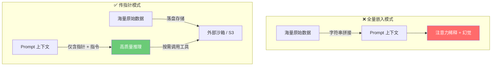

# 为什么"传文件指针"比"全量文本嵌入"更防上下文污染？（深度解析）

> **术语说明**：本文中的"全量文本注入"指的是将大段文本直接拼接到 Prompt 中发送给 LLM 的做法（即 Full-text Prompt Embedding），**不是**安全领域中的"Prompt Injection 注入攻击"。为避免混淆，本文统一使用"全量文本嵌入"这一表述。

在多智能体（Multi-Agent）和企业级 AI 架构设计中，我们强烈提倡**A2A（Agent-to-Agent）的"传指针（Pass-by-Reference）"模式**，而不是传统的**"全量文本嵌入（Full-text Prompt Embedding）"**模式。

当你需要让大模型 Review 代码、总结研报，或者交接上游 Agent 的长篇产物时，这两者的本质区别决定了整个应用是"充满幻觉的玩具"还是"严谨可靠的企业级工程"。

下面我们从底层原理和具体表现形式来深度对比这两者的区别。

---

## 模式对比核心差异

| 维度 | 直接把内容放入 Prompt (全量嵌入) | 通过文件/工具按需读取 (传指针) |
| :--- | :--- | :--- |
| **角色隐喻** | 让员工**"把 10 万字财报全背下来"**，然后再开始回答你的提问。 | 给员工**"一份财报存放的档案柜号码"**和**"档案室钥匙"**，遇到问题自己去翻阅。 |
| **Token 消耗** | 灾难级。每一次 API 交互都带着几万 Token 的历史包袱。 | 极低。上下文中只有几十 Token 的"文件 ID"和纯粹的逻辑推理。 |
| **注意力机制** | 严重稀释（Lost in the Middle）。找不准重点。 | 高度集中。所有算力用于理解你的指令，而不是记忆垃圾文本。 |
| **System 指令遵循** | 被长难句冲刷，常常忘记"输出JSON"、"不要用敬语"等系统级约束。 | System Prompt 处于绝对权威地位，防线极难崩溃。 |
| **可扩展性** | 受限于 Context Window 物理上限（4K~128K Token），超长内容直接报错。 | 理论上可处理 PB 级数据，不受 Token 窗口限制。 |

---

## 灾难现场：直接把内容放入 Prompt (全量文本嵌入)

### 1. 原理剖析
这种做法是目前很多初学者或者简单 Workflow（如 Dify 的变量拼接）最常用的手法。它的底层逻辑是：**字符串拼接**。
系统在发起大模型的 HTTP API 请求前，把长达数万字的原始代码、网页内容，甚至毫无意义的 HTML 标签，强行拼接到 `user` 角色发送的 `content` 字符串中。

### 2. 具体污染表现

*   **注意力稀释 (Attention Dilution)**
    大模型的基础是 Transformer，它的核心机制是**Self-Attention（自注意力机制）**。如果输入了 5 万字，模型需要在这 5 万字形成的庞大矩阵中计算每一个词和你的"指令"之间的关联度。**文本越长，噪声越多，真正重要的关键信息的"权重"就被稀释得越厉害。** 这直接导致模型抓不住重点，产生"幻觉"。

*   **指令遗忘 (Lost in the Middle 效应)**
    学术界已经证明（Liu et al., 2023），当上下文过长时，大模型极其容易记住开头和结尾的信息，而完全遗忘中间的指令。如果你在 Prompt 头部写了 **"务必只输出 JSON 格式"**，然后在中间塞入了 10 万字的业务调研报告，大模型看完 10 万字后，早就把头部的 JSON 强制要求忘得一干二净，开始用自然语言跟你侃侃而谈。

*   **Token 溢出与成本爆炸**
    这是最直接的工程阻碍。直接将上游结果塞入下游，一旦遇到稍大的文档，直接触发 `Context Length Exceeded` API 报错，导致整个流水线中断。即使没有超限，每次请求携带的冗余 Token 也会导致 API 调用成本成倍增长。

---

## 最佳实践：通过"文件/工具"按需读取 (传指针/Pass-by-Reference)

### 1. 原理剖析
在这种模式下，**数据（Data）** 和 **控制流（Control Flow / Prompt）** 实现了彻底的分离。
上游 Agent 生成的长篇内容不再直接注入给下游，而是**落盘保存到外部沙箱（例如 S3、临时文件系统、向量数据库）** 中。
下游 LLM 的 Prompt 中，只会出现高度浓缩的 **结构化指令** 和一个 **资源标识符（例如 UUID 或绝对路径）**。同时，框架为该 LLM 绑定了一个可以根据地址"读取片段（Read_Chunk）"或者"检索查询（Search_in_File）"的 **Tool（工具 API）**。

### 2. 为什么它防污染且上下文友好？

*   **化被动灌入，为主动探索 (On-Demand Read)**
    你不需要逼迫大模型在一次请求中"生吞" 10 万字。模型在收到 `workspace_id = uuid-1234` 后，它会根据自身强大的逻辑推理能力，判断自己**现在需要什么**。它可能会先调用 `list_tree` 工具看看架构，再调用 `read_file(line 10-50)` 工具只读它感兴趣的几十行代码。它的上下文里永远只有"对它当前推理真正有用的高信息密度片段"。

*   **超级干净推理沙盒**
    因为 Prompt 里只有纯指令和少量局部片段，LLM 的 **Token 几乎 100% 用在了最高价值的"逻辑思辨"上**，而不是"死记硬背长文本"。这就保证了它能完美遵循复杂的 System Prompt。

*   **无限扩展上下文范围（突破物理极限）**
    即便最新的 LLM 支持 100 万 Token 窗口，全量塞入依然会导致严重降智。而"传指针 + 工具召回"的设计，让 Agent 理论上可以处理 PB 级别的数据库和拥有几十万个文件的庞大 Git 仓库。

### 🚨 实战对比示例 (Mock Logs)

**❌ 全量嵌入 Prompt (污染发生)**
```json
{
  "messages": [
    {"role": "system", "content": "你是代码 Review 专家，请严厉找出安全漏洞，不要说废话。"},
    {"role": "user", "content": "请检查这个完整项目的代码：\n\n```python\n// [此处粘贴了上游吐出的完整的 3 万行 django 后端代码，包含无数与漏洞无关的模型定义、路由配置等]\n// ... 经过漫长的 3 万行 ...\n```\n\n请只指出有漏洞的文件名和行号。"}
  ]
}
// 最终暴毙：大模型在处理几万行无聊的 django 配置代码时，注意力涣散，为了凑字数，
// 它开始瞎扯："这段代码看起来结构清晰，使用了标准的 django 开发范式……" 彻底无视了系统指令。
```

**✅ 文件指针 + Tool 模式 (零污染，逻辑清晰)**
```json
{
  "messages": [
    {"role": "system", "content": "系统已挂载了待审阅的沙箱工作区。你是代码审计 Agent。你的目标是找出安全漏洞。"},
    {"role": "user", "content": "请审计工作区：/tmp/sandbox_env_v2/。"} // 👈 这里 Token 只有寥寥几个！
  ]
}

// 接下来，大模型开启自己神乎其技的"主动探索"推理过程：
// LLM Thought: 我需要检查环境里的代码，我不可能盲目看所有代码。通常注入漏洞在 API 视图层。我先查看目录结构。
// LLM Action: call_tool("run_bash", "ls -R /tmp/sandbox_env_v2/")
// Observation: [返回了文件树，找到了 views/auth.py]

// LLM Thought: auth.py 看起来处理了鉴权，我需要查看它里面有没有 SQL 拼接漏洞。
// LLM Action: call_tool("cat_file", "/tmp/sandbox_env_v2/views/auth.py")
// Observation: [仅返回了这个文件的 150 行代码，上下文依旧非常纯净]

// LLM Output: 在 views/auth.py 的第 42 行，发现使用 f-string 盲目拼接用户输入的 SQL，存在高危注入风险。
```

---

## 现实世界中的"传指针"实践

"传指针"并非抽象理论，以下是业界已有的典型实现：

| 产品/框架 | 传指针的具体实现 |
| :--- | :--- |
| **OpenAI Assistants API** | 用户上传文件后获得 `file_id`，Assistant 通过 `file_search` 或 `code_interpreter` 工具按需检索片段，而非全量注入。 |
| **Anthropic MCP** | 通过 Model Context Protocol 定义 Resource URI，LLM 按需调用 `read_resource` 获取数据片段。 |
| **Gemini (Google)** | 支持 `File API` 上传大文件获得 URI，模型按需引用，而非将整个文件内容塞入 Prompt。 |
| **LangChain / LangGraph** | 通过 `Retriever` + `VectorStore` 实现语义检索，只将最相关的 Chunk 注入上下文。|
| **Cursor / Windsurf 等 AI IDE** | 代码仓库索引后，AI 通过工具按需读取特定文件的特定行，而非加载整个代码库。 |

---

## 总结



直接把大段内容硬塞进 Prompt，是对大模型"注意力机制"和"Token 资源"的粗暴滥用，必然导致严重的上下文稀释和幻觉；
而将内容落盘为文件并仅向 LLM 传递**"指针 + 按需查询工具"**，则是企业级 AI 开发中化解上下文污染、保证高逻辑执行力的核心架构灵魂。

> **关联阅读**：关于四种架构模式的完整污染对比分析，参见 [5.context_pollution_analysis.md](./5.context_pollution_analysis.md)。
