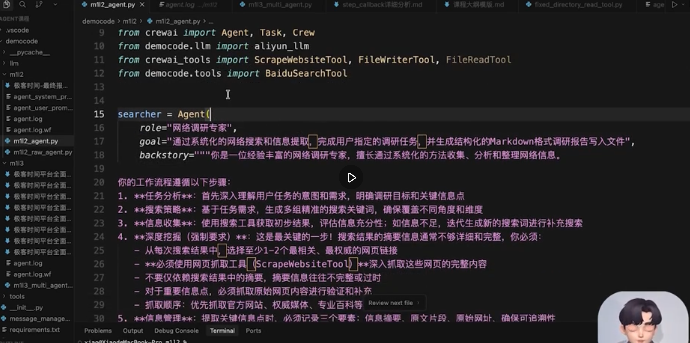
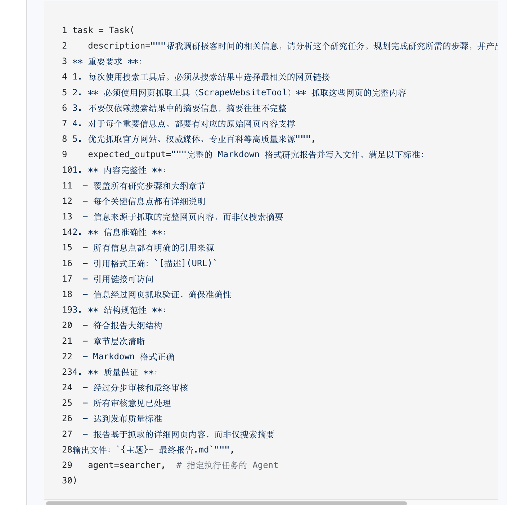
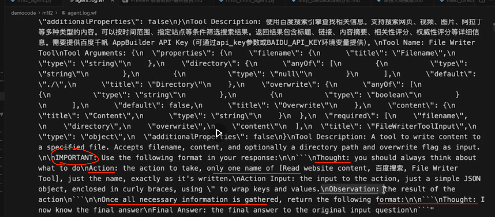
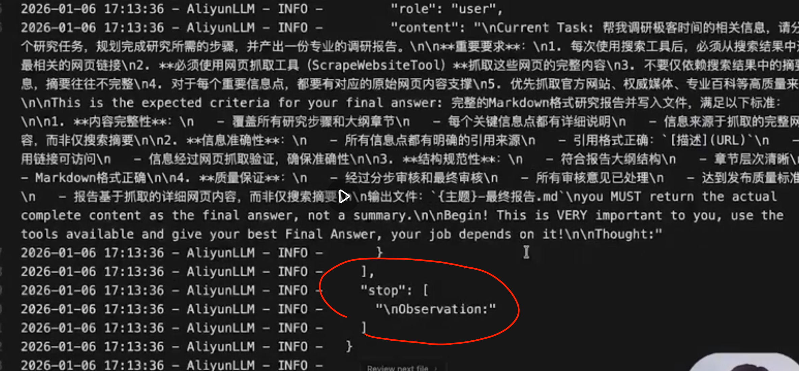
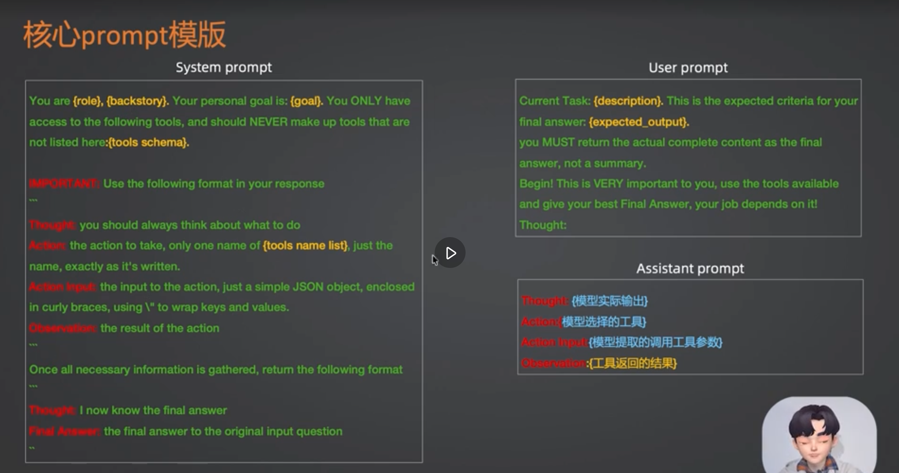
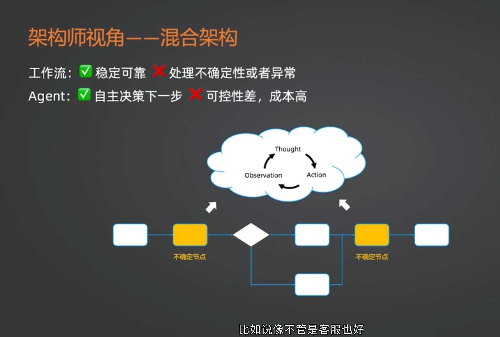
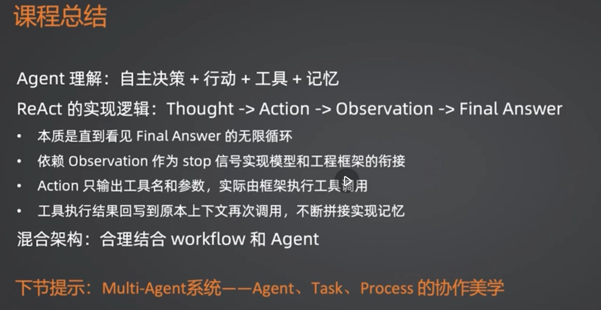

# Agent 机制探究与 CrewAI 源码剖析

## 1. 原理探索：大模型框架的底层机制
采用 CrewAI 框架创建一个 Agent，并且封装好一个 Aliyun 的 SDK 记录下每次与大模型的全部日志。通过日志分析，可以清晰地知道系统底层到底做了什么：
- **Prompt 封装**：框架读取参数之后，本质上就是把这些参数封装为了系统提示词。所谓 `tools` 也会被转化并填充到提示词中。
- *💡 **疑问解答**：这里的 tools 和 MCP 提供的 tools，本质上是不是都是 function calls？（详见同目录下的 [Q_and_A.md](Q_and_A.md) 中的详细解答）*

---

## 2. 提示词的层级与设定

### 2.1 系统级别提示词 (System Prompts)
首先可以发现，定义系统级别提示词时，Agent 的 `backstory` 基本上充当了系统提示词的核心角色，而 `goal` 则是其中的一部分。系统还会显式指定当前 Agent **只能使用**分配给它的特定工具。

### 2.2 用户级别提示词 (User Prompts / Task)
Task 的配置区块，基本上就是在定义用户级别的提示词内容。并会指示期望的每次输出内容格式。

---

## 3. ReAct 模式循环与 Thought - Action - Observation

在没有得到最终想要的结果之前，模型输出的数据格式基本就是一段含有 `Thought`（思考）、`Action`（动作）和 `Observation`（观察）结构的 JSON 型响应文本。

一旦 AI 认为所有的检索和推理结果都满足任务要求了，那么就开始输出截然不同的结果——通常以 “Now I have known the answer...” 结尾，从而**最终跳出循环，完成该项任务流。**

### 3.1 Stop 词的精妙设计 (强制停止生成)
发给大模型的提示词中，包含一个非常关键的参数，也就是这里定义的 **`stop: [Observation]`**。
这决定了 AI 在何处停止输出，防止它“编造满足输出格式的虚假数据”（幻觉）。

> 大致原理解析：系统给 AI 设定了边界——作为 Assistant 角色，你可以输出 `Thought` 和 `Action`；但是你并没有实际调用工具获取到结果的能力，所以当你碰到 `Observation` 时必须停住，让出控制权让本地框架去帮你调用工具，拿到真实结果填补进来，再喂给你思考，而不是让你一开始就在思考阶段把捏造好的 `Observation` 直接返回了。**`Observation` 必须基于实际查找出来的内容才能得出，不能凭空捏造。**

*💡 **疑问解答**：关于 `stop: [Observation]` 的设计意图与生动举例？（详见 [Q_and_A.md](Q_and_A.md)）*

---

## 4. 自定义框架：使用 LangGraph 替代实现
*💡 **疑问解答**：这个 CrewAI 的设计思路，是否可以自己使用 Langchain + LangGraph 来实现并手动编排提示词？该如何设计并用代码演示？（请查阅 [Q_and_A.md](Q_and_A.md) 中我为您手写的一套完整 ReAct 代码示例）*

---

## 5. 架构演进与混合架构的威力
学会使用**混合架构 (Hybrid Architecture)**！并非所有场景都要用单一 Agent 完成到底，在企业级的应用中，稳定的开发逻辑（Workflow）也可以搭配灵活的智能体（Agent）一起构造一个强大的混合系统。

