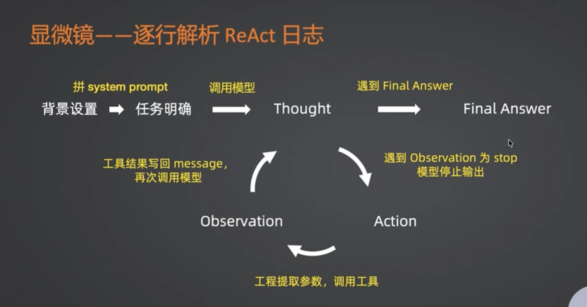
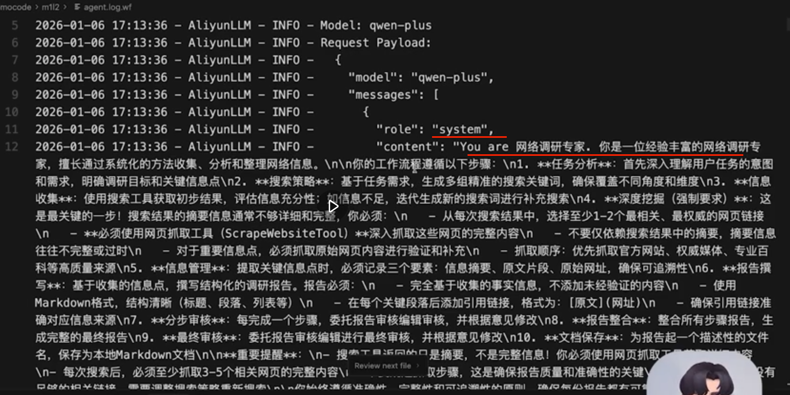
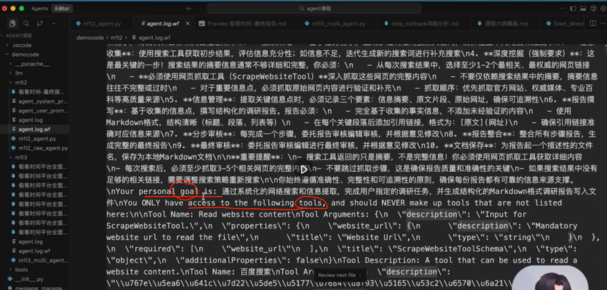
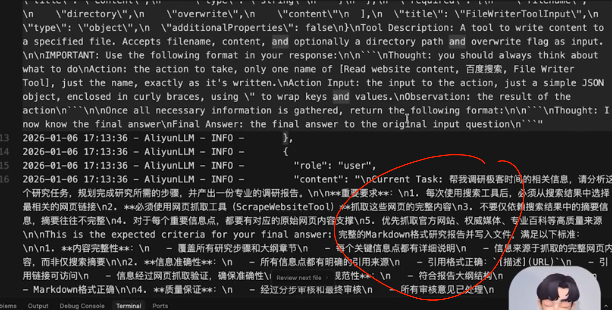
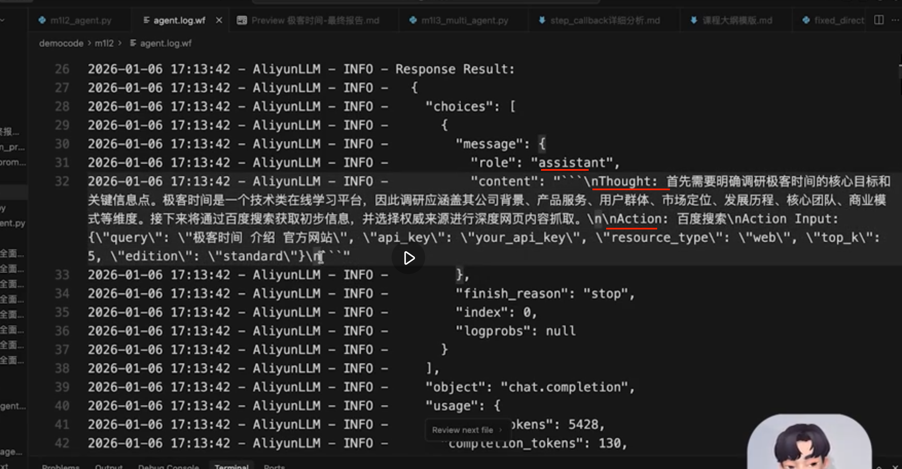

采用crewAI框架创建一个agent，并且封装好一个aliyun的sdk记录下每次和crewAI的log数据。就可以知道底层到底做了什么。通过日志你会发现，框架读取参数之后，本质上就是把这些参数封装为了提示词，类似于tools之类的。这个地方的tools和mcp提供的tools不知道本质上是不是一个概念，问问ai解答一下，是不是本质上他们都是function calls？
首先可以发现，定义系统级别提示词，backstory基本上就是定义系统提示此，goal就是里面的一部分，可以看到这里还会指定只能用这些工具，

task这块基本就是定义user级别提示词

而且每次输出的内容应该是什么格式。没有得到想要的结果之前，那么数据的格式就是一个json，里面包含了thought，action，observation。一旦ai认为所有的结果都满足要求了，那么就开始输出不一样的结果了，也就是这里的“Now I have known the answer...”,最终跳出循环，完成最终的任务

这一这里发给大模型的提示词里面有一个stop标志很关键，那就是这里定义的stop:[Observation],他决定了ai什么时候停止输出，而不是编造满足输出格式的数据，这里没搞懂，问问ai帮我解释crewAI里面这个设计思路，帮我解释它的目的，最好举例说明。

大概的理解就是给ai说了，作为assistant角色，你的输出内容可以包含thought，action。但是呢，你并没有实际调用工具获取到结果，因此下面的步骤就是调用你上一步思考的工具列表去查询结果，然后在汇总结果，思考以后输出你们的observation。 而不是一开始就在思考阶段就把observation给我返回了。observation是必须基于实际查找出来的内容才能得出的，而不是你凭空捏造的。

这个crewAI的设计思路是不是可以自己使用langchain+langgraph来实现，同样可以自己编排他的提示词之类的。让ai帮我解释，以及大概的设计思路，最好有代码示例，给我我一个sample类型的代码

