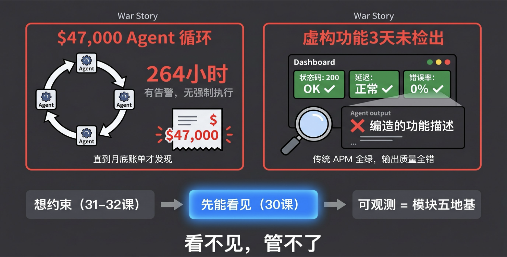
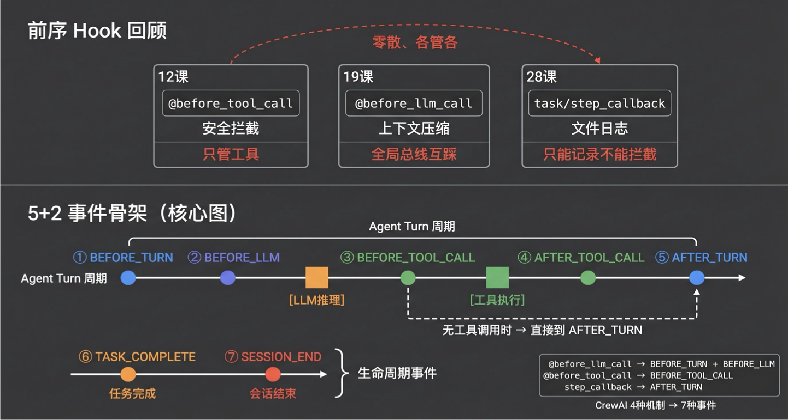
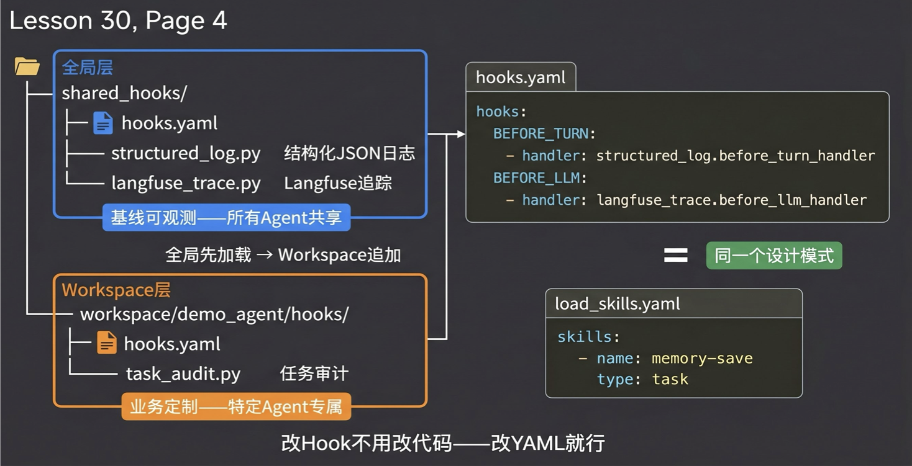
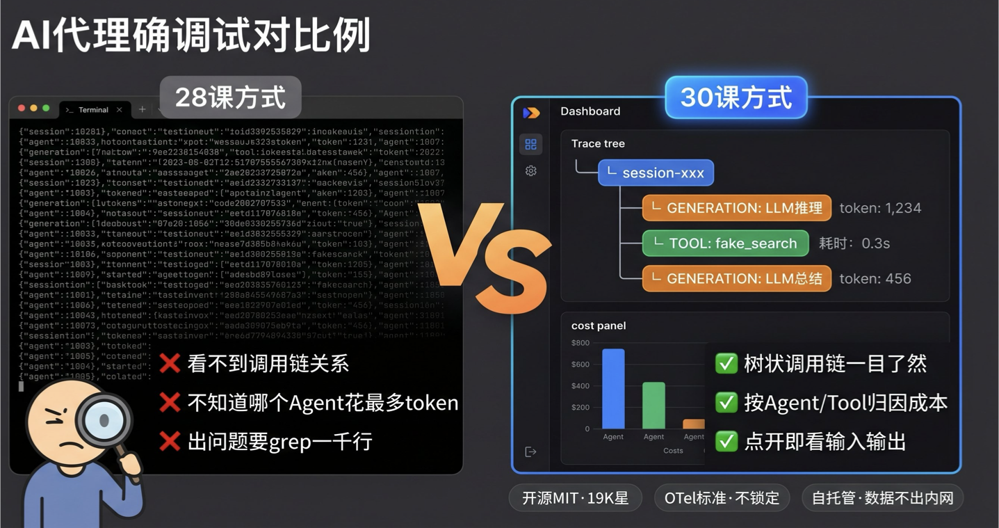
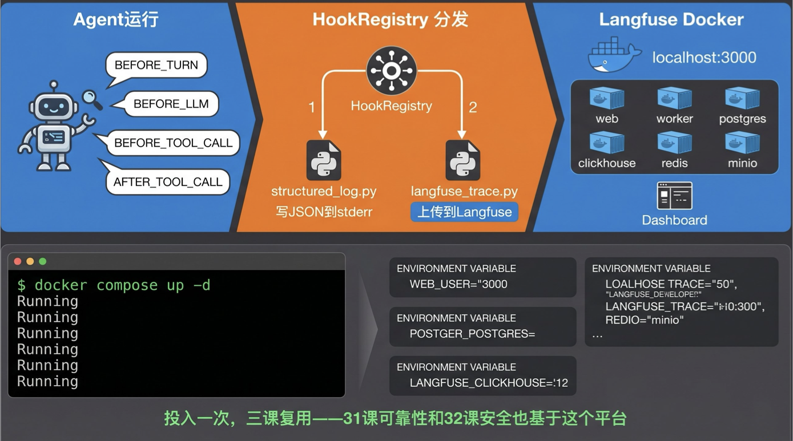
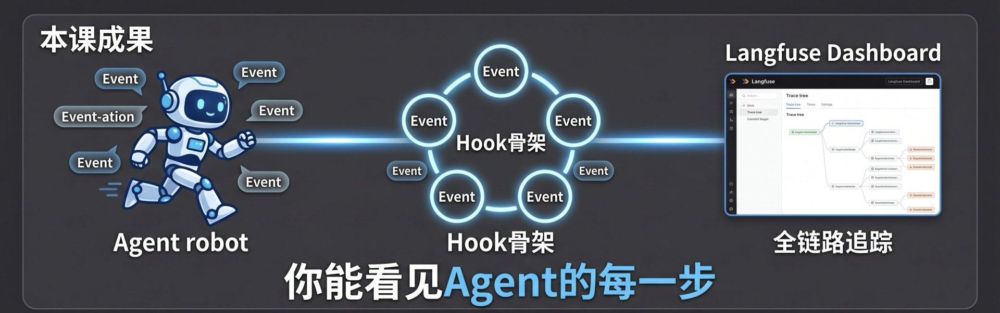

# 模块五第一课：Agent 可观测性与 Langfuse

> 核心观点：你无法约束你看不见的东西。

前四个模块，我们一路给 Agent 赋能：

- 架构思维让它选对范式
- 工具和 Skills 让它能干活
- 上下文工程让它有记忆
- 协作设计让它组团队

到现在，你的 Agent 团队在功能上已经完整：能推理、能调工具、能记事、能分工。

但“能干活”和“能上生产”之间，隔着一个巨大的鸿沟。一个团队在测试环境跑得好好的，到了生产环境，可能会出现这些事故：

- Agent 在后台陷入死循环跑了 264 小时，直到月底账单出来才发现烧掉了 `$70,000+`
- Agent 编造的功能描述上线 3 天，传统监控却一片绿

这些不是假设场景，而是真实的工程事故。模块五要做的，就是把“能干活”和“能上生产”之间的鸿沟填上：可观测性、可靠性、安全，三课把企业级加固补完。



今天是模块五的第一课，也是整个模块的地基。想给 Agent 加重试、加熔断、加成本围栏，第一个问题是：你知道它现在在干什么吗？

## 目录

- [一、认知原点：可观测性到底是什么？](#一认知原点可观测性到底是什么)
- [二、为什么需要新框架：零散 Hook 的崩溃时刻](#二为什么需要新框架零散-hook-的崩溃时刻)
- [三、Hook 骨架：5+2 事件体系 + 两层配置](#三hook-骨架52-事件体系--两层配置)
- [四、从日志到平台：接入 Langfuse](#四从日志到平台接入-langfuse)
- [五、深入框架：CrewAI 适配层的映射机制](#五深入框架crewai-适配层的映射机制)
- [六、实战：从零到 Langfuse Dashboard](#六实战从零到-langfuse-dashboard)
- [七、避坑指南：最佳实践与反模式](#七避坑指南最佳实践与反模式)
- [课程总结](#课程总结)
- [课末学习活动](#课末学习活动)

## 一、认知原点：可观测性到底是什么？

Agent 的可观测性，本质就是给 Agent 的运行过程装上“黑匣子”：不是 Agent 自己写的日记，而是外部独立的飞行记录仪。

传统软件的可观测性有三支柱：`Metrics`、`Logging`、`Tracing`。但在 Agent 场景下，这三支柱的含义发生了质变。

| 支柱 | 传统软件关注什么 | Agent 场景关注什么 |
| --- | --- | --- |
| Metrics | 延迟、错误率 | token 消耗、工具成功率、推理步数。`200 OK` 不代表输出正确 |
| Logging | 行级文本日志 | 结构化事件流，每个事件带 `agent_id`、`turn_number`、`tool_name` |
| Tracing | 一个 HTTP 请求经过哪些服务 | 一个用户指令经过几轮推理、调了哪些工具、每轮花了多少 token |

这里有一个最基础的原则必须明确：

> 可观测性一定不是由模型来做的。

有些方案让模型自己打日志、自己汇报状态，这完全不可靠。整个模块五的所有内容：可观测、护栏、安全，都必须放在工程层，也就是 Harness 层去做。

原因很简单：模型是完全不可信的。让被监控对象自己报告监控数据，等于让考生自己批改试卷。只有用工程手段独立观测，才能保证护栏真的生效。

> 回忆一下：第 18 课讲过 Harness 三支柱：`Context Engineering`、`Architectural Constraints`、`Garbage Collection`。
>
> 模块三完成了第一个支柱，上下文工程；模块四部分完成了第二个，协作架构约束。模块五补完后两个支柱，而可观测性是补完的前提条件：看不见，就无法约束。

## 二、为什么需要新框架：零散 Hook 的崩溃时刻



你可能会说：“我们之前不是已经用过 Hook 了吗？”

确实用过，而且不止一次。

| 课号 | 用了什么 | 做了什么 | 问题在哪 |
| --- | --- | --- | --- |
| 第 12 课 | `@before_tool_call` | 工具安全拦截 | 只管工具调用，LLM 推理过程完全看不见 |
| 第 19 课 | `@before_llm_call` | 上下文压缩 | 注册在全局总线上，多 Agent 共享同一个 Hook 列表，互相影响 |
| 第 28 课 | `task_callback` / `step_callback` | 三层日志 | 回调只能记录，不能拦截；而且是 Agent 内部视角的自报告 |

三个课、三种 Hook 机制，各管各的。这就像 12 课装了门禁，19 课装了烟感，28 课装了摄像头，但三套系统各自为政，门禁的告警到不了摄像头。

更关键的问题是：28 课的三层日志是 Agent 自己写的文件日志，属于 Agent 自报告。

安全领域有个基本常识：被监控对象的自报告不可信。不是说 Agent 在撒谎，而是它的 self-assessment 天然有偏差。Reflexion 论文已经证明，犯错的 Agent 倾向于合理化，而不是纠正。

为什么不直接在现有 Hook 上改进，而要搭一套新系统？因为问题出在架构层面。

| 问题 | 表现 |
| --- | --- |
| 事件类型不统一 | `@before_tool_call` 管工具，`@before_llm_call` 管 LLM，`step_callback` 管步骤。三种机制，三种注册方式，三种生命周期 |
| 全局污染 | CrewAI 的 `@before_llm_call` 是模块级全局列表，第 29 课用 `asyncio.Lock` 才勉强解决多 Agent 互相影响 |
| 配置固化 | Hook 都 hardcode 在代码里，改一个 Hook 就要改代码重部署 |

这课我们做的事，是装一个中控系统。后面 31 课的熔断、32 课的权限检查，全部是这个中控系统的插件：插在同一个骨架上，通过配置文件添加，不用改架构代码。

## 三、Hook 骨架：5+2 事件体系 + 两层配置

> 课程说明：本节代码已同步至 GitHub：<https://github.com/kid0317/crewai_mas_demo/blob/main/m5l30/>

### 3.1 对齐 Agent Turn 周期的 5+2 事件

怎么统一那些零散的 Hook？关键洞察是：所有 Agent 框架的执行单元都是 `Turn`。

Agent 想一步，也就是 LLM 推理；做一步，也就是工具调用。这就是一个 `Turn`。把事件类型对齐到 Turn 周期，就能覆盖 Agent 运行的每一个关节。

#### Agent Turn 周期：5 个事件

```text
BEFORE_TURN ──→ BEFORE_LLM ──→ [LLM 推理] ──→ BEFORE_TOOL_CALL ──→ [工具执行] ──→ AFTER_TOOL_CALL ──→ AFTER_TURN
                                                （无工具调用时直接 → AFTER_TURN）
```

#### 生命周期事件：2 个事件

```text
TASK_COMPLETE（任务完成）
SESSION_END（会话结束）
```

为什么是 5+2，而不是更多？

参考 Claude Code 的设计，它有 26+ 事件类型，但核心就是 `PreToolUse`、`PostToolUse`、`Stop` 这几个。我们取其精华：

- Turn 级 5 个事件覆盖执行细节
- 生命周期 2 个事件覆盖边界清理
- 第 31 课的重试和熔断注册在 `BEFORE_LLM` 和 `BEFORE_TOOL_CALL` 上
- 第 32 课的权限检查注册在 `BEFORE_TOOL_CALL` 上

同一个骨架，不同的插件。

这 7 种事件怎么对接 CrewAI 的 4 种 Hook 机制？这是适配层的核心工作。

| CrewAI 机制 | 映射到的事件 | 映射逻辑 |
| --- | --- | --- |
| `@before_llm_call` | `BEFORE_TURN`（首次）+ `BEFORE_LLM`（每次） | 用计数器区分：一轮内第一次 LLM 调用触发 `BEFORE_TURN`，后续只触发 `BEFORE_LLM` |
| `@before_tool_call` | `BEFORE_TOOL_CALL` | 直接映射 |
| `@after_tool_call` | `AFTER_TOOL_CALL` | 直接映射 |
| `step_callback` | `AFTER_TURN` | 每步推理完成后触发，同时重置“首次 LLM”标记 |
| `task_callback` | `TASK_COMPLETE` | 直接映射 |
| 手动调用 | `SESSION_END` | cleanup 时触发，清理全局 hooks |

### 3.2 HookRegistry：核心分发引擎



`HookRegistry` 是整个系统的心脏：接收事件，分发给所有注册的 handler。核心逻辑不到 30 行。

```python
# hook_framework/registry.py
class EventType(Enum):
    BEFORE_TURN = "before_turn"
    BEFORE_LLM = "before_llm"
    BEFORE_TOOL_CALL = "before_tool_call"
    AFTER_TOOL_CALL = "after_tool_call"
    AFTER_TURN = "after_turn"
    TASK_COMPLETE = "task_complete"
    SESSION_END = "session_end"


@dataclass(frozen=True)
class HookContext:
    event_type: EventType
    timestamp: str = field(default_factory=lambda: datetime.now(timezone.utc).isoformat())
    agent_id: str = ""
    task_name: str = ""
    tool_name: str = ""
    tool_input: dict = field(default_factory=dict)
    input_tokens: int = 0
    output_tokens: int = 0
    duration_ms: float = 0
    success: bool = True
    session_id: str = ""
    turn_number: int = 0
    metadata: dict = field(default_factory=dict)


class HookRegistry:
    def __init__(self):
        self._handlers: dict[EventType, list[Callable]] = defaultdict(list)
        self._handler_names: dict[EventType, list[str]] = defaultdict(list)

    def register(self, event_type: EventType, handler: Callable, name: str = ""):
        self._handlers[event_type].append(handler)
        self._handler_names[event_type].append(
            name or getattr(handler, "__name__", repr(handler))
        )

    def dispatch(self, event_type: EventType, context: HookContext):
        for handler in self._handlers[event_type]:
            try:
                handler(context)
            except Exception as e:
                print(
                    f"[HookRegistry] {event_type.value} handler error: {e}",
                    file=sys.stderr,
                )

    def summary(self) -> dict[str, list[str]]:
        """自省接口：返回所有注册的 handler，启动时打印确认配置正确。"""
        return {
            et.value: list(names)
            for et, names in self._handler_names.items()
            if names
        }
```

四个关键设计决策：

| 设计 | 价值 |
| --- | --- |
| `HookContext` 是 frozen dataclass | handler 只能读取上下文信息，不能修改，防止一个 handler 影响后续 handler 的行为 |
| 丰富的度量字段 | `input_tokens` / `output_tokens` 支持成本归因，`duration_ms` 支持性能分析，`success` 支持工具成功率统计 |
| `dispatch` 用 try-except 包裹每个 handler | 一个 handler 崩溃，比如 Langfuse 网络超时，结构化日志 handler 还能正常工作 |
| 实例级注册，不是全局注册 | 解决第 29 课暴露的全局总线污染问题。每个 Crew 有自己的 `HookRegistry` 实例 |

`summary()` 方法支持自省，启动时打印所有注册的 handler，确认配置正确。

### 3.3 两层配置：全局 + Workspace

你已经习惯了 Skills 放在 workspace 目录下，用 yaml 配置，框架自动加载。Hooks 完全一样：yaml 里写好“什么事件触发什么脚本”，框架启动时自动加载。改 Hook 不用改代码，改 yaml 就行。

```text
shared_hooks/                          ← 全局 Hook（基线可观测，所有 Agent 共享）
  hooks.yaml                           # 事件 → handler 映射
  structured_log.py                    # 结构化 JSON 日志（→ stderr）
  langfuse_trace.py                    # Langfuse 追踪（→ Docker）

workspace/demo_agent/hooks/            ← Workspace Hook（业务定制，仅本 Agent）
  hooks.yaml
  task_audit.py                        # 任务审计日志（→ audit.log）
```

全局层的 `hooks.yaml` 长这样：

```yaml
# shared_hooks/hooks.yaml
hooks:
  BEFORE_TURN:
    - handler: structured_log.before_turn_handler
  BEFORE_LLM:
    - handler: structured_log.before_llm_handler
    - handler: langfuse_trace.before_llm_handler
  BEFORE_TOOL_CALL:
    - handler: structured_log.before_tool_handler
    - handler: langfuse_trace.before_tool_handler
  AFTER_TOOL_CALL:
    - handler: structured_log.after_tool_handler
    - handler: langfuse_trace.after_tool_handler
  AFTER_TURN:
    - handler: structured_log.after_turn_handler
    - handler: langfuse_trace.after_turn_handler
  TASK_COMPLETE:
    - handler: langfuse_trace.task_complete_handler
  SESSION_END:
    - handler: langfuse_trace.flush_and_close
```

两层的关系是追加不覆盖：全局层先加载，Workspace 层追加。

所以 `BEFORE_TURN` 事件触发时，会先执行全局的 `structured_log.before_turn_handler`，再执行 workspace 的自定义 handler，如果有的话。

这和第 16 课的 `load_skills.yaml` 没有本质区别：

- `load_skills.yaml` 管技能加载
- `hooks.yaml` 管事件拦截

同一个设计模式：配置文件声明“加载什么”，框架负责自动发现和导入。这个模式在 Claude Code 里叫 `userSettings + projectSettings` 合并，在我们的体系里叫“全局 + Workspace 两层配置”。

### 3.4 HookLoader：自动发现与导入

`HookLoader` 负责读取 `hooks.yaml`、动态导入 handler 模块、注册到 `HookRegistry`。

```python
# hook_framework/loader.py
class HookLoader:
    def __init__(self, registry: HookRegistry):
        self._registry = registry
        self._module_cache: dict[str, object] = {}

    def load_from_directory(self, hooks_dir: Path, layer_name: str = ""):
        yaml_path = hooks_dir / "hooks.yaml"
        if not yaml_path.exists():
            return

        with open(yaml_path) as f:
            config = yaml.safe_load(f)

        for event_name, handler_list in config.get("hooks", {}).items():
            event_type = EventType(event_name.lower())
            for entry in handler_list:
                handler_ref = entry["handler"]
                module_name, func_name = handler_ref.rsplit(".", 1)
                module_path = (hooks_dir / f"{module_name}.py").resolve()

                if not module_path.is_relative_to(hooks_dir.resolve()):
                    print(
                        f"[HookLoader] path traversal blocked: {handler_ref}",
                        file=sys.stderr,
                    )
                    continue

                if not module_path.exists():
                    continue

                fq_name = f"hooks.{layer_name}.{module_name}"
                if fq_name in self._module_cache:
                    module = self._module_cache[fq_name]
                else:
                    spec = importlib.util.spec_from_file_location(fq_name, module_path)
                    module = importlib.util.module_from_spec(spec)
                    spec.loader.exec_module(module)
                    self._module_cache[fq_name] = module

                handler_fn = getattr(module, func_name, None)
                if handler_fn is None:
                    continue

                display = f"[{layer_name}] {handler_ref}"
                self._registry.register(event_type, handler_fn, name=display)

    def load_two_layers(self, global_dir: Path, workspace_dir: Path):
        self.load_from_directory(global_dir, layer_name="global")
        ws_hooks = workspace_dir / "hooks"
        if ws_hooks.exists():
            self.load_from_directory(ws_hooks, layer_name="workspace")
```

这里用 `importlib.util.spec_from_file_location`，而不是普通 `import` 语句。原因是 handler 脚本的路径是运行时从 yaml 里读出来的，不在 Python 的 import 搜索路径上。

两个容易忽略的关键设计：

| 设计 | 为什么重要 |
| --- | --- |
| 模块缓存 `_module_cache` | `importlib.util.module_from_spec()` 每次调用都会创建新的模块实例。如果同一个 YAML 中多次引用同一模块，不缓存会导致每个 handler 持有独立的模块级全局状态，Langfuse 的 span 栈机制会直接失效 |
| 路径穿越防护 | `module_path.is_relative_to(hooks_dir.resolve())` 阻止 `../../malicious.handler` 之类的攻击。配置文件可编辑，不做这个检查等于开了个后门 |

## 四、从日志到平台：接入 Langfuse



### 4.1 为什么文件日志不够

有了 Hook 骨架，最简单的 handler 就是写结构化日志。这是 `structured_log.py` 做的事：每个事件输出一行 JSON 到 stderr。

```python
# shared_hooks/structured_log.py
def _emit(ctx):
    record = {
        "timestamp": ctx.timestamp,
        "event": ctx.event_type.value,
        "session_id": ctx.session_id,
        "turn": ctx.turn_number,
    }

    if ctx.agent_id:
        record["agent_id"] = ctx.agent_id
    if ctx.tool_name:
        record["tool"] = ctx.tool_name
    if ctx.input_tokens or ctx.output_tokens:
        record["tokens"] = {
            "input": ctx.input_tokens,
            "output": ctx.output_tokens,
        }

    print(json.dumps(record, ensure_ascii=False), file=sys.stderr)
```

这比第 28 课的文件日志好多了：结构化、带 `session_id`、带 `turn` 编号。

但你试过 grep 一千行 JSON 找一个 Agent 的循环吗？

文件日志有三个致命短板：

| 短板 | 说明 |
| --- | --- |
| 看不到调用链关系 | 日志是扁平的一行行文本，看不出“这个工具调用是哪次 LLM 推理触发的” |
| 没有成本归因 | 你知道总共花了多少 token，但不知道是哪个 Agent 的哪个工具花的 |
| 没有可视化 | 出了问题要 grep、要 jq、要肉眼扫，效率极低 |

这就是为什么业界会接可观测性平台：追踪、成本、可视化一站式。

### 4.2 为什么选 Langfuse

Agent 可观测平台不少：LangSmith、Datadog LLM Observability、Arize Phoenix、Langfuse。课程选择 Langfuse，有三个理由：

| 理由 | 价值 |
| --- | --- |
| 开源 MIT，19K+ stars | 可以自托管，数据不出内网，这是企业环境的硬需求 |
| 基于 OpenTelemetry 标准 | 不锁定供应商。今天用 Langfuse，明天换 LangSmith 或 Datadog，span 格式是通的 |
| Python 原生 SDK | CrewAI 有官方集成，通过 OpenInference，接入成本低 |

Langfuse 给你的核心能力：

- Trace 树：完整 Agent Loop 可视化。根节点是用户请求，子节点是每一步推理和工具调用，点开就能看输入输出
- 成本面板：按模型、按 Agent、按 Session 聚合 token 消耗
- Prompt 版本管理：在平台上管理 Prompt 模板，关联到 trace

### 4.3 Langfuse 作为 Hook handler 接入

Langfuse 在我们的架构里不是一个独立组件，而是 Hook 系统的一个 handler。

Hook 捕获事件，handler 决定怎么处理：

- 写日志是一个 handler
- 上传 Langfuse 是另一个 handler
- 未来第 31 课的成本检查也是一个 handler

全部插在同一个骨架上。

```text
Agent 运行 → Hook 事件触发 → HookRegistry 分发
    ↓                              ↓                ↓
正常执行               langfuse_trace.py     structured_log.py
                              ↓
                    Langfuse Docker（localhost:3000）
                              ↓
                      Dashboard 可视化
```

`langfuse_trace.py` 的核心设计：用模块级状态管理 trace 生命周期，用 span 栈实现树状嵌套。

```python
# shared_hooks/langfuse_trace.py
from langfuse import Langfuse
from langfuse.types import TraceContext

_client = None
_trace_id = None
_trace_context = None
_root_span = None
_root_span_id = None
_pending_spans: dict[str, object] = {}
_span_stack: list = []


def _ensure_client():
    global _client
    if _client is None:
        _client = Langfuse()
        atexit.register(lambda: _client.flush() if _client else None)
    return _client


def _ensure_trace(ctx):
    global _trace_id, _trace_context, _root_span, _root_span_id
    client = _ensure_client()
    if _trace_id is None:
        _trace_id = client.create_trace_id(seed=ctx.session_id)
        _trace_context = TraceContext(trace_id=_trace_id)
        _root_span = client.start_observation(
            trace_context=_trace_context,
            name=f"session-{ctx.session_id}",
            as_type="chain",
        )
        _root_span_id = _get_otel_span_id(_root_span)
    return _trace_context


def _get_parent_context():
    """栈顶 span 为父；栈空则 root span 为父。"""
    parent_id = _get_otel_span_id(_span_stack[-1]) if _span_stack else _root_span_id
    if parent_id:
        return TraceContext(trace_id=_trace_id, parent_span_id=parent_id)
    return _trace_context


def _get_root_context():
    """始终以 root span 为父，用于 GENERATION / TASK_COMPLETE。"""
    if _root_span_id:
        return TraceContext(trace_id=_trace_id, parent_span_id=_root_span_id)
    return _trace_context


def before_tool_handler(ctx):
    """BEFORE_TOOL_CALL: 开启 TOOL span → 压栈。"""
    _ensure_trace(ctx)
    client = _ensure_client()
    tc = _get_parent_context()
    span = client.start_observation(
        trace_context=tc,
        name=f"tool-{ctx.tool_name}",
        as_type="tool",
        input=ctx.tool_input or None,
        metadata={"tool": ctx.tool_name, "turn": ctx.turn_number},
    )
    key = f"{ctx.tool_name}:{ctx.turn_number}"
    _pending_spans[key] = span
    _span_stack.append(span)


def after_tool_handler(ctx):
    """AFTER_TOOL_CALL: 关闭 TOOL span → 出栈。"""
    key = f"{ctx.tool_name}:{ctx.turn_number}"
    span = _pending_spans.pop(key, None)
    if span:
        tool_output = ctx.metadata.get("tool_output", "")
        span.update(output=tool_output or None)
        span.end()
        if _span_stack and _span_stack[-1] is span:
            _span_stack.pop()


def after_turn_handler(ctx):
    """AFTER_TURN: 创建 GENERATION，始终挂在 root span 下。"""
    _ensure_trace(ctx)
    client = _ensure_client()
    tc = _get_root_context()
    gen = client.start_observation(
        trace_context=tc,
        name=f"turn-{ctx.turn_number}",
        as_type="generation",
        model=os.environ.get("AGENT_MODEL", "qwen-plus"),
        input=ctx.metadata.get("prompt_preview") or None,
        output=ctx.metadata.get("output") or None,
    )
    gen.end()


def flush_and_close(ctx):
    global _trace_id, _trace_context, _root_span, _root_span_id
    _span_stack.clear()

    for key, span in list(_pending_spans.items()):
        span.update(level="WARNING", status_message="orphaned-span-auto-closed")
        span.end()

    _pending_spans.clear()
    if _root_span:
        _root_span.end()
    if _client:
        _client.flush()

    _trace_id = None
    _trace_context = None
    _root_span = None
    _root_span_id = None
```

span 栈机制是整个 Langfuse handler 的精髓：

| 机制 | 说明 |
| --- | --- |
| `before_tool_handler` 压栈 | 主 Agent 调用 `skill_loader` 时创建一个 TOOL span 并压栈。Sub-Crew 的工具调用会以栈顶的 `skill_loader` span 为父节点，自动形成树状嵌套 |
| `after_tool_handler` 出栈 | 工具执行完毕后出栈，恢复上层 span 为父节点 |
| GENERATION 挂在 root 下 | LLM 推理结果用 `_get_root_context()` 始终挂在根 span 下，避免被嵌套到某个工具 span 内部 |
| 孤儿 span 清理 | `flush_and_close` 会把异常退出时残留的未配对 span 标记为 `WARNING` 并关闭，避免 Dashboard 上出现永远不结束的 span |

### 4.4 Langfuse 环境搭建



课程使用 Docker 自托管 Langfuse，6 个容器：

- web
- worker
- postgres
- clickhouse
- redis
- minio

听起来重，实际上 `docker compose up -d` 一行搞定，2-3 分钟就能访问 <http://localhost:3000>。

```bash
# 启动 Langfuse（课程机器上已搭好）
cd /path/to/langfuse
docker compose up -d

# 配置环境变量
export LANGFUSE_PUBLIC_KEY="pk-lf-xxx"
export LANGFUSE_SECRET_KEY="sk-lf-xxx"
export LANGFUSE_HOST="http://localhost:3000"
```

为什么不用 Langfuse Cloud？

企业环境里，数据不出内网是硬需求。而且自托管的好处是：这个环境后面第 31 课的可靠性策略和第 32 课的安全机制都要用。投入一次，三课复用。

## 五、深入框架：CrewAI 适配层的映射机制

到这里，你可能已经注意到一个问题：我们的 7 种事件类型和 CrewAI 提供的 4 种 Hook 机制之间，有一个映射层。

这一层不是简单的一对一，它做了几件巧妙的事。

`CrewObservabilityAdapter` 是这个映射层的实现。核心逻辑如下：

```python
# hook_framework/crew_adapter.py
class CrewObservabilityAdapter:
    def __init__(self, registry: HookRegistry, session_id: str = ""):
        self._registry = registry
        self._session_id = session_id
        self._turn_count = 0
        self._current_turn_has_llm = False
        self._cleaned = False
        self._last_agent_role = ""

    def install_global_hooks(self):
        registry = self._registry
        sid = self._session_id

        @before_llm_call
        def _before_llm(context):
            agent_id = getattr(getattr(context, "agent", None), "role", "")
            self._last_agent_role = agent_id

            if not self._current_turn_has_llm:
                self._turn_count += 1
                self._current_turn_has_llm = True
                registry.dispatch(
                    EventType.BEFORE_TURN,
                    HookContext(
                        event_type=EventType.BEFORE_TURN,
                        agent_id=agent_id,
                        session_id=sid,
                        turn_number=self._turn_count,
                    ),
                )

            registry.dispatch(
                EventType.BEFORE_LLM,
                HookContext(
                    event_type=EventType.BEFORE_LLM,
                    agent_id=agent_id,
                    session_id=sid,
                    turn_number=self._turn_count,
                ),
            )
            return None
```

这里有一个 CrewAI 的坑：为什么用了 `@before_llm_call`、`@before_tool_call`、`@after_tool_call`，却没有用 `@after_llm_call`？

因为注册 `@after_llm_call` 会干扰 CrewAI 的 function calling 工具调度：LLM 返回的 `tool_call` 消息会被当作 `final_answer`，而不是触发工具执行。

解决办法是：改从 `step_callback` 中的 `AgentAction` / `AgentFinish` 对象获取 LLM 回复数据。大家自己实现 CrewAI 时，要注意避开这个点。

### BEFORE_TURN 和 BEFORE_LLM 的区分

CrewAI 只有一个 `@before_llm_call`，但我们用 `_current_turn_has_llm` 标志位把它拆成了两个事件：

| 场景 | 触发事件 |
| --- | --- |
| 一轮内第一次 LLM 调用 | 同时触发 `BEFORE_TURN` 和 `BEFORE_LLM` |
| 一轮内后续 LLM 调用，比如工具调用返回后 Agent 再次推理 | 只触发 `BEFORE_LLM` |

`step_callback` 触发时重置标志位，下一次 LLM 调用就是新一轮的开始。

```python
def make_step_callback(self) -> Callable:
    def callback(step):
        from crewai.agents.parser import AgentAction, AgentFinish

        step_output, llm_response = "", ""
        if isinstance(step, AgentAction):
            step_output = str(getattr(step, "result", "") or "")
            llm_response = str(getattr(step, "text", "") or "")
        elif isinstance(step, AgentFinish):
            step_output = str(getattr(step, "output", ""))
            llm_response = str(getattr(step, "text", "") or "")

        self._registry.dispatch(
            EventType.AFTER_TURN,
            HookContext(
                event_type=EventType.AFTER_TURN,
                session_id=self._session_id,
                turn_number=self._turn_count,
                agent_id=self._last_agent_role,
                metadata={
                    "output": step_output,
                    "llm_response": llm_response,
                },
            ),
        )
        self._current_turn_has_llm = False

    return callback
```

### 清理逻辑

清理函数做三件事：

1. dispatch `SESSION_END` 事件
2. 清除 CrewAI 全局 hooks
3. 设置 `_cleaned`，防止重复清理

```python
def cleanup(self):
    if self._cleaned:
        return

    self._cleaned = True
    self._registry.dispatch(
        EventType.SESSION_END,
        HookContext(
            event_type=EventType.SESSION_END,
            session_id=self._session_id,
        ),
    )
    clear_before_llm_call_hooks()
    clear_before_tool_call_hooks()
    clear_after_tool_call_hooks()
```

为什么需要 `_cleaned` 标志？

因为 `demo.py` 里既注册了 `atexit.register(adapter.cleanup)`，又显式调用了 `adapter.cleanup()`。双重保险确保 Langfuse 数据一定 flush，但 `SESSION_END` 事件只触发一次。

理解了这个适配层，你就能把同样的模式移植到其他 Agent 框架：LangChain、AutoGen、自研框架都可以。

适配层的本质是：

> 把框架特定的 Hook 机制映射到通用的事件类型，上层 handler 完全不感知底层框架。

## 六、实战：从零到 Langfuse Dashboard

### 6.1 端到端演示



`demo.py` 把所有组件串在一起：

1. 初始化 `HookRegistry`
2. 两层加载
3. 安装适配层
4. 构建 Crew
5. 执行
6. 清理

```python
# demo.py（核心流程，省略导入和工具定义）
def main():
    task_desc = " ".join(sys.argv[1:]).strip() or "为一个用户注册功能产出技术设计文档"
    session_id = f"sess_{datetime.now(timezone.utc).strftime('%Y%m%d_%H%M%S')}"

    # 1. 初始化 + 两层加载
    registry = HookRegistry()
    loader = HookLoader(registry)
    loader.load_two_layers(
        global_dir=_M5L30_DIR / "shared_hooks",
        workspace_dir=WORKSPACE_DIR,
    )

    summary = registry.summary()
    total = sum(len(v) for v in summary.values())
    print(f"📦 HookRegistry: {total} handlers loaded")

    # 2. 安装 CrewAI 适配层
    adapter = CrewObservabilityAdapter(registry, session_id=session_id)
    adapter.install_global_hooks()
    atexit.register(adapter.cleanup)

    # 3. 构建 Crew（复用 25 课 Bootstrap + SkillLoader 架构）
    backstory = build_bootstrap_prompt(WORKSPACE_DIR)
    skill_tool = SkillLoaderTool(skills_dir=str(SKILLS_DIR), ...)
    llm = LLM(
        model="qwen-plus",
        base_url="https://dashscope.aliyuncs.com/compatible-mode/v1",
    )
    agent = Agent(
        role="数字员工",
        backstory=backstory,
        llm=llm,
        tools=[skill_tool],
    )
    task = Task(
        description=f"用户请求：{task_desc}\n 请先调用 skill_loader ...",
        agent=agent,
    )
    crew = Crew(
        agents=[agent],
        tasks=[task],
        step_callback=adapter.make_step_callback(),
        task_callback=adapter.make_task_callback(),
    )

    # 4. 执行 + 清理
    result = crew.kickoff()
    adapter.cleanup()
```

运行后，你会在三个地方看到输出。

#### 1. 终端 stderr：`structured_log` handler

```json
{"timestamp":"2026-04-23T11:04:56Z","event":"before_turn","session_id":"sess_20260423_110456","turn":1,"agent_id":"数字员工"}
{"timestamp":"2026-04-23T11:04:56Z","event":"before_llm","session_id":"sess_20260423_110456","turn":1,"agent_id":"数字员工"}
{"timestamp":"2026-04-23T11:04:58Z","event":"before_tool_call","session_id":"sess_20260423_110456","turn":1,"tool":"skill_loader"}
{"timestamp":"2026-04-23T11:05:12Z","event":"after_tool_call","session_id":"sess_20260423_110456","turn":1,"tool":"sandbox_file_operations"}
{"timestamp":"2026-04-23T11:05:18Z","event":"after_tool_call","session_id":"sess_20260423_110456","turn":1,"tool":"sandbox_execute_code"}
{"timestamp":"2026-04-23T11:05:20Z","event":"after_tool_call","session_id":"sess_20260423_110456","turn":1,"tool":"skill_loader"}
{"timestamp":"2026-04-23T11:05:21Z","event":"after_turn","session_id":"sess_20260423_110456","turn":1}
{"timestamp":"2026-04-23T11:05:21Z","event":"task_complete","session_id":"sess_20260423_110456"}
```

#### 2. Langfuse Dashboard：`langfuse_trace` handler

Dashboard 上会出现一棵完整的 Trace 树。

根节点是 session，点开可以看到用户输入和最终输出。往下展开，可以看到 Agent 先加载 Skill，然后 Skill 内部的 Sub-Crew 在沙盒中执行了一系列操作：

1. 第一次尝试写文件，失败了，因为沙盒 MCP 的参数格式没填对
2. 又试了一遍，还是没对
3. 换了字符串替换的方式，还是没搞定
4. 最后写了段代码执行，终于成功把文档写进去

这个时候你就能看得很清楚：沙盒 MCP 的参数设计太复杂，导致模型很难一次写对，白白浪费了 3-4 轮 token。

这就是可观测性的价值：你能精确定位到哪里在浪费成本，然后去优化它。

#### 3. Workspace 审计日志：`task_audit` handler

`workspace/demo_agent/audit.log` 里会记录每个任务完成的摘要。

这是 Workspace 层定制的业务逻辑，只有这个特定 Agent 才有。

### 6.2 测试覆盖

代码附带 20 个测试用例，确保每个组件都有独立验证。

| 文件 | 测试内容 | 数量 |
| --- | --- | --- |
| `test_registry.py` | 注册 / 分发 / 多 handler / 异常保护 / summary | 6 |
| `test_loader.py` | yaml 加载 / 两层合并 / 缺 yaml / 不存在模块 | 4 |
| `test_handlers.py` | 日志 JSON 格式 / 全事件覆盖 / 审计写文件 | 3 |
| `test_adapter.py` | `BEFORE_TURN` 计数 / step → `AFTER_TURN` / cleanup / tool 事件 | 5 |
| `test_e2e_hooks.py` | 全链路：真实 Crew → 7 种事件 × 2 层 hook | 2 |

其中 `test_all_event_types_fired_both_layers` 是最关键的集成测试：它用真实的 Crew 执行，验证 7 种事件类型 × 2 层 hook = 14 种组合全部至少触发一次。

这个测试保证了 Hook 骨架的完整性。

## 七、避坑指南：最佳实践与反模式

### 7.1 严重破坏可观测性的反模式

#### 反模式 1：全量日志，把 Agent Loop 中的所有信息都存下来

**现象：** 有了可观测平台，就把 Agent 每一轮的完整 message list、所有中间推理过程全部上传。

**致命后果：** 数据量爆炸。一个 turn 可能有几万 token 的上下文，平台存储成本飙升，Dashboard 上也不好看。关键信息被淹没在噪声里，反而找不到问题。

代码里也没有把 message list 整个打进去，而是选择性记录关键信息：

- `BEFORE_TURN` 记用户输入
- `AFTER_TURN` 记模型输出
- `TOOL` 事件记工具名和结果

这些就够定位 90% 的问题。

#### 反模式 2：观测工具各自为政

**现象：** 日志用 ELK，追踪用 Jaeger，Agent 评测用另一个平台，告警用 PagerDuty。五六个 Dashboard 各管各的。

**致命后果：** 排查一个问题时，需要在多个平台间跳来跳去，排查循环被频繁打断。比如在评测平台发现质量下降，想看对应 trace 找原因，又要切到另一个平台去搜。

尽量把 Agent 层面的可观测性收敛到一个平台，比如 Langfuse 同时支持 trace、评测和统计，减少工具割裂带来的认知负担。

#### 反模式 3：用传统阈值做 LLM 告警

**现象：** 沿用传统 APM 的监控逻辑，按错误率、P99 延迟设阈值告警。Dashboard 全绿，但 Agent 的输出质量悄悄退化。

**致命后果：** Agent 可以返回 `200 OK` + 完美格式的垃圾内容。传统指标捕获不了幻觉率上升、安全回退增多、prompt 效果漂移这些 LLM 特有的退化信号。

Agent 可观测性必须增加输出质量维度：

- 工具调用成功率
- token ratio 异常
- 人类反馈分数

#### 反模式 4：Trace 存完整 prompt，但不做 PII 脱敏

**现象：** 为了调试方便，把 LLM 的完整输入输出都存到 trace 里。

**致命后果：** 企业环境约 10% 的 prompt 包含 PII，trace 存储会变成新的攻击面。

解决思路：用 Langfuse 的 `LANGFUSE_MASK_INPUTS` 环境变量，或在 OTel Collector 层过滤敏感内容。

### 7.2 稳健落地的最佳实践

#### 最佳实践 1：尾采样，在生命周期结束后再决定是否上报

**落地心法：** 不要在 Agent 循环过程中逐步上报 trace。等一个 turn 结束后，把完整信息一次性采样上报。

好处有两个：

- 能补全前面的信息，比如 `AFTER_TURN` 时才知道总耗时和输出结果
- 可以根据结果决定是否保留。完全正常且无异常的流量甚至可以不上报，节省采集成本

建议策略：

- 错误和高成本请求 100% 保留
- 成功请求只保留 10%

这样遥测量可下降 80-90%，但保留全部调试价值。

#### 最佳实践 2：分层仪表盘，不同的人看不同的面板

**落地心法：** 传统 API 的 Dashboard 看延迟和吞吐就够了。Agent 至少需要两层面板：

| 面板 | 关注指标 | 典型用户 |
| --- | --- | --- |
| 决策层 | 工具选择准确率、任务完成率、正确率 | 产品、业务负责人 |
| 基础设施层 | token 吞吐、延迟分布、成本趋势 | 运维、工程团队 |

不同角色看不同面板：产品看决策质量，运维看基础设施，老板看成本。

#### 最佳实践 3：层级化 Trace：Session → Turn → Span

**落地心法：** 把 trace 组织成树状结构：

```text
Session
└── Turn
    ├── LLM Generation
    └── Tool Span
```

这比扁平的日志列表有价值得多。你能一眼看出“这个工具调用是哪次推理触发的”，不用肉眼去 grep 关联。

#### 最佳实践 4：Day 1 就用 OTel GenAI 语义约定

**落地心法：** 从第一行 instrumentation 代码开始，就遵守 OpenTelemetry 的 GenAI 语义约定，包括 span 命名和 attribute 键名。

标准化命名让未来换平台零迁移成本：今天用 Langfuse，明天换 Datadog 或 LangSmith，span 格式是通的。

## 课程总结

本课完成了五件事：

1. 理解可观测性是模块五企业级加固的地基。你无法约束你看不见的东西，而且可观测性必须在工程层实现，模型的自报告不可信。
2. 设计 5+2 事件体系，对齐 Agent Turn 周期，把之前零散的 Hook 统一到一个骨架上。从 `BEFORE_TURN` 到 `SESSION_END`，覆盖 Agent 运行的每个关节。
3. 实现两层配置架构：全局 + Workspace。用 `hooks.yaml` 配置驱动，`importlib` 自动导入。改 Hook 不用改代码，改 yaml 就行。模块缓存和路径穿越防护确保了安全性。
4. 搭建 Langfuse 全链路追踪，作为 Hook handler 接入。span 栈机制实现树状 Trace，在 Dashboard 上能一目了然地看到 Agent 的每一步。
5. 理解 CrewAI 适配层的映射机制。把框架特定的 4 种 Hook 机制映射到通用的 7 种事件类型，上层 handler 完全不感知底层框架。

Hook 骨架 + 可观测平台搭好了，你能看见 Agent 的每一步。

但看见不等于控制。下一节课，我们将在同一个 Hook 骨架上插入可靠性策略：重试、熔断、成本围栏，让系统不只是告诉你“出了问题”，而是自动应对。

## 课末学习活动

### 费曼检验

在你脑中，用一句话把“Hook 骨架 + 两层配置”解释给一个没学过的同事听，不许用专业术语。

### 思考题 1：主动回忆

不看代码，你能说出 CrewAI 适配层是怎么用一个 `@before_llm_call` 拆出 `BEFORE_TURN` 和 `BEFORE_LLM` 两个事件的吗？

关键的状态变量是什么？

### 思考题 2：知识迁移

如果你用的不是 CrewAI，而是 LangChain 或自研框架，适配层需要怎么改？

哪些部分可以复用，哪些需要重写？

提示：从“哪些事件类型是通用的”角度思考。
