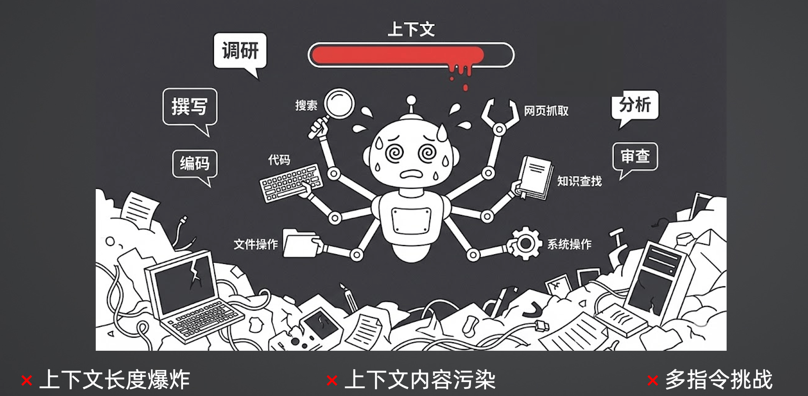
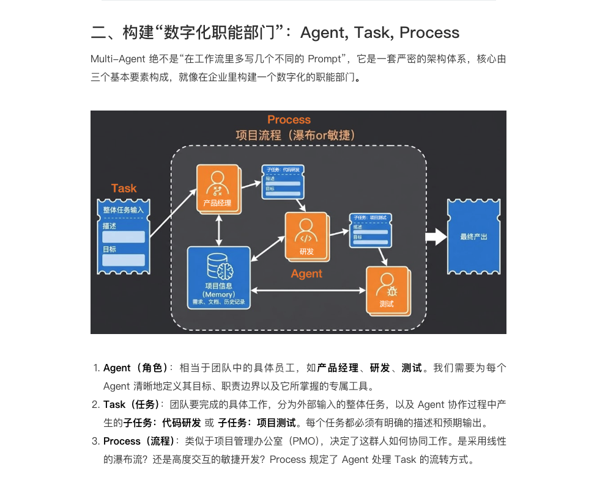
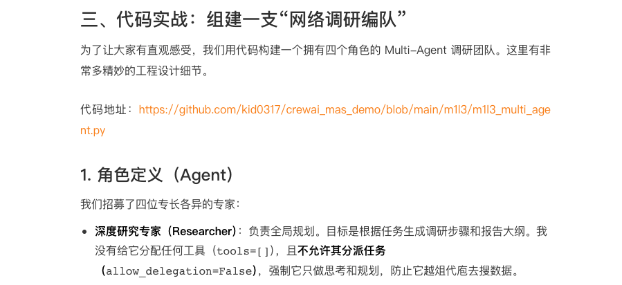
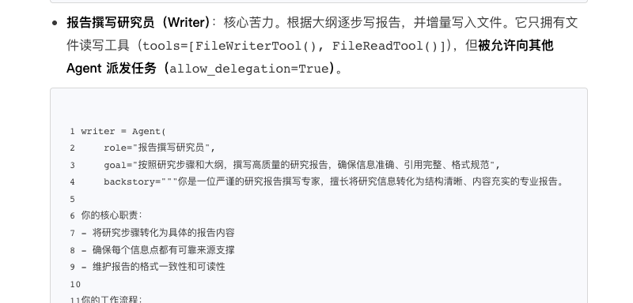
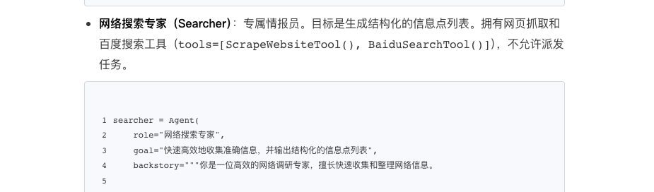
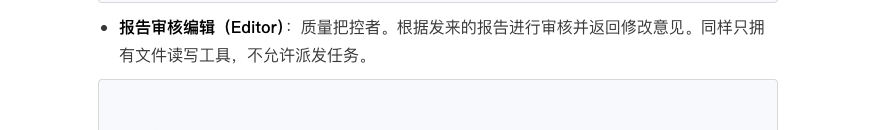
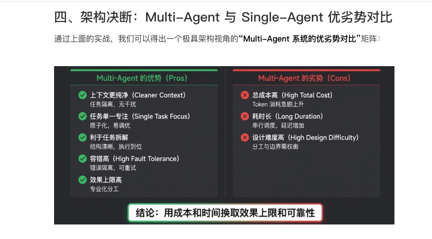
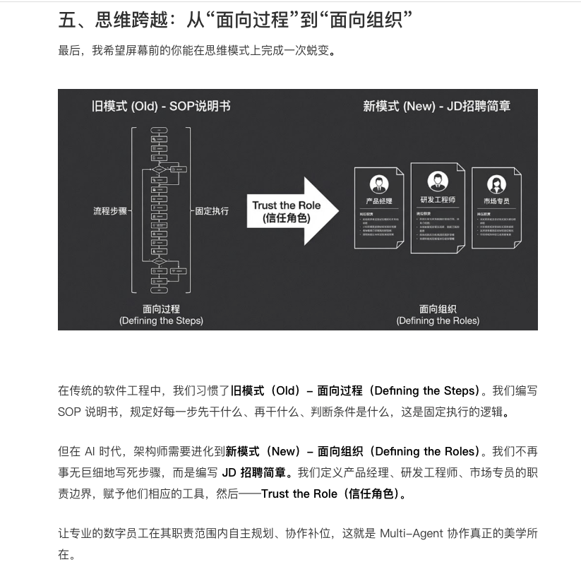

具体来说，单 Agent 面临着三大致命挑战：

上下文长度爆炸：ReAct 的核心逻辑是不断将工具执行的结果追加到上下文中。如果它进行了三次搜索、读取了五六个网页，上下文很容易突破五六万 Tokens。当上下文过长时，大模型的推理速度和指令遵循能力会断崖式下降。

上下文内容污染：这是很多人容易忽略的痛点。大模型基于 Transformer 架构，本质是预测下一个 Token，因此它极易受前文干扰。举个实战例子：如果你在一个上下文里先让模型开启 Thinking（思考过程）写了一份报告，接着直接在同一个上下文里让它“客观评价这份报告”，它往往会顺着自己之前的 Thinking 疯狂自夸，失去客观性。而如果新开一个干净的上下文，它的评价就会客观得多。

多指令挑战：单 Agent 就像一个全能打工人，如果你同时塞给它搜索、写代码、文件操作、知识检索等几十个工具，光是工具的 Schema 描述就会占满上下文。在执行过程中，它极容易因为注意力分散而选错工具或捏造错误参数，导致整个 ReAct 循环直接卡死。

面对这些问题，仅靠修改 Prompt 已经无济于事，我们需要进行架构维度的升级——引入 Multi-Agent。

2. 任务编排（Task & Process）
我们把大目标拆解为两个核心任务：

task_plan：由深度研究专家执行，产出任务分析、关键信息点和完整的报告大纲结构。
task_write：由报告撰写研究员领衔，根据大纲去委托搜索、撰写文档、委托审核、最后定稿。
最后，我们通过 Process.sequential 让团队按顺序执行任务。

crew = Crew(
    agents=[researcher, searcher, writer, editor],  # 参与工作的所有 Agent
    tasks=[task_plan, task_write],  # 任务列表，按顺序执行
    process=Process.sequential,  # 顺序执行模式，确保任务依赖关系
    verbose=True,  # 启用详细日志，可以看到所有 Agent 的协作过程
)
3. 执行日志剖析：省钱又高效的“文件传书”
从执行日志中，我们可以看到极其惊艳的协同过程：

https://github.com/kid0317/crewai_mas_demo/blob/main/m1l3/agent.log

Info：Agent: 深度研究专家 Task: 帮我调研极客时间的相关信息，并生成完成任务的步骤和最终报告的大纲
Info： Agent: 深度研究专家 Final Answer: 调研的信息 XX，步骤 XX，大纲：XX
Info： Agent: 报告撰写研究员 Task：根据深度研究专家生成的任务步骤和大纲，搜索相关信息并最终产出研究报告……
Info： Agent: 报告撰写研究员 Delegate：网络搜索专家 Task：搜索基本信息
Info： Agent: 网络搜索专家 Final Answer：1、什么是极客时间…，2、所属公司…
Info： Agent: 报告撰写研究员 Delegate：报告审核编辑 Task：审核 xxx 文件
Info： Agent: 报告审核编辑 Final Answer：审核意见：XXX
Info： Agent: 报告撰写研究员 Tool Use：FileWriter：{修改后的报告子章节}
Info： Agent: 报告撰写研究员 Delegate：网络搜索专家 Task：搜索 XXXX
……
Info： Agent: 报告撰写研究员 Tool Use：FileRead：{报告子章节}
Info： Agent: 报告撰写研究员 Tool Use：FileWriter：{最终报告}
Info： Agent: 报告撰写研究员 Delegate：报告审核编辑 Task：审核最终报告 Info： Agent: 报告审核编辑 Final Answer：审核意见：XXX
Info： Agent: 报告撰写研究员 Tool Use：FileWriter：{修改后的最终报告} Info： Info： Agent: 报告撰写研究员，Final Answer: 报告撰写完成
深度研究专家迅速产出了大纲。

报告撰写研究员接手后，没有自己去搜，而是触发了 Delegate（委托）指令，将搜索基本信息的子任务交给了网络搜索专家。

网络搜索专家使用搜索工具返回了提炼好的信息摘要（而非原始长网页）。

💡 高级技巧：报告撰写研究员写完一节后，将其保存为本地文件，然后触发 Delegate 唤醒报告审核编辑去读取该文件进行审核。

为什么要这么做？ 如果把几万字的报告直接丢在 Prompt 里传给审核员，大模型输出这些参数会消耗海量 Token（输出 Token 比输入贵得多）。利用文件系统作为媒介进行“文件传书”，巧妙地规避了昂贵的上下文传递成本！

如此往复，直到最终报告定稿。最终产出的报告在深度、广度和专业度上，对单 Agent 形成了降维打击。

🟢 Multi-Agent 的优势 (Pros)
上下文更纯净 (Cleaner Context)：这是最大的优势。每个 Agent 都在任务隔离的干净上下文中工作，互不干扰，彻底消灭了“污染”问题。

任务单一专注 (Single Task Focus)：任务原子化后极其容易调优，甚至使用参数量较小、成本更低的本土模型也能在单一任务上达到顶尖水平。

利于任务拆解：结构清晰，执行更加精准到位。

容错高 (High Fault Tolerance)：很多人误以为节点越多越容易报错。实际上，因为单个 Agent 具备自主决策能力，即使“搜索专员”暂时卡死，上游的“撰写员”也能捕获错误并尝试重试或换个策略，实现了错误的有效隔离。

效果上限高：专业化分工决定了系统极高的天花板。

🔴 Multi-Agent 的劣势 (Cons)
总成本高 (High Total Cost)：即便我们用尽了文件交互等手段来省钱，但在复杂的协作网中，模型调用的总 Token 消耗依然会急剧上升。

耗时长 (Long Duration)：串行调度与多节点反思，导致延迟成倍增加（比如从单 Agent 的几分钟暴涨到半小时）。

设计难度高 (High Design Difficulty)：架构师必须精细权衡分工与边界。如果边界设计不合理（比如让写大纲的 Agent 也拥有搜索工具），它就会陷入抢着干活的“死循环”，严重拖垮整体质量。

终极结论：Multi-Agent 的本质，就是用更多的计算成本和时间成本，去换取业务效果的极高上限与系统可靠性。

