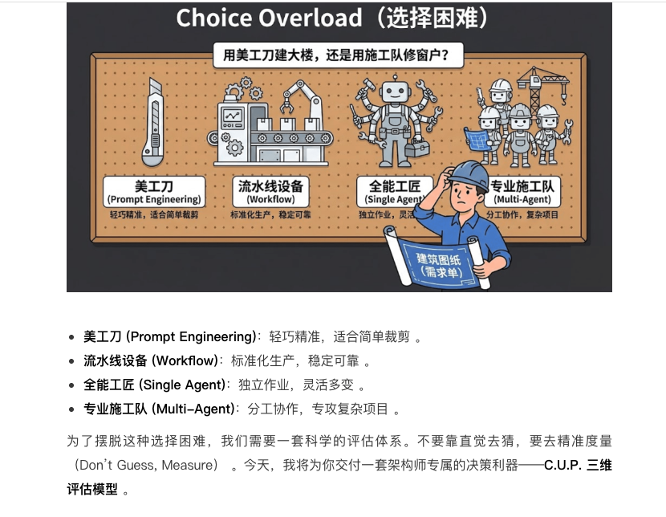
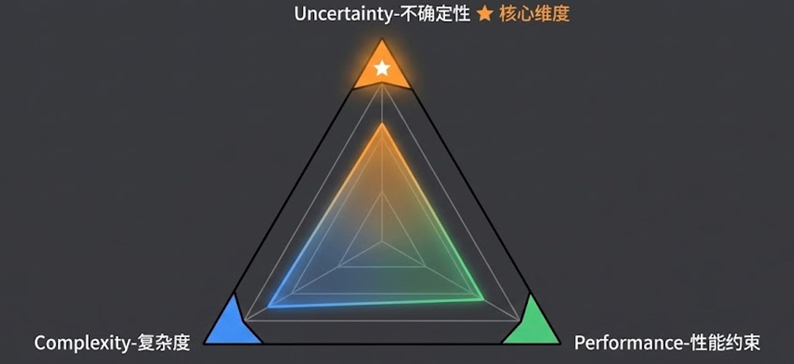
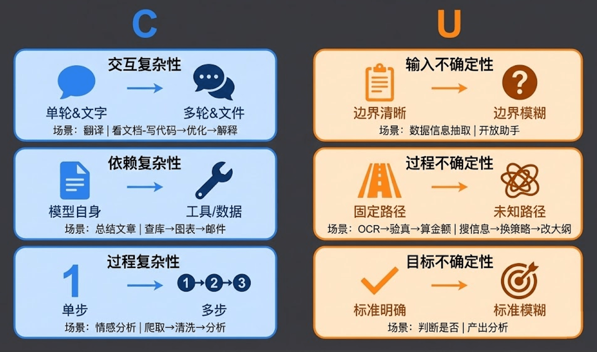
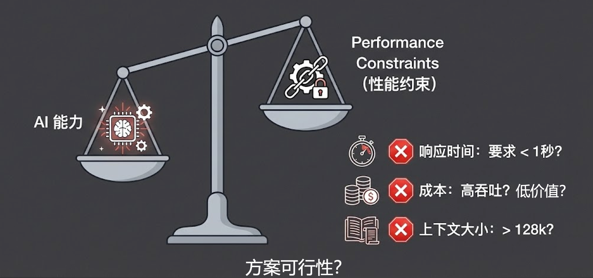
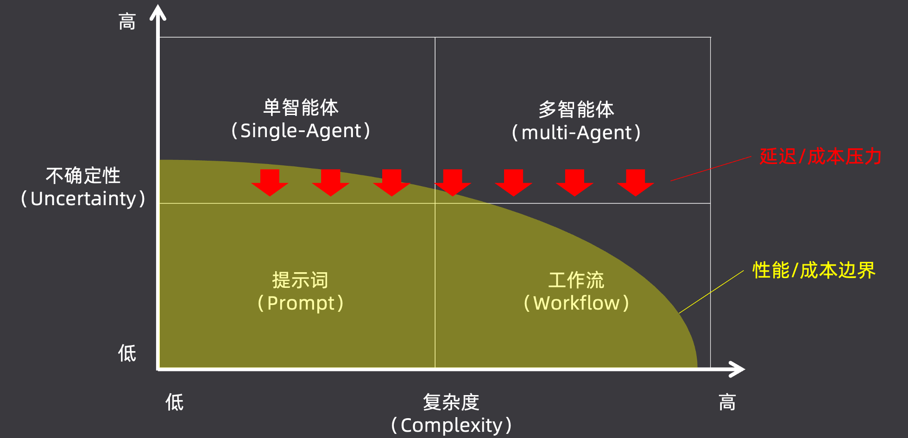
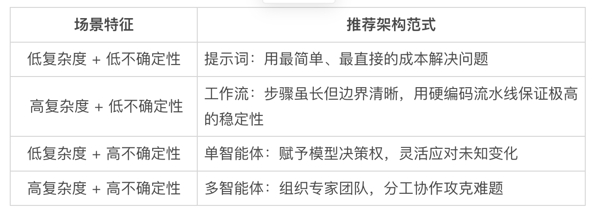

# AI 应用开发工具选型

## 一、深度解析 C.U.P. 三维评估模型

C.U.P. 模型由三个核心维度构成，只有将当前业务场景放进这三个维度中进行全方位扫描，你才能得出最合理的架构选型。

---

### C：Complexity（复杂度）

复杂度不仅仅是直觉上的"难不难"，我们需要从三个具体方向进行拆解和定性：

| 维度 | 低复杂度 | 高复杂度 |
|------|----------|----------|
| **交互复杂性** | 单轮对话与纯文本（如机器翻译） | 多轮交互与多模态文件（如阅读长文档、编写代码） |
| **依赖复杂性** | 仅依赖模型自身内部知识（如总结文章大意） | 深度调用外部工具与数据（如查询数据库、生成图表） |
| **过程复杂性** | 单步直达（如情感分析判断） | 多步流转（如网页爬取→数据清洗→多维分析） |

---

### U：Uncertainty（不确定性）—— 核心维度

> [!IMPORTANT]
> 如果一切都是确定的，我们根本不需要引入复杂的 Agent 甚至 AI。**不确定性是决定是否启用智能体架构的最核心标准。**

不确定性体现在三个层面：

- **输入不确定性**：输入的"边界清晰"（如标准化的数据信息抽取），还是"边界模糊"（如完全开放式的用户助手）？

- **过程不确定性**：执行路径是"固定路径"（如 OCR 识别 → 验真 → 计算金额），还是充满变数的"未知路径"（如搜索后发现此路不通，需要动态换策略）？

- **目标不确定性**：衡量标准是"标准明确"（如判断风控指标是否合规），还是主观的"标准模糊"（如产出一篇深度行业分析报告）？

---

### P：Performance Constraints（性能约束）—— 一票否决权

即使一个场景极其复杂且充满不确定性（理应使用 Multi-Agent），但现实的商业环境会施加严苛的性能约束。**变量 P 拥有一票否决权**，直接决定方案的最终可行性：

| 约束维度 | 关键问题 |
|----------|----------|
| **响应时间约束** | 业务是否要求响应时间 < 1 秒？如果是，绝不能使用需要长时间循环思考的 Agent |
| **成本约束** | 是否是高吞吐、低价值场景？高频功能的 Token 消耗会导致 ROI 穿透底线 |
| **上下文大小约束** | 是否需要极长的历史记忆或超大文件处理（> 128k）？直接限制模型和架构选型 |

---

## 二、C.U.P. 综合决策矩阵：理想与现实的博弈

将复杂度和不确定性作为横纵坐标，我们就得到了一个标准的四宫格选型矩阵：

### 现实的引力：收缩能力边界

在理想状态下，高复杂度和高不确定性应当直接采用 Multi-Agent。然而，一旦引入 P（性能 / 成本边界），巨大的延迟和成本压力会**强行将选型往下压**。

> [!TIP]
> **核心策略：收缩能力边界，强行降低不确定性**
>
> 例如：面对无限种可能的输入流，人为限制只支持最高频的三种意图，其余全部降级为"暂不支持"。通过舍弃边缘场景，将高不确定性压缩为低不确定性，从而安全降级到成本更低的**工作流（Workflow）方案**。

---

## 三、实战案例分析：复杂系统的问题根因定位

用一个真实的工程师高频场景——**"线上问题报警后的根因定位"** 来演练这套模型：

| 评估维度 | 分析结果 |
|----------|----------|
| **复杂性 (C)** | 🔴 极高 —— 需要跨系统拉取日志、比对 Metrics 监控大盘、追踪全链路 Tracing 数据 |
| **不确定性 (U)** | 🔴 极高 —— 症状千奇百怪，排查路径需根据反馈随时动态调整 |
| **时效性 (P)** | 🔴 极高 —— 线上事故止损黄金时间通常只有 5~10 分钟 |

> [!IMPORTANT]
> **决策结果**：虽然 C 和 U 都指向了 Multi-Agent，但极高的时效性（P）**一票否决**了纯 Multi-Agent 漫长的调度耗时。
>
> 最终的工业级解法是采用**混合架构**：以快速稳定的 Workflow 为骨架控制大方向，在遇到极其复杂的特定排查节点时，再唤醒单智能体（Single-Agent）进行局部的深度推理。

---

## 四、第一篇章总结：架构思维篇

随着第四节课的结束，我们完成了整个课程第一大篇章的学习：

1. **建立设计范式的概念**：理清了纷繁复杂的概念，确立了 AI 应用开发的四种核心范式。

2. **深入理解 Agent**：撕开了智能体的神秘外衣，从代码底层解析了 ReAct 范式的死循环本质，链接了设计与实现。

3. **初识 Multi-Agent**：完成了从传统的"面向过程开发"到"面向组织设计"的思维跃迁。

4. **决策选型**：掌握了 C.U.P. 三维评估模型，学会了在系统的需求分析之后再做出架构决策。

> 在接下来的第二大篇章**"工程篇"**中，我们将正式卷起袖子，手把手带你开始搭建真正的 AI 应用，彻底掌握企业级的最佳落地范式。