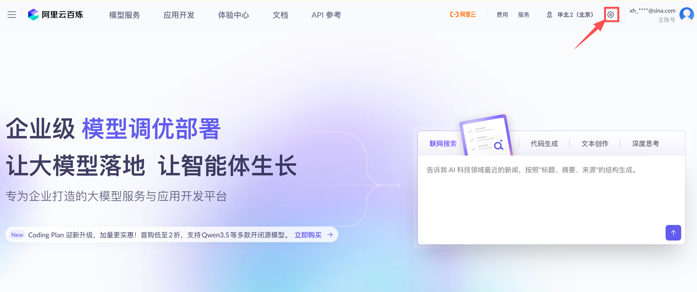
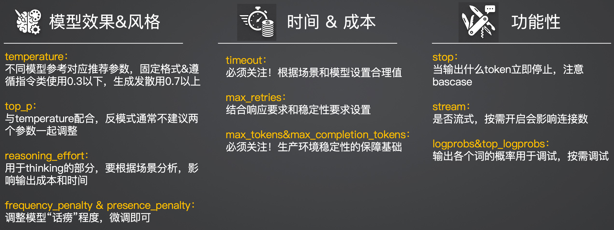

# 基础代码环境准备

## 1. 基础代码环境清单

在开始之前，请确保你的本地计算机或开发服务器已经具备了以下基础运行环境：

- **Python 环境配置**：本课程的示例代码依赖于 Python 环境，请大家自行学习并完成安装，强烈要求 Python 版本在 **3.10 及以上**。
- **核心框架更新**：我们将大量使用 **CrewAI** 框架作为工程落地的载体。由于当前 AI 应用框架处于高速发展期，CrewAI 的迭代速度极快，版本之间可能存在破坏性更新，因此建议大家在安装时尽量拉取并使用**最新版本**。

---

## 2. 核心准备工作清单

本节课的核心准备工作将围绕以下四个清单展开：

1. **阿里云模型 API 申请**
2. **在 CrewAI 中进行 OpenAI 风格的模型使用**
3. **在 CrewAI 中进行自定义模型 API 的使用**
4. **LLM 参数的最佳实践和反模式**

---

## 3. 阿里云模型 API 申请

阿里云百炼平台的 API 申请流程如下：

进入阿里云百炼平台后，可以看到其提供的企业级模型调优部署服务：

---

## 4. LLM 参数最佳实践与反模式

LLM 参数可以分为三大类别进行理解和配置：

### 4.1 模型效果 & 风格
| 参数 | 说明 |
|------|------|
| `temperature` | 不同模型参考对应推荐参数；固定格式 & 遵循指令类使用 0.3 以下，生成发散用 0.7 以上 |
| `top_p` | 与 temperature 配合，反模式：通常不建议两个参数一起调整 |
| `reasoning_effort` | 用于 thinking 的部分，要根据场景分析，影响输出成本和时间 |
| `frequency_penalty` & `presence_penalty` | 调整模型"话痨"程度，微调即可 |

### 4.2 时间 & 成本
| 参数 | 说明 |
|------|------|
| `timeout` | 必须关注！根据场景和模型设置合理值 |
| `max_retries` | 结合响应要求和稳定性要求设置 |
| `max_tokens` & `max_completion_tokens` | 必须关注！生产环境稳定性的保障基础 |

### 4.3 功能性
| 参数 | 说明 |
|------|------|
| `stop` | 当输出什么 token 立即停止，注意 basecase |
| `stream` | 是否流式，按需开启会影响连接数 |
| `logprobs` & `top_logprobs` | 输出各个词的概率用于调试，按需调试 |