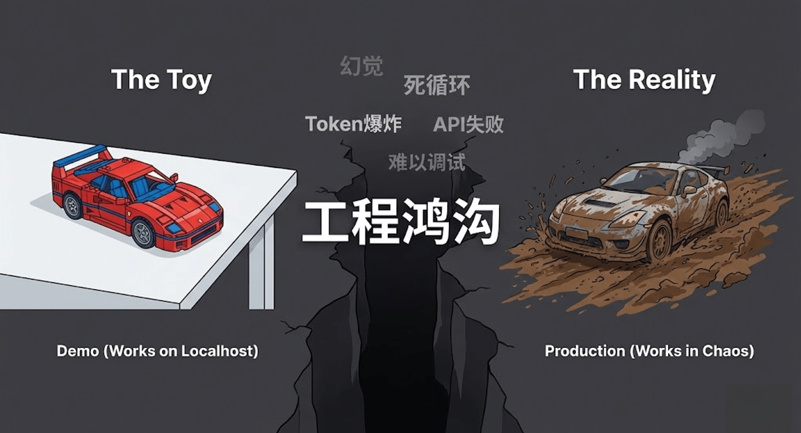
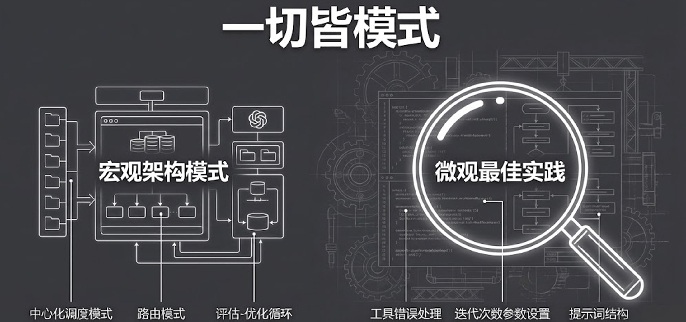
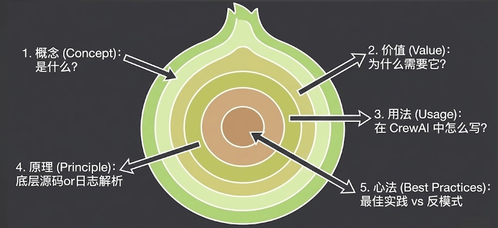
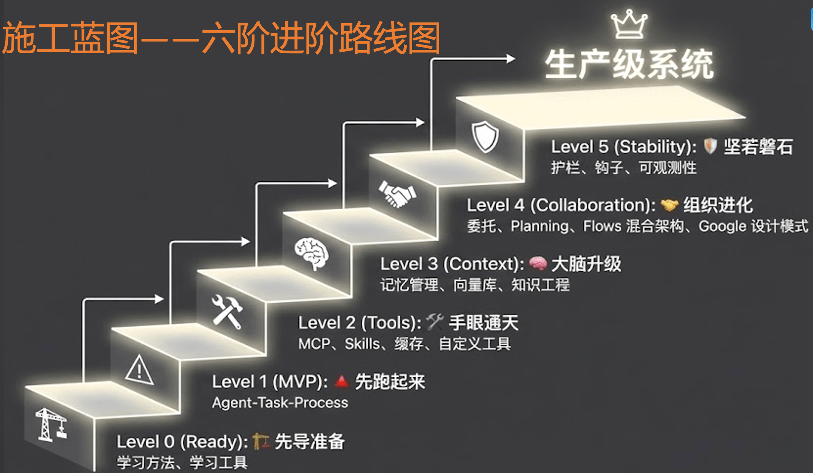
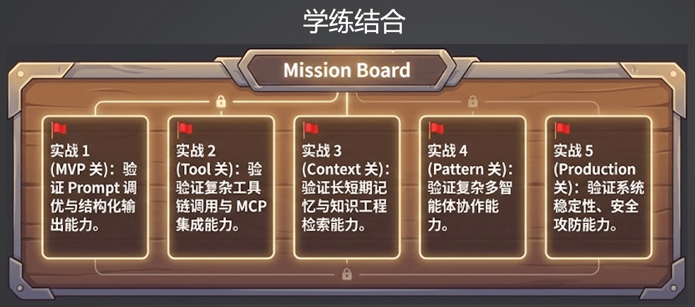

# 工程全景图：构建企业级施工蓝图

## 一、告别"野路子"：从玩具 Demo 到企业级生产

很多开发者在刚接触大模型应用时，通常会看几个网上的开源教程，用几行代码跑通一个 Demo，在命令行里看到模型成功回复了一段话，就觉得非常有成就感。

但是，当你试图把这个 Demo 搬到真实的业务系统和企业生产环境中时，你会立刻遭遇无数"毒打"：

- **稳定性极差**：大模型经常产生幻觉，或者格式输出错误导致代码崩溃。
- **上下文失控**：多轮对话或工具调用后，上下文长度爆炸，模型开始胡言乱语。
- **不可观测与难以排查**：一旦线上出错，由于整个系统是个黑盒，你根本不知道是哪一步的 Prompt 写坏了，还是哪个 Tool 返回了异常数据。

> [!IMPORTANT]
> 这些痛点的根源在于：我们用**做玩具的思维**，去盖**企业级的大楼**。要想跨越这条鸿沟，必须告别"野路子"，建立起"正规军"的工程化体系。

---

## 二、穿透技术本质："五步认知法"

在接下来的工程篇中，我们会接触到大量且高频迭代的 AI 概念（如 Memory、Skill、RAG、Guardrails 等）。这些的一切都是**设计模式**——从宏观的 AI 应用架构模式，到微观的每个技术点的最佳实践。

为了避免大家迷失在技术的海洋里，我将采用一套名为**"五步认知法"**的教学框架：

| 步骤 | 名称 | 说明 |
|------|------|------|
| 1 | **What（它是什么）** | 用最通俗的语言，讲清这个技术概念的本质定义 |
| 2 | **Why（为什么需要它）** | 它究竟解决了什么具体的业务痛点？如果没有它，系统会怎样？ |
| 3 | **How（怎么用）** | 结合实际代码，演示如何在框架中调用和实现这个功能 |
| 4 | **Under the Hood（底层原理）** | 撕开外衣，深入源码或底层协议，看看它到底是怎么工作的 |
| 5 | **Best Practices & Anti-Patterns** | 结合一线实战经验，告诉你哪些坑不能踩，哪些技巧能大幅提升稳定性 |

> 只要掌握了这套方法论，未来无论涌现出什么新的 AI 框架或概念，你都能迅速将其解构并纳入自己的知识体系。

---

## 三、企业级 Multi-Agent 系统的"施工蓝图"

一个真正能上线的企业级多智能体系统，到底长什么样？以下是从下至上的**六阶进阶路线图**：

---

### Level 0 (Ready)：先导准备 —— 思想与工具的双重武装

> **核心关键词**：学习方法、学习工具

千里之行，始于足下。我们的第一步是做好全面的先导准备：

- **思想准备**：明确学习方向。带着具体的问题和明确的目标去学习，做到有的放矢。
- **工具准备**：工欲善其事，必先利其器。搭建一套稳定、能立刻跑起代码来的本地环境，甚至不需要强依赖外网访问就能顺利运行。

---

### Level 1 (MVP)：先跑起来 —— 核心跑通，告别"玩具"

> **核心关键词**：Agent - Task - Process

- **重塑认知**：不是简单的 POC 或跑个 Demo，而是重新深度学习多智能体的核心概念。
- **死磕细节**：不再走马观花，深入细节，看底层的运行日志。
- **真正落地**：构建出的系统一定是一个实际可落地、可以直接上线的系统。这是**第一个重要里程碑**。

---

### Level 2 (Tools)：手眼通天 —— 赋予智能体行动能力

> **核心关键词**：MCP、Skills、缓存、自定义工具

- **工具的深度应用**：讲解各类工具的调用，包括 CrewAI 等框架自带的工具、MCP（模型上下文协议）以及各种 Skills。
- **性能与扩展**：学习缓存（Cache）机制提升效率，以及根据业务需求编写自定义工具。
- **最佳实践**：编写工具时的工程化最佳实践，代码既优雅又实用。

---

### Level 3 (Context)：大脑升级 —— 工程化提升模型智商

> **核心关键词**：记忆管理、向量库、知识工程

构建优秀的 Agent 系统不能过度依赖底层大模型的能力。利用工程化方法将复杂工作拆解，让系统输出更加确定、可靠，这才是我们作为开发者的**核心价值**所在。

- **上下文进阶**：通过工程化手段为 Agent 的大脑进行升级。
- **记忆与知识**：运用记忆管理机制来精准控制上下文，结合向量库和知识工程沉淀专业领域数据。
- **变得更聪明**：极大提升 Agent 处理复杂问题的能力。

---

### Level 4 (Collaboration)：组织进化 —— 面向组织的协作架构

> **核心关键词**：委托、Planning、Flows 混合架构、Google 设计模式

这是极其关键的**"分水岭"阶段**。架构思维将从"面向过程"升级为"面向组织"的设计。

- **协作机制**：深入学习 Agent 间的委托（Delegation）机制、规划（Planning）能力以及更复杂的 Flows 混合架构。
- **前沿设计模式**：将 Google 最新发布的 Multi-Agent 设计模式揉进课程中。
- **终极目标**：弄透 Agent 之间的高效协作方式，完美应用到复杂业务流中。

---

### Level 5 (Stability)：坚若磐石 —— 迈向真正的生产级

> **核心关键词**：护栏、钩子、可观测性

当复杂多智能体系统跑起来之后，挑战才刚刚开始。要让它真正在线上平稳运行，还需要解决最后一道防线：**稳定性瓶颈**。

- **安全与规范**：建立"护栏（Guardrails）"防止模型输出违规或越界内容；设置"钩子（Hooks）"精准介入系统运行周期。
- **透明可控**：全面建设系统的"可观测性"，让内部所有的调用、耗时和状态都一目了然。
- **大功告成**：只有当这些维稳基建全部建设完毕，才算真正完成了一个坚若磐石的生产级应用的交付。

> 这六个阶段环环相扣，从底层的环境搭建，到代码落地，再到工具扩展、大脑升级、协作架构，最终实现生产级维稳。

---

## 四、实战演练：能力验证的"试金石"

光听不练假把式。这五个实战关卡与"六阶进阶路线图"紧密对应，采用**"闯关"**形式，将理论知识转化为企业级落地能力。

| 关卡 | 核心目标 | 实战要点 |
|------|----------|----------|
| **实战 1 (MVP 关)** | 验证 Prompt 调优与结构化输出能力 | 不使用复杂外部工具，纯粹依靠 Prompt 打磨与 Multi-Agent 结构设计 |
| **实战 2 (Tool 关)** | 验证复杂工具链调用与 MCP 集成能力 | 掌握工具链编排，无缝接入开源工具，自行设计自定义工具 |
| **实战 3 (Context 关)** | 验证长短期记忆与知识工程检索能力 | 将记忆机制、知识工程与向量数据库融合到系统中 |
| **实战 4 (Pattern 关)** | 验证复杂多智能体协作能力 | 设计合理的协作流和委托机制，让多个 Agent 打出完美配合 |
| **实战 5 (Production 关)** | 验证系统稳定性、安全攻防能力 | 加上护栏和监控，确保在不稳定环境下安全、稳定运行 |

> 这五大实战关卡是一套完整的练兵场，从单点突破到全局统筹，再到最后的维稳攻防。只要一步步打通这五关，就能真正掌握构建复杂 AI 智能体应用的核心实战能力。

---

## 五、课程总结与预告

今天，我们一起绘制了构建企业级 Multi-Agent 系统的全景施工蓝图：

1. **明确了**从 Demo 到生产级系统的鸿沟与痛点。
2. **确定了**采用"What → Why → How → 原理 → 最佳实践"的五步认知法来进行后续的技术学习。
3. **全览了**包括"原子能力"、"Agent 协作"和"工程化保障"在内的三大架构层级。

> 在下一节课中，我们将正式开启代码实战！手把手带大家搭建 Python 开发环境、配置所需的大模型 API，并初探主流的 Agent 开发框架，为接下来的造楼工程打好坚实的地基。