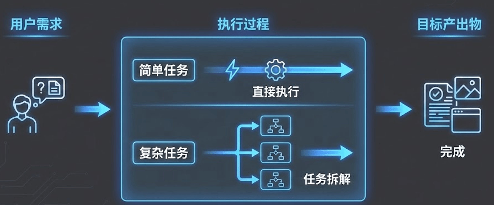
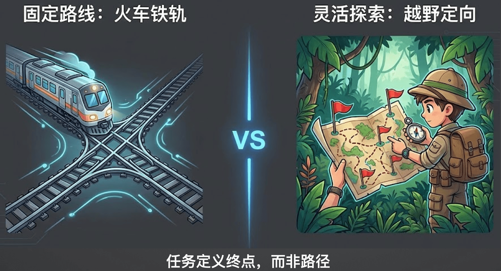
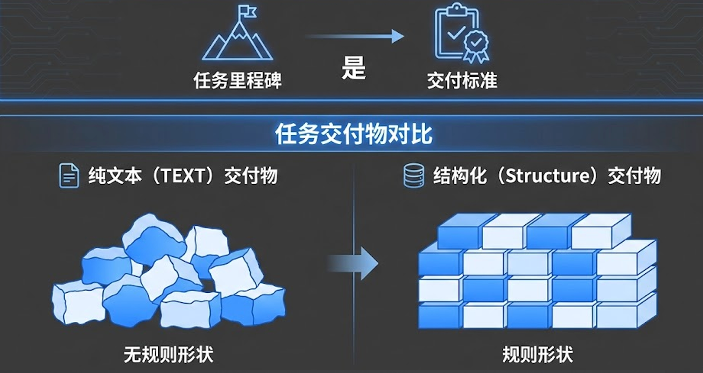

# 8. 定义 Task：设定契约

欢迎来到第八课！在上一节课中，我们详细讲解了如何定义 Agent（智能体），完成了“定人”的步骤。有了优秀的数字员工，接下来就需要给他们派发明确的工作了。这节课，我们将深入探讨多智能体协作的第二步：**定义 Task（任务）**。

## 一、 认知原点——一切 AI 应用皆为“Task”

我们需要建立一个基础认知：**一切的 AI 应用，本质上都是在执行任务。**



无论是传统的 Chatbot、智能客服，还是复杂的数据分析 Agent，其底层逻辑都包含以下三个核心环节：

1. **输入（Input）**：用户的原始诉求或系统的定时触发事件。
2. **执行过程**：Agent 思考、调用工具、交互协作的中间环节。
3. **输出（Output/ 交付物）**：经过执行后，必须产出一个明确的结果。这个结果可能是一段对话回复、一份结构化的 Markdown 报告、一个 PPT 文件，或者是在业务系统中提交的一系列操作。

> **💡 核心结论**：未来我们在做 AI 应用评测时，最核心的依据也就是对比这“输入”和“产出”是否匹配预期的标准。

## 二、 拆解心法——火车轨道 vs 里程碑

在定义任务时，开发者最容易陷入传统编程的惯性思维，这就引出了我们这节课的核心心法：**任务定义终点，而非路径。**



* **🚂 火车轨道（传统工作流）**：像铺设铁轨一样，事无巨细地规定 Agent 第一步必须做什么、第二步必须怎么做。在面对充满不确定性的复杂场景时，一旦中途出现意外状况，“火车”就会彻底脱轨崩溃。
* **⛳️ 里程碑（最佳实践）**：我们应该像设定里程碑一样去定义 Task。明确告诉 Agent 当前阶段需要交付什么成果，至于中间它怎么搜索、怎么调整策略，完全交由大模型自主决策。**结构化的交付标准就是最好的里程碑。**

## 三、 交付标准——结构是混乱世界中的确定性

既然任务是契约驱动的，我们就必须提供清晰的“验收标准”。在工程代码中，我们强烈推荐使用 **Pydantic** 定义任务的目标输出结构。



### 为什么必须使用 Pydantic？

这不仅仅是为了让代码好看，它在底层发挥着极大的作用：
1. **深入框架（提示词注入）**：当你用 Pydantic 定义好数据结构和详细的 description（字段描述）后，框架在底层会将其转换为标准的 JSON Schema 格式，并硬编码注入到发送给大模型的 System Prompt 中。
2. **结果提取与验证**：模型在接收到这个明确的 Schema 后，会极大地倾向于按照你规定的 JSON 结构输出内容。框架随后会通过 JSON 提取器抓取结果，并用 Pydantic 反向校验数据格式是否合规，从而将不确定的自然语言文本转化为确定性的工程数据字典。

---

## 四、 简明对比：Pydantic 对 Agent 效果的质变影响

为了更直观地理解，我们来看一个极其简单的例子：**让 Agent 从一段话中提取用户信息。**

**需求：** 从口语化文本“我是张三，今年30岁，住在北京”中提取姓名、年龄和城市。

### ❌ 使用前（纯 Prompt 驱动）
* **开发者 Prompt**："请从以下文本中提取用户的姓名、年龄和城市信息：我是张三，今年30岁，住在北京。"
* **Agent 输出（充满不确定性）**：
  > "你好！根据您提供的文本，我为您提取出的用户信息如下：姓名是张三，年龄为30，所在城市为北京。请问还有什么其他可以帮您的吗？"
* **痛点**：输出掺杂了大量友好的“废话”，格式完全不可控。如果下游代码试图使用 `result["name"]` 去读取姓名，系统会直接报错崩溃，因为输出的是一串纯文本，根本不是代码可解析的数据对象。

### ✅ 使用后（Pydantic 契约驱动）
* **开发者行为**：使用 Pydantic 明确要求大模型返回什么类型的字段，并附带描述：
  ```python
  from pydantic import BaseModel, Field

  class UserProfile(BaseModel):
      name: str = Field(description="用户姓名")
      age: int = Field(description="用户年龄")
      city: str = Field(description="用户所在城市")
  ```
* **Agent 输出（高度确定性的 JSON 结构）**：
  ```json
  {
    "name": "张三",
    "age": 30,
    "city": "北京"
  }
  ```
* **爽点**：毫无废话，100% 结构化返回！下游代码只需 `profile = UserProfile.model_validate_json(result)`，就可以安全、优雅地调用 `profile.name` 了。这实现了**从“不可控的文本闲聊”到“稳定可靠的系统工程”的跨越**。

### ⚙️ 底层运行原理深度剖析

当你把 `UserProfile` 这个对象传给 Agent 的 Task 时，底层到底发生了什么魔法？

1. **Schema 转换**：框架调用 Pydantic 的底层方法，将 Python 类结构一键翻译为 AI 更容易理解的标准化协议 JSON Schema。
2. **Prompt 组装注入**：框架悄悄在你的原始 Prompt 后面追加了一段强制指令：
   > *"You MUST return the actual complete content as the final answer... Ensure your final answer strictly adheres to the following OpenAPI schema: `{"properties": {"name": {"type": "string", "description": "用户姓名"}...}}` Do not include any code block markers..."*
3. **大模型生成**：大模型接收到了带有“Schema 紧箍咒”的 Prompt，利用自身强大的指令遵循和格式化能力，直接生成标准 JSON 字符串。
4. **反向校验与自反思 (Reflection)**：框架拿到 JSON 字符串后，立即调用 `UserProfile.model_validate_json(output)` 进行格式校验。假如大模型“犯迷糊”输出了错误的数据类型（例如把年龄 30 输出了 "三十" 字符串），Pydantic 校验阶段就会抛出强类型的异常。此时，高级框架（如 CrewAI）会捕获该异常，并**将报错信息和要求纠正的命令扔回给大模型让其自我修正(Reflection)**，直到它的输出完全通过类型校验为止。

---

## 五、 代码实战：小红书的内容增长策略大纲任务

这是一个真实应用中的复杂案例，源码：[m2l4_task.py](https://github.com/kid0317/crewai_mas_demo/blob/main/m2l4/m2l4_task.py)

**1. 首先定义 Pydantic 数据模型（契约定义）：**
这是“契约驱动”的核心，这些模型定义了 Agent 输出的“验收标准”，确保格式完全符合预期。

```python
class ImageAnalysis(BaseModel):
    """单张图片的深度分析详情"""
    file_name: str = Field(..., description="图片文件名或 ID。")
    image_quality_score: str = Field(..., description="【质量评价】1-10 分打分...")
    highlight_feature: str = Field(..., description="【突出特点】这张图最抓人眼球的一个视觉锚点。")
    # ... 省略其他字段

class ContentStrategyBrief(BaseModel):
    """爆款内容策划简报 - Strategist Agent 的交付物"""
    input_evaluation: str = Field(..., description="【素材评估】基于用户诉求和图片质量的综合评价...")
    target_audience_persona: str = Field(..., description="【目标受众画像】采用反漏斗模型，定义最核心细分人群...")
    suggested_title: str = Field(..., description="【建议标题】包含标点和 Emoji，20字以内。规律：'痛点场景+情绪/利益钩子+核心人群标签'")
    # ... 省略其他字段
```

**2. 将契约绑定在 Task 任务上：**
在任务分配时，强制要求 Agent 遵循该模型。

```python
task_content_strategy = Task(
    description="""
    ** 任务要求 **：
    1. 仔细分析视觉报告中的用户意图、图片质量和整体风格
    2. 制定精准的内容策略，具体可执行
    """,
    expected_output="一个完整的 ContentStrategyBrief 结构化输出，包含所有必填字段。",
    agent=content_strategist,
    output_pydantic=ContentStrategyBrief, # 核心：将 Pydantic 对象注入给任务
)
```

**3. 底层机制的日志验证**：
当你打印出运行框架的底层 Prompt 调用时，你会看到它自动把你的类拼装成了 JSON Schema：

```text
{
    "role": "user",
    "content": "\nCurrent Task:{task.description}\n\nThis is the expected criteria for your final answer: {task.expected_output}\nyou MUST return the actual complete content as the final answer, not a summary.\nEnsure your final answer strictly adheres to the following OpenAPI schema: {ContentStrategyBrief.schema}\n..."
}
```

## 六、 最佳实践与反模式

在实际定义任务拆解时，千万要避开以下几个常见的坑：

### 🚫 反模式 (Anti-Patterns)
1. **注意力涣散的超级任务**：把多个关联性不大的子目标强行塞进同一个大任务里（例如让它既负责搜索海量数据，又负责写核心代码，还要撰写给外行看的前台文案）。这会导致 Agent 在执行时逻辑混乱、失去焦点，最终什么都做不好。
2. **不设明确的验收目标**：如果你在 Task 里不给出清晰的标准，Agent 在执行 ReAct 时就会陷入迷茫，它可能永远不知道什么时候该输出 Final Answer，导致执行过程陷入死循环。
3. **流程步骤过度微操**：强制规定极度细微的操作步骤。操作步骤越细致僵化，Agent 的泛化能力和“智能感”就越差。当它碰到事先未设想到的异常场景时，为了强行满足你设定的僵化步骤，它极容易产生严重的幻觉和生搬硬套。

### 💡 最佳实践 (Best Practices)
* **把质量标准写进 Pydantic 描述里**：不要仅仅在 Pydantic 中定义干巴巴的数据类型（如 `str`, `int`），**一定要在 `description` 字段描述里写清楚明确的质量标准**。例如，与其写 `description="文章标题"`，不如写 `description="带有情绪钩子且不超过20字的引发好奇悬念式标题"`。这些精确的交付要求就像紧箍咒一样，能强行聚焦大模型的注意力，引导它朝着高质量的明确终态去努力。