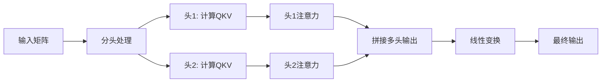
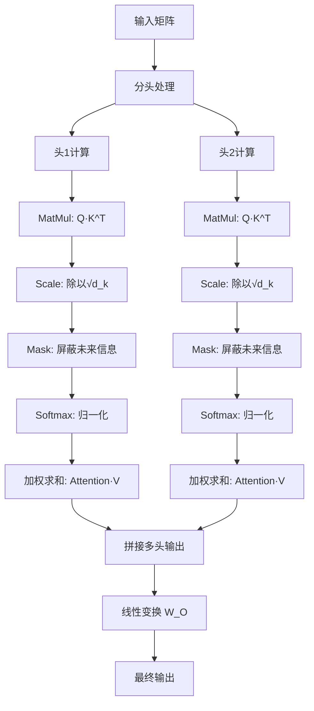
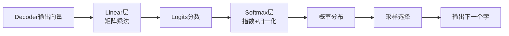

## Transformer Architecture

When i was new to AI and first encountered the Transformer Architecture, i felt overwhelmed by the sheer number of concepts and turorials available to understand it. I noticed that some vides or articles assumed prior knowlwdge of natural language processing(NLP) concepts,while others were too lengthy and difficult to comprehend.TO grasp the Transformer Architecture, I had to read numerous articles and watch several videos, and there were times when i got stuck due to a lack of basic knowledge that prevented me from fully understanding the topic,including:
- why input embedding can represent a word?
- What is a matrix multiplication and how the shape performs?
- what does sofmax do ?
- when the model is trained, where is it stored?
...

With all the complexities involved, I have found it challenging to completely master this architecture. Therefore , I urge you to be patitent and make sure to watch the video clips first, as the concepts are relatively easy to understand once explained. If we proceed step-by-step, staring from the basics and gradually moving towards more advanced topics, I am confident that you will soon be on the same page as me.


详细梳理：
假设我们需要对“中华人民共和国”这句话进行训练，提取字之间的关键信息，我们要根据维度建立一个矩阵，因为一个字或者词语，在不同的语境不同的场合有不同的意思，所以建立这种不同的维度，就可以更好的把人类的话语信息统计到
比如现在的矩阵是
 1， 2， 3 ... 20
中
华
人
民
共
和
国

这是一个7 * 20的矩阵
丢进去Input Embeddings,把它变为数字，这是因为计算机对于数字可以很好的理解，对于文字没那么好理解，不符合计算机的计算架构。假设我们之前提前设计好了每个字对应的数字符号，比如中 对应数字符号是 3923，华是 4034 以此类推。那么InputEmbedding就是做这个动作。
Positional Encoding是对这些符号化了的文字进行位置编码，只有位置固定好了，才方便记录概率计算和统计。
Masked Multi-Head Attention: 这个地方是最重要的地方，他是用来计算这些字之间的概率的。他会接受3个同样的矩阵数据，这三个参数叫做q,k,v 本质上就是q,k,v之间相互作运算，得出字与字之间的概率,但是得出概率之后为了防止过拟合，所以你会看到图上出来之后他还会把原来的文本概率给你加上来，防止概率偏差太大。比如原本中，华概率是1，1 但是你这里的出来的结果是0.2，0.9， 那么加上之后就是1.2，1.9就更合理了，没那么偏差大了
Layer Norm: 这里也是类似防止过拟合的操作，概率大的缩小一点，概率小的稍微缩一点点，比如前面的1.2->1.1,1.9->1.5之类的操作
Feed Forward:是传统的网络神经的计算模块，得到的结果你会发现，也会重复前面的操作，把原本的概率拿出来加上，防止过拟合，然后也是会后续用到Layer Norm优化概率分布。
Linear: 它本身是一个类似于字典表，一个很大规模的矩阵，然后结合下一步骤的softmax会计算下一个概率高的词或者字，比如目前我们训练的结果是“中华人民共和国”，经过这个计算之后softmax计算下一个字概率最大的事“万”，那么他就把“万”添加到原本的输入里面去，比如是“中华人民共和国万”，以此类推，下一次后面又会追加一个字变为 “中华人民共和国万岁”


AI embedding之后 矩阵的维度如何理解， 假设 一句话在库表里面找到个字对应的维度信息之后，把它拿出来给transformer做训练，这些维度信息，如何理解？ 举个例子，简单点

# Embedding与维度理解：一个简单例子

我来用一个非常具体的例子帮你理解Embedding后的矩阵维度。

## 1. 基础设定

假设我们有一个极简的文本和词汇表：
- **词汇表**：["中", "华", "人", "民", "共", "和", "国"] (7个字)
- **嵌入维度**：3 (为了简单可视化)
- **训练句子**："中华人民共和国"

## 2. Embedding矩阵长什么样？

Embedding层本质上是一个**查找表**，它的矩阵形状是 `[词汇表大小, 嵌入维度]`。

在我们的例子中，就是一个 `[7, 3]` 的矩阵：

```
Embedding Matrix (形状: 7×3):
注意下面各个维度的数值，其实初始化的时候是随机生成的，只有经过训练之后得到的数据才是真实有用的
字索引 | 字 | 维度1 | 维度2 | 维度3
-----|---|------|------|------
0    | 中 | 0.1  | 0.2  | 0.3
1    | 华 | 0.4  | 0.5  | 0.6  
2    | 人 | 0.7  | 0.8  | 0.9
3    | 民 | 1.0  | 1.1  | 1.2
4    | 共 | 1.3  | 1.4  | 1.5
5    | 和 | 1.6  | 1.7  | 1.8
6    | 国 | 1.9  | 2.0  | 2.1
```

**理解要点**：这个矩阵的每一行代表一个字的"向量身份证"。

## 3. 从文字到向量的转换过程

原始句子："中华人民共和国"
对应的索引序列：[0, 1, 2, 3, 4, 5, 6] (假设按词汇表顺序)

**Embedding查找过程**：
```
"中" (索引0) → 查找第0行 → 向量 [0.1, 0.2, 0.3]
"华" (索引1) → 查找第1行 → 向量 [0.4, 0.5, 0.6]
"人" (索引2) → 查找第2行 → 向量 [0.7, 0.8, 0.9]
"民" (索引3) → 查找第3行 → 向量 [1.0, 1.1, 1.2]
"共" (索引4) → 查找第4行 → 向量 [1.3, 1.4, 1.5]
"和" (索引5) → 查找第5行 → 向量 [1.6, 1.7, 1.8]
"国" (索引6) → 查找第6行 → 向量 [1.9, 2.0, 2.1]
```

## 4. 输入Transformer的矩阵形状

经过Embedding后，整个句子变成了一个矩阵：

```
句子矩阵 (形状: 7×3):

[[0.1, 0.2, 0.3],   # "中"的向量表示
 [0.4, 0.5, 0.6],   # "华"的向量表示  
 [0.7, 0.8, 0.9],   # "人"的向量表示
 [1.0, 1.1, 1.2],   # "民"的向量表示
 [1.3, 1.4, 1.5],   # "共"的向量表示
 [1.6, 1.7, 1.8],   # "和"的向量表示
 [1.9, 2.0, 2.1]]   # "国"的向量表示
```

**维度理解**：
- **7**：序列长度（这句话有7个字）
- **3**：每个字的向量维度（每个字用3个数字表示）

## 5. 这些维度信息代表什么？

虽然我们无法直接解释每个维度的具体含义（它们是模型自动学习的），但可以这样理解：

假设我们的3个维度分别代表：
- **维度1**：语义相关性（数值越大，语义越重要）
- **维度2**：语法角色（数值区分名词、动词等）  
- **维度3**：上下文关联度（数值越大，与前后文关联越强）

那么：
- `"中" = [0.1, 0.2, 0.3]`：相对基础的语义，语法功能明确
- `"国" = [1.9, 2.0, 2.1]`：语义重要，与上下文强相关

**关键洞察**：在向量空间中，语义相近的字会有相似的向量表示。比如"人"和"民"的向量比"人"和"共"更接近。

## 6. Transformer如何利用这些向量？

1. **自注意力机制**：计算每个字向量与其他所有字向量的关联度
2. **信息融合**：根据注意力权重，重新调整每个字的向量表示
3. **层次化理解**：通过多层Transformer，从字面意思理解到深层语义

## 7. 实际模型 vs 我们的例子
 
| 特性 | 我们的例子 | 真实大模型 |
|------|------------|------------|
| 词汇表大小 | 7个字 | 3万-20万字 |
| 嵌入维度 | 3维 | 768-12288维 |
| 序列长度 | 7个字 | 512-4096个字 |

**核心思想相同**：都是将离散的文字转换为连续的向量表示，让模型能够进行数学运算。

## 总结

Embedding的本质就是：**为每个字创建一个"数学身份证"**，让计算机能够用向量的方式理解和处理文字。这些向量维度就像是字的"特征"，模型通过调整这些特征值来学习语言规律。

# Positional Encoding（位置编码）工作原理详解

我用之前的"中华人民共和国"例子来详细解释位置编码是如何工作的。

## 1. 为什么要用位置编码？

Transformer的自注意力机制是**位置无关**的 - 它不知道"中"是第一个字，"国"是最后一个字。位置编码就是为了解决这个问题。

**没有位置编码时**：
- "中华人民共和国" 和 "国共民人华中民" 对模型来说是一样的
- 模型无法理解字的顺序信息

## 2. 位置编码的矩阵形状

位置编码矩阵的形状与输入矩阵完全一致：`[序列长度, 嵌入维度]`

在我们的例子中：
- 序列长度：7（7个字）
- 嵌入维度：3（每个字3维向量）

所以位置编码矩阵也是 `7×3`：

## 3. 正弦余弦位置编码公式

原始Transformer使用正弦余弦函数生成位置编码：
下面两种计算方式分别对应奇数位和偶数位，而且用正弦和余弦计算不用纯数字表示的原因就是因为防止不同维度得到的值是一样的，因为不同维度值应该不一样才合理，transformer才可以更好的觉察到这种不同维度之间的细微差别，更合理一点
```
PE(pos, 2i)   = sin(pos / 10000^(2i/d_model))
PE(pos, 2i+1) = cos(pos / 10000^(2i/d_model))
```

其中：
- `pos`：字在序列中的位置（0-6）
- `i`：维度索引（0-2）
- `d_model`：总维度数（3）

## 4. 具体计算示例

让我们为"中华人民共和国"的每个位置计算位置编码：

### 位置0："中"
```
PE(0,0) = sin(0 / 10000^(0/3)) = sin(0) = 0.00
PE(0,1) = cos(0 / 10000^(0/3)) = cos(0) = 1.00
PE(0,2) = sin(0 / 10000^(2/3)) = sin(0) = 0.00
```
位置编码向量：[0.00, 1.00, 0.00]

### 位置1："华"
```
PE(1,0) = sin(1 / 10000^(0/3)) ≈ sin(1) ≈ 0.84
PE(1,1) = cos(1 / 10000^(0/3)) ≈ cos(1) ≈ 0.54
PE(1,2) = sin(1 / 10000^(2/3)) ≈ sin(0.01) ≈ 0.01
```
位置编码向量：[0.84, 0.54, 0.01]

### 位置2："人"
```
PE(2,0) = sin(2) ≈ 0.91
PE(2,1) = cos(2) ≈ -0.42  
PE(2,2) = sin(0.02) ≈ 0.02
```
位置编码向量：[0.91, -0.42, 0.02]

### 继续计算所有位置...

最终得到完整的位置编码矩阵：
```
位置编码矩阵 (7×3):

[[0.00, 1.00, 0.00],   # 位置0 - "中"
 [0.84, 0.54, 0.01],   # 位置1 - "华"
 [0.91, -0.42, 0.02],  # 位置2 - "人" 
 [0.14, -0.99, 0.03],  # 位置3 - "民"
 [-0.76, -0.65, 0.04], # 位置4 - "共"
 [-0.96, 0.28, 0.05],  # 位置5 - "和"
 [-0.28, 0.96, 0.06]]  # 位置6 - "国"
```

## 5. 位置编码如何与词向量结合？

**简单相加**：位置编码向量 + 词嵌入向量 = 最终输入向量

```
词嵌入矩阵 (7×3)     +     位置编码矩阵 (7×3)     =     输入矩阵 (7×3)

[[0.1, 0.2, 0.3]          [[0.00, 1.00, 0.00]          [[0.10, 1.20, 0.30]
 [0.4, 0.5, 0.6]    +      [0.84, 0.54, 0.01]    =      [1.24, 1.04, 0.61]
 [0.7, 0.8, 0.9]           [0.91, -0.42, 0.02]          [1.61, 0.38, 0.92]
 [1.0, 1.1, 1.2]           [0.14, -0.99, 0.03]          [1.14, 0.11, 1.23]
 [1.3, 1.4, 1.5]           [-0.76, -0.65, 0.04]         [0.54, 0.75, 1.54]
 [1.6, 1.7, 1.8]           [-0.96, 0.28, 0.05]          [0.64, 1.98, 1.85]
 [1.9, 2.0, 2.1]]          [-0.28, 0.96, 0.06]]         [1.62, 2.96, 2.16]]
```

## 6. 位置编码的巧妙之处

### 6.1 相对位置信息
正弦余弦编码的**周期性**让模型能学会相对位置：
- 位置1和位置3的关系 ≈ 位置101和位置103的关系
- 模型可以推广到更长的序列

### 6.2 每个维度都有独特的位置"指纹"
观察我们的3维位置编码：
- 维度0：正弦波，快速变化
- 维度1：余弦波，相对稳定  
- 维度2：线性增长，表示绝对位置

这样每个位置都有独特的向量组合。

## 7. 可视化理解

想象每个字的向量现在包含两种信息：
```
"中"的最终向量 = [语义信息] + [位置0的指纹]
"华"的最终向量 = [语义信息] + [位置1的指纹]  
"国"的最终向量 = [语义信息] + [位置6的指纹]
```

当自注意力机制计算时，它能看到：
- "中"在位置0
- "华"在位置1，紧挨着"中"
- "国"在位置6，是句子的结尾

## 8. 实际应用中的改进

在实际的Transformer中：
- **维度更高**：通常是512维或1024维，有更丰富的位置表示
- **可学习的位置编码**：有些模型让位置编码在训练中学习，而不是用固定公式
- **相对位置编码**：直接建模字与字之间的相对距离，而不是绝对位置

## 9. 总结

位置编码的核心思想：**为每个位置创建一个独特的"位置指纹"，通过简单的向量加法将这个指纹注入到每个字的表示中**。

这样，模型就能同时理解：
1. **这个字是什么**（通过词嵌入）
2. **这个字在哪里**（通过位置编码）

正是这种简单而巧妙的设计，让Transformer能够处理序列的顺序信息，从而在NLP任务中取得巨大成功。


# Multi-Head Attention 工作机制详解

我用"中华人民共和国"的例子来详细拆解多头注意力的工作过程。为了更好的演示，我们把嵌入维度从3维扩展到4维，这样可以用2个头来演示。

## 1. 基础设定

- **句子**："中华人民共和国"（7个字）
- **嵌入维度**：4（扩展为4维，便于分头）
- **头数**：2（将4维分成2个头，每个头2维）
- **输入矩阵**（词嵌入 + 位置编码后）：

```
输入矩阵 X (7×4):

[[0.10, 1.20, 0.30, 0.40],   # "中"
 [1.24, 1.04, 0.61, 0.81],   # "华"  
 [1.61, 0.38, 0.92, 1.12],   # "人"
 [1.14, 0.11, 1.23, 1.43],   # "民"
 [0.54, 0.75, 1.54, 1.74],   # "共"
 [0.64, 1.98, 1.85, 2.05],   # "和"
 [1.62, 2.96, 2.16, 2.36]]   # "国"
```

## 2. 分头处理：将4维拆分成2个头

每个头处理2维数据：

**头1（处理前2维）**：
```
头1输入 (7×2):
[[0.10, 1.20],   # "中"的头1表示
 [1.24, 1.04],   # "华"的头1表示
 [1.61, 0.38],   # "人"的头1表示  
 [1.14, 0.11],   # "民"的头1表示
 [0.54, 0.75],   # "共"的头1表示
 [0.64, 1.98],   # "和"的头1表示
 [1.62, 2.96]]   # "国"的头1表示
```

**头2（处理后2维）**：
```
头2输入 (7×2):
[[0.30, 0.40],   # "中"的头2表示
 [0.61, 0.81],   # "华"的头2表示
 [0.92, 1.12],   # "人"的头2表示
 [1.23, 1.43],   # "民"的头2表示
 [1.54, 1.74],   # "共"的头2表示
 [1.85, 2.05],   # "和"的头2表示
 [2.16, 2.36]]   # "国"的头2表示
```

## 3. 每个头独立计算Q、K、V

**每个头都有自己独立的权重矩阵**来生成Q、K、V：

### 头1的权重矩阵（假设值）：
```
W_Q1 = [[0.1, 0.2],   # 头1的Q权重
        [0.3, 0.4]]
        
W_K1 = [[0.5, 0.6],   # 头1的K权重  
        [0.7, 0.8]]
        
W_V1 = [[0.9, 1.0],   # 头1的V权重
        [1.1, 1.2]]
```

### 计算头1的Q、K、V：
```
Q1 = 头1输入 × W_Q1^T
K1 = 头1输入 × W_K1^T  
V1 = 头1输入 × W_V1^T
```

以"中"字在头1的计算为例：
```
Q1["中"] = [0.10, 1.20] × [[0.1, 0.3],   = [0.10×0.1 + 1.20×0.3, 0.10×0.2 + 1.20×0.4]
                            [0.2, 0.4]]   = [0.01 + 0.36, 0.02 + 0.48] = [0.37, 0.50]
```

同理计算所有字的Q、K、V，得到头1的完整矩阵：
```
头1的Q1 (7×2): 
[[0.37, 0.50], [1.59, 1.83], [0.72, 0.93], [0.46, 0.61], [0.78, 0.97], [2.02, 2.52], [3.55, 4.41]]

头1的K1 (7×2):
[[0.89, 1.07], [2.97, 3.51], [1.28, 1.55], [0.82, 1.01], [1.40, 1.69], [3.61, 4.33], [6.33, 7.57]]

头1的V1 (7×2): 
[[1.31, 1.52], [4.35, 5.03], [1.87, 2.18], [1.20, 1.41], [2.05, 2.36], [5.28, 6.08], [9.26, 10.64]]
```

## 4. 注意力计算：头1关注"语法结构"

### 计算注意力分数（以"人"字为例）：
"人"（位置2）需要关注句子中的所有字：

```
注意力分数 = Q1["人"] · K1[所有字]^T
= [0.72, 0.93] 与每个字的K1向量点积

与"中"的点积: 0.72×0.89 + 0.93×1.07 = 0.64 + 1.00 = 1.64
与"华"的点积: 0.72×2.97 + 0.93×3.51 = 2.14 + 3.26 = 5.40
与"人"的点积: 0.72×1.28 + 0.93×1.55 = 0.92 + 1.44 = 2.36
与"民"的点积: 0.72×0.82 + 0.93×1.01 = 0.59 + 0.94 = 1.53
与"共"的点积: 0.72×1.40 + 0.93×1.69 = 1.01 + 1.57 = 2.58
与"和"的点积: 0.72×3.61 + 0.93×4.33 = 2.60 + 4.03 = 6.63
与"国"的点积: 0.72×6.33 + 0.93×7.57 = 4.56 + 7.04 = 11.60
```

### Softmax得到注意力权重：
```
原始分数: [1.64, 5.40, 2.36, 1.53, 2.58, 6.63, 11.60]
Softmax后: [0.0001, 0.008, 0.0004, 0.0001, 0.0005, 0.031, 0.960]
```

**头1的发现**："人"字最需要关注"国"字（权重96%），可能在学习"人民"与"共和国"的语法关系。

### 加权求和得到新表示：
```
新"人"向量 = 0.0001×V1["中"] + 0.008×V1["华"] + ... + 0.960×V1["国"]
≈ [0.960×9.26, 0.960×10.64] = [8.89, 10.21]
```

## 5. 头2关注"语义关联"

头2用不同的权重矩阵，可能关注不同的模式。假设头2发现：

**头2的注意力模式**：
- "人"字更关注"民"字（权重45%）和"共"字（权重40%）
- 在学习"人民"和"共和国"的语义组合

头2计算得到新表示：假设为 `[2.34, 2.78]`

## 6. 多头输出拼接

将两个头的输出拼接：

```
头1输出: [8.89, 10.21]   # 关注语法结构
头2输出: [2.34, 2.78]    # 关注语义关联
拼接后: [8.89, 10.21, 2.34, 2.78]  # 新的"人"字表示
```

## 7. 最终线性变换

拼接后的向量经过一个线性层，整合信息并调整到合适维度。

## 8. 多头注意力的优势

| 头 | 可能关注的重点 | 在例子中的体现 |
|----|----------------|----------------|
| **头1** | 语法结构 | 发现"人民"与"共和国"的修饰关系 |
| **头2** | 语义关联 | 发现"人民"和"共和"的概念关联 |
| **头3**（如果有）| 位置距离 | 关注相邻字的关系 |
| **头4**（如果有）| 全局信息 | 关注整个句子的主题 |

## 9. 工作流程总结



## 关键理解点

1. **不是一份数据的三份副本**：Q、K、V是同一份输入通过**不同的线性变换**得到的，让它们扮演不同角色
2. **多头并行**：每个头独立学习不同的关注模式，就像多个专家从不同角度分析
3. **注意力是动态的**：每个字根据当前查询，动态决定需要关注其他哪些字
4. **信息融合**：最终输出融合了多个头的洞察，比单头更强大

这种设计让Transformer能够同时捕捉语法、语义、位置等多种语言特征，是其强大能力的重要来源。


# Multi-Head Attention 计算细节详解

我用"中华人民共和国"的例子详细拆解每个计算步骤。让我们聚焦在"人"字（位置2）如何通过注意力机制计算。

## 1. 基础设定

- **序列**："中华人民共和国"（7个字）
- **嵌入维度**：4
- **头数**：2（每个头处理2维）
- **聚焦位置**：位置2的"人"字

假设我们已经有了分头后的Q、K、V矩阵（只展示头1的数据）：

```
Q1 (7×2): 
[[0.37, 0.50],   # 中
 [1.59, 1.83],   # 华  
 [0.72, 0.93],   # 人 ← 我们要计算的
 [0.46, 0.61],   # 民
 [0.78, 0.97],   # 共
 [2.02, 2.52],   # 和
 [3.55, 4.41]]   # 国

K1 (7×2):
[[0.89, 1.07],   # 中
 [2.97, 3.51],   # 华
 [1.28, 1.55],   # 人
 [0.82, 1.01],   # 民  
 [1.40, 1.69],   # 共
 [3.61, 4.33],   # 和
 [6.33, 7.57]]   # 国

V1 (7×2):
[[1.31, 1.52],   # 中
 [4.35, 5.03],   # 华
 [1.87, 2.18],   # 人
 [1.20, 1.41],   # 民
 [2.05, 2.36],   # 共
 [5.28, 6.08],   # 和
 [9.26, 10.64]]  # 国
```

## 2. 步骤1: MatMul（矩阵乘法）

计算"人"字的Q向量与所有K向量的点积：

```
注意力分数 = Q1["人"] · K1[所有]^T
Q1["人"] = [0.72, 0.93]

计算过程：
与"中": 0.72×0.89 + 0.93×1.07 = 0.6408 + 0.9951 = 1.6359
与"华": 0.72×2.97 + 0.93×3.51 = 2.1384 + 3.2643 = 5.4027  
与"人": 0.72×1.28 + 0.93×1.55 = 0.9216 + 1.4415 = 2.3631
与"民": 0.72×0.82 + 0.93×1.01 = 0.5904 + 0.9393 = 1.5297
与"共": 0.72×1.40 + 0.93×1.69 = 1.0080 + 1.5717 = 2.5797
与"和": 0.72×3.61 + 0.93×4.33 = 2.5992 + 4.0269 = 6.6261
与"国": 0.72×6.33 + 0.93×7.57 = 4.5576 + 7.0401 = 11.5977
```

得到原始注意力分数：
```
[1.6359, 5.4027, 2.3631, 1.5297, 2.5797, 6.6261, 11.5977]
```

## 3. 步骤2: Scale（缩放）

缩放因子 = √(d_k) = √2 ≈ 1.4142

```
缩放后分数 = 原始分数 / 1.4142

[1.6359/1.4142, 5.4027/1.4142, 2.3631/1.4142, 
 1.5297/1.4142, 2.5797/1.4142, 6.6261/1.4142, 11.5977/1.4142]

= [1.157, 3.821, 1.671, 1.082, 1.824, 4.686, 8.202]
```

**缩放的目的**：防止点积结果过大导致softmax梯度消失。

## 4. 步骤3: Mask（掩码，仅解码器需要）

在**解码器的Masked Multi-Head Attention**中，需要屏蔽未来信息。

假设我们在生成"人"字时，只能看到前面的字（"中"、"华"）：

```
原始缩放分数: [1.157, 3.821, 1.671, 1.082, 1.824, 4.686, 8.202]
掩码后分数: [1.157, 3.821, 1.671, -1e9, -1e9, -1e9, -1e9]
```
（将位置2之后的分数设为极小的负值）

## 5. 步骤4: Softmax（归一化）

对掩码后的分数进行softmax：

### 计算指数：
```
exp(1.157) = 3.180
exp(3.821) = 45.670  
exp(1.671) = 5.317
exp(-1e9) ≈ 0  （其他位置）
总和 = 3.180 + 45.670 + 5.317 + 0 + 0 + 0 + 0 = 54.167
```

### 计算概率权重：
```
权重["中"] = 3.180 / 54.167 = 0.0587 (5.87%)
权重["华"] = 45.670 / 54.167 = 0.8432 (84.32%)  
权重["人"] = 5.317 / 54.167 = 0.0981 (9.81%)
其他位置权重 ≈ 0
```

最终注意力权重：
```
[0.0587, 0.8432, 0.0981, 0, 0, 0, 0]
```

## 6. 步骤5: 加权求和

用注意力权重对V向量进行加权求和：

```
新"人"向量 = 
0.0587 × V1["中"] + 0.8432 × V1["华"] + 0.0981 × V1["人"] + 0 × 其他

维度1: 0.0587×1.31 + 0.8432×4.35 + 0.0981×1.87
      = 0.0769 + 3.6679 + 0.1834 = 3.9282

维度2: 0.0587×1.52 + 0.8432×5.03 + 0.0981×2.18  
      = 0.0892 + 4.2413 + 0.2139 = 4.5444
```

头1的新"人"向量：`[3.9282, 4.5444]`

## 7. 多头并行与拼接

假设头2计算得到新"人"向量：`[2.1345, 2.6789]`

**拼接两个头的输出**：
```
头1输出: [3.9282, 4.5444]
头2输出: [2.1345, 2.6789]  
拼接后: [3.9282, 4.5444, 2.1345, 2.6789]
```

## 8. 最终线性变换

拼接后的向量通过一个线性层，整合信息并调整到合适维度：

```
最终输出 = 拼接向量 × W_O + b_O
```

假设 `W_O` 是 `[4×4]` 矩阵，输出维度保持为4。

## 9. 可视化整个流程



## 10. 关键洞察

1. **MatMul**：计算"相关性分数"，衡量每个字对当前字的重要性
2. **Scale**：稳定训练，防止梯度消失
3. **Mask**：保证自回归性质，不让模型"偷看"答案  
4. **Softmax**：将分数转换为概率分布，突出重要信息
5. **加权求和**：根据重要性聚合信息

通过这个精细的计算过程，每个字都能动态地从其他相关字中提取有用信息，这就是Transformer强大的核心机制。

# Decoder结尾Linear层工作机制详解

我用"中华人民共和国"的例子来详细解释Decoder最后Linear层和Softmax层是如何协同工作来预测下一个字的。

## 1. 基础设定

- **词汇表**：["中", "华", "人", "民", "共", "和", "国"] (7个字)
- **模型内部维度**：4
- **当前解码状态**：已经生成了"中华人民共"，要预测下一个字
- **Decoder最终输出**：一个4维向量，代表对下一个字的"思考结果"

## 2. Decoder最终输出向量

假设经过所有Decoder层处理后，模型为下一个位置生成了这样的内部表示：

```
decoder_output = [1.2, 0.8, -0.3, 0.5]
```

这个向量包含了模型基于前文"中华人民共"对下一个字的所有"理解"。

## 3. Linear层的工作：从内部表示到词汇表分数

### 3.1 Linear层的权重矩阵

Linear层本质上是一个全连接层，权重矩阵形状为 `[词汇表大小, 模型维度] = [7, 4]`

假设我们的权重矩阵为：
```
W_linear (7×4) = 
[[0.1, 0.2, 0.3, 0.4],   # 对应"中"
 [0.3, 0.4, 0.5, 0.6],   # 对应"华" 
 [0.5, 0.6, 0.7, 0.8],   # 对应"人"
 [0.7, 0.8, 0.9, 1.0],   # 对应"民"
 [0.9, 1.0, 1.1, 1.2],   # 对应"共"
 [1.1, 1.2, 1.3, 1.4],   # 对应"和" 
 [1.3, 1.4, 1.5, 1.6]]   # 对应"国"
```

偏置向量：
```
b_linear = [0.01, 0.02, 0.03, 0.04, 0.05, 0.06, 0.07]
```

### 3.2 计算Logits（原始分数）

计算：`Logits = decoder_output × W_linear^T + b_linear`

**计算每个字的得分**：

**"中"的得分**：
```
= [1.2, 0.8, -0.3, 0.5] · [0.1, 0.2, 0.3, 0.4] + 0.01
= 1.2×0.1 + 0.8×0.2 + (-0.3)×0.3 + 0.5×0.4 + 0.01
= 0.12 + 0.16 - 0.09 + 0.20 + 0.01 = 0.40
```

**"华"的得分**：
```
= [1.2, 0.8, -0.3, 0.5] · [0.3, 0.4, 0.5, 0.6] + 0.02
= 1.2×0.3 + 0.8×0.4 + (-0.3)×0.5 + 0.5×0.6 + 0.02
= 0.36 + 0.32 - 0.15 + 0.30 + 0.02 = 0.85
```

**"人"的得分**：
```
= 1.2×0.5 + 0.8×0.6 + (-0.3)×0.7 + 0.5×0.8 + 0.03
= 0.60 + 0.48 - 0.21 + 0.40 + 0.03 = 1.30
```

**"民"的得分**：
```
= 1.2×0.7 + 0.8×0.8 + (-0.3)×0.9 + 0.5×1.0 + 0.04
= 0.84 + 0.64 - 0.27 + 0.50 + 0.04 = 1.75
```

**"共"的得分**：
```
= 1.2×0.9 + 0.8×1.0 + (-0.3)×1.1 + 0.5×1.2 + 0.05
= 1.08 + 0.80 - 0.33 + 0.60 + 0.05 = 2.20
```

**"和"的得分**：
```
= 1.2×1.1 + 0.8×1.2 + (-0.3)×1.3 + 0.5×1.4 + 0.06
= 1.32 + 0.96 - 0.39 + 0.70 + 0.06 = 2.65
```

**"国"的得分**：
```
= 1.2×1.3 + 0.8×1.4 + (-0.3)×1.5 + 0.5×1.6 + 0.07
= 1.56 + 1.12 - 0.45 + 0.80 + 0.07 = 3.10
```

得到Logits向量：
```
logits = [0.40, 0.85, 1.30, 1.75, 2.20, 2.65, 3.10]
```

## 4. Softmax层：从分数到概率

### 4.1 计算指数
```
exp(0.40) = 1.4918
exp(0.85) = 2.3396
exp(1.30) = 3.6693
exp(1.75) = 5.7546
exp(2.20) = 9.0250
exp(2.65) = 14.1543
exp(3.10) = 22.1979
```

### 4.2 计算总和
```
总和 = 1.4918 + 2.3396 + 3.6693 + 5.7546 + 9.0250 + 14.1543 + 22.1979
    = 58.6325
```

### 4.3 计算每个字的概率
```
P("中") = 1.4918 / 58.6325 = 0.0254 (2.54%)
P("华") = 2.3396 / 58.6325 = 0.0399 (3.99%)
P("人") = 3.6693 / 58.6325 = 0.0626 (6.26%)
P("民") = 5.7546 / 58.6325 = 0.0982 (9.82%)
P("共") = 9.0250 / 58.6325 = 0.1539 (15.39%)
P("和") = 14.1543 / 58.6325 = 0.2414 (24.14%)
P("国") = 22.1979 / 58.6325 = 0.3786 (37.86%)
```

## 5. 选择下一个字

根据概率分布，模型最可能选择"国"（概率37.86%），这与"中华人民共和国"的下一字完全匹配。

## 6. 训练过程中的反向传播

在训练时，模型会比较预测概率与真实标签：

- **真实下一个字**："国"（one-hot编码：`[0,0,0,0,0,0,1]`）
- **预测概率**：`[0.0254, 0.0399, 0.0626, 0.0982, 0.1539, 0.2414, 0.3786]`

**计算交叉熵损失**：
```
loss = -log(0.3786) ≈ 0.971
```

通过反向传播，模型会调整：
1. **Linear层的权重**：让"国"对应的权重向量与decoder_output更匹配
2. **所有前面的参数**：包括注意力权重、前馈网络参数等

## 7. 推理时的采样策略

在生成文本时，有多种选择策略：

### 7.1 贪心搜索（Greedy Search）
直接选择概率最高的字："国"

### 7.2 随机采样（Sampling）
按概率分布随机选择：
- 有37.86%的概率选"国"
- 有24.14%的概率选"和"
- 以此类推...

### 7.3 Top-k采样
只从概率最高的k个候选字中采样（如k=2，只考虑"国"和"和"）

## 8. 可视化整个流程



## 9. 实际模型 vs 我们的例子

| 特性 | 我们的例子 | 真实大模型 |
|------|------------|------------|
| 词汇表大小 | 7个字 | 3万-20万字 |
| 模型维度 | 4维 | 768-12288维 |
| Linear层参数 | 7×4=28个 | 几十亿个参数 |

## 10. 关键理解点

1. **Linear层是"翻译官"**：将模型内部的抽象思考"翻译"成词汇表语言
2. **Softmax是"投票机"**：将原始分数转换为概率分布
3. **训练目标**：让正确字的Logits分数尽可能高
4. **参数规模**：Linear层是模型参数的主要组成部分之一

通过这个精细的转换过程，模型能够将内部的复杂推理转化为具体的外在文字选择，这就是AI能够生成连贯文本的核心机制。