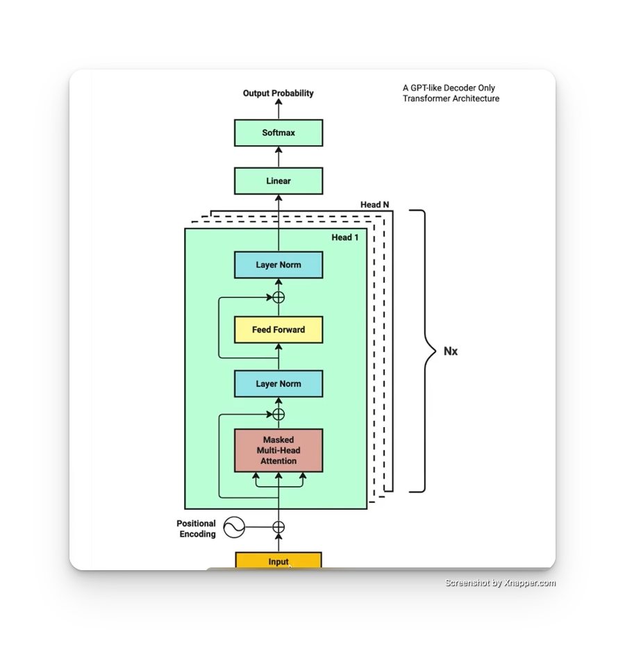

## Transformer Architecture

When i was new to AI and first encountered the Transformer Architecture, i felt overwhelmed by the sheer number of concepts and turorials available to understand it. I noticed that some vides or articles assumed prior knowlwdge of natural language processing(NLP) concepts,while others were too lengthy and difficult to comprehend.TO grasp the Transformer Architecture, I had to read numerous articles and watch several videos, and there were times when i got stuck due to a lack of basic knowledge that prevented me from fully understanding the topic,including:
- why input embedding can represent a word?
- What is a matrix multiplication and how the shape performs?
- what does sofmax do ?
- when the model is trained, where is it stored?
...

With all the complexities involved, I have found it challenging to completely master this architecture. Therefore , I urge you to be patitent and make sure to watch the video clips first, as the concepts are relatively easy to understand once explained. If we proceed step-by-step, staring from the basics and gradually moving towards more advanced topics, I am confident that you will soon be on the same page as me.

详细梳理：
假设我们需要对“中华人民共和国”这句话进行训练，提取字之间的关键信息，我们要根据维度建立一个矩阵，因为一个字或者词语，在不同的语境不同的场合有不同的意思，所以建立这种不同的维度，就可以更好的把人类的话语信息统计到
比如现在的矩阵是
 1， 2， 3 ... 20
中
华
人
民
共
和
国

这是一个7 * 20的矩阵
丢进去Input Embeddings,把它变为数字，这是因为计算机对于数字可以很好的理解，对于文字没那么好理解，不符合计算机的计算架构。假设我们之前提前设计好了每个字对应的数字符号，比如中 对应数字符号是 3923，华是 4034 以此类推。那么InputEmbedding就是做这个动作。
Positional Encoding是对这些符号化了的文字进行位置编码，只有位置固定好了，才方便记录概率计算和统计。
Masked Multi-Head Attention: 这个地方是最重要的地方，他是用来计算这些字之间的概率的。他会接受3个同样的矩阵数据，这三个参数叫做q,k,v 本质上就是q,k,v之间相互作运算，得出字与字之间的概率,但是得出概率之后为了防止过拟合，所以你会看到图上出来之后他还会把原来的文本概率给你加上来，防止概率偏差太大。比如原本中，华概率是1，1 但是你这里的出来的结果是0.2，0.9， 那么加上之后就是1.2，1.9就更合理了，没那么偏差大了
Layer Norm: 这里也是类似防止过拟合的操作，概率大的缩小一点，概率小的稍微缩一点点，比如前面的1.2->1.1,1.9->1.5之类的操作
Feed Forward:是传统的网络神经的计算模块，得到的结果你会发现，也会重复前面的操作，把原本的概率拿出来加上，防止过拟合，然后也是会后续用到Layer Norm优化概率分布。
Linear: 它本身是一个类似于字典表，一个很大规模的矩阵，然后结合下一步骤的softmax会计算下一个概率高的词或者字，比如目前我们训练的结果是“中华人民共和国”，经过这个计算之后softmax计算下一个字概率最大的事“万”，那么他就把“万”添加到原本的输入里面去，比如是“中华人民共和国万”，以此类推，下一次后面又会追加一个字变为 “中华人民共和国万岁”

