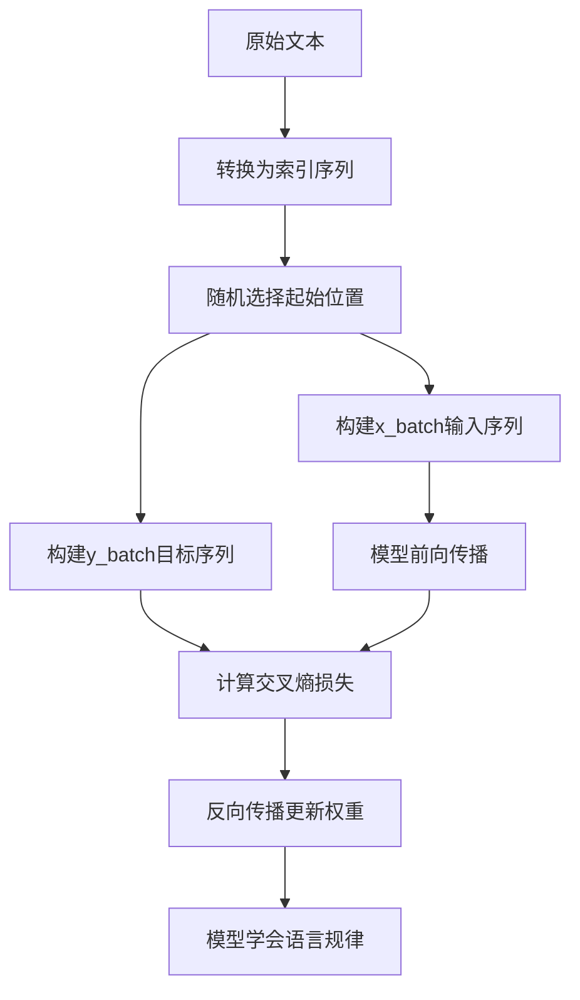

# 自回归训练与x_batch/y_batch详解

我用"中华人民共和国"的例子来详细解释自回归训练和x_batch/y_batch的作用。

## 1. 自回归训练的基本概念

### 1.1 什么是自回归？
**自回归**就像"接龙游戏"：模型根据前面已经生成的内容，预测下一个字。

在"中华人民共和国"的例子中：
- 给定"中" → 预测"华"
- 给定"中华" → 预测"人"  
- 给定"中华人民" → 预测"民"
- 以此类推...

### 1.2 自回归的数学表达
```
P(文本) = P(字₁) × P(字₂|字₁) × P(字₃|字₁,字₂) × ... × P(字ₙ|字₁,...,字ₙ₋₁)
```

对于"中华人民共和国"：
```
P(中华人民共和国) = P(中) × P(华|中) × P(人|中华) × P(民|中华人民) × ...
```

## 2. x_batch和y_batch的具体作用

### 2.1 数据准备过程

假设我们的训练数据是：
```python
text = "中华人民共和国"
train_data = [0, 1, 2, 3, 4, 5, 6]  # 中=0,华=1,人=2,民=3,共=4,和=5,国=6
context_length = 3  # 用3个字预测下一个字
batch_size = 2     # 一次训练2个样本
```

### 2.2 随机选择起始位置
```python
idxs = torch.randint(low=0, high=len(train_data) - context_length, size=(batch_size,))
# 假设随机得到：idxs = [0, 2]  (从位置0和位置2开始)
```

### 2.3 构建x_batch（输入序列）
```python
x_batch = torch.stack([train_data[idx:idx + context_length] for idx in idxs])
# 结果：x_batch = [[0, 1, 2],   # 从位置0开始：中,华,人
#                 [2, 3, 4]]   # 从位置2开始：人,民,共
```

### 2.4 构建y_batch（目标序列）
```python
y_batch = torch.stack([train_data[idx + 1:idx + context_length + 1] for idx in idxs])
# 结果：y_batch = [[1, 2, 3],   # 从位置1开始：华,人,民  
#                 [3, 4, 5]]   # 从位置3开始：民,共,和
```

## 3. 为什么需要这种"偏移"设计？

### 3.1 训练目标：预测下一个字
对于第一个样本 `x_batch[0] = [0, 1, 2]`（中,华,人）：

| 输入上下文 | 应该预测的下一个字 | 在y_batch中的位置 |
|-----------|-------------------|------------------|
| [0]       | 1 (华)            | y_batch[0][0] = 1 |
| [0, 1]    | 2 (人)            | y_batch[0][1] = 2 |
| [0, 1, 2] | 3 (民)            | y_batch[0][2] = 3 |

**关键洞察**：y_batch不是简单地向右移动一位，而是**每个位置都有对应的下一个字目标**。

### 3.2 并行训练的优势

传统的自回归是一个字一个字生成：
```
时间步1: 输入"中" → 预测"华"
时间步2: 输入"中华" → 预测"人"  
时间步3: 输入"中华人民" → 预测"民"
```

但我们的方法可以**并行处理**：
```
同时训练：
- 给定"中"预测"华"
- 给定"中华"预测"人" 
- 给定"中华人民"预测"民"
```

## 4. 具体训练过程模拟

### 4.1 模型前向传播
输入 `x_batch = [[0,1,2], [2,3,4]]`

模型为**每个位置的每个字**计算下一个字的概率分布：

**第一个样本 [0,1,2] 的预测**：
```
位置0（只看"中"）: 
    P(华|中)=0.3, P(人|中)=0.1, P(民|中)=0.05, ...  # 总和=1

位置1（看"中,华"）:
    P(人|中华)=0.6, P(民|中华)=0.2, P(共|中华)=0.1, ... 

位置2（看"中,华,人"）:
    P(民|中华人民)=0.8, P(共|中华人民)=0.15, ...
```

### 4.2 计算损失
将预测概率与y_batch中的真实值比较：

**第一个样本的损失计算**：
```
位置0: 真实值=1(华) → 损失 = -log(P(华|中)) = -log(0.3) ≈ 1.20
位置1: 真实值=2(人) → 损失 = -log(P(人|中华)) = -log(0.6) ≈ 0.51  
位置2: 真实值=3(民) → 损失 = -log(P(民|中华人民)) = -log(0.8) ≈ 0.22
平均损失 = (1.20 + 0.51 + 0.22) / 3 ≈ 0.64
```

### 4.3 反向传播更新
模型学习到：
- 看到"中"时，应该更自信地预测"华"
- 看到"中华"时，应该更自信地预测"人"
- 看到"中华人民"时，应该更自信地预测"民"

## 5. 可视化训练流程



## 6. 为什么这种设计有效？

### 6.1 数据效率高
从"中华人民共和国"7个字中，我们可以创建多个训练样本：
- 起始位置0: [中,华,人] → [华,人,民]
- 起始位置1: [华,人,民] → [人,民,共] 
- 起始位置2: [人,民,共] → [民,共,和]
- 起始位置3: [民,共,和] → [共,和,国]

### 6.2 学习完整的语言模型
模型不仅学习"中华人民"后面是"共"，还学习：
- "中"后面通常是"华"
- "中华"后面通常是"人"
- 各种长度上下文的预测规律

### 6.3 为生成任务做准备
训练完成后，模型可以用于文本生成：
```
输入: "中" → 输出: "华"
输入: "中华" → 输出: "人"
输入: "中华人民" → 输出: "共"
```

## 7. 实际训练中的批量处理

在实际训练中，我们会处理大量这样的批次：

```python
for epoch in range(1000):  # 训练1000轮
    for batch in range(100):  # 每轮100个批次
        # 每个批次处理32个样本
        idxs = torch.randint(low=0, high=len(data)-context_length, size=(32,))
        x_batch = torch.stack([data[idx:idx+context_length] for idx in idxs])
        y_batch = torch.stack([data[idx+1:idx+context_length+1] for idx in idxs])
        
        # 训练步骤...
        logits = model(x_batch)  # 形状: [32, context_length, vocab_size]
        loss = compute_loss(logits, y_batch)
        loss.backward()
        optimizer.step()
```

## 8. 关键理解点

1. **x_batch是"上下文"**：模型看到的输入序列
2. **y_batch是"目标"**：模型应该预测的下一个字序列  
3. **偏移设计**：让每个位置都能作为训练样本
4. **并行训练**：一次性学习多种长度上下文的预测
5. **自回归本质**：基于历史预测未来

这种巧妙的数据组织方式，让模型能够高效地学习语言的内在规律，为后续的文本生成任务打下坚实基础。