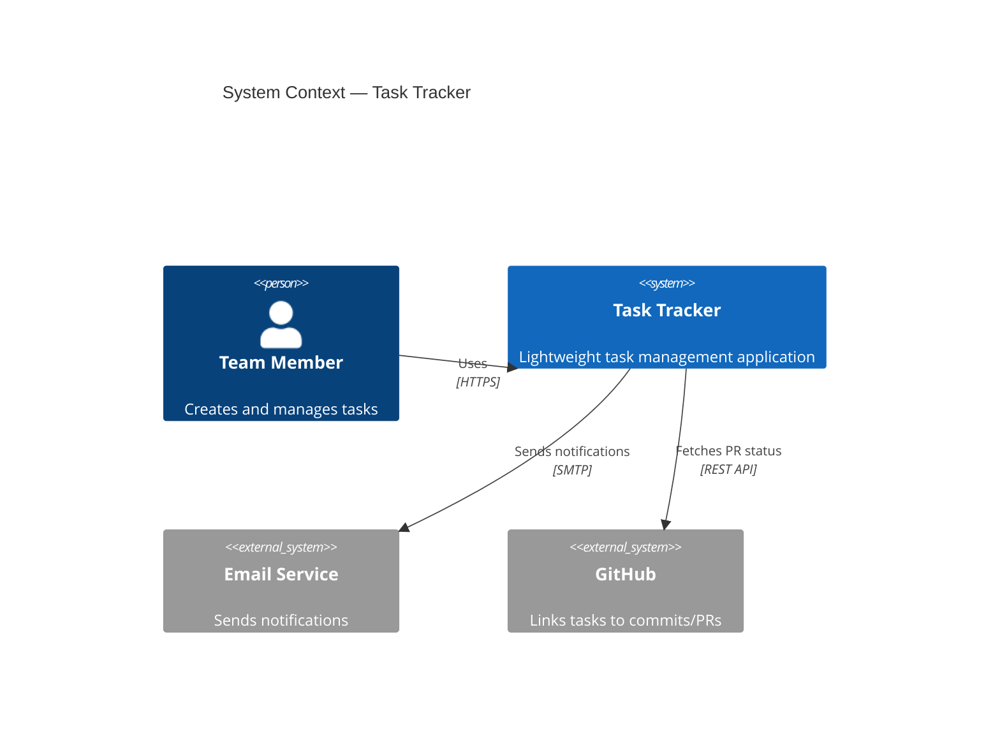
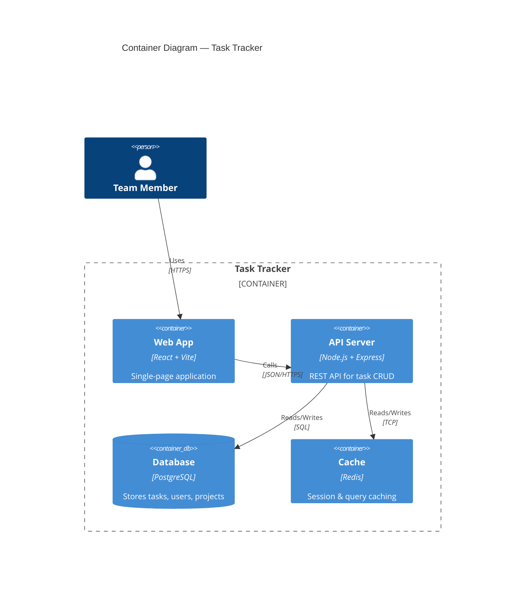

# Phase 3: Architecture — System Design & API-First

## Purpose

Define the high-level technical structure: components, data flow, technology stack, system boundaries, **and the API contract that governs frontend-backend integration**.

## Recommended Tools

| Tool | Type | Best For | Link |
|:---|:---|:---|:---|
| **Structurizr** | OSS | C4 model, "models as code" | [GitHub: structurizr](https://github.com/structurizr) |
| **Mermaid.js** | OSS | Diagrams in markdown/GitHub | [mermaid.js.org](https://mermaid.js.org) |
| **C4-PlantUML** | OSS | C4 diagrams with PlantUML | [GitHub: C4-PlantUML](https://github.com/plantuml-stdlib/C4-PlantUML) |
| **draw.io** | OSS | Visual architecture diagrams | [diagrams.net](https://www.diagrams.net) |
| **Eraser.io** | Platform | AI-generated diagrams | [eraser.io](https://eraser.io) |
| **OpenSpec** | OSS | Architecture design documents | [GitHub: Fission-AI/OpenSpec](https://github.com/Fission-AI/OpenSpec) |

## Should You Use OpenSpec/Superpowers or Open-Source Repos?

| Approach | When to Use |
|:---|:---|
| **OpenSpec** | When you need structured design docs before coding. Best for documenting component decisions. |
| **Structurizr + Mermaid** | When you need formal C4 architecture diagrams that live in your repo as code. |
| **AI + Eraser.io** | When you want to quickly draft architecture from a prompt and iterate visually. |

> **Recommendation**: Use a combination:
> 1. **OpenSpec** for architecture decision records (ADRs) and design proposals
> 2. **Mermaid.js** for diagrams embedded in your markdown docs (renders natively on GitHub)
> 3. **Structurizr** for formal C4 model if you need multi-level zoom (Context → Container → Component)

## Key Steps

```
Step 1: Choose Architecture Style
  └─→ Monolith vs. Microservices vs. Serverless vs. Modular Monolith

Step 2: Define System Context (C4 Level 1)
  └─→ Who uses the system? What external systems does it interact with?

Step 3: Define Container Diagram (C4 Level 2)
  └─→ Frontend, Backend API, Database, Message Queue, etc.

Step 4: Define Component Diagram (C4 Level 3)
  └─→ Internal modules, services, and their responsibilities

Step 5: Design API Contract (API-First) ← NEW — CRITICAL
  └─→ Define OpenAPI spec BEFORE writing frontend or backend code
  └─→ Generate mock servers for frontend team to develop against

Step 6: Define Data Model
  └─→ Entity-Relationship Diagram, database schema

Step 7: Document Architecture Decision Records (ADRs)
  └─→ Why did we choose X over Y?

Step 8: Review & Validate
  └─→ Ensure NFRs (performance, security, scalability) are addressed
```

## API-First Design Principle (Frontend-Backend Integration)

> **"Design the API contract before writing a single line of frontend or backend code."**

### Why API-First?

The API-First approach is the **single most important practice** for frontend-backend integration. Without it, teams fall into the "integration nightmare":

```
❌ WITHOUT API-First (Code-First):

  Frontend Dev                    Backend Dev
  ────────────                    ───────────
  Builds UI based on             Builds API based on
  assumptions about API    ≠     database schema
        │                              │
        └──────── INTEGRATION ─────────┘
                      │
              💥 "The response format
                 is completely different
                 from what I expected!"
              → Rework both sides
              → 2 weeks wasted

✅ WITH API-First (Contract-First):

  Step 1: DESIGN API CONTRACT TOGETHER
  ──────────────────────────────────────
  Both teams agree on the OpenAPI spec
        │
        ├──→ Frontend Dev uses MOCK SERVER (from spec)
        │    Can build & test UI immediately
        │
        └──→ Backend Dev implements to match CONTRACT
             Guaranteed to be compatible
        │
        └──── INTEGRATION ────
                   │
               ✅ "It just works."
               → Both sides already compatible
               → 0 rework
```

### The API-First Workflow

```
┌─────────────────────────────────────────────────────────────────────────┐
│                    API-First Development Workflow                       │
│                                                                         │
│  Step 1: DESIGN — Write OpenAPI Spec                                    │
│  ├─ Tool: Swagger Editor, Stoplight, or VS Code OpenAPI extension       │
│  ├─ Define: Endpoints, request/response schemas, error formats          │
│  └─ Output: openapi.yaml (the single source of truth)                  │
│                                                                         │
│  Step 2: REVIEW — Both Teams Agree                                      │
│  ├─ Frontend, Backend, QA, and Product review the spec                  │
│  ├─ Catch issues BEFORE implementation                                  │
│  └─ Merge approved spec into repo                                       │
│                                                                         │
│  Step 3: MOCK — Generate Mock Server                                    │
│  ├─ Tool: Prism (from Stoplight) or Postman                            │
│  ├─ Frontend team develops against mock API                             │
│  └─ No waiting for backend to be ready!                                 │
│                                                                         │
│  Step 4: GENERATE — Auto-Generate Code                                  │
│  ├─ Tool: openapi-generator-cli or openapi-typescript                   │
│  ├─ Generate: TypeScript types, API client SDK, server stubs            │
│  └─ Both teams get type-safe, synchronized code                         │
│                                                                         │
│  Step 5: IMPLEMENT — Build Against the Contract                         │
│  ├─ Backend: Implement endpoints to match the spec exactly              │
│  ├─ Frontend: Replace mock server URL with real API URL                 │
│  └─ Integration is seamless — the contract guarantees compatibility     │
│                                                                         │
│  Step 6: VALIDATE — Contract Testing in CI/CD                           │
│  ├─ Automatically verify implementation matches the spec                │
│  ├─ Fail CI if API drifts from the contract                             │
│  └─ Prevents "silent breaking changes"                                  │
└─────────────────────────────────────────────────────────────────────────┘
```

### API-First Recommended Tools

| Tool | Purpose | Link |
|:---|:---|:---|
| **Swagger Editor** | Visual OpenAPI spec editor | [editor.swagger.io](https://editor.swagger.io) |
| **Stoplight Studio** | API design platform (free tier) | [stoplight.io](https://stoplight.io) |
| **Prism** | Mock server from OpenAPI spec | [GitHub: stoplightio/prism](https://github.com/stoplightio/prism) |
| **openapi-generator** | Code generation (40+ languages) | [GitHub: OpenAPITools](https://github.com/OpenAPITools/openapi-generator) |
| **openapi-typescript** | TypeScript types from OpenAPI | [GitHub: openapi-ts](https://github.com/openapi-ts/openapi-typescript) |
| **Postman** | API testing + mock servers | [postman.com](https://postman.com) |
| **Redoc** | Beautiful API docs from spec | [GitHub: Redocly/redoc](https://github.com/Redocly/redoc) |

### Demo: OpenAPI Spec for Task Tracker

```yaml
# openapi.yaml — The Single Source of Truth
openapi: 3.1.0
info:
  title: Task Tracker API
  version: 1.0.0
  description: RESTful API for the Task Tracker application

servers:
  - url: http://localhost:3001/api
    description: Development
  - url: https://api.tasktracker.example.com/api
    description: Production

paths:
  /tasks:
    get:
      summary: List all tasks
      operationId: listTasks
      parameters:
        - name: status
          in: query
          schema:
            $ref: '#/components/schemas/TaskStatus'
        - name: priority
          in: query
          schema:
            $ref: '#/components/schemas/TaskPriority'
        - name: search
          in: query
          schema:
            type: string
        - name: cursor
          in: query
          description: Cursor for pagination
          schema:
            type: string
      responses:
        '200':
          description: Success
          content:
            application/json:
              schema:
                type: object
                properties:
                  data:
                    type: array
                    items:
                      $ref: '#/components/schemas/Task'
                  meta:
                    $ref: '#/components/schemas/PaginationMeta'

    post:
      summary: Create a new task
      operationId: createTask
      requestBody:
        required: true
        content:
          application/json:
            schema:
              $ref: '#/components/schemas/CreateTaskRequest'
      responses:
        '201':
          description: Task created
          content:
            application/json:
              schema:
                type: object
                properties:
                  data:
                    $ref: '#/components/schemas/Task'
        '400':
          $ref: '#/components/responses/ValidationError'

  /tasks/{taskId}:
    patch:
      summary: Update a task
      operationId: updateTask
      parameters:
        - name: taskId
          in: path
          required: true
          schema:
            type: string
      requestBody:
        required: true
        content:
          application/json:
            schema:
              $ref: '#/components/schemas/UpdateTaskRequest'
      responses:
        '200':
          description: Task updated
          content:
            application/json:
              schema:
                type: object
                properties:
                  data:
                    $ref: '#/components/schemas/Task'
        '404':
          $ref: '#/components/responses/NotFound'

components:
  schemas:
    Task:
      type: object
      required: [id, title, status, priority, createdAt, updatedAt]
      properties:
        id:
          type: string
          format: cuid
        title:
          type: string
          maxLength: 200
        description:
          type: string
          maxLength: 2000
        status:
          $ref: '#/components/schemas/TaskStatus'
        priority:
          $ref: '#/components/schemas/TaskPriority'
        assigneeId:
          type: string
          nullable: true
        createdAt:
          type: string
          format: date-time
        updatedAt:
          type: string
          format: date-time

    TaskStatus:
      type: string
      enum: [todo, in_progress, done]

    TaskPriority:
      type: string
      enum: [low, medium, high, urgent]

    CreateTaskRequest:
      type: object
      required: [title]
      properties:
        title:
          type: string
          minLength: 1
          maxLength: 200
        description:
          type: string
          maxLength: 2000
        priority:
          $ref: '#/components/schemas/TaskPriority'
          default: medium
        assigneeId:
          type: string

    UpdateTaskRequest:
      type: object
      properties:
        title:
          type: string
        description:
          type: string
        status:
          $ref: '#/components/schemas/TaskStatus'
        priority:
          $ref: '#/components/schemas/TaskPriority'
        assigneeId:
          type: string
          nullable: true

    PaginationMeta:
      type: object
      properties:
        nextCursor:
          type: string
          nullable: true
        hasMore:
          type: boolean

    # ── Standardized Error Format ──
    ErrorResponse:
      type: object
      required: [error]
      properties:
        error:
          type: string
        details:
          type: array
          items:
            type: object
            properties:
              field:
                type: string
              message:
                type: string

  responses:
    ValidationError:
      description: Validation failed
      content:
        application/json:
          schema:
            $ref: '#/components/schemas/ErrorResponse'
          example:
            error: "Validation failed"
            details:
              - field: "title"
                message: "Title is required"
    NotFound:
      description: Resource not found
      content:
        application/json:
          schema:
            $ref: '#/components/schemas/ErrorResponse'
          example:
            error: "Task not found"
```

### Demo: Using the API Spec in Practice

```bash
# 1. Generate a mock server (frontend can start immediately!)
npx @stoplight/prism-cli mock openapi.yaml --port 4010
# Mock server running at http://localhost:4010
# Frontend team can now build against this mock!

# 2. Generate TypeScript types (shared between frontend & backend)
npx openapi-typescript openapi.yaml -o src/types/api.ts
# Produces type-safe interfaces:
# export interface Task { id: string; title: string; ... }
# export interface CreateTaskRequest { title: string; ... }

# 3. Generate API client SDK for frontend
npx openapi-generator-cli generate \
  -i openapi.yaml \
  -g typescript-fetch \
  -o src/api/generated/
# Frontend now has a type-safe API client!

# 4. Generate server stubs for backend
npx openapi-generator-cli generate \
  -i openapi.yaml \
  -g nodejs-express-server \
  -o server/generated/
# Backend has route stubs that match the contract!
```

### API Design Best Practices

```
1. CONSISTENT RESPONSE FORMAT
   Every endpoint returns: { data, error, meta }
   ✅ { "data": { "id": "1", "title": "..." } }
   ✅ { "error": "Not found", "details": [...] }
   ❌ Mixing formats across endpoints

2. VERSIONING FROM DAY ONE
   /api/v1/tasks — allows future breaking changes
   without disrupting existing clients

3. CURSOR-BASED PAGINATION (not offset)
   Offset: /tasks?page=5&limit=20  ← breaks with large datasets
   Cursor: /tasks?cursor=abc123&limit=20  ← stable, scalable

4. STANDARDIZED ERROR HANDLING
   Always return structured errors with field-level details
   so the frontend can display specific validation messages

5. SECURITY SCHEMES IN THE SPEC
   Define auth (JWT, API keys) in the OpenAPI spec itself
   so all generated code includes auth handling automatically
```

## Demo: Architecture Design for Task Tracker

### C4 Context Diagram (Mermaid)



### Container Diagram (Mermaid)



### Technology Stack Decision

```markdown
## Architecture Decision Record: ADR-001 — Technology Stack

### Context
We need to select a technology stack for the Task Tracker MVP.

### Decision
| Layer | Choice | Rationale |
|:---|:---|:---|
| Frontend | React + Vite | Fast build, modern DX, large ecosystem |
| Backend | Node.js + Express | JavaScript full-stack, easy API development |
| Database | PostgreSQL | Relational, robust, free |
| Cache | Redis | Fast session/query caching |
| Hosting | Vercel (FE) + Railway (BE) | Free tiers, easy deployment |

### Alternatives Considered
- **Next.js (Full-stack)**: Overkill for MVP, adds SSR complexity
- **SQLite**: Simpler but less scalable
- **Firebase**: Vendor lock-in concerns

### Status: Accepted
```


---

← [Back to Overview](../overall-view.md)
