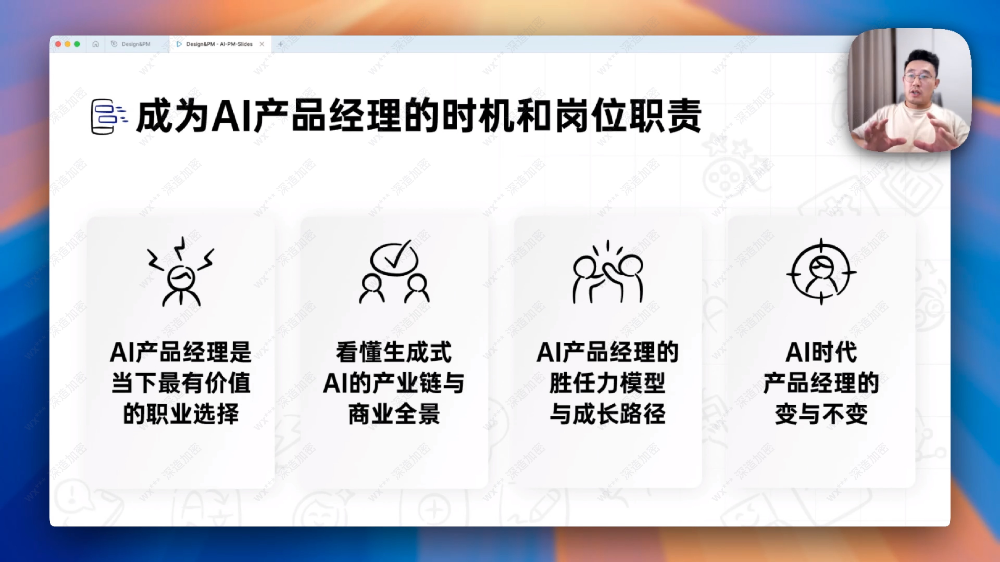
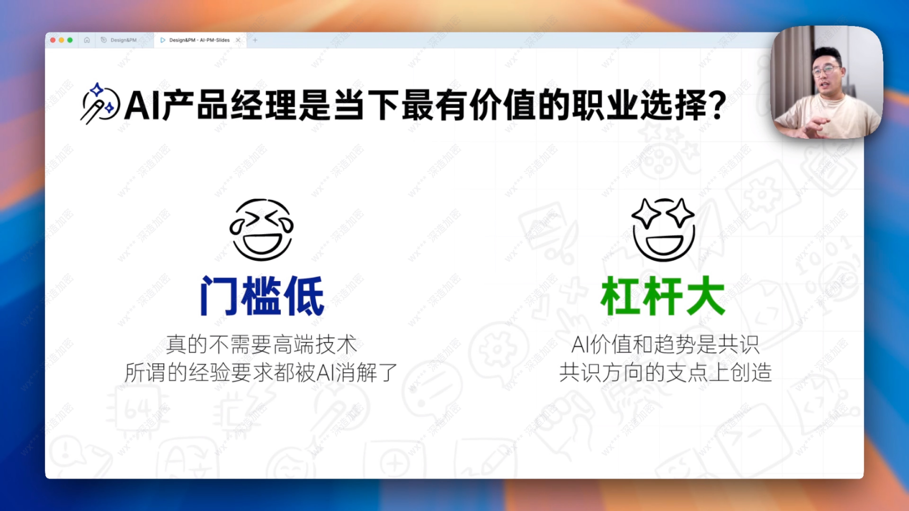
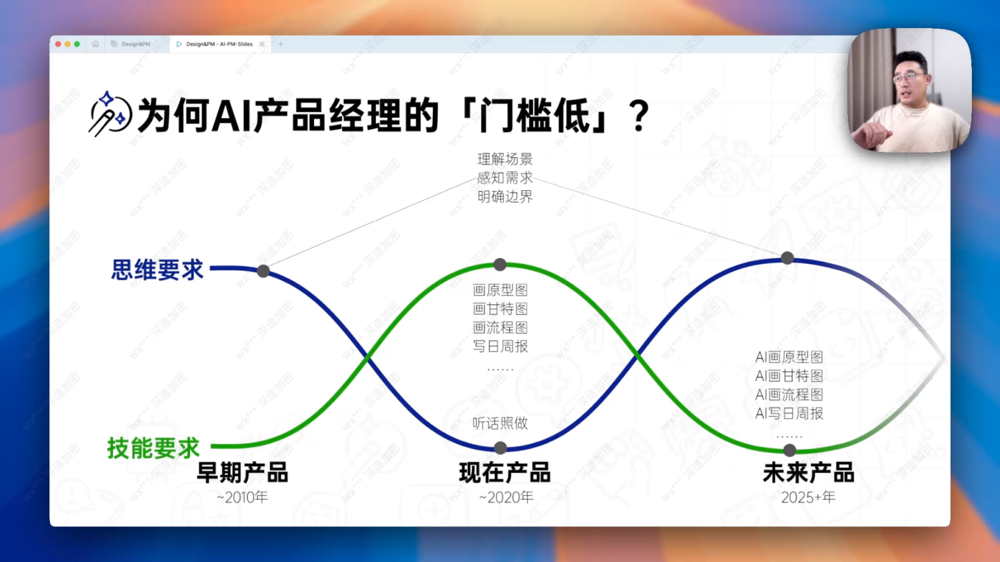
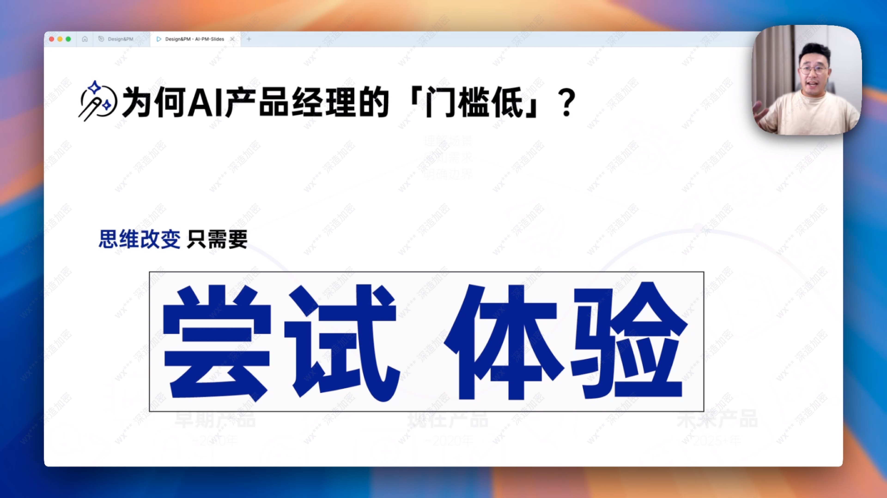
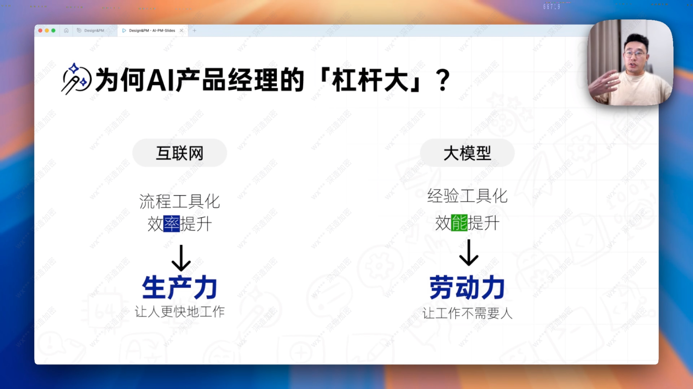
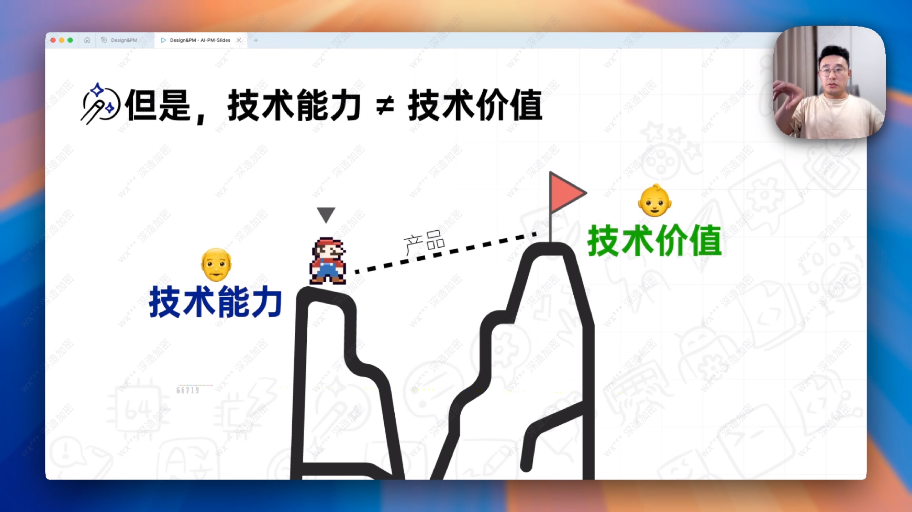
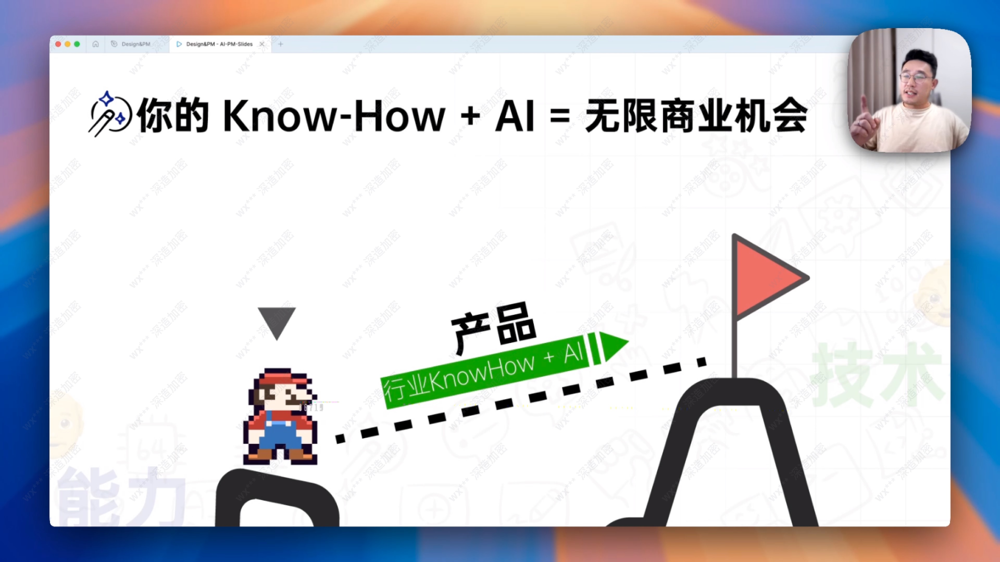
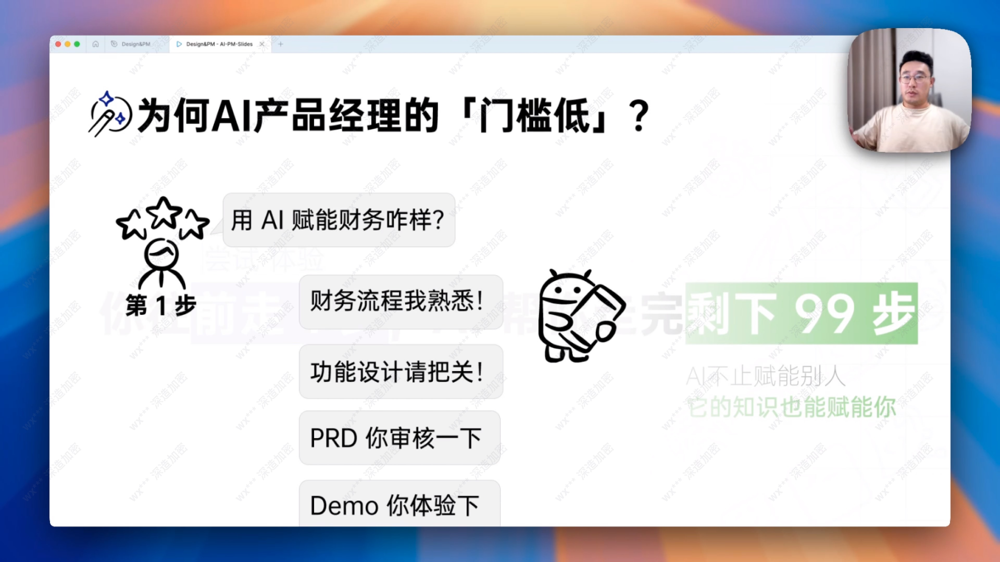
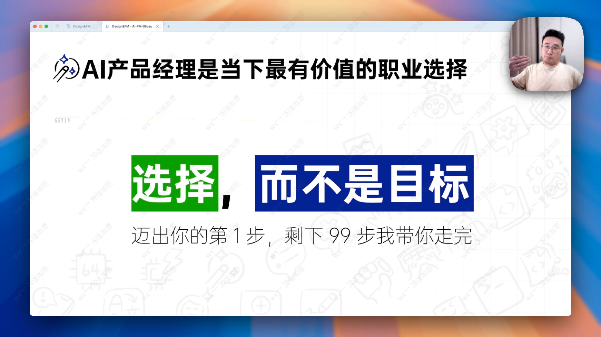

不需要高端技术，技术可以通过ai解决，更重要的是经验积累和用户需求敏感度

未来的产品经理更加侧重思维能力，技能要求反而不是什么重点了

只要你多体验多尝试，就有机会找到适合自己的思维方式和新的观点，从而把对应的产品思路打开

过去是把流程封装为工具，也就是所谓的SOP，让人的效率提升。未来大模型就是把你经验工具化，让你的效率提升。不需要那么多人

你知道如何做才可以满足用户需求和解决用户痛点，这才是你的商业机会

只要你想做产品经理，你就可以做，他从以前的目前变为现在的一个选择而已。因为所有的步骤都可以使用ai帮助你解决，信息差不再那么多了

