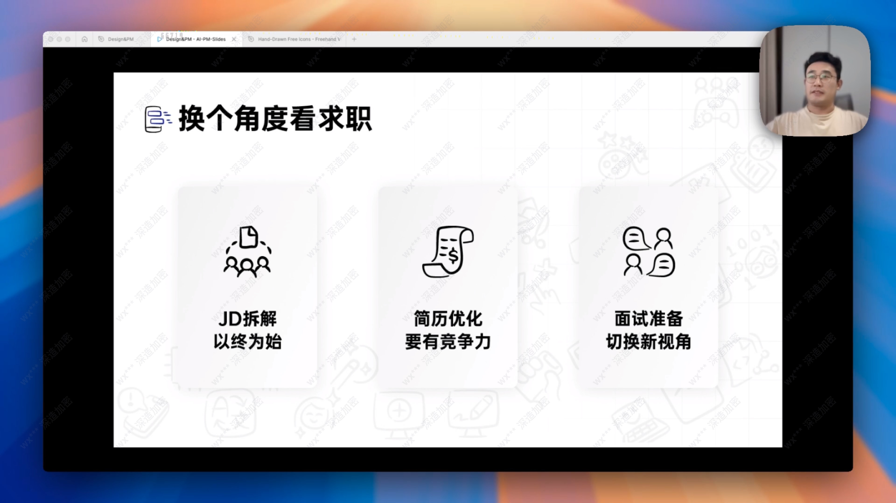 

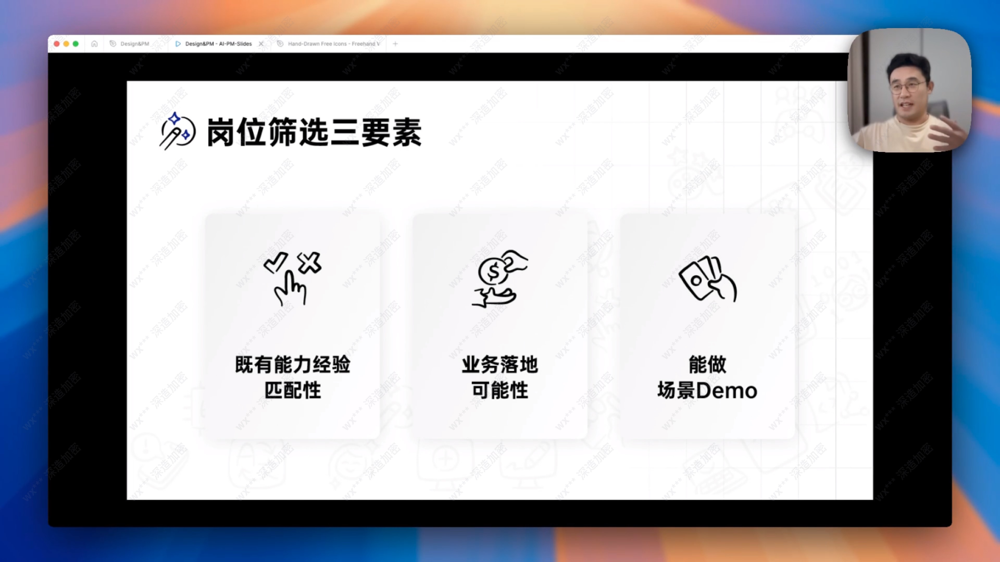 

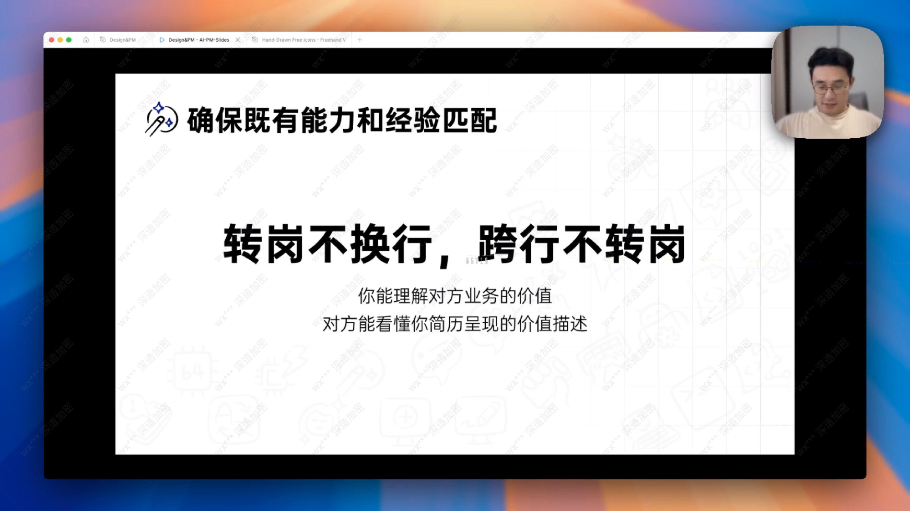 

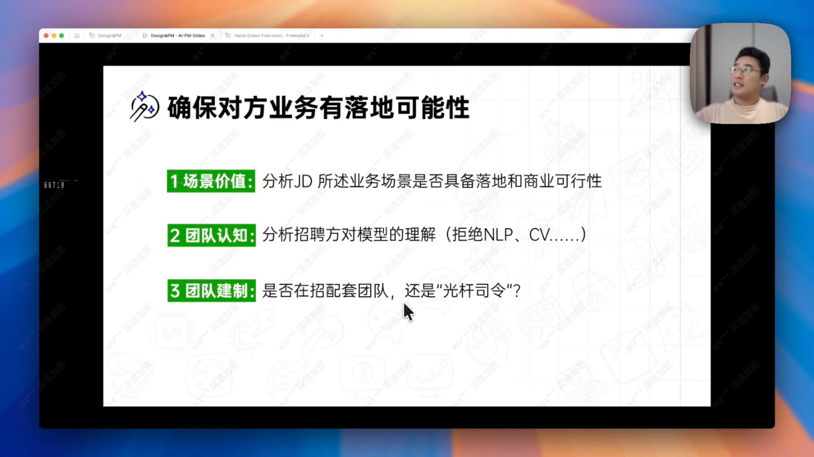 

这个岗位描述提到自然语言处理，计算机视觉，市场需求和用户需求之类的。明显就是还没想好做什么，怎么做。基本就是找个人来试试水，团队内部没有一个清晰的方向，进去了可能是光杆司令，机器学习算法之类的写进去就是没意义的，现在根本不用到机器学习

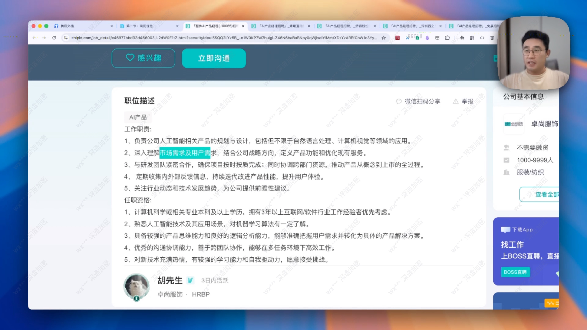 

点进去就会发现招聘岗位其实很少ai的，说明光杆司令机会很大，然后服装类也确实没有太多AI可以用到的场景。

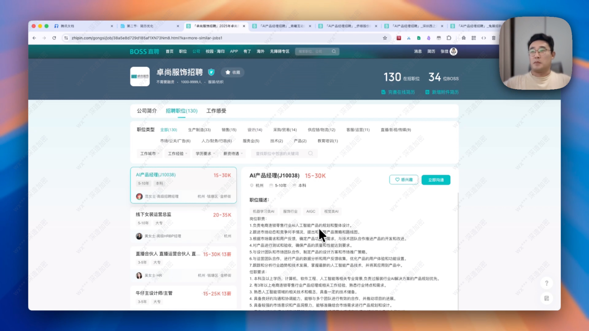 

这个写法有点偏向于技术层面，但是有一点就是AI中台能力建设方向，估计就是给企业内部开发工作流程赋能的一个平台。如果是技术人写的JD倒是可以理解

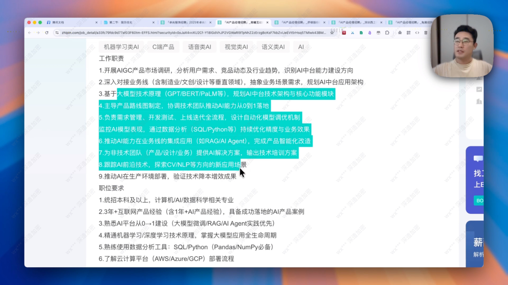 

Tensor早就很老了，JD里面提到这些根本就是毫无意义

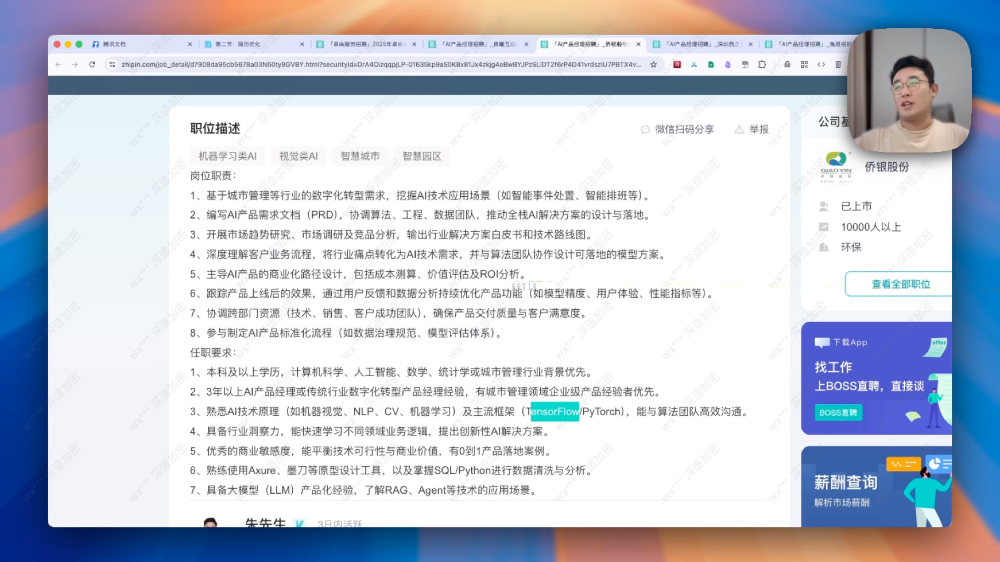 

这里提到的内容还算是知道自己要什么，需要做什么，而且提示词，知识库之类的都还是有很多不错的说明，至少是行业内主流的方案。可以试一试

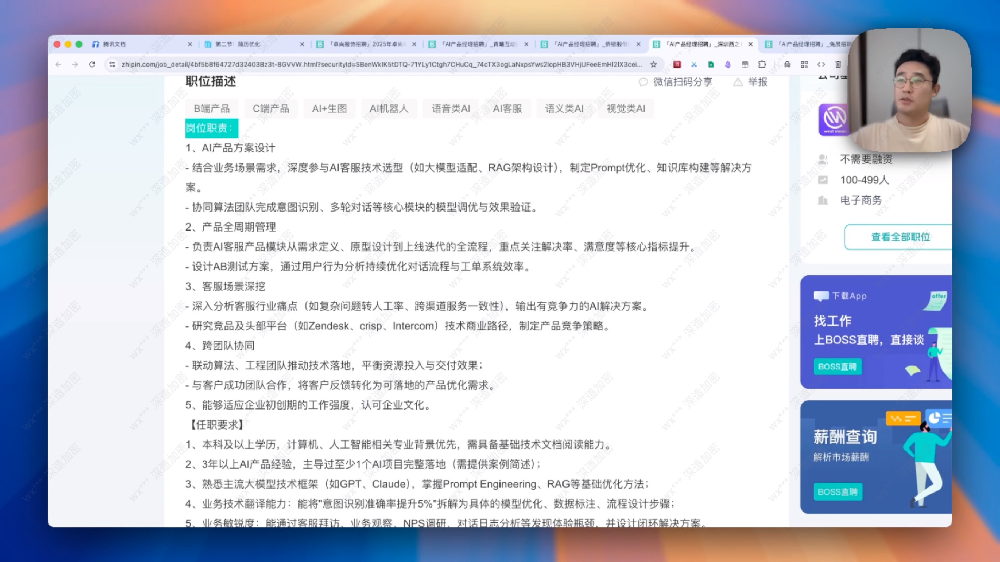 

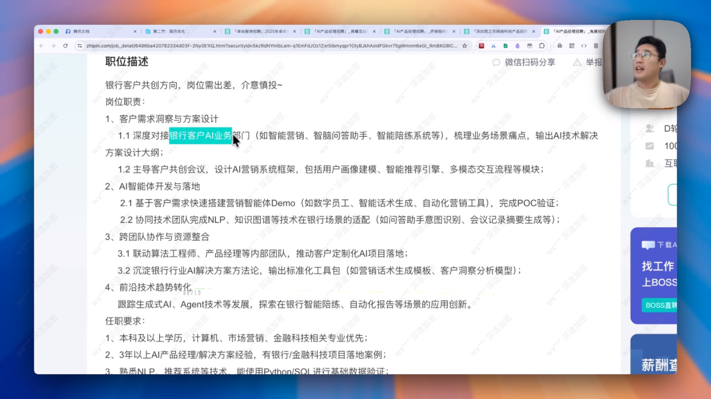 

了解这些JD之后，做一个DEMO出来，让对方知道你做了什么，有哪些细节有坑，别人更加认可你的能力和技术。

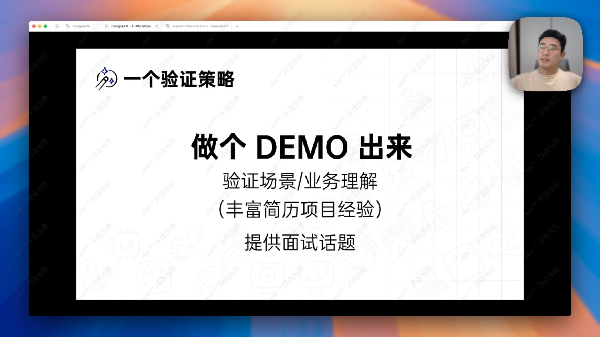