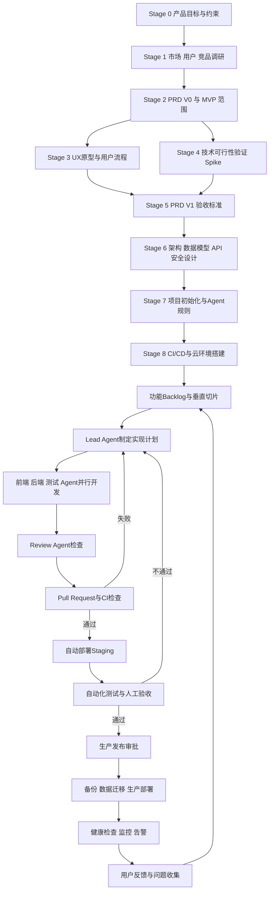

# AI Agent Teams 个人开发者全流程（含 CI/CD、云部署与运维）

> 适用场景：个人开发者负责产品决策与最终审批，使用 AI Agent Teams 完成调研、设计、编码、测试、审查和 DevOps 工作，并将项目部署到云服务器。

---

## 一、总体思路

原有流程应从“**一次性线性生成项目**”改成：

> **一次性搭建产品与工程底座 + 按功能切片重复迭代**

这更适合个人开发者使用 Agent Teams 的方式。成熟的 AI 开发流程通常保留以下关键控制点：

- Agent 在独立上下文、分支或 worktree 中完成任务；
- Lead Agent 负责任务拆分、协调和结果汇总；
- 代码必须经过自动测试、PR 和人工检查；
- Agent 不应直接修改主分支；
- 生产发布、数据库操作和 Secret 管理必须保留人工控制。

---

## 二、优化后的完整流程



这套流程分成两大部分：

1. **Stage 0—8：项目底座，重点搭建一次**
2. **Stage 9 以后：每个功能持续重复执行**

---

# 第一部分：一次性产品与工程底座

## Stage 0：产品目标与项目约束

这一阶段由你本人确定，Agent 只能提供建议，不能替你决定。

需要明确：

```text
产品解决什么问题
目标用户是谁
核心业务指标是什么
MVP 必须包含什么
MVP 明确不做什么
预算和服务器成本上限
预计开发周期
涉及哪些敏感数据
允许 Agent 使用哪些工具和权限
```

建议建立：

```text
docs/product-charter.md
```

其中写明：

- 产品目标
- 目标用户
- 核心指标
- MVP 边界
- 技术与成本限制
- 数据隐私边界
- 禁止 Agent 自主决定的事项

这是所有 Agent 的最高层约束。

---

## Stage 1：市场、用户与竞品研究

建议使用三个并行 Agent：

| Agent | 任务 |
|---|---|
| Market Research Agent | 市场规模、趋势、商业模式 |
| Competitor Agent | 功能、定价、技术与体验拆解 |
| User Research Agent | 用户痛点、场景和使用路径 |

Lead Agent 负责：

- 合并重复内容
- 标记不同 Agent 的冲突结论
- 区分事实、推测和建议
- 输出待你确认的问题

输出：

```text
docs/research/market.md
docs/research/competitors.md
docs/research/users.md
docs/research/research-summary.md
```

不要让调研 Agent 直接决定产品功能。它们只提供证据和候选方案。

---

## Stage 2：PRD V0 和 MVP 范围

PRD 应前移，不应在设计和开发完成后才补写。

PRD V0 至少包含：

- 产品背景
- 用户角色
- 用户问题
- 核心使用场景
- 功能范围
- 非功能需求
- 数据与隐私要求
- 暂不实现的内容
- 成功指标
- 已知风险

每个功能需要有用户故事：

```text
作为一个……
我希望……
从而可以……
```

以及初步验收标准：

```text
Given 前置条件
When 用户执行操作
Then 系统产生结果
```

输出：

```text
docs/product/prd-v0.md
docs/product/mvp-scope.md
```

---

## Stage 3：UX 原型与用户流程

UX Agent 负责：

- 信息架构
- 页面结构
- 用户流程
- 空状态
- 加载状态
- 错误状态
- 权限不足状态
- 移动端和桌面端差异

推荐顺序：

```text
文字用户流程
→ 低保真线框
→ 可点击原型
→ 关键页面高保真设计
```

不要一开始就让 Agent 设计全部高保真页面，应先验证主要用户路径。

输出：

```text
docs/design/user-flows.md
docs/design/page-specs.md
Figma 原型
```

每个页面规格需要写明：

- 页面目的
- 数据来源
- 用户操作
- 权限限制
- 错误处理
- 对应 API
- 验收标准

---

## Stage 4：技术可行性验证（Spike）

技术 Agent 针对风险最高的部分做小型验证，不开发完整功能。

例如：

- 第三方 API 是否可用
- AI 模型调用延迟和费用
- 文件上传方案
- WebSocket 或流式响应
- 搜索和向量数据库
- 权限体系
- 云服务器资源需求
- 大文件处理
- 支付回调

每个 Spike 应限制在几个小时到一天，只回答技术问题，验证代码可以被删除。

输出：

```text
docs/spikes/xxx-spike.md
```

结论格式：

```text
问题
候选方案
验证过程
测试结果
成本和风险
推荐方案
放弃方案
```

---

## Stage 5：PRD V1、验收标准和非功能需求

结合 UX 原型和技术 Spike 更新 PRD。

### 功能验收标准示例

```text
用户可以创建项目
项目名称不能为空
项目名称最长 100 个字符
重复提交不会产生重复项目
创建失败时显示明确错误
无权限用户返回 403
```

### 非功能需求

至少包含：

- 性能
- 安全
- 可用性
- 数据备份
- 日志与审计
- 浏览器兼容
- 响应式设计
- 可访问性
- API 超时
- 数据保留期限

PRD 不应从此冻结，而应随着功能迭代持续更新。

---

## Stage 6：架构、数据、API 与安全设计

建议并行启用：

| Agent | 输出 |
|---|---|
| Architecture Agent | 系统架构、模块边界、ADR |
| Database Agent | ER 图、表结构、索引和迁移 |
| API Agent | OpenAPI 契约、错误码和鉴权 |
| Security Agent | 威胁模型、权限和 Secret 方案 |
| DevOps Agent | 容器、服务器和部署方案 |

输出目录：

```text
docs/architecture/
├── system-overview.md
├── module-boundaries.md
├── deployment.md
├── security.md
├── observability.md
└── adr/
```

建议维护 ADR：

```text
docs/architecture/adr/001-use-postgresql.md
docs/architecture/adr/002-use-jwt-or-session.md
docs/architecture/adr/003-deployment-strategy.md
```

### API 契约优先

前端和后端并行开发前，先固定：

- URL
- 请求参数
- 响应结构
- 枚举值
- 错误码
- 分页形式
- 时间和时区格式
- 鉴权方式
- 幂等规则

推荐使用：

```text
openapi.yaml
```

前端可以根据契约使用 Mock Server 或生成类型，不需要等后端全部完成。

### 数据库设计要求

每次修改必须包含：

- 数据库迁移
- 向前兼容说明
- 是否需要数据回填
- 回滚方式
- 大表影响
- 备份要求

---

## Stage 7：项目初始化与 Agent 规则

建议目录：

```text
project/
├── apps/
│   ├── frontend/
│   └── backend/
├── packages/
│   ├── shared/
│   └── api-client/
├── tests/
│   ├── integration/
│   └── e2e/
├── deploy/
│   ├── compose.yaml
│   ├── compose.staging.yaml
│   ├── compose.production.yaml
│   └── scripts/
├── docs/
├── .github/
│   ├── workflows/
│   ├── ISSUE_TEMPLATE/
│   └── pull_request_template.md
├── CLAUDE.md
├── AGENTS.md
├── openapi.yaml
└── README.md
```

对于个人开发者，单体仓库通常更容易管理，因为前端、后端、接口契约、测试和部署配置能够在同一次 PR 中原子修改。

### `CLAUDE.md` / `AGENTS.md`

这两个文件应在项目开始时创建。

建议内容：

```markdown
# 项目目标

# 技术栈

# 目录结构

# 本地启动命令

# 测试命令

# 编码规范

# API 规则

# 数据库迁移规则

# Git 与分支规范

# Agent 可修改的目录

# Agent 禁止操作

# 安全规则

# Definition of Done
```

必须明确禁止：

```text
禁止直接提交 main
禁止绕过测试
禁止关闭安全扫描
禁止读取或输出生产 Secret
禁止直接连接生产数据库
禁止执行生产部署
禁止修改历史数据库迁移
禁止在没有审批时添加大型依赖
禁止同时重构与开发新功能
```

---

## Stage 8：CI/CD 与云环境搭建

需要同时搭建：

- 本地开发环境
- Staging 测试环境
- Production 生产环境
- GitHub Actions 或同类 CI/CD
- 容器镜像仓库
- 数据库备份
- 健康检查
- 日志和监控
- 回滚脚本

---

# 第二部分：Agent Teams 组织结构

## 1. Lead / Orchestrator Agent

职责：

- 阅读 PRD 和架构文档
- 拆分 Issue
- 确定依赖关系
- 分配任务
- 检查各 Agent 输出
- 汇总状态
- 发现冲突后停止并上报

Lead Agent 原则上不负责大规模编码，避免同时承担管理和主要开发工作。

---

## 2. Product Agent

负责：

- 完善用户故事
- 检查需求遗漏
- 编写验收条件
- 更新 PRD
- 检查实现是否偏离范围

---

## 3. Frontend Agent

负责：

- 页面与组件
- 状态管理
- API Client
- 表单验证
- 前端单元测试
- 可访问性
- 加载、空状态和错误状态

---

## 4. Backend Agent

负责：

- API
- 领域逻辑
- 权限
- 数据库访问
- 数据迁移
- 后端单元和集成测试

---

## 5. QA Agent

QA Agent 不应只在最后补测试。

它应该：

- 根据 PRD 独立生成测试用例
- 检查边界条件
- 编写集成测试
- 编写 E2E 测试
- 验证 Bug 修复
- 检查回归风险

---

## 6. Review / Security Agent

建议设置为只读或限制写权限。

负责：

- 审查 Diff
- 查找逻辑漏洞
- 查找越权问题
- 查找 Secret 泄露
- 查找未处理异常
- 检查数据库迁移
- 检查依赖风险
- 检查测试覆盖是否真实有效

---

## 7. DevOps Agent

负责生成和维护：

- Dockerfile
- Compose 文件
- GitHub Actions
- 部署脚本
- 健康检查
- 监控配置
- 备份脚本
- 回滚脚本

DevOps Agent 不应持有生产服务器密钥，也不应拥有自动执行生产部署的权限。

---

## 并行规模建议

个人开发时建议同时运行：

```text
1 个 Lead Agent
2～3 个实现 Agent
1 个测试或审查 Agent
```

调研 Agent 可以更多，但同时修改代码的 Agent 不宜过多。

注意：

- 两个 Agent 不要同时修改同一个模块；
- 数据库 Schema 只能指定一个负责人；
- OpenAPI 契约修改必须先协调；
- 一个 Agent 对应一个 Issue；
- 一个 Issue 对应一个短生命周期分支；
- 一个 PR 尽量只解决一个主题。

---

# 第三部分：Agent 任务标准

不要只给 Agent 一句话：

> 帮我实现登录功能。

每个 Issue 应包含完整的 Task Package：

```markdown
# 目标

实现邮箱和密码登录。

# 背景

关联 PRD：docs/product/prd-v1.md
关联 API：openapi.yaml
关联设计：Figma XXX 页面

# 范围

- 登录表单
- 登录 API
- Session 创建
- 错误提示
- 登录成功跳转

# 不在范围内

- OAuth 登录
- 找回密码
- 多因素认证

# 允许修改

- apps/frontend/src/features/auth/**
- apps/backend/app/auth/**
- tests/auth/**

# 禁止修改

- 支付模块
- 已发布数据库迁移
- CI/CD 配置

# 验收标准

1. 正确账号可以登录
2. 错误密码返回统一错误
3. 不泄露账号是否存在
4. 连续失败有频率限制
5. 前端显示加载和错误状态

# 测试要求

- 后端单元测试
- API 集成测试
- 前端组件测试
- 登录 E2E 测试

# 完成条件

- 所有测试通过
- 无 lint 和类型错误
- 文档已更新
- 提交 PR
```

任务越具体，Agent 输出越稳定。

---

# 第四部分：每个功能的开发循环

成熟流程不是“后端全部写完，前端全部写完，最后联调”，而是按小型垂直功能切片交付。

一个切片应包含：

```text
数据库迁移
+ 后端 API
+ 前端页面
+ 自动化测试
+ 监控日志
+ 文档
```

不建议：

```text
先开发所有数据库
再开发所有 API
再开发所有前端
最后统一联调
```

## 标准循环

```text
1. 你选择下一个功能
2. Product Agent 完善需求和验收条件
3. Lead Agent 制订技术计划
4. 你批准计划
5. Lead Agent 创建并分配子任务
6. 各 Agent 使用独立分支或 worktree
7. 前后端根据 OpenAPI 契约并行开发
8. QA Agent 独立补充测试
9. Review Agent 审查 Diff
10. 编码 Agent 修复问题
11. 创建 Pull Request
12. CI 自动检查
13. 你检查 PR
14. 合并 main
15. 自动部署到 Staging
16. 自动测试和人工验收
17. 发布到 Production
18. 监控并收集反馈
```

---

# 第五部分：Git 分支和 PR 流程

个人开发者不需要复杂的 Git Flow。

推荐简化的 Trunk-Based Development：

```text
main
├── feat/123-login
├── fix/145-login-timeout
├── chore/160-update-dependencies
└── spike/170-streaming-test
```

规则：

- `main` 始终可部署；
- Agent 不直接修改 `main`；
- 功能分支生命周期控制在几个小时到两三天；
- 通过 PR 合并；
- 不建议长期保留 `develop` 分支；
- 未完成功能使用 Feature Flag 隐藏；
- CI 失败时不允许合并。

---

# 第六部分：CI 自动质量门禁

建议创建：

```text
.github/workflows/ci.yml
```

## PR 触发的 CI

```text
Pull Request 创建或更新
        ↓
安装锁定版本的依赖
        ↓
代码格式检查
        ↓
Lint
        ↓
类型检查
        ↓
后端单元测试
        ↓
前端单元测试
        ↓
API 集成测试
        ↓
数据库迁移测试
        ↓
构建前端
        ↓
构建后端 Docker 镜像
        ↓
依赖漏洞扫描
        ↓
Secret 扫描
        ↓
容器镜像扫描
        ↓
CI 结果
```

最低必须通过：

- 格式检查
- Lint
- 类型检查
- 单元测试
- 集成测试
- 构建测试
- 数据库迁移测试
- Secret 扫描

## 数据库迁移测试

CI 中应启动一个干净数据库：

```text
创建空数据库
→ 执行全部迁移
→ 运行测试
→ 检查 Schema
→ 删除临时数据库
```

不要只在已有开发数据库上验证迁移。

---

# 第七部分：CD 与 Staging 自动部署

建议创建：

```text
.github/workflows/deploy-staging.yml
```

触发方式：

```text
PR 合并到 main
```

流程：

```text
运行完整 CI
        ↓
构建不可变 Docker 镜像
        ↓
使用 commit SHA 标记镜像
        ↓
推送容器镜像仓库
        ↓
连接 Staging 服务器
        ↓
拉取新镜像
        ↓
执行数据库迁移
        ↓
更新容器
        ↓
执行健康检查
        ↓
运行 Smoke Test
        ↓
运行关键 E2E
        ↓
标记部署成功或失败
```

镜像建议同时使用：

```text
app:<commit-sha>
app:staging
```

真正部署和回滚应使用不可变的 Commit SHA，不应只使用 `latest`。

---

# 第八部分：Production 生产发布

建议创建：

```text
.github/workflows/deploy-production.yml
```

生产环境不建议在每次合并 `main` 后立即自动发布。

推荐：

```text
main 自动部署 Staging
生产环境通过手动 workflow_dispatch 或版本 Tag 发布
```

例如：

```text
v0.1.0
v0.1.1
v0.2.0
```

## 生产发布流程

```text
手动选择已通过 Staging 的 Commit
        ↓
确认数据库迁移风险
        ↓
创建数据库备份
        ↓
验证备份成功
        ↓
拉取指定 Commit SHA 镜像
        ↓
运行向后兼容的数据库迁移
        ↓
更新应用容器
        ↓
健康检查
        ↓
生产 Smoke Test
        ↓
监控错误率
        ↓
成功完成或自动回滚
```

### 生产发布前检查

```text
[ ] CI 全部通过
[ ] Staging 验收通过
[ ] 数据库已备份
[ ] 迁移已在 Staging 验证
[ ] 回滚镜像存在
[ ] 回滚命令可执行
[ ] 新增环境变量已配置
[ ] 健康检查已配置
[ ] 监控和告警已配置
```

---

# 第九部分：云服务器架构

对于早期 MVP，不必一开始使用 Kubernetes。

推荐：

```text
GitHub
   │
   ├── GitHub Actions CI
   │
   ├── Container Registry
   │
   └── CD Workflow
            │
            ▼
        云服务器 VPS
            │
      Caddy / Nginx
       ┌────┴────┐
       ▼         ▼
   Frontend    Backend
                  │
          ┌───────┴───────┐
          ▼               ▼
      PostgreSQL       Redis 可选
```

## 最低环境划分

```text
本地开发环境
Staging 测试环境
Production 生产环境
```

预算允许时：

```text
1 台 Staging VPS
1 台 Production VPS
托管 PostgreSQL 或独立数据库服务
```

预算有限时，可以暂时共用一台服务器，但必须隔离：

```text
不同 Compose Project
不同容器网络
不同数据库
不同数据库账号
不同环境变量
不同域名
不同持久化 Volume
```

例如：

```text
staging.example.com
api-staging.example.com

example.com
api.example.com
```

建议文件：

```text
deploy/
├── compose.yaml
├── compose.staging.yaml
├── compose.production.yaml
├── .env.example
└── scripts/
    ├── deploy.sh
    ├── backup.sh
    ├── health-check.sh
    └── rollback.sh
```

---

# 第十部分：服务器安全

## 部署账号

不要让 CI/CD 使用 root 登录。

创建独立用户：

```text
deploy
```

该用户只应具有：

- 拉取指定镜像
- 管理指定 Compose 项目
- 读取部署目录
- 执行限定部署脚本

不应拥有：

- 任意 sudo
- 读取其他用户文件
- 直接读取应用 Secret
- 访问不相关数据库
- 修改防火墙
- 创建系统用户

## 云平台身份

云厂商支持时，优先使用 OIDC 和短期身份，不保存长期访问密钥。

普通 VPS 的 SSH 部署建议：

- 使用专用 SSH Key；
- 禁止密码登录；
- 禁止 root 登录；
- 限制 deploy 用户权限；
- 私钥存储在部署环境 Secret；
- 定期轮换密钥；
- 不向编码 Agent 提供生产密钥。

## 网络

最低要求：

```text
开放 80/443
SSH 仅开放给可信 IP，或通过 VPN/跳板机
数据库端口不对公网开放
Redis 不对公网开放
应用容器只通过内部网络访问数据库
```

---

# 第十一部分：备份和回滚

## 数据库备份

建议：

```text
每天自动备份
保留最近 7 个每日备份
保留最近 4 个每周备份
备份上传到异地对象存储
备份文件加密
定期执行恢复测试
```

仅看到“备份成功”日志不够，必须验证备份能否恢复。

## 应用回滚

每次生产发布保存：

```text
当前镜像 SHA
上一个镜像 SHA
迁移版本
发布时间
变更内容
```

回滚流程：

```text
健康检查失败
        ↓
停止继续发布
        ↓
切换到上一个镜像 SHA
        ↓
重新启动容器
        ↓
执行健康检查
        ↓
确认服务恢复
```

数据库变更尽量遵循 Expand and Contract：

```text
第一版：新增字段，旧代码仍可工作
第二版：新旧字段并存并完成数据迁移
第三版：代码停止使用旧字段
第四版：后续版本删除旧字段
```

避免应用部署和破坏性数据库迁移强绑定，否则应用镜像无法安全回滚。

---

# 第十二部分：上线后的监控闭环

## 日志

应记录：

- 请求日志
- 应用错误
- 数据库错误
- 用户 ID 或请求 ID
- 部署记录
- 后台任务失败
- 安全事件

不要在日志中记录：

- 密码
- Token
- Cookie
- 完整身份证号
- 银行卡数据
- API Secret

## 指标

- CPU 和内存
- 磁盘空间
- 容器重启次数
- 请求数量
- 错误率
- 响应时间
- 数据库连接
- 队列长度
- 第三方 API 失败率

## 告警

个人开发者最需要：

```text
网站不可访问
5xx 错误明显增加
磁盘空间不足
数据库连接失败
证书即将过期
备份失败
容器反复重启
关键业务流程失败
```

项目复杂后可以逐步加入 OpenTelemetry，用于统一采集日志、指标和链路追踪。

---

# 第十三部分：建议的 GitHub Actions 文件

```text
.github/workflows/
├── ci.yml
├── deploy-staging.yml
├── deploy-production.yml
├── database-backup.yml
├── dependency-scan.yml
└── scheduled-health-check.yml
```

## `ci.yml`

触发：

```text
pull_request
push to main
```

执行：

```text
lint
typecheck
unit test
integration test
migration test
frontend build
backend build
Docker build
security scan
```

## `deploy-staging.yml`

触发：

```text
push to main
```

执行：

```text
build image
push image
deploy staging
migration
health check
smoke test
e2e
```

## `deploy-production.yml`

触发：

```text
workflow_dispatch
或 v* Tag
```

执行：

```text
validate release
backup database
deploy selected SHA
migration
health check
smoke test
rollback on failure
```

## `dependency-scan.yml`

触发：

```text
每周一次
依赖文件变更时
```

执行：

```text
依赖漏洞检查
过期依赖报告
容器基础镜像检查
```

---

# 第十四部分：项目级 Definition of Done

任何 Agent 任务只有同时满足以下条件，才算完成：

```text
[ ] 验收标准全部满足
[ ] 功能范围没有擅自扩大
[ ] 单元测试通过
[ ] 集成测试通过
[ ] 关键 E2E 通过
[ ] Lint 和类型检查通过
[ ] 数据库迁移已验证
[ ] API 文档已更新
[ ] 没有 Secret 进入仓库
[ ] 错误处理完整
[ ] 日志和必要监控已添加
[ ] Review Agent 已检查
[ ] CI 全部通过
[ ] Staging 已验证
[ ] 回滚方式明确
[ ] 你已批准 PR 或发布
```

---

# 第十五部分：对原流程的具体调整

| 原流程 | 优化方式 |
|---|---|
| Stage 1 基础环境配置 | 拆成项目本地环境和云部署环境 |
| Stage 2 项目初始化 | 保留，但加入 CI、测试、Agent 规则 |
| Stage 3/4 市场和竞品 | 加入用户研究，并保留证据来源 |
| Stage 5 业务建模 | 后面立即生成 PRD V0 |
| Stage 6 核心交互设计 | 与技术 Spike 并行 |
| Stage 7 产品原型 | 原型验证后更新 PRD |
| Stage 8 后端架构 | 改为全系统架构与部署架构 |
| Stage 9 技术框架 | 前移到项目初始化 |
| Stage 10 数据模型 | 与 API、安全和迁移方案共同设计 |
| Stage 11 API 设计 | 使用 OpenAPI 作为前后端契约 |
| Stage 12 生成 PRD | 前移到业务建模后，并持续更新 |
| Stage 13 Figma | 前移到架构和编码之前 |
| Stage 14 CLAUDE.md | 前移到项目初始化阶段 |
| Stage 15/16 前后端源码 | 改为按垂直功能切片并行 |
| 最后才接口联调 | 改成每个功能持续联调 |
| 没有测试 | 加入单元、集成、E2E 和安全检查 |
| 没有部署流程 | 加入 Staging、Production、备份和回滚 |
| 没有运维闭环 | 加入日志、指标、告警和用户反馈 |

---

# 最终主线

```text
产品目标
→ 调研
→ PRD V0
→ UX 与技术验证
→ PRD V1
→ 架构/API/数据/安全
→ 项目与CI/CD底座
→ 功能垂直切片
→ Agent计划与并行开发
→ PR与CI
→ Staging
→ 人工验收
→ 生产部署
→ 监控与反馈
→ 下一轮切片
```

这套结构既保留了 Agent Teams 的并行效率，又把真正高风险的环节——需求范围、架构变更、数据库、Secret、代码合并和生产发布——保留在个人开发者的控制之下。
