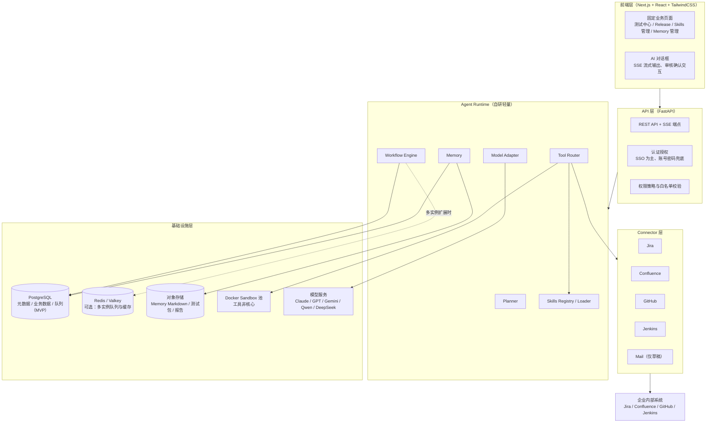
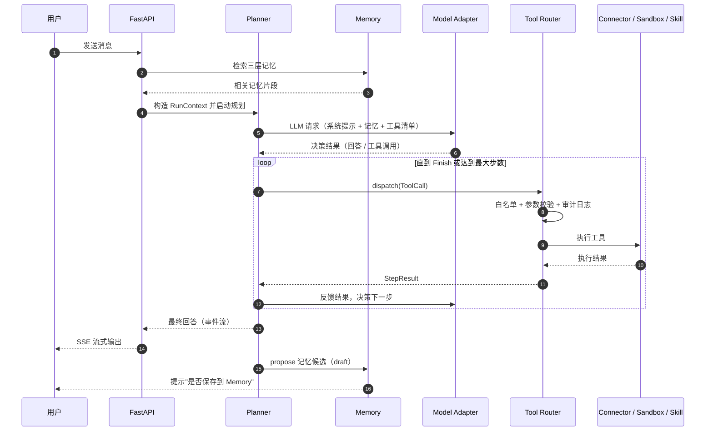
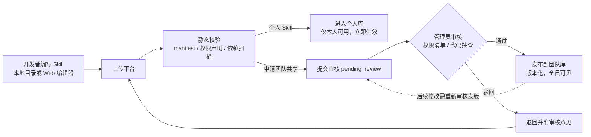
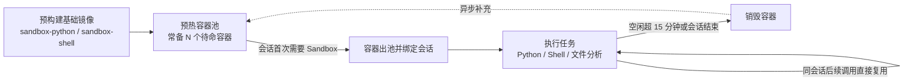
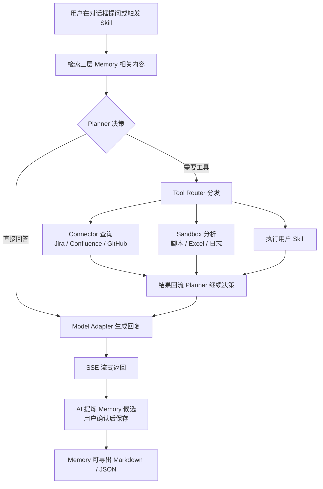
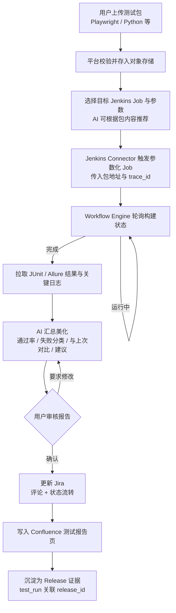
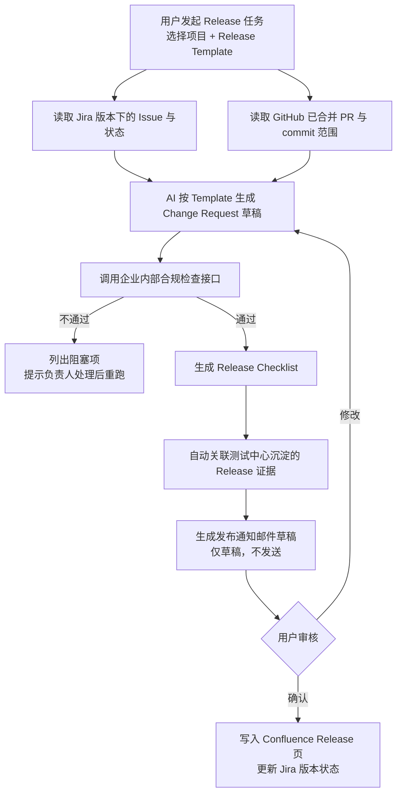
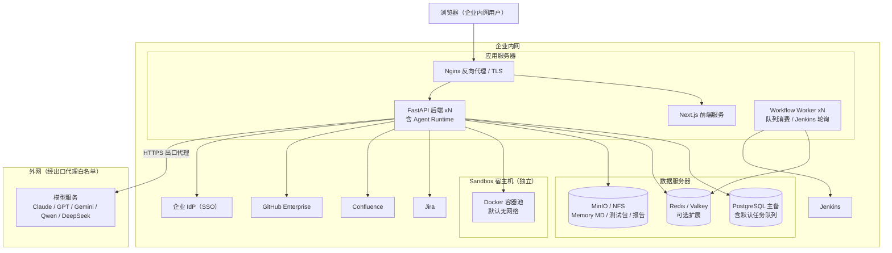

# 企业研发 AI 助手（Enterprise AI Developer Assistant）架构设计

> 版本：v1.1（面向 V1 目标态）
> 依据：[00-原始项目思路.md](./00-原始项目思路.md)，本文严格遵循其中已定的技术决策，不做推翻。
> 关联：[README.md](./README.md)（决策摘要）· [04-开发路线图与技术栈.md](./04-开发路线图与技术栈.md)（分阶段交付；本文为目标态，路线图为到达路径）
> 定位：AI 是 Workflow Orchestrator（编排者），不是 Coding Agent；Connector、Workflow、Memory、Skills 是核心资产；LLM 可替换；**不绑定 Claude Agent SDK**。

---

## 一、总体架构

### 1.1 分层架构图



### 1.2 各层职责

| 层 | 职责 | 关键原则 |
| --- | --- | --- |
| 前端层 | 固定业务页面 + AI 对话框双形态；业务页面承载结构化操作（上传测试包、审核报告、Release Checklist），对话框承载自然语言交互与流式输出 | 不是纯 Chat 产品，业务页面是一等公民 |
| API 层 | 认证鉴权、请求路由、SSE 会话管理、参数校验、限流；是权限白名单的第一道关口 | 无状态、可水平扩展 |
| Agent Runtime | 自研轻量实现，五个模块（Planner / Tool Router / Memory / Model Adapter / Workflow Engine）+ Skills Registry；负责任务规划、工具编排、记忆读写、多模型适配、长流程状态机 | 不绑定 Claude Agent SDK；模块间通过明确接口解耦 |
| Connector 层 | 统一抽象封装 Jira / Confluence / GitHub / Jenkins / Mail；负责协议转换、凭证注入、错误归一、重试熔断 | 对 Runtime 暴露的是"工具"，对外是各系统 API |
| 基础设施层 | Postgres（结构化数据 + Memory 元数据 + **MVP/默认任务队列**）、Redis/Valkey（**可选**，多实例 SSE/限流/队列升级）、对象存储（Markdown / 测试包 / 报告归档）、Docker Sandbox 宿主、外部模型服务 | Docker 是工具不是平台；正式测试不进 Sandbox；所有表预留 tenant_id |

---

## 二、Agent Runtime 详细设计

### 2.1 公共数据结构（简化）

```python
@dataclass
class RunContext:
    tenant_id: str
    user: User
    session_id: str
    trace_id: str
    memory: MemoryBundle          # 本轮已检索的三层记忆片段
    tools: list[ToolSpec]         # 按用户权限过滤后的可用工具

@dataclass
class ToolCall:
    call_id: str
    tool: str                     # 命名规范 "<域>.<动作>"，如 "jira.add_comment"
    args: dict

@dataclass
class StepResult:
    call_id: str
    ok: bool
    output: Any
    error: str | None = None
```

### 2.2 Planner

**职责**：将用户目标拆解为步骤，驱动"观察 → 思考 → 行动"循环；决定直接回答、调用工具、追问用户还是移交 Workflow Engine（长流程场景）。

```python
class Planner:
    async def run(self, goal: str, ctx: RunContext) -> AsyncIterator[AgentEvent]:
        """主循环，产出事件流：thinking / tool_call / tool_result / answer。
        FastAPI 层将事件流转为 SSE 推给前端。"""

    async def next_action(
        self, ctx: RunContext, history: list[StepResult]
    ) -> Action:
        """基于 LLM 决策下一步：CallTool | AskUser | StartWorkflow | Finish。
        内置最大步数与超时保护，防止无限循环。"""
```

设计要点：

- V1 采用 **ReAct 式单循环规划**（每步由 LLM 决策），不引入复杂的多 Agent 协作，符合"轻量自研"定位。
- 识别到"自动化测试""Release"等长流程意图时，Planner 不自己逐步执行，而是**启动对应 Workflow**，将确定性流程交给 Workflow Engine，自己只负责其中的 LLM 步骤（如汇总报告）。

### 2.3 Tool Router

**职责**：工具注册与发现、权限白名单校验、参数校验、统一分发执行、审计日志落库。它是 AI 操作边界的**强制执行点**（详见第八章）。

```python
class ToolRouter:
    def register(self, spec: ToolSpec, handler: ToolHandler) -> None:
        """注册来源：Connector 暴露的操作、内置工具、已加载 Skill。"""

    def list_tools(self, ctx: RunContext) -> list[ToolSpec]:
        """按 租户白名单 ∩ 用户角色 ∩ Skill 声明权限 过滤，结果注入 LLM。"""

    async def dispatch(self, call: ToolCall, ctx: RunContext) -> StepResult:
        """流程：白名单校验 → JSON Schema 参数校验 → 高危操作确认检查
        → 执行（Connector / Sandbox / Skill）→ 写审计日志 → 归一化返回。"""
```

工具三类来源：**Connector 操作**（如 `jira.update_issue`）、**内置工具**（如 `memory.search`、`sandbox.run_python`）、**Skill**（注册为 `skill.<name>`）。

### 2.4 Memory

**职责**：三层记忆（User / Project / Knowledge）的检索、提议、确认落盘、导出迁移。内容存 Markdown（对象存储），元数据存 Postgres。

```python
class MemoryStore:
    async def search(
        self, query: str, scopes: list[Scope], ctx: RunContext
    ) -> list[MemoryItem]:
        """V1：Postgres 全文检索 + tags 过滤；预留向量检索扩展点。"""

    async def propose(self, draft: MemoryDraft, ctx: RunContext) -> str:
        """AI 提炼的记忆候选先进入 draft 状态，等用户确认。"""

    async def commit(self, draft_id: str, ctx: RunContext) -> MemoryItem:
        """确认后：Markdown 写入对象存储 + 元数据入 Postgres（含 content_hash）。"""

    async def export(self, scope: Scope, fmt: Literal["markdown", "json"]) -> bytes:
        """按目录树打包 Markdown 或导出 JSON，支持迁移。"""
```

| 层 | 内容示例 | 写入权限 |
| --- | --- | --- |
| User Memory | 个人偏好（汇报格式、常用 Jira 项目）、个人笔记 | 本人确认后写入 |
| Project Memory | 项目约定、决策记录、环境信息 | 项目成员提议，项目 Owner 确认 |
| Knowledge | 企业级知识（Release 流程、Jenkins Job 清单） | 管理员确认 |

### 2.5 Model Adapter

**职责**：LiteLLM 思路的统一多模型接口，屏蔽 Claude / GPT / Gemini / Qwen / DeepSeek 的协议差异。

```python
class ModelAdapter:
    async def chat(
        self,
        messages: list[Message],
        *,
        model: str,                       # "claude-sonnet" / "gpt" / "qwen" ...
        tools: list[ToolSpec] | None = None,
        stream: bool = True,
    ) -> AsyncIterator[ModelChunk]:
        """内部统一为 OpenAI 风格 messages + tool_calls：
        - 各厂商协议转换（含 tool calling 格式差异）
        - 失败重试与降级（主模型不可用时按配置切换备用模型）
        - token 用量计量，按 tenant / user 记账
        - 敏感信息出网前脱敏钩子"""
```

模型路由配置化（Postgres `model_configs` 表）：按场景指定模型（如"报告汇总用 Qwen，规划用 Claude"），管理员可在线切换，**业务代码不感知具体厂商**。

### 2.6 Workflow Engine

**职责**：承载确定性长流程（测试中心、Release），以声明式 YAML 定义步骤，状态持久化到 Postgres，支持人工审核暂停、外部事件恢复、失败重试。

```python
class WorkflowEngine:
    async def start(self, workflow_key: str, inputs: dict, ctx: RunContext) -> str:
        """创建 workflow_run 记录，投递到任务队列，由 Worker 执行。
        默认队列：Postgres（SKIP LOCKED）；多实例扩展时可换 Redis/Valkey。"""

    async def resume(self, run_id: str, event: ExternalEvent) -> None:
        """外部事件驱动恢复：用户审核通过 / Jenkins 构建完成 / 定时轮询到期。"""

    async def get_state(self, run_id: str) -> WorkflowRunState:
        """前端据此渲染流程进度条。"""
```

步骤类型（V1 够用的最小集合）：`tool`（调 Connector/Sandbox）、`llm`（调 Planner 做汇总/生成）、`poll`（轮询直到条件满足）、`human_approval`（暂停等用户确认）、`branch`（条件分支）。

Workflow YAML 示例（节选）：

```yaml
key: test-center-run
steps:
  - id: trigger
    type: tool
    tool: jenkins.trigger_job
  - id: wait
    type: poll
    tool: jenkins.get_build_status
    until: "status in ['SUCCESS', 'FAILURE', 'UNSTABLE']"
    interval: 30s
    timeout: 2h
  - id: summarize
    type: llm
    prompt_ref: prompts/test-summary.md
  - id: review
    type: human_approval
  - id: update_jira
    type: tool
    tool: jira.add_comment
```

### 2.7 模块间交互流程



---

## 三、Connector 层设计

### 3.1 统一抽象接口

所有 Connector 实现同一基类，向 Tool Router 以"工具"形式暴露能力：

```python
class BaseConnector(ABC):
    name: str          # "jira" / "confluence" / "github" / "jenkins" / "mail"

    @abstractmethod
    def tool_specs(self) -> list[ToolSpec]:
        """声明可暴露的操作清单。每个操作标注：
        - access: read | write（write 类操作受白名单与审核约束）
        - schema: 参数 JSON Schema
        - idempotent: 是否幂等（决定可否自动重试）"""

    @abstractmethod
    async def invoke(self, action: str, args: dict, cred: Credential) -> ConnectorResult:
        """执行操作，内部完成协议转换与错误归一。"""

    async def health_check(self) -> HealthStatus:
        """供部署监控与熔断器使用。"""
```

V1 各 Connector 暴露的核心操作：

| Connector | 读操作 | 写操作（白名单内） |
| --- | --- | --- |
| Jira | `search_issues` / `get_issue` / `get_version_issues` | `add_comment` / `update_issue` / `transition_issue` |
| Confluence | `get_page` / `search_pages` | `create_page` / `update_page` |
| GitHub | `list_prs` / `get_pr` / `compare_commits` | 无（V1 只读） |
| Jenkins | `get_build_status` / `get_build_result` / `get_artifacts` | `trigger_job`（仅标注 ai-enabled 的 Job） |
| Mail | — | `create_draft`（**不存在 send 操作**） |

### 3.2 认证凭证管理

- **两级凭证**：平台级 Service Account（默认）+ 用户级 Token（Jira/Confluence 支持 OAuth 时优先使用，保证操作可追溯到具体用户）。使用 Service Account 执行写操作时，正文自动附加"由 AI 代 {用户} 操作，trace_id=xxx"标注。
- **存储**：`connector_credentials` 表，凭证内容用信封加密（应用层 AES-GCM，主密钥来自环境变量 / KMS），数据库泄露不等于凭证泄露。
- **生命周期**：Token 过期前自动刷新；刷新失败标记凭证失效并通知管理员，相关工具在 `list_tools` 中自动隐藏。

### 3.3 错误处理与重试

统一错误分类，Connector 内部将各系统异常映射到该分类，Planner / Workflow Engine 按类别决策：

| 错误类别 | 示例 | 处理策略 |
| --- | --- | --- |
| `AuthError` | 401 / token 失效 | 自动刷新凭证重试 1 次，仍失败则终止并提示 |
| `RateLimited` | 429 | 遵循 Retry-After 退避后重试 |
| `Retryable` | 网络超时 / 502 / 503 | 指数退避重试（1s/2s/4s + 抖动），最多 3 次，**仅限幂等操作** |
| `NotFound` | Issue 不存在 | 不重试，结构化返回给 LLM 供其修正参数 |
| `Fatal` | 参数错误 / 权限不足 | 不重试，记审计日志并上报 |

补充机制：写操作携带幂等键（trace_id + call_id），防止重试导致重复评论/重复触发构建；每个 Connector 实例配熔断器（连续失败 N 次后半开探测），避免下游故障拖垮会话。

---

## 四、Skills 系统设计

### 4.1 目录结构与 Manifest 规范

参考 Hermes Agent 结构，一个 Skill 是一个自包含目录：

```
skills/
  test-report/
    skill.yaml          # manifest：元数据、权限、sandbox 声明
    prompt.md           # 注入 LLM 的技能说明与使用指引
    main.py             # 可执行入口（python 或 shell 二选一，纯 prompt 型可省略）
    requirements.txt    # python 依赖（在 sandbox 镜像内安装）
  jira/
  release/
  mail/
```

`skill.yaml` 示例：

```yaml
name: test-report
version: 1.2.0
title: 测试报告汇总
description: 拉取 Jenkins 构建结果，生成结构化测试报告
author: zhang.san
scope: team                     # personal | team

entrypoint:
  type: python                  # python | shell | prompt
  file: main.py
  handler: run

prompt: prompt.md

inputs:
  - name: build_url
    type: string
    required: true
  - name: format
    type: string
    default: markdown

permissions:
  tools:                        # 该 Skill 允许调用的工具白名单（最小授权）
    - jenkins.get_build_result
    - jira.add_comment
  network: internal_only        # none | internal_only

sandbox:
  required: true                # python/shell 型必须为 true
  image: sandbox-python:3.12
  timeout: 300                  # 秒
  memory: 512Mi
  cpu: "0.5"
```

### 4.2 加载与执行流程

- **加载**：平台启动 / Skill 发布时，Skills Registry 解析 manifest → 静态校验（schema、权限声明合法性、依赖安全扫描）→ 注册为工具 `skill.test-report` 到 Tool Router。
- **执行**：LLM 发起 `skill.test-report` 调用 → Tool Router 校验（用户对该 Skill 的可见性 + Skill 自身权限白名单）→ `prompt` 型直接注入 LLM 执行；`python/shell` 型投递到 Sandbox 执行，入口进程通过平台注入的受限 SDK 回调工具（回调同样经过 Tool Router，**Skill 无法越权**）。
- **超时与失败**：按 manifest 的 timeout 强制终止容器进程，结果归一为 StepResult。

### 4.3 权限模型

三层叠加，取交集：

1. **租户/平台白名单**：全局允许的工具集合（第八章）。
2. **用户角色**：member / admin；某些工具（如 `jenkins.trigger_job`）可配置为仅特定角色。
3. **Skill manifest 声明**：Skill 只能调用其 `permissions.tools` 中列出的工具，安装/审核时用户与管理员对该清单可见可拒绝。

### 4.4 个人 / 团队 Skill 审核发布流程



- 个人 Skill 直接使用，但仍受运行时三层权限约束（个人 Skill 不能因为"个人"就绕过工具白名单）。
- 团队 Skill 按版本发布，`skill_versions` 表保留历史版本与审核记录，可回滚。

---

## 五、Sandbox 设计

定位重申：Docker Sandbox 是**工具不是核心**，仅用于 Python / Shell / Excel / XML / 日志分析 / 数据统计，不运行正式测试（正式测试在 Jenkins）。

### 5.1 生命周期：推荐"会话级临时容器 + 预热池"



推荐理由（对比另外两种方案）：

| 方案 | 问题 |
| --- | --- |
| 每次调用新建容器 | 冷启动 2~5 秒，多步分析任务体验差；且同会话多步间无法共享中间文件 |
| 长期持久容器 | 状态污染、依赖漂移、安全面扩大，与"Docker 是工具不是平台"原则相悖 |
| **会话级临时 + 预热池（推荐）** | 出池即用（毫秒级），会话内可复用工作目录做多步分析，会话结束即销毁保证无状态；需要保留的产物在销毁前拷出到对象存储 |

### 5.2 资源限制

| 维度 | 默认值 | 说明 |
| --- | --- | --- |
| CPU | 0.5 core | manifest 可申请，上限 2 core |
| 内存 | 512Mi | 上限 2Gi，OOM 即杀 |
| 磁盘 | 工作目录 quota 1Gi | tmpfs + 配额 |
| 执行超时 | 300s | manifest 可申请，上限 30min |
| 进程数 | pids-limit 128 | 防 fork 炸弹 |
| 并发容器数 | 按宿主机容量设上限 | 超限排队，防资源耗尽 |

### 5.3 安全隔离

- **运行身份**：非 root 用户，`no-new-privileges`，drop 全部 capabilities，只读根文件系统 + 可写工作目录。
- **网络**：默认 `network=none`；manifest 声明 `internal_only` 时接入仅含内网 DNS 白名单的自定义网络，**永不放开公网**。
- **文件**：输入文件（如用户上传的 Excel/日志）由平台拷入工作目录，容器不挂载宿主机敏感路径；产物白名单目录拷出。
- **凭证**：容器内不注入任何 Connector 凭证；Skill 需要调工具时通过平台 SDK 回调，由宿主侧 Tool Router 鉴权执行。
- **部署**：Sandbox 宿主机与应用服务器分离（见第九章），进一步收缩爆炸半径。

---

## 六、三大 V1 场景端到端流程

### 6.1 日常开发助手



### 6.2 自动化测试中心

原则：测试跑在 Jenkins，AI 只做 Trigger / Polling / Summary / 更新 Jira 和 Confluence。



### 6.3 Release Assistant



---

## 七、数据模型

### 7.1 Postgres 核心表

约定：所有业务表含 `tenant_id`（V1 单企业固定为默认租户，为多租户预留）；主键 uuid；时间戳 `timestamptz`。

```sql
create table tenants (
  id         uuid primary key default gen_random_uuid(),
  name       text not null,
  created_at timestamptz not null default now()
);

create table users (
  id            uuid primary key default gen_random_uuid(),
  tenant_id     uuid not null references tenants(id),
  username      text not null,
  display_name  text,
  email         text,
  role          text not null default 'member',      -- member | admin
  auth_source   text not null default 'sso',         -- sso | local
  password_hash text,                                -- 仅 local 兜底账号使用
  sso_subject   text,                                -- IdP 返回的唯一标识
  created_at    timestamptz not null default now(),
  unique (tenant_id, username)
);

-- Memory 元数据（内容在对象存储的 Markdown 文件中）
create table memories (
  id            uuid primary key default gen_random_uuid(),
  tenant_id     uuid not null,
  scope         text not null check (scope in ('user','project','knowledge')),
  owner_user_id uuid,                                -- scope=user 时必填
  project_id    uuid,                                -- scope=project 时必填
  title         text not null,
  file_path     text not null,                       -- 对象存储中的相对路径
  tags          text[] not null default '{}',
  content_hash  text not null,                       -- 与文件一致性校验
  status        text not null default 'active',      -- draft | active | archived
  source        text,                                -- manual | ai_proposed
  created_by    uuid not null,
  created_at    timestamptz not null default now(),
  updated_at    timestamptz not null default now()
);
create index idx_memories_search on memories
  using gin (to_tsvector('simple', title), tags);

create table skills (
  id             uuid primary key default gen_random_uuid(),
  tenant_id      uuid not null,
  name           text not null,
  scope          text not null check (scope in ('personal','team')),
  owner_user_id  uuid not null,
  latest_version text,
  status         text not null default 'active',     -- active | disabled
  unique (tenant_id, name)
);

create table skill_versions (
  id             uuid primary key default gen_random_uuid(),
  skill_id       uuid not null references skills(id),
  version        text not null,
  manifest       jsonb not null,                     -- skill.yaml 解析结果
  package_path   text not null,                      -- 对象存储中的 Skill 包
  review_status  text not null default 'draft',
      -- draft | pending_review | approved | rejected
  reviewed_by    uuid,
  review_comment text,
  created_at     timestamptz not null default now(),
  unique (skill_id, version)
);

create table workflow_runs (
  id           uuid primary key default gen_random_uuid(),
  tenant_id    uuid not null,
  workflow_key text not null,                        -- test-center-run 等
  status       text not null default 'running',
      -- running | waiting_approval | succeeded | failed | cancelled
  current_step text,
  inputs       jsonb not null default '{}',
  state        jsonb not null default '{}',          -- 各步骤输出快照
  started_by   uuid not null,
  started_at   timestamptz not null default now(),
  finished_at  timestamptz
);

create table test_runs (
  id              uuid primary key default gen_random_uuid(),
  tenant_id       uuid not null,
  project_id      uuid,
  workflow_run_id uuid references workflow_runs(id),
  package_path    text not null,                     -- 测试包在对象存储位置
  jenkins_job     text not null,
  build_number    int,
  status          text not null default 'pending',
  result_summary  jsonb,                             -- 通过率、失败分类等
  report_page_id  text,                              -- Confluence 页面 id
  jira_issue_keys text[] not null default '{}',
  release_id      uuid,                              -- Release 证据关联
  created_by      uuid not null,
  created_at      timestamptz not null default now()
);

create table audit_logs (
  id            bigserial primary key,
  tenant_id     uuid not null,
  trace_id      text not null,
  actor_user_id uuid not null,
  actor_type    text not null check (actor_type in ('user','ai')),
  tool          text not null,                       -- jira.add_comment 等
  action_access text not null,                       -- read | write
  target        text,                                -- 如 PROJ-123
  args_digest   jsonb,                               -- 脱敏后的关键参数
  result        text not null,                       -- ok | denied | error
  error_message text,
  created_at    timestamptz not null default now()
);
create index idx_audit_trace on audit_logs (tenant_id, trace_id);
```

其余表简述：`projects`（项目）、`sessions` / `messages`（会话与消息）、`connector_credentials`（加密凭证）、`releases`（Change Request / Checklist，jsonb）、`release_templates`（模板内容 + 版本）、`email_drafts`（邮件草稿，仅存不发）、`model_configs`（模型路由配置）、`tool_whitelist`（租户级工具白名单）。

### 7.2 Memory 的 Markdown + 元数据方案

对象存储（或共享盘）目录布局，目录树即导出单元：

```
memory-store/
  {tenant_id}/
    users/{user_id}/
      preferences.md
      notes/2026-07-28-jenkins-tips.md
    projects/{project_id}/
      conventions.md
      decisions/adr-001-api-style.md
    knowledge/
      release-process.md
      jenkins-job-catalog.md
```

每个 Markdown 文件带 YAML front-matter，使文件**自描述、可脱库迁移**：

```markdown
---
id: 8f2c...
scope: project
tags: [api, convention]
source: ai_proposed
updated_at: 2026-07-28T09:00:00+08:00
---

# API 命名约定

...正文...
```

一致性策略：Postgres 元数据是检索与权限的唯一入口，`content_hash` 校验文件与元数据一致；导出即打包目录树（Markdown）或序列化元数据+内容（JSON）；导入时反向解析 front-matter 重建元数据，实现平台间迁移。

---

## 八、安全与权限

### 8.1 认证：SSO 为主，账号密码兜底

- **SSO**：优先 OIDC（Authorization Code + PKCE），兼容 SAML 2.0，对接企业 IdP；用户首次登录按 `sso_subject` 自动建档（JIT provisioning）。
- **兜底**：IdP 故障时管理员可启用本地账号密码登录（bcrypt 存储、强口令策略、失败锁定），仅作为逃生通道，默认关闭。
- **会话**：短期 JWT（15 分钟）+ HttpOnly refresh cookie；FastAPI 依赖注入统一做认证与租户解析。

### 8.2 AI 操作权限边界：白名单机制

关键设计：边界在 **Tool Router 强制执行**，而非依赖提示词约束——LLM 看不到白名单外的工具，即使幻觉出调用也会被 dispatch 拒绝并审计。

| 类别 | 策略 |
| --- | --- |
| 允许（写） | `jira.add_comment` / `jira.update_issue` / `jira.transition_issue` / `confluence.create_page` / `confluence.update_page` / `jenkins.trigger_job`（仅 ai-enabled Job）/ `mail.create_draft` |
| 允许（读） | 各 Connector 读操作、`memory.search`、Sandbox 分析类工具 |
| 禁止 | **邮件发送**（系统不注册 `mail.send` 工具，物理上不可调用）；GitHub 写操作（V1）；白名单之外的一切 |
| 需人工确认 | 批量写（一次影响 >N 个 Issue）、Jira 状态流转、Confluence 覆盖已有页面——Planner 必须先产生确认卡片，用户点击后才执行 |

白名单存 `tool_whitelist` 表，管理员可视化管理；变更本身记入审计日志。

### 8.3 审计日志

- 所有 `dispatch` 调用（含被拒绝的）写 `audit_logs`：谁（用户 + actor_type 区分人工/AI）、何时、用什么工具、对什么目标、参数摘要（脱敏）、结果。
- `trace_id` 贯穿一次会话/工作流的全部调用，可完整还原 AI 的操作链路。
- 写操作在目标系统留痕（Jira 评论/Confluence 页面标注"由 AI 代 xx 操作"），双向可追溯。
- 日志只增不改，定期归档到对象存储；管理员控制台支持按用户/工具/时间检索。

---

## 九、部署架构

单企业内网部署为主，V1 推荐 Docker Compose（组件少、运维简单），预留 K8s 迁移路径（全部组件已容器化、无状态服务可水平扩展）。



要点：

- **Sandbox 宿主机独立**于应用服务器，即使容器逃逸也不触及应用与数据。
- **模型出网收口**：仅 Model Adapter 经企业出口代理访问模型服务，域名白名单管控；若企业有私有化模型（如内部 Qwen/DeepSeek 部署），Adapter 直接指向内网地址，架构不变。
- **Worker 与 API 分离**：轮询 Jenkins、执行 Workflow 的长任务放 Worker，避免阻塞交互式请求；两者共享同一代码库，通过任务队列解耦（**默认 Postgres；多实例时升级 Redis/Valkey**，与 [04](./04-开发路线图与技术栈.md) 一致）。
- 备份：Postgres 定时备份 + 对象存储（Memory Markdown 天然文件化，备份即 rsync/版本化）。

---

## 十、与路线图的对齐说明

本文描述的是 **V1 目标态架构**（三大场景 + Runtime 五模块 + Connector + Skills + Sandbox + 治理齐备）。分阶段落地节奏以 [04-开发路线图与技术栈.md](./04-开发路线图与技术栈.md) 为准：

| 目标态能力（本文） | 路线图落点 |
| --- | --- |
| 测试中心端到端 + Connector（Jira/Confluence/Jenkins）+ Runtime v0 | **MVP（0–3 月）** |
| Skills 完整体系、三层 Memory、Docker Sandbox（会话级 + 预热池）、审计 | **短期（3–6 月）** |
| Release Assistant、声明式 Workflow Engine、RBAC 细化 | **中期（6–12 月）→ V1 发布** |
| Workflow Builder、RAG、多租户、可插拔 Sandbox Backend | **长期（12 月+）** |

因此：架构图中的 Workflow Engine / Sandbox 池在 V1 结束前必须具备；**不要求 MVP 第一天就全部到位**。实现顺序冲突时，服从路线图；原则冲突时，服从 [00](./00-原始项目思路.md)。

---

## 十一、"九、需要确认"6 个问题的推荐答案

### 1. Workflow Builder 是否进入 V1？

**推荐：不进 V1。** V1 的三大场景工作流由工程侧以 YAML 声明式定义、随版本发布，前端只提供**只读的运行进度可视化**。理由：可视化 Builder 的编辑器、校验、调试体验成本极高，而 V1 的核心价值在三个固定场景跑通；Workflow Engine 从第一天就以声明式 YAML 为唯一事实来源，V2 的 Builder 只是"生成同一份 YAML 的 GUI"，不会返工。

### 2. Memory 自动保存策略？

**推荐："AI 提议 + 用户确认"为主，小范围自动保存。** 具体：① 用户显式说"记住这个"立即保存；② 会话结束时 AI 提炼候选进入 draft 待确认区，用户一键采纳或忽略；③ 仅 User Memory 中的低风险偏好类信息（如"报告要中文"）允许自动保存，但通知用户且一键撤销；④ Project / Knowledge 层一律需要项目 Owner / 管理员确认。理由：全自动保存会快速堆积噪音并引发"AI 记了不该记的"信任问题，全手动则 Memory 形同虚设；分层收敛是成本与质量的平衡点。

### 3. Connector SDK 规范？

**推荐：以第三章 `BaseConnector` 为 SDK 核心，固化五项约定**：① 能力以 `ToolSpec` 声明（含 access 读写级别、JSON Schema、幂等性标注）；② 凭证由平台注入，Connector 代码不接触明文存储；③ 错误必须映射到统一分类（AuthError / RateLimited / Retryable / NotFound / Fatal）；④ 必须实现 `health_check`；⑤ 以独立 Python 包 + entry point 注册，配置存 DB。理由：Connector 是长期核心资产，规范一次定死，未来新增 GitLab、内部系统等 Connector 都是纯增量，Tool Router 与审计体系零改动。

### 4. Docker 生命周期（持久或临时）？

**推荐：临时——会话级容器 + 预热池**（第五章方案）。容器从预热池秒级出借、绑定会话内复用、空闲 15 分钟或会话结束即销毁，需要保留的产物销毁前拷出对象存储。理由：持久容器必然出现状态污染与安全面扩大，违背"Docker 是工具不是平台"；纯按次新建则冷启动伤体验且多步分析无法共享中间文件；会话级临时是两者的最优折中。

### 5. Release Template 配置方式？

**推荐：平台内置模板管理，格式为 Markdown + YAML front-matter，版本化存储。** front-matter 定义变量（版本号、Jira 项目、合规检查项清单）与 Checklist 结构，正文为 Markdown 骨架；管理员在 UI 中维护，支持按项目覆盖默认模板，支持从现有 Confluence 页面导入初始化。理由：与 Memory 的 Markdown 哲学一致，天然可导出迁移、可 diff 可回滚；不选"只存 Confluence"是因为模板需要结构化变量供 Workflow 消费，纯页面难以可靠解析。

### 6. Jenkins Job 标准接口？

**推荐：定义"AI 可调 Job 契约"，一次约定、全团队复用**：

- **发现**：Job 打标 `ai-enabled=true`，平台自动扫描注册为可选目标；
- **入参**：统一参数化接口 `PACKAGE_URL`（测试包地址）、`ENTRY`（执行入口）、`ENV`（目标环境）、`TIMEOUT`、`TRACE_ID`（回写审计链路）；
- **出参**：结果必须发布 JUnit XML（必选）+ Allure 报告（可选），产物按约定路径归档；
- **状态获取**：V1 用 Workflow Engine 轮询 REST API（间隔 30s、指数退避），预留 webhook 回调升级路径；
- 配套提供一个 Jenkins Shared Library 流水线模板，存量 Job 接入只需数行改动。

理由：AI 侧只需实现一个 Jenkins Connector 适配这份契约，各团队 Job 内部实现完全自由；轮询在内网可靠且不要求 Jenkins 侧开放入站回调，符合 V1 求稳原则。

---

## 附录：技术选型摘要

| 领域 | 选型 | 来源 |
| --- | --- | --- |
| 前端 | Next.js + React + TailwindCSS | 需求文档已定 |
| 后端 | FastAPI（+ Worker；默认 Postgres 队列，可选 Redis） | 需求文档已定；队列策略与路线图对齐 |
| Agent Runtime | 自研轻量（五模块），不绑定 Claude Agent SDK | 需求文档已定 |
| 模型接入 | 统一 Model Adapter（LiteLLM 思路），支持五家模型 | 需求文档已定 |
| Skills | Hermes 风格目录 + manifest，三层权限 | 需求文档已定 |
| Sandbox | Docker，会话级临时容器 + 预热池（工具非核心） | 本文推荐；与原始思路一致 |
| 正式测试 | Jenkins（AI 仅 Trigger / Polling / Summary / 回写） | 需求文档已定 |
| Memory | Markdown（对象存储）+ Postgres 元数据，可导出 | 需求文档已定 |
| 认证 | SSO（OIDC 优先）+ 本地账号兜底 | 需求文档已定 |
| 多租户 | 单企业，全表预留 tenant_id | 需求文档已定 |
| 邮件 | 仅 `create_draft`，系统不注册 send | 需求文档已定 |
